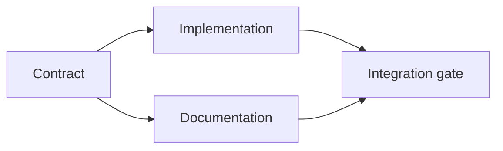

# Faites un plan d'exécution fondé sur des preuves

> Un plan n'est pas une liste de tâches plus jolie. C'est un graphique de dépendance dans lequel chaque changement a une raison et chaque nœud terminal a une preuve.

**Type:** Learn + Build
**Languages:** Python (stdlib)
**Prerequisites:** Phase 14 lesson 43
**Time:** ~65 minutes

## Objectifs d'apprentissage

- Convertir un cadre de tâche en éléments de travail avec des preuves et des preuves.
- L'ordre de modèle est une dépendance au lieu d'une séquence de prose.
- Détecter les faits manquants, les dépendances inconnues et les cycles avant de modifier.
- Des étapes séparées qui peuvent couler ensemble et des étapes qui doivent attendre.

## Pourquoi les plans des agents échouent

Les plans faibles répètent la demande dans le futur:

1. Mettez à jour l'API.
2. Ajoutez des tests.
3. Mettre à jour la documentation.

Rien dans cette liste ne dit ce qui a été trouvé, pourquoi ces fichiers sont corrects, quel contrat change en premier, ou ce qui peut se passer simultanément.

Un plan solide comporte cinq engagements pour chaque élément de travail:

| Commitment | Purpose |
|---|---|
| Identifier | Stable reference for dependencies and handoff |
| Change | The smallest behavior or contract change |
| Evidence | Repository facts that justify the change |
| Dependencies | Work that must be true first |
| Proof | The exact check that closes the item |

## Planifiez le contrat avant de le mettre en œuvre

Lorsque plusieurs surfaces dépendent du même comportement, définissez d'abord le comportement. Les tests, la mise en œuvre, la documentation et l'intégration peuvent ensuite partager un contrat au lieu d'inventer quatre versions.



Le graphique expose une simultanée sûre. La mise en œuvre et la documentation peuvent se poursuivre ensemble après la fixation du contrat.

## Des preuves changent le plan

Les preuves de référentiel ne sont pas une décoration.

- Un assistant existant supprime une nouvelle abstraction prévue.
- Un test de compatibilité force une étape de migration.
- Une contrainte de déploiement déplace un changement de schéma dans une autre tâche.
- Un type de réponse publique modifie l'ordre de mise en œuvre et de documentation.

Si les preuves ne peuvent pas modifier le plan, elles ne sont probablement pas des preuves de cette décision.

## Conception pour l'interruption

Les sessions d'agent de codage se terminent de façon inattendue.

- le poste complet;
- la preuve qui a été déposée;
- les objets modifiés;
- les dépendances désormais débloquées;
- Quel est le prochain élément de sécurité.

Ne cochez pas l'état uniquement dans les cases à cocher dans un chat.

## Validation du plan

Rejeter le plan avant l'exécution lorsque:

- un identifiant est dupliqué;
- un article de travail n'a pas de preuve;
- un article de travail n'a pas de preuve;
- une dépendance nomme un élément inconnu;
- le graphique contient un cycle;
- la première action irréversible a lieu avant que l'incertitude pertinente ne soit résolue.

Les cinq premiers contrôles sont mécaniques, le dernier exige un jugement et doit être appelé explicitement.

## Faites-le

`code/main.py`Les modèles de travail des éléments, valident leurs reçus, calculent les ondes d'exécution avec un sort topologique, et écrit `outputs/evidence-plan.json`- Je suis désolé .

Je vais courir .

```bash
python3 code/main.py
python3 -m unittest discover code/tests -v
```

L'exemple produit trois ondes. La définition du contrat se déroule en premier. La mise en œuvre et la documentation se rejoignent. La porte d'intégration se déroule en dernier.

## Utilisez-le avec un agent de codage

Demandez à l'agent de produire le plan avant qu'il change les fichiers.

1. Chaque revendication de chemin et de comportement a un reçu de référentiel.
2. Chaque article a une preuve claire de finition.
3. Le graphique retarde un travail coûteux ou irréversible jusqu'à ce que l'incertitude dont il dépend soit résolue.

Approuvez le plan, pas une promesse vague d'être prudent.

## Exercices

1. Ajouter un élément de migration qui nécessite une approbation humaine explicite.
2. Créez un cycle et expliquez le désaccord de produit caché derrière.
3. Divisez un élément qui a deux commandes de preuve.
4. Ajoutez un élément de travail qui peut fonctionner dans la deuxième vague sans toucher aucune des branches existantes.
5. Rendez le plan comme Markdown tout en gardant JSON comme source de vérité.

## Pour en savoir plus

- [Nuseibeh and Easterbrook, Requirements Engineering: A Roadmap](https://www.cs.toronto.edu/~sme/papers/2000/ICSE2000.pdf), pour la relation itérative entre les objectifs, les spécifications, l'accord et l'évolution.
- [Barry Boehm, A Spiral Model of Software Development and Enhancement](https://dl.acm.org/doi/10.1145/12944.12948), pour l'ordre de développement autour de la résolution des risques plutôt que d'une séquence linéaire fixe.

## Ce que vous gardez

Je le garde .`outputs/evidence-plan.json`Il devient le contrat de délégation dans la prochaine leçon.
