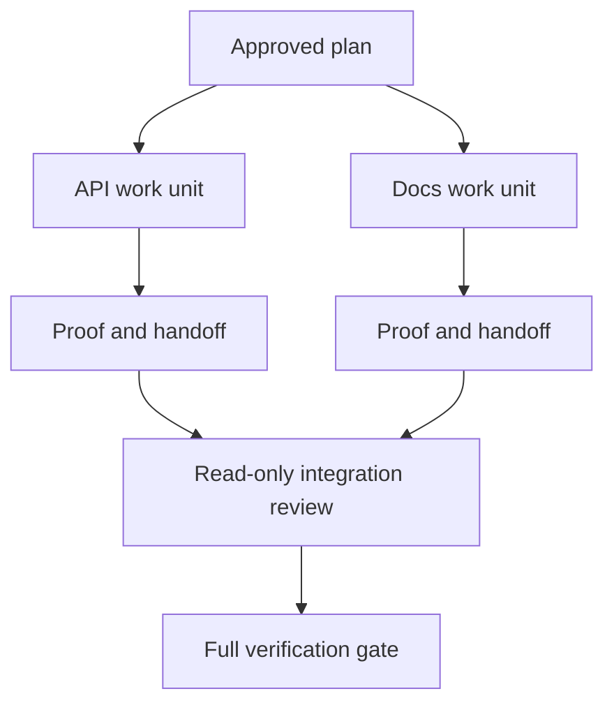

# Les agents délégués travaillent avec des contrats d'isolement et de fusion

> Les agents parallèles ne permettent d'économiser du temps sur le mur que lorsque le travail est indépendant.

**Type:** Learn + Build
**Languages:** Python (stdlib)
**Prerequisites:** Phase 14 lessons 39 and 44
**Time:** ~70 minutes

## Objectifs d'apprentissage

- Décider si la délégation est justifiée par une véritable indépendance.
- Donnez à chaque travailleur la propriété exclusive des dossiers et une preuve explicite.
- Des ondes d'exécution de calcul provenant de dépendances.
- Conçuez un contrat de fusion pour combiner le travail des agents en toute sécurité.

## Le test de parallélisme

Ne déléguer pas parce qu'il y a plus d'agents disponibles.

- deux enquêtes peuvent répondre de manière indépendante à des inconnues différentes;
- deux mises en œuvre possèdent des dossiers et des contrats disjoints;
- un examinateur peut inspecter un artefact fini sans le modifier;
- un contrôle extérieur lent peut être effectué pendant que les travaux locaux se poursuivent.

Gardez le travail en série lorsque les agents ont besoin des mêmes fichiers, de la même décision non résolue ou du même environnement changeant.

## Une unité de travail est un contrat

Chaque unité déléguée a besoin de:

| Field | Meaning |
|---|---|
| Goal | One observable result |
| Owner | One accountable worker |
| Paths | Exclusive write ownership |
| Dependencies | Completed units required before starting |
| Proof | Exact evidence returned to the integrator |
| Handoff | Files changed, decisions made, remaining risk |

Manifiez le backend n'est pas une unité de travail. Implémenter le double contrôle `app/accounts.py`et prouver avec le test de compte ciblé est.

## L'isolement est constitué de trois couches

1. **Filesystem isolation:**Les arbres de travail ou les boîtes à sable séparés empêchent les modifications partagées accidentelles.
2. **Ownership isolation:**Les contrats empêchent deux travailleurs de modifier intentionnellement le même chemin.
3. **State isolation:**Les journaux et les sorties séparés empêchent un travailleur de surécrire les preuves d'un autre travailleur.

L'isolement du système de fichiers ne résout pas la propriété. Deux arbres de travail propres peuvent toujours produire des conceptions contradictoires.



## L'intégrateur ne reconstruit pas l'œuvre

L'intégrateur doit:

1. confirmer que chaque remise correspond à sa portée assignée;
2. lire la preuve, et pas seulement le résumé du travailleur;
3. combiner les changements d'ordre de dépendance;
4. faire fonctionner la porte de l'unité transversale complète;
5. rejeter l'expansion cachée du champ d'application;
6. enregistrer les conflits comme de nouvelles décisions, pas des éditions silencieuses.

Si l'intégration nécessite la réécriture de la plupart des résultats d'un travailleur, la décomposition initiale était erronée.

## Les rôles de l'homme et de l'agent

La délégation ne supprime pas le jugement humain. L'homme possède toujours des choix qui modifient le comportement public, le risque, l'autorité ou les coûts irréversibles.

Il s'agit d'une autonomie calibrée: le système accorde la liberté lorsque les preuves et le retour sont solides, et nécessite un point de contrôle lorsque les conséquences sont élevées.

## Faites-le

Le laboratoire vérifie le chevauchement des chemins, valide les dépendances, calcule les ondes d'exécution sûres et écrit `outputs/delegation-plan.json`- Je suis désolé .

Je vais courir .

```bash
python3 code/main.py
python3 -m unittest discover code/tests -v
```

Changez l' unité de docs à la propriété `app/`Le plan devrait être bloqué parce que ce chemin parent se chevauchera sur l'unité API.

## Exercices

1. Décomposer un changement réel en deux unités de travail indépendantes et un intégrateur.
2. Trouvez une fraction parallèle proposée qui ne semble qu'indépendante.
3. Ajoutez un chercheur qui ne peut lire que le contenu de son produit est un tableau de faits.
4. Ajouter une passerelle de fusion qui vérifie le jeu de fichiers modifiés final contre tous les contrats unitaires.
5. Définir une règle d'annulation pour un travailleur dont la dépendance devient invalide.

## Pour en savoir plus

- [Reid Smith, The Contract Net Protocol](https://doi.org/10.1109/TC.1980.1675516), pour un traitement formel précoce de l'allocation de tâches distribuées et de la communication des résultats.
- [Eric Horvitz, Principles of Mixed-Initiative User Interfaces](https://dl.acm.org/doi/10.1145/302979.303030), pour décider quand l'automatisation doit agir et quand elle doit rendre le contrôle à une personne.

## Ce que vous gardez

Je le garde .`outputs/delegation-plan.json`Il indique pourquoi la fraction est sûre, qui possède chaque chemin et quelle preuve l'intégration doit recevoir.
