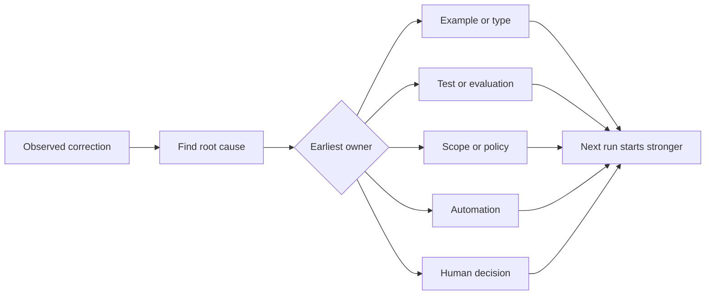

# Transformer chaque correction d'agent en amélioration du système

> Une correction qui ne vit que dans le chat répare une mise en ligne. Une correction promue dans un test, une limite, un exemple ou un outil améliore chaque mise en ligne ultérieure.

**Type:** Learn + Build
**Languages:** Python (stdlib)
**Prerequisites:** Phase 14 lessons 37 to 41
**Time:** ~65 minutes

## Objectifs d'apprentissage

- Convertir les corrections d'agent en contrôles durables.
- Placez chaque contrôle dans la couche la plus précoce qui puisse empêcher la récidive.
- Déduplicer les leçons répétées avec des empreintes digitales stables.
- Retirez les contrôles qui ne protègent plus un risque réel.

## Les corrections sont la preuve

Lorsque vous dites à un agent ne modifiez pas ce fichier, vous avez appris que la limite de portée n'était pas exécutable. Lorsque vous dites ce format de sortie est erroné, vous avez appris qu'un exemple ou un test manquait. Lorsque la configuration échoue à nouveau, vous avez appris que la connaissance de l'environnement appartient à l'automatisation.

Traitez la correction comme une observation sur le système de travail, et non comme une erreur de rédaction rapide.

## Promenons à la première couche efficace

Utilisez cette commande:

| Recurring failure | Durable destination |
|---|---|
| Wrong result or regression | Test or evaluation |
| Off-scope or unsafe action | Scope or permission policy |
| Repeated setup or command mistake | Automation or tool |
| Repeated output-format mistake | Canonical example plus validator |
| Ambiguous local convention | Instruction with a scenario check |
| Product disagreement | Human decision record |

Un type qui empêche un état invalide est plus fort qu'un commentaire de critique qui le reçoit plus tard. Un test axé est plus fort qu'un paragraphe demandant à l'agent de se souvenir.



## Le dossier Ratchet

Capture:

- symptôme;
- cause profonde;
- conséquence;
- le nombre de récurrents;
- le contrôle choisi;
- la vérification pour le contrôle;
- propriétaire;
- date de révision ou de retraite.

Ne favorisez pas chaque préférence unique, mais favorisez une correction lorsque la récurrence ou la conséquence justifient une complexité permanente.

## Cause séparée du symptôme

L'agent modifié README est un symptôme.

- la tâche a permis la racine du référentiel;
- les documents ont été implicitement considérés comme sûrs;
- la mise en œuvre et la documentation du plan en série;
- Deux travailleurs avaient des propriétés qui se chevauchent.

Chaque cause appartient à un contrôle différent. Une règle qui ne fait que répéter le symptôme échouera dans le cas suivant légèrement différent.

## Les contrôles se détériorent également

Les anciens contrôles peuvent entrer en conflit, gonfler le contexte et encoder un système qui n'existe plus.

- la structure sous-jacente a changé;
- une régulation exécutable plus stricte l'a remplacé;
- l'échec n'a pas été récurrent dans une période significative;
- Le contrôle crée plus de friction que le risque qu'il empêche.

L'objectif n'est pas le plus long fichier d'instructions, mais le plus petit système qui préserve le jugement durement gagné.

## Faites-le

Le laboratoire classe les corrections, les fait passer en contrôles, duplique les empreintes digitales et écrit.`outputs/feedback-ratchet.json`- Je suis désolé .

Je vais courir .

```bash
python3 code/main.py
python3 -m unittest discover code/tests -v
```

Ajouter deux corrections formulées différemment avec la même cause. Améliorer la normalisation jusqu'à ce qu'elles s'effondrent dans un seul contrôle sans effondrement d'échecs non liés.

## Exercices

1. Prenez cinq corrections d'une récente session de codage et classez leurs vrais propriétaires.
2. Remplacez une règle de prose par un test exécutable.
3. Ajoutez une pondération des conséquences afin que la première occurrence sévère puisse être immédiatement encouragée.
4. Ajoutez un propriétaire et une date de retraite à la sortie du laboratoire.
5. Revoir une instruction d'agent existante et la supprimer seulement après avoir prouvé l'existence d'un contrôle plus fort.

## Pour en savoir plus

- [Basili, Caldiera, and Rombach, The Goal Question Metric Approach](https://www.cs.toronto.edu/~sme/CSC444F/handouts/GQM-paper.pdf)Les objectifs sont conçus pour la transformation des questions et des mesures opérationnelles.
- [Shinn et al., Reflexion](https://arxiv.org/abs/2303.11366), pour utiliser des traces de rétroaction pour améliorer les décisions ultérieures sans changer les poids du modèle.
- [Madaan et al., Self-Refine](https://arxiv.org/abs/2303.17651), pour les retours et les révision itératifs à l'intérieur d'une boucle de tâches.

## Ce que vous gardez

Je le garde .`outputs/feedback-ratchet.json`Il s'agit de la fin durable du chemin de l'ingénierie assistée par l'agent et de l'entrée pour les futurs changements de bureau.
