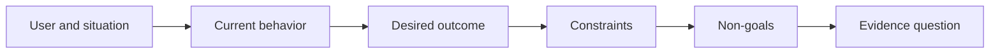

# Définissez le résultat avant de choisir le produit

> La mise en œuvre rapide augmente la peine pour avoir choisi le mauvais problème.

**Type:** Learn + Build
**Languages:** Python (stdlib)
**Prerequisites:** None
**Time:** ~60 minutes

## Objectifs d'apprentissage

- Écrivez un cadre de résultat sans nommer une solution.
- Identifier l'utilisateur, la situation, le comportement actuel et le changement souhaité.
- Faites préciser les contraintes et les non-objectifs.
- Détecter la fuite de solution avant qu'elle ne se durcisse.

## Le résultat n'est pas le résultat

Construire un assistant d'incident nomme une sortie.

Un cadre de résultats dit:

> Lorsque l'alerte de production arrive, l'ingénieur en appel identifie le service défaillant et une prochaine action sûre dans les deux minutes, tandis que le diagnostic reste lisible et vérifiable.

Cette phrase peut être satisfaite par un logiciel, un manuel d'exécution, une réparation de données ou un changement d'interface plus petit.

## Le cadre en six parties

| Part | Question |
|---|---|
| User | Who experiences the problem directly? |
| Situation | When and where does it occur? |
| Current behavior | What happens today, including workarounds? |
| Desired outcome | What observable state should improve? |
| Constraints | Which safety, policy, cost, or compatibility limits are fixed? |
| Non-goals | What tempting adjacent work is excluded? |



## Trouver une solution

Les déclarations de résultats filtrent des solutions lorsqu'elles contiennent une forme de produit, une interface, un choix de modèle, un cadre ou une architecture qui n'a pas été obtenu par des preuves.

- Les utilisateurs reçoivent un résumé hebdomadaire de l'IA les fuites de résumé et de cadence.
- Les utilisateurs comprennent les changements de compte avant que l'approbation indique le résultat.
- Déployer une base de données vectorielle fuites d'infrastructure.
- Les données probantes pertinentes sur les politiques sont disponibles lors de l'examenindiquent une capacité.

Les contraintes peuvent nommer une technologie lorsque la compatibilité la corrige vraiment.

## Les contraintes protègent le résultat

Les contraintes ne sont pas des détails de mise en œuvre, elles font partie de l'objectif du monde réel:

- aucune production n'écrit pendant le diagnostic;
- la réponse dans le cadre du budget de temps d'incident;
- les événements d'audit existants restent authentiques;
- aucune nouvelle dépendance à l'heure de fonctionnement;
- Le comportement d'accessibilité reste intact.

Une construction qui atteint le résultat en violant une contrainte n'a pas atteint le résultat.

## Les objectifs non fixés imposent des limites

Les objectifs non objectifs empêchent une tranche utile de se transformer en plateforme.

- aucune remise en état automatique;
- aucun nouveau système de routage d'alerte;
- aucun remplacement du commandant de l'incident;
- Aucune analyse historique dans cette tranche.

## Faites-le

Le laboratoire valide une`OutcomeFrame`et écrit `outputs/outcome-frame.json`- Je suis désolé .

```bash
python3 code/main.py
python3 -m unittest discover code/tests -v
```

Le validateur doit signaler que la sortie proposée a été introduite dans le résultat.

## Exercices

1. Réécrivez une demande de fonctionnalité de votre backlog comme cadre de résultat.
2. Ajouter une contrainte qui modifie les solutions qui restent possibles.
3. Ajouter deux buts qui gardent la première tranche petite.
4. Identifiez la première observation qui refusait le résultat souhaité.
5. Écrivez trois résultats différents qui pourraient satisfaire le même résultat.

## Pour en savoir plus

- [Nuseibeh and Easterbrook, Requirements Engineering: A Roadmap](https://www.cs.toronto.edu/~sme/papers/2000/ICSE2000.pdf), pour traiter les objectifs du monde réel comme l'ancre du travail logiciel.
- [Dardenne, van Lamsweerde, and Fickas, Goal-Directed Requirements Acquisition](https://doi.org/10.1016/0167-6423(93)90021-G), pour affiner les objectifs de haut niveau en contraintes et exigences opérationnelles.

## Ce que vous gardez

Je le garde .`outputs/outcome-frame.json`La leçon suivante le teste contre le flux de travail que les gens effectuent réellement.
