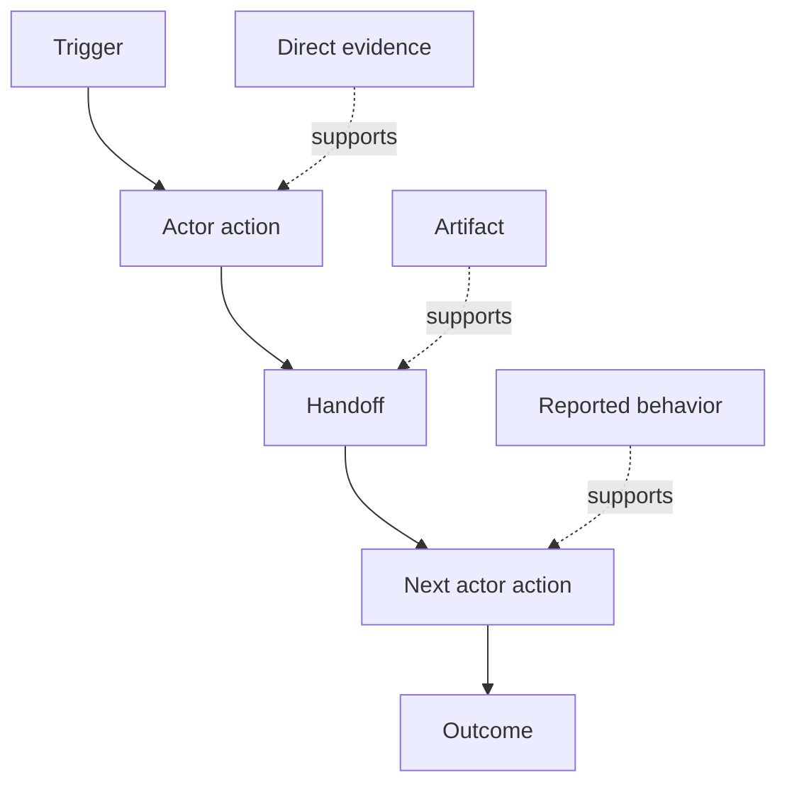

# Découvrez le flux de travail que les gens effectuent réellement

> Les exigences ne sont pas à attendre dans une réunion pour être collectées, elles sont dispersées sur des actions, des solutions, des dossiers et des désaccords.

**Type:** Learn + Build
**Languages:** Python (stdlib)
**Prerequisites:** Phase 14 lesson 47
**Time:** ~70 minutes

## Objectifs d'apprentissage

- Modéliser le flux de travail actuel en actions ordonnées avec des preuves.
- Séparer l'observation directe du comportement rapporté ou déduit.
- Trouvez les frictions, les délivrances, l'autorité et l'état caché.
- Gardez les affirmations incertaines visibles au lieu de les transformer en exigences.

## Commencez par le système actuel

Ne commencez pas par demander quelles caractéristiques les gens veulent, mais reconstruisez ce qui se passe maintenant.

Pour chaque étape, enregistrer:

| Field | Example |
|---|---|
| Actor | On-call engineer |
| Trigger | Production alert arrives |
| Action | Opens alert, then searches dashboards |
| Input | Alert payload and deployment record |
| Output | Candidate service and owner |
| Friction | Context switching across three tools |
| Authority | Incident commander approves a write |
| Evidence | Screen recording, incident log, runbook |

Le flux de travail est plus grand que l'écran. Il comprend l'attente, la copie-collage, les canaux latéraux, l'approbation, la récupération d'erreur et les étapes que les gens ont cessé de remarquer.

## Les preuves sont solides

Utilisez une échelle simple:

1. **Direct behavior:**observation, trace, enregistrement ou événement du système.
2. **Artifact:**billet, annuaire, journal, formulaire ou sortie complète.
3. **Reported behavior:**une personne décrit ce qu'elle fait.
4. **Inference:**L'équipe conclut ce qui se passe probablement.

Les quatre peuvent être utiles. Seuls les deux premiers prouvent directement le comportement actuel.



## Recherchez quatre choses

- **Friction:**des efforts répétés, des retards, des réentrées ou des rétablissements.
- **Hidden state:**des faits contenus dans la mémoire, la conversation ou les notes personnelles.
- **Authority:**la personne ou le système autorisé à apporter un changement conséquent.
- **Exceptions:**le cas où le flux de travail normal cesse d'être normal.

Les caractéristiques de l'IA échouent souvent à des remises et des exceptions parce que le chemin heureux était le seul chemin façonné.

## Ne négligez pas les désaccords

Deux utilisateurs peuvent effectuer des flux de travail différents pour de bonnes raisons.

- différents rôles;
- différents niveaux de risque;
- l'héritage et le processus actuel;
- les différences d'expertise;
- Un véritable désaccord politique.

Un flux de travail moyen ne peut décrire personne.

## Faites-le

Le laboratoire stocke des données sur chaque étape du flux de travail, valide l'ordre et la confiance, calcule le rapport direct-évidence et écrit `outputs/workflow-evidence.json`- Je suis désolé .

```bash
python3 code/main.py
python3 -m unittest discover code/tests -v
```

Ajoutez un chemin d'exception dans lequel le dossier de déploiement manque.

## Exercices

1. Reconstruire un flux de travail à partir d'un journal sans interviewer personne.
2. Interroger un utilisateur et marquer toute allégation qui manque encore de preuves directes.
3. Ajouter une limite d'autorité et une étape de récupération de défaillance.
4. Modèle deux variantes de flux de travail sans les fusionner.
5. Identifiez une caractéristique proposée qui supprime une étape visible mais laisse le travail caché intact.

## Pour en savoir plus

- [Nuseibeh and Easterbrook, Requirements Engineering: A Roadmap](https://www.cs.toronto.edu/~sme/papers/2000/ICSE2000.pdf)Il est important de noter que les données de base sont disponibles dans les pays tiers.
- [Gotel and Finkelstein, An Analysis of the Requirements Traceability Problem](https://doi.org/10.1109/ICRE.1994.292398), pour la difficulté de préserver la relation entre les exigences et leurs sources.

## Ce que vous gardez

Je le garde .`outputs/workflow-evidence.json`Il transforme l'observation de la friction et de l'incertitude en une carte d'hypothèse dans la prochaine leçon.
