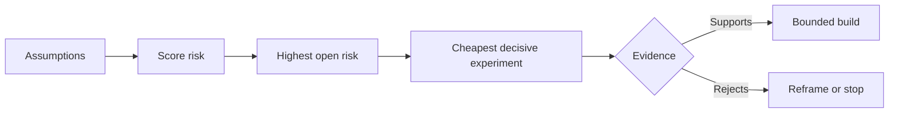

# Mettez en cartographie les hypothèses et résolvez d'abord celles qui présentent le plus de risques

> Une feuille de route cache l'incertitude à l'intérieur des caractéristiques.

**Type:** Learn + Build
**Languages:** Python (stdlib)
**Prerequisites:** Phase 14 lesson 48
**Time:** ~65 minutes

## Objectifs d'apprentissage

- Convertir les travaux proposés en hypothèses explicites.
- Les résultats de l'impact, de l'incertitude et de l'irréversibilité sont séparés.
- Choisissez l'expérience suivante par risque, pas par enthousiasme.
- Remplacez les hypothèses testées par des preuves et des décisions.

## Chaque bâtiment contient des paris

Un outil d'incident peut dépendre de la véracité de tous ces éléments:

- le contexte d'alerte contient suffisamment d'informations pour identifier un service;
- les ingénieurs font confiance à une recommandation qu'ils n'ont pas dérivées eux-mêmes;
- le temps de réponse souhaité est opérationnellement important;
- les données requises peuvent être consultées sans autorisation dangereuse;
- le flux de travail se produit assez souvent pour justifier la maintenance.

Ce ne sont pas des tâches de mise en œuvre, mais des conditions pour que la construction soit précieuse, utilisable, viable et sûre.

## Classes d'hypothèse

| Class | Question |
|---|---|
| Value | Will the outcome matter enough? |
| Usability | Can the user understand and act on it? |
| Feasibility | Can the system produce it with available data and constraints? |
| Viability | Can the organization sustain cost, ownership, and operation? |
| Safety | Can it fail without unacceptable consequence? |

Écrivez des hypothèses comme des déclarations falsifiables. La fonctionnalité est utilene peut pas être testée. 8 ingénieurs sur dix sur appel identifient le service correct plus rapidement avec le résultat de lecture seulement peut.

## Le risque n'est pas un nombre

Le laboratoire utilise trois dimensions de 1 à 5:

- **Impact:**les dommages si l'hypothèse est fausse.
- **Uncertainty:**faiblesse des preuves actuelles.
- **Irreversibility:**le coût de l'apprentissage après engagement.

Le score d'exemple multiplie l'impact et l'incertitude, puis ajoute l'irréversibilité. La formule n'est pas universelle. Son but est de forcer l'équipe à déclarer pourquoi un inconnu doit être résolu avant un autre.



## Conçuez une expérience, pas un rituel de confirmation

Un test utile a:

- une allégation qui pourrait être fausse;
- une population ou un échantillon réaliste;
- un résultat observable;
- un seuil décidé avant le résultat;
- une décision suivante pour la réussite, l'échec et des preuves ambiguës.

Évitez les tests qui démontrent que l'équipe peut construire l'idée.

## La réversibilité change l'ordre

Les choix irréversibles et de haute conséquence nécessitent des preuves antérieures. Un jeu de lecture uniquement peut précéder une intégration de production. Un adaptateur temporaire peut précéder une migration de données. Une recommandation approuvée par l'homme peut précéder une action automatique.

La forme de la construction doit suivre la forme de l'incertitude.

## Faites-le

Le laboratoire classe les hypothèses, distingue les affirmations testées des affirmations ouvertes, sélectionne le risque ouvert le plus élevé et écrit `outputs/assumption-map.json`- Je suis désolé .

```bash
python3 code/main.py
python3 -m unittest discover code/tests -v
```

Modifiez les preuves sur l'hypothèse de risque le plus élevé et observez comment l'expérience suivante change.

## Exercices

1. Écrivez cinq hypothèses pour une fonctionnalité que vous voulez construire.
2. Ajoutez une hypothèse de sécurité que votre liste de fonctionnalités a omise.
3. Définissez un seuil qui vous amènerait à arrêter la construction.
4. Remplacez une grande expérience par un test décisif moins cher.
5. Comparer le classement des risques avec la priorité de la feuille de route et expliquer le désaccord.

## Pour en savoir plus

- [Barry Boehm, A Spiral Model of Software Development and Enhancement](https://dl.acm.org/doi/10.1145/12944.12948), pour un cycle de développement axé sur le risque qui résout l'incertitude avant un engagement plus profond.
- [Dardenne, van Lamsweerde, and Fickas, Goal-Directed Requirements Acquisition](https://doi.org/10.1016/0167-6423(93)90021-G), pour le raffinement des objectifs tout en supprimant les obstacles et les contraintes.

## Ce que vous gardez

Je le garde .`outputs/assumption-map.json`La leçon suivante l'utilise pour choisir la plus petite tranche qui puisse produire des preuves décisives.
