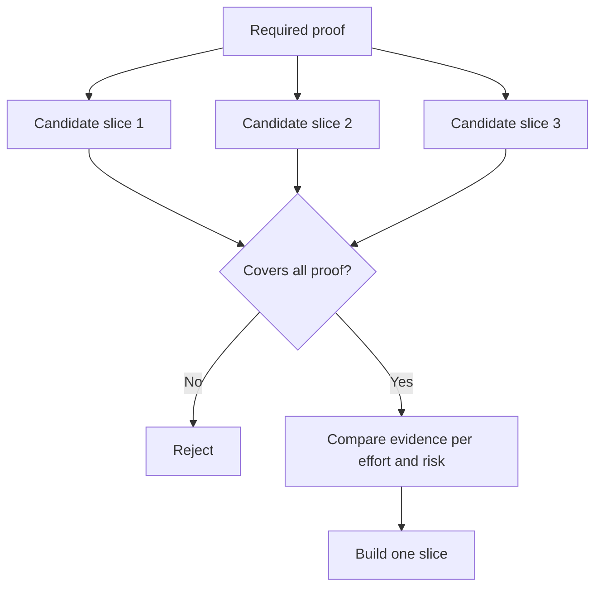

# Choisissez la plus petite tranche qui puisse changer la décision

> Une petite chose n'est utile que si elle prouve quelque chose d'important.

**Type:** Learn + Build
**Languages:** Python (stdlib)
**Prerequisites:** Phase 14 lesson 49
**Time:** ~65 minutes

## Objectifs d'apprentissage

- Définissez une tranche par les hypothèses qu'elle prouve.
- Équilibrer la valeur des résultats, la réduction de l'incertitude, l'effort et les conséquences.
- Je préfère des preuves réversibles à l'engagement de production prématurée.
- Rejetez les tranches qui omettent la partie risquée du flux de travail.

## Des moyens verticaux: preuves de bout en bout

Une tranche utile traverse le flux de travail réel minimum nécessaire pour observer un résultat. Elle peut être étroite en termes d'utilisateurs, de données, de durée et de capacité. Elle ne doit pas être étroite en éliminant l'incertitude exacte dont vous avez besoin pour tester.

Les exemples:

- Une répétition en lecture seulement sur dix incidents réels teste l'identification du service et la confiance de l'opérateur.
- Un tableau de bord polissé sur des données synthétiques peut tester la compréhension mais pas la faisabilité des données.
- Un remédiateur automatique de production teste tout en même temps avec des conséquences inacceptables.

## Définissez d'abord les preuves requises

Prenez les hypothèses ouvertes à risque élevé et transformez-les en un ensemble de preuves requis.

Comparer les tranches admissibles sur:

| Dimension | Direction |
|---|---|
| Outcome value | More is better |
| Uncertainty reduced | More is better |
| Effort | Less is better |
| Consequence | Less is better |
| Reversibility | More is better |

Le score du laboratoire est intentionnellement simple.



## Des faux minimums courants

- **The UI-only minimum:**supprime les données et l'incertitude opérationnelle.
- **The infrastructure-only minimum:**prouve une possibilité technique sans valeur utilisateur.
- **The happy-path minimum:**Il n'y a pas de risque.
- **The demo minimum:**produit un artefact persuasif mais aucune mesure répétée.
- **The platform minimum:**construit des machines réutilisables avant qu'un seul flux de travail ne les gagne.

## Ajouter une règle d'arrêt

Avant la mise en œuvre, écrivez ce qui se passe si la tranche échoue:

- abandonner le résultat;
- modifier l'utilisateur cible ou la situation;
- tester un mécanisme différent;
- recueillir de meilleures preuves;
- - Il faut encore plus de pouvoir.

Si chaque résultat conduit à la construction, la tranche n'est pas une expérience.

## Faites-le

Le laboratoire filtre les candidats par la preuve requise, marque les tranches admissibles et écrit `outputs/slice-decision.json`- Je suis désolé .

```bash
python3 code/main.py
python3 -m unittest discover code/tests -v
```

Ajouter un candidat moins cher qui prouve une seule hypothèse requise. Il devrait rester ineligible même si son score numérique est élevé.

## Exercices

1. Conçuez trois tranches pour le même résultat à différents niveaux de conséquences.
2. Indiquez la preuve requise avant de les marquer.
3. Retirez une capacité tout en préservant les preuves décisives.
4. Ajoutez une règle d'arrêt pour un pilote raté.
5. Identifier un composant de plateforme réutilisable qui devrait attendre après la tranche.

## Pour en savoir plus

- [Barry Boehm, A Spiral Model of Software Development and Enhancement](https://dl.acm.org/doi/10.1145/12944.12948), pour adapter chaque cycle de développement aux risques qu'il doit résoudre.
- [Lenarduzzi and Taibi, MVP Explained: A Systematic Mapping Study on the Definitions of Minimal Viable Product](https://arxiv.org/abs/1609.07592), pour l'ambiguïté concernant les minimum et viable dans la pratique des produits logiciels.

## Ce que vous gardez

Je le garde .`outputs/slice-decision.json`Il indique pourquoi cette tranche est la plus petite qui puisse changer la décision.
