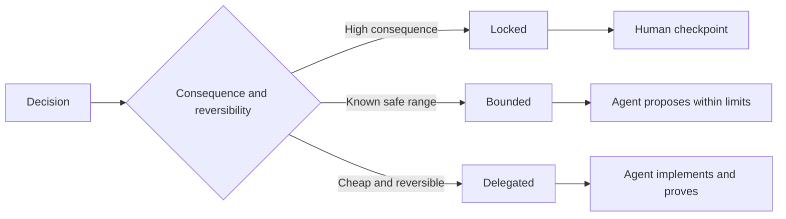

# Écrivez des spécifications qui préservent le jugement

> Une spécification utile fixe les invariants et les preuves tout en laissant des choix de mise en œuvre réversibles ouverts.

**Type:** Learn + Build
**Languages:** Python (stdlib)
**Prerequisites:** Phase 14 lesson 50
**Time:** ~75 minutes

## Objectifs d'apprentissage

- Résultat séparé, invariants, exemples, non-objectifs et preuve.
- Marquez les décisions comme étant fermées, limitées ou déléguées.
- Gardez le jugement des agents où les choix sont bon marché et réversibles.
- Exiger des points de contrôle humains où les conséquences ou le comportement public changent.

## Deux extrêmes maux

Une tâche sous-spécifiée demande à un agent de deviner le système.

Le moyen utile est un contrat exécutable:

| Surface | Purpose |
|---|---|
| Outcome | The observable result |
| Invariants | Conditions that must always remain true |
| Examples | Concrete cases that reveal intent |
| Non-goals | Adjacent behavior intentionally excluded |
| Decision policy | Which choices are locked, bounded, or delegated |
| Proof | Evidence required before completion |

## Trois modes de décision

- **Locked:**L'utilisation pour la compatibilité publique, l'autorité, la sécurité, le coût irréversible ou un engagement du produit.
- **Bounded:**L'agent peut choisir dans des limites explicites. Utilisation pour les budgets de recherche, les recensements d'essais, les dépendances autorisées ou une famille d'interface connue.
- **Delegated:**L'agent possède le choix et doit l'expliquer.



## Décrivez votre comportement par des exemples

Les exemples comprennent mieux l'intention que les adjectifs. Utilisants,  robustes, et prêt à la production ne sont pas exécutables.

Les exemples ne remplacent pas les invariants.

## Les preuves doivent être conformes à la revendication

- Un test d'unité prouve un contrat de fonction locale.
- Un test de fil prouve la sérialisation et le comportement de transport.
- Un parcours de navigateur prouve un chemin d'interface.
- Un ensemble de répétitions prouve le comportement sur des cas représentatifs.
- Un journal d'audit prouve que les limites de l'autorité étaient respectées.

Ne pas accepter une couche inférieure comme preuve d'une affirmation de couche supérieure.

## Préservez délibérément les choses inconnues

Une spécification peut dire que l'exécution peut choisir n'importe quelle source à lire uniquement qui revient dans le budget. Ce n'est pas une vagueur.

Les spécifications doivent évoluer lorsque les preuves changent. Préserver la raison derrière les choix verrouillés et limités afin que les équipes ultérieures puissent les réviser sans archéologie.

## Faites-le

Le laboratoire valide chaque surface du contrat, vérifie les modes de décision et écrit `outputs/executable-specification.json`- Je suis désolé .

```bash
python3 code/main.py
python3 -m unittest discover code/tests -v
```

Mettre la décision de production-écriture de verrouillé à délégué. Expliquez pourquoi le schéma accepte la valeur mais le risque produit ne l'accepte pas.

## Exercices

1. Convertir un billet de retard dans les six surfaces de spécifications.
2. Remplacez trois instructions d'exécution par une invariante et deux exemples.
3. Marquez chaque décision et justifiez chaque choix bloqué ou limité.
4. Ajoutez un reçu de preuve pour chaque invariante.
5. Supprimer une contrainte qui n'a aucune preuve ou aucune raison de risquer.

## Pour en savoir plus

- [Nuseibeh and Easterbrook, Requirements Engineering: A Roadmap](https://www.cs.toronto.edu/~sme/papers/2000/ICSE2000.pdf), pour la relation entre les objectifs, les spécifications précises, la validation, l'accord et l'évolution.
- [Zave and Jackson, Four Dark Corners of Requirements Engineering](https://doi.org/10.1145/267895.267896), pour séparer les hypothèses, les exigences et les spécifications environnementales.
- [Gotel and Finkelstein, An Analysis of the Requirements Traceability Problem](https://doi.org/10.1109/ICRE.1994.292398), pour préserver la raison pour laquelle une exigence existe et d'où elle vient.

## Ce que vous gardez

Je le garde .`outputs/executable-specification.json`Il devient le contrat partagé entre les agents de codage et les examinateurs humains.
