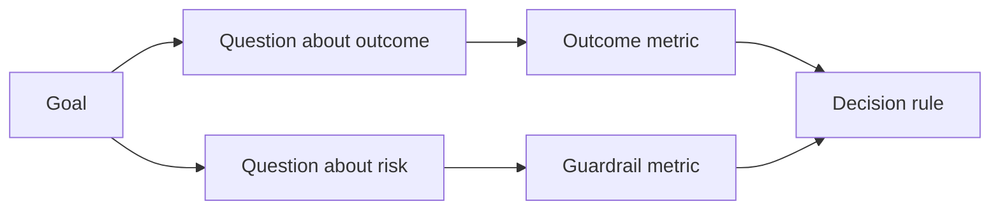

# Conception de mesures de réussite avant l'existence du résultat

> La mesure doit répondre à une décision, pas décorer un tableau de bord. Commencez par l'objectif, dérivez des questions, puis choisissez les plus petites mesures qui répondent à ces questions.

**Type:** Learn + Build
**Languages:** Python (stdlib)
**Prerequisites:** Phase 14 lessons 47 and 51
**Time:** ~70 minutes

## Objectifs d'apprentissage

- Dériver des questions et des mesures d'un objectif final.
- Définissez les seuils, les fenêtres, les sources et les directions avant d'observer les résultats.
- Partagez les mesures de résultat avec les barreaux et les contre-métres.
- Les preuves de l'évaluation correspondent à la décision que doit appuyer la construction.

## Objectif, question, métrique

Commencez par un objectif:

> Réduire le temps d'identification du service affecté sans augmenter les actions dangereuses.

Des questions dérivées:

- Combien de temps faut- il pour identifier le bon service?
- Combien de fois le service identifié est-il correct ?
- Le diagnostic reste-t-il seulement lu ?
- Le flux de travail augmente-t-il le rejet des alertes ou la charge de travail de l'opérateur?

Ensuite, choisissez des mesures qui fonctionnent ces questions.



## Une mesure nécessite un contrat

Chaque métrique a besoin de:

| Field | Example |
|---|---|
| Name | `median_identification_seconds` |
| Direction | at most |
| Threshold | 120 |
| Window | ten incident replays |
| Source | replay event log |
| Population | on-call engineers in the pilot |
| Kind | outcome or guardrail |

Sans source et fenêtre, un nombre ne peut être reproduit.

## Résultat, garde-ferre et contre-métrologie

- **Outcome metric:**l'état souhaité s'est-il amélioré ?
- **Guardrail:**une contrainte fixe est-elle toujours valable ?
- **Counter-metric:**le changement de poste local a-t-il coûté ou endommagé ailleurs ?

Pour un flux de travail accidentel, la vitesse n'est pas suffisante.

## Des preuves hors ligne et en ligne

Le jeu de répétition hors ligne est utile pour la répétabilité et la couverture des bords. Un pilote délimité est utile pour un comportement réel, une confiance et des effets de flux de travail.

Utilisez les preuves les moins chères qui peuvent répondre à la décision en cours.

## Décidez avant de prendre des mesures

Écrivez les passes, les échecs et les chemins ambiguës avant de voir les résultats.

Exemple:

- Pass: taux de service correct d'au moins 0,9 et temps médian de 120 secondes au maximum;
- défaillance: tout taux de production de rédaction ou de correction inférieur à 0,75;
- ambigu: une petite amélioration avec une large variance, nécessitant un ensemble de répétition plus grand.

## Faites-le

Le laboratoire valide un plan de mesure, évalue les seuils inclus, enregistre les valeurs manquantes et écrit `outputs/measurement-report.json`- Je suis désolé .

```bash
python3 code/main.py
python3 -m unittest discover code/tests -v
```

Retirez la mesure de garde et observez pourquoi le plan devient invalidé même lorsque les mesures de résultat restent.

## Exercices

1. Déduire trois questions d'un seul objectif final.
2. Ajouter une contre-méthrique qui capture le coût déplacé à un autre rôle.
3. Définir la source, la population et la fenêtre pour chaque métrique.
4. Écrivez des décisions passées, échouées et ambiguës avant de générer des valeurs.
5. Identifiez une mesure facile à collecter mais qui ne peut pas changer la décision.

## Pour en savoir plus

- [Basili, Software Modeling and Measurement: The Goal/Question/Metric Paradigm](https://drum.lib.umd.edu/items/8119803a-362b-42ec-b6ce-2311713e7236), pour dériver des mesures opérationnelles à partir d'objectifs explicites.
- [Basili, Caldiera, and Rombach, The Goal Question Metric Approach](https://www.cs.toronto.edu/~sme/CSC444F/handouts/GQM-paper.pdf), pour l'application de la méthode en tant que système de rétroaction et d'amélioration.

## Ce que vous gardez

Je le garde .`outputs/measurement-report.json`Il définit la porte d'épreuve pour le prototype, le pilote ou la phase de production.
