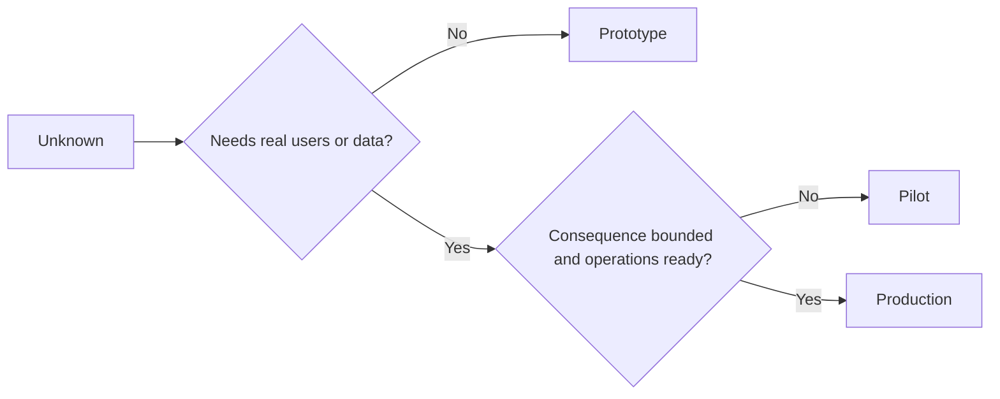

# Choisissez délibérément le prototype, le pilote ou la production

> Il s'agit d'environnements d'apprentissage différents, pas de niveaux de polissage.

**Type:** Learn + Build
**Languages:** Python (stdlib)
**Prerequisites:** Phase 14 lessons 50 to 52
**Time:** ~70 minutes

## Objectifs d'apprentissage

- Choisissez une étape de construction parmi l'inconnu, le public, les données, les conséquences et la préparation.
- Définir les contrôles et les critères de sortie spécifiques à chaque étape.
- empêcher les prototypes de devenir silencieusement des systèmes de production.
- Retarder l'autorité réelle jusqu'à ce que des preuves et des opérations la justifient.

## Trois questions différentes

| Stage | Primary question |
|---|---|
| Prototype | Can this mechanism produce the evidence at all? |
| Pilot | Does it work safely with a bounded real audience and real conditions? |
| Production | Can we own it continuously at the promised reliability and risk level? |

Un prototype peut être techniquement complet et être jetable. Un pilote peut utiliser les données de production tout en restant limité en audience et autorité.

## Prototype

Utilisez un prototype lorsque l'inconnu ne nécessite pas de vrais utilisateurs ou de vrais données.

- décomposable;
- isolé;
- étroit dans le comportement;
- explicite sur la question de l'apprentissage;
- exempt de fausses garanties opérationnelles.

Ne pas optimiser l'architecture avant que le mécanisme ne gagne une autre étape.

## Pilot

Utilisez un pilote lorsque l'inconnu nécessite un comportement réel, des données réalistes ou un véritable flux de travail, mais la conséquence ou la préparation n'est pas encore compatible avec la diffusion générale.

Un pilote a besoin de:

- un public désigné;
- un propriétaire humain;
- durée et autorité limitées;
- l'audit et le retour en action;
- les seuils de sortie et de garde;
- critères de sortie pour l'expansion, la révision ou l'arrêt.

## Production

La production a besoin de plus que de déploiement:

- objectif de niveau de service;
- propriété à l'appel et en cas d'incident;
- l'examen de la sécurité et de la confidentialité;
- contrôles des coûts et des capacités;
- le retour et la récupération;
- la surveillance continue;
- une voie de retraite.



## Départ de la phase

Le code prototype devient dangereux lorsqu'il acquiert des utilisateurs, des données ou une autorité sans acquérir la propriété.

L'étape doit être observable à partir du système lui-même.

## Faites-le

Le laboratoire choisit une étape du contexte de la décision, renvoie les contrôles requis et écrit `outputs/stage-decisions.json`- Je suis désolé .

```bash
python3 code/main.py
python3 -m unittest discover code/tests -v
```

Modifier l'exemple pilote à faible conséquence avec préparation opérationnelle.

## Exercices

1. Classifier trois projets en cours par étape d'apprentissage et non par statut de déploiement.
2. Écrivez des critères de sortie du pilote qui incluent une décision d'arrêt.
3. Ajouter un contrôle technique qui empêche un prototype d'atteindre les données de production.
4. Identifier la première responsabilité opérationnelle qui fait la production de construction.
5. Conçuez un reçu de retour pour le pilote délimité.

## Pour en savoir plus

- [Barry Boehm, A Spiral Model of Software Development and Enhancement](https://dl.acm.org/doi/10.1145/12944.12948), pour correspondre l'engagement de chaque itération au risque résolu.
- [Fagerholm et al., Building Blocks for Continuous Experimentation](https://doi.org/10.1145/2601248.2601276)Il est important de noter que les résultats obtenus par les chercheurs ont été évalués en fonction des conditions organisationnelles et techniques requises pour mener des expériences en continu.

## Ce que vous gardez

Je le garde .`outputs/stage-decisions.json`Il indique pourquoi chaque étape est justifiée et quels contrôles doivent exister avant la prochaine.
