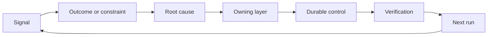

# Construisez un ratchet de rétroaction avec la propriété et la retraite

> La navigation ferme une boucle de construction et ouvre la boucle d'apprentissage.

**Type:** Learn + Build
**Languages:** Python (stdlib)
**Prerequisites:** Phase 14 lessons 46 and 53
**Time:** ~75 minutes

## Objectifs d'apprentissage

- Transformez les incidents, les évaluations, le comportement des utilisateurs et les corrections en actions propres.
- Routez chaque signal vers le contexte, l'évaluation, la politique, le temps d'exécution ou le backlog.
- Faites priorité à la récurrence par gravité et fréquence.
- Donnez à chaque contrôle une condition de retraite.

## Les commentaires sont des infrastructures

Une équipe peut recueillir des traces, des évaluations, des billets de soutien et des journaux d'incidents sans en apprendre quoi que ce soit.

La boucle est:

1. observer un signal concret;
2. le relier à un résultat, à une contrainte ou à une hypothèse;
3. identifier la couche de système la plus ancienne qui détient la cause;
4. créer un changement limité;
5. vérifier que la récurrence devient moins probable;
6. examiner si le contrôle devrait rester.

## La route vers la propriété

| Signal | Destination |
|---|---|
| False positive, regression, wrong result | Evaluation or test |
| Missing context, duplicate work, stale fact | Context source or retrieval route |
| Unsafe action or authority gap | Policy or permission boundary |
| Timeout, retry storm, unavailable dependency | Runtime control |
| New product need or unresolved tradeoff | Shaped backlog item |

Réfléchissez à la cause au premier niveau de l'effet.



## La propriété fait partie du contrôle

Chaque action à la raquette a besoin de:

- un propriétaire;
- une priorité fondée sur les conséquences et la récurrence;
- l'artefact à modifier;
- la vérification qui prouve le changement;
- une fenêtre de réexamen ou d'expiration;
- une condition de retraite.

Une amélioration non propre est une observation avec une meilleure mise en forme.

## Retirer les contrôles stables

Les systèmes de rétroaction accumulent des politiques. Cette politique peut devenir contradictoire et coûteuse.

- des modifications de l'architecture ou du flux de travail;
- une invariante de niveau inférieur remplace une instruction de niveau supérieur;
- la défaillance protégée n'est pas apparue dans la fenêtre choisie;
- Le contrôle bloque les travaux légitimes plus souvent qu'il ne prévient les dommages.

La retraite a aussi besoin de preuves.

## Connectez le commentaire de l'agent de construction et de codage

La même fourchette sert les deux pistes:

- Les preuves du produit modifient le cadre de résultats, les hypothèses, la tranche ou le plan de mesure.
- Les corrections de codeur modifient les tests, le contexte, la portée, l'automatisation ou la remise.
- Les incidents peuvent modifier à la fois la limite du produit et le tableau de bord des agents.

C'est pourquoi la mise en forme de la construction n'est pas une phase qui se termine avant le codage.

## Faites-le

Le laboratoire classe les signaux, crée des actions propriétaires, les priorise et écrit.`outputs/feedback-backlog.json`- Je suis désolé .

```bash
python3 code/main.py
python3 -m unittest discover code/tests -v
```

Ajoutez un signal de temps d'arrêt de l'exécution et confirmez qu'il est en route vers l'exécution plutôt que vers le backlog général.

## Exercices

1. Transformer un incident et une plainte d'utilisateur en actions de ratchet.
2. Nombre de la couche la plus ancienne qui peut empêcher chaque récurrence.
3. Ajouter des commandes de vérification ou des observations à la sortie du laboratoire.
4. Définir une condition de retraite pour une règle de police.
5. Trace un a accepté la correction dans le cadre de la tâche suivante.

## Pour en savoir plus

- [Basili, Caldiera, and Rombach, The Goal Question Metric Approach](https://www.cs.toronto.edu/~sme/CSC444F/handouts/GQM-paper.pdf), pour l'apprentissage organisationnel par la mesure axée sur les objectifs.
- [Fagerholm et al., Building Blocks for Continuous Experimentation](https://doi.org/10.1145/2601248.2601276), pour la boucle technique et organisationnelle qui relie les preuves au développement continu du produit.
- [Nuseibeh and Easterbrook, Requirements Engineering: A Roadmap](https://www.cs.toronto.edu/~sme/papers/2000/ICSE2000.pdf), pour traiter les exigences comme évoluant au cours du cycle de vie du système.

## Ce que vous gardez

Je le garde .`outputs/feedback-backlog.json`. Il s'agit de l'artefact de clôture du parcours de jugement et de livraison du produit et de l'entrée dans le cadre de résultats suivant.
