# Protocoles de communication

> Les agents qui ne parlent pas la même langue ne sont pas une équipe, mais des étrangers qui crient dans le vide.

**Type:** Build
**Languages:** TypeScript
**Prerequisites:** Phase 14 (Agent Engineering), Lesson 16.01 (Why Multi-Agent)
**Time:** ~120 minutes

## Objectifs d'apprentissage

- Implementer la découverte et l'invocation des outils MCP afin que les agents puissent utiliser les outils exposés par des serveurs externes
- Construire une carte d'agent A2A et un point d'extrémité de tâche qui permet à un agent de déléguer le travail à un autre via HTTP
- Comparer MCP (accès aux outils), A2A (agent-à-agent), ACP (audit des entreprises) et ANP (trust décentralisé) et expliquer quel protocole résolve quel problème
- Connectez plusieurs protocoles ensemble dans un seul système où les agents découvrent des outils via MCP et déléguent des tâches via A2A

## Le problème

Vous divisez votre système en plusieurs agents, un chercheur, un codeur, un critique, ils sont superbes dans leur travail individuel, mais maintenant vous avez besoin qu'ils parlent réellement les uns aux autres.

Votre première tentative est évidente: passez des chaînes autour. Le chercheur renvoie une tache de texte, le codeur la analyse de la façon dont il peut. Cela fonctionne jusqu'à ce que le codeur interprète mal un résumé de recherche, ou deux agents en impasse qui s'attendent l'un l'autre, ou vous avez besoin d'agents construits par différentes équipes pour collaborer. Soudainement " juste passer des chaînes " tombe en panne.

Sans un contrat commun pour l'échange d'informations, les systèmes multi-agents sont fragiles, non auditifs et impossibles à échanger au-delà d'une poignée d'agents que vous avez écrits personnellement.

L'écosystème de l'IA a répondu avec quatre protocoles, chacun résolvant une tranche différente du problème:

- **MCP**pour l'accès aux outils
- **A2A**pour la collaboration entre agents
- **ACP**pour la vérifiabilité des entreprises
- **ANP**pour une identité et une confiance décentralisées

Cette leçon va en profondeur. Vous lirez des formats de fil réels de chaque spécification, construirez des implémentations de travail et connectez les quatre dans un système unifié.

## Le concept

### Le paysage du protocole

Pensez à ces quatre protocoles comme des couches, chacune abordant une question différente:

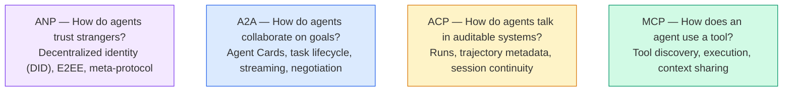

Ils ne sont pas des concurrents, ils résolvent différents problèmes à différents niveaux.

### MCP (récapitulation)

Le MCP est couvert en profondeur dans la phase 13. Résumé rapide: le MCP normalise la façon dont un LLM se connecte à des outils externes et à des sources de données.**client-server**protocole dans lequel l'agent (client) détecte et appelle des outils exposés par un serveur.

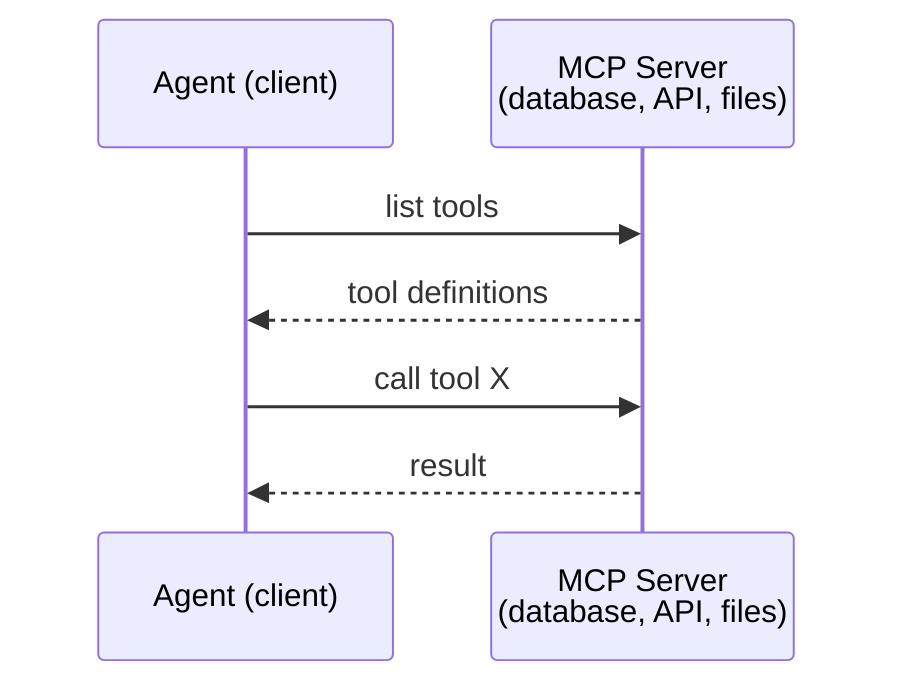

Le MCP est **agent-to-tool**Ça n'aide pas les agents à communiquer.

### A2A (Protocole sur les agents2actifs)

**Created by:**Google (maintenant sous la Linux Foundation comme `lf.a2a.v1`)
**Spec version:**1.0.0
**Problem:**Comment les agents autonomes collaborent-ils, négocient-ils et se déléguent-ils mutuellement des tâches?

A2A est le protocole pour **peer-to-peer agent collaboration**. Lorsque MCP connecte un agent à des outils, A2A connecte un agent à d'autres agents.**Agent Card**d'autres agents découvrent, négocient et lui déléguent des tâches.

#### Comment fonctionne A2A

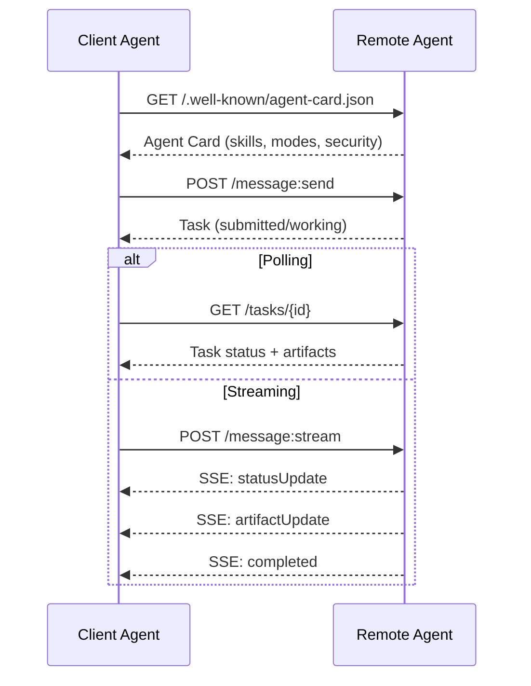

#### La carte de l'agent réel

C'est à quoi ressemble une carte d'agent A2A dans la nature.`GET /.well-known/agent-card.json`- Le numéro de la liste:

```json
{
  "name": "Research Agent",
  "description": "Searches documentation and summarizes findings",
  "version": "1.0.0",
  "supportedInterfaces": [
    {
      "url": "https://research-agent.example.com/a2a/v1",
      "protocolBinding": "JSONRPC",
      "protocolVersion": "1.0"
    },
    {
      "url": "https://research-agent.example.com/a2a/rest",
      "protocolBinding": "HTTP+JSON",
      "protocolVersion": "1.0"
    }
  ],
  "provider": {
    "organization": "Your Company",
    "url": "https://example.com"
  },
  "capabilities": {
    "streaming": true,
    "pushNotifications": false
  },
  "defaultInputModes": ["text/plain", "application/json"],
  "defaultOutputModes": ["text/plain", "application/json"],
  "skills": [
    {
      "id": "web-research",
      "name": "Web Research",
      "description": "Searches the web and synthesizes findings",
      "tags": ["research", "search", "summarization"],
      "examples": ["Research the latest changes in React 19"]
    },
    {
      "id": "doc-analysis",
      "name": "Documentation Analysis",
      "description": "Reads and analyzes technical documentation",
      "tags": ["docs", "analysis"],
      "inputModes": ["text/plain", "application/pdf"],
      "outputModes": ["application/json"]
    }
  ],
  "securitySchemes": {
    "bearer": {
      "httpAuthSecurityScheme": {
        "scheme": "Bearer",
        "bearerFormat": "JWT"
      }
    }
  },
  "security": [{ "bearer": [] }]
}
```

Les points clés à noter:
- **Skills**Chacun a un identifiant, des balises et des types MIME d'entrée/sortie pris en charge. C'est ainsi qu'un agent client décide si cet agent distant peut gérer sa demande.
- **supportedInterfaces**Un seul agent peut parler simultanément JSON-RPC, REST et gRPC.
- **Security**Le client sait ce dont il a besoin avant de faire une seule demande.

#### Cycle de vie des tâches

Les tâches sont l'unité de travail de base dans A2A. Elles se déplacent à travers des états définis:

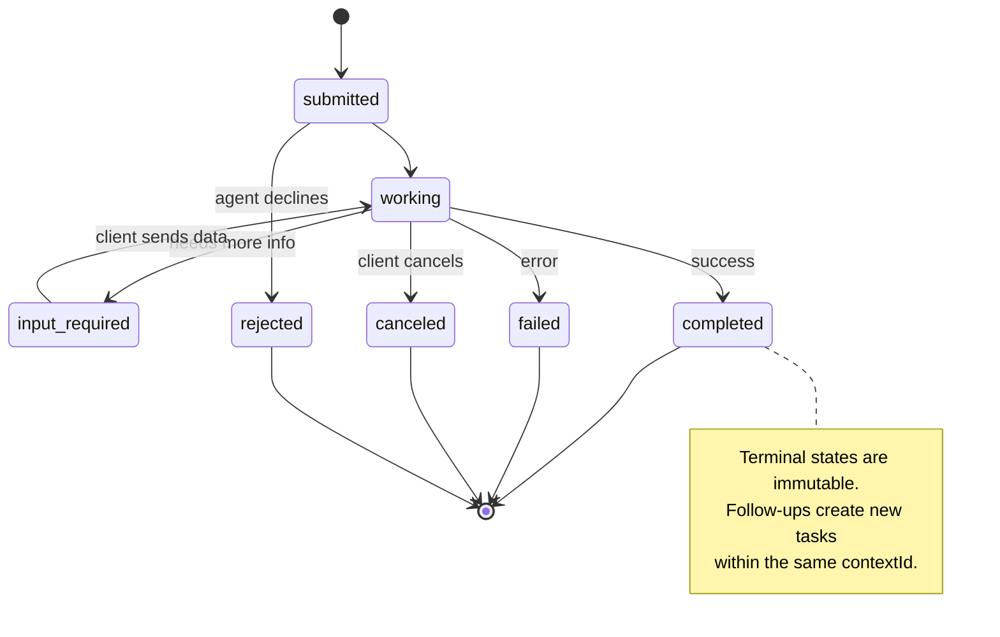

Les 8 États (les spécifications définissent également `UNSPECIFIED`comme sentinelle, omise ici):

| State | Terminal? | Meaning |
|---|---|---|
| `TASK_STATE_SUBMITTED` | No | Acknowledged, not yet processing |
| `TASK_STATE_WORKING` | No | Actively being processed |
| `TASK_STATE_INPUT_REQUIRED` | No | Agent needs more info from client |
| `TASK_STATE_AUTH_REQUIRED` | No | Authentication needed |
| `TASK_STATE_COMPLETED` | Yes | Finished successfully |
| `TASK_STATE_FAILED` | Yes | Finished with error |
| `TASK_STATE_CANCELED` | Yes | Canceled before completion |
| `TASK_STATE_REJECTED` | Yes | Agent declined the task |

Une fois qu'une tâche atteint un état terminal, elle est immuable. Aucun message supplémentaire.`contextId`- Je suis désolé .

#### Format du fil

A2A utilise JSON-RPC 2.0. Voici à quoi ressemble un échange de messages réel:

**Client sends a task:**
```json
{
  "jsonrpc": "2.0",
  "id": 1,
  "method": "SendMessage",
  "params": {
    "message": {
      "messageId": "msg-001",
      "role": "ROLE_USER",
      "parts": [{ "text": "Research React 19 compiler features" }]
    },
    "configuration": {
      "acceptedOutputModes": ["text/plain", "application/json"],
      "historyLength": 10
    }
  }
}
```

**Agent responds with a task:**
```json
{
  "jsonrpc": "2.0",
  "id": 1,
  "result": {
    "task": {
      "id": "task-abc-123",
      "contextId": "ctx-xyz-789",
      "status": {
        "state": "TASK_STATE_COMPLETED",
        "timestamp": "2026-03-27T10:30:00Z"
      },
      "artifacts": [
        {
          "artifactId": "art-001",
          "name": "research-results",
          "parts": [{
            "data": {
              "findings": [
                "React 19 compiler auto-memoizes components",
                "No more manual useMemo/useCallback needed",
                "Compiler runs at build time, not runtime"
              ]
            },
            "mediaType": "application/json"
          }]
        }
      ]
    }
  }
}
```

**Streaming via SSE:**
```text
POST /message:stream HTTP/1.1
Content-Type: application/json
A2A-Version: 1.0

data: {"task":{"id":"task-123","status":{"state":"TASK_STATE_WORKING"}}}

data: {"statusUpdate":{"taskId":"task-123","status":{"state":"TASK_STATE_WORKING","message":{"role":"ROLE_AGENT","parts":[{"text":"Searching documentation..."}]}}}}

data: {"artifactUpdate":{"taskId":"task-123","artifact":{"artifactId":"art-1","parts":[{"text":"partial findings..."}]},"append":true,"lastChunk":false}}

data: {"statusUpdate":{"taskId":"task-123","status":{"state":"TASK_STATE_COMPLETED"}}}
```

### ACP (protocole de communication de l'Agence)

**Created by:**IBM / BeeAI
**Spec version:**Les données de l'application doivent être fournies à l'utilisateur.
**Status:**Fusion dans A2A sous la Fondation Linux
**Problem:**Comment les agents communiquent-ils avec une auditabilité complète, une continuité de séances et un suivi de trajectoire?

ACP est le **enterprise protocol**- Contrairement à ce que prétendent de nombreux résumés, l'ACP fait**not**JSON-LD est une API REST/JSON simple définie par OpenAPI.**TrajectoryMetadata**: chaque réponse d'agent peut contenir un journal détaillé des étapes de raisonnement et des appels à l'outil qui l'ont produite.

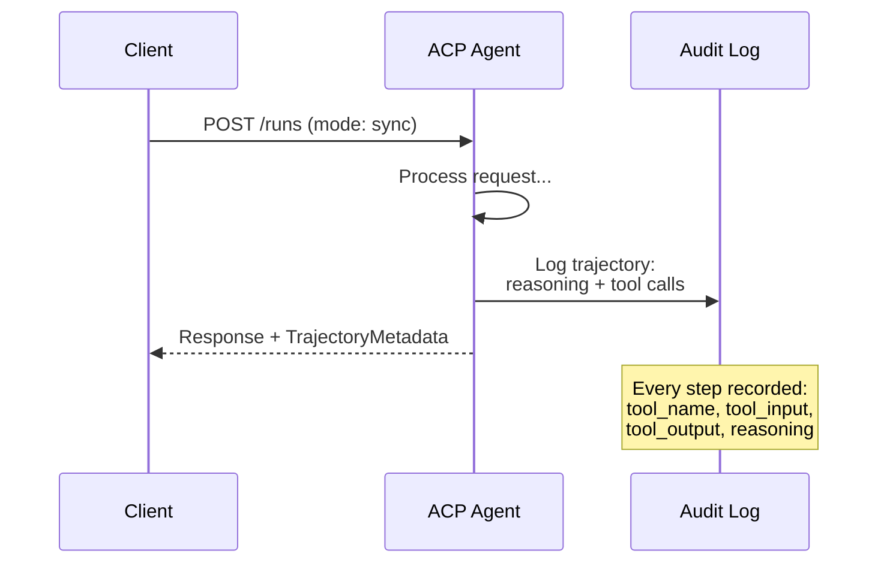

#### L'agent Discovery dans l'ACP

ACP définit quatre méthodes de découverte:

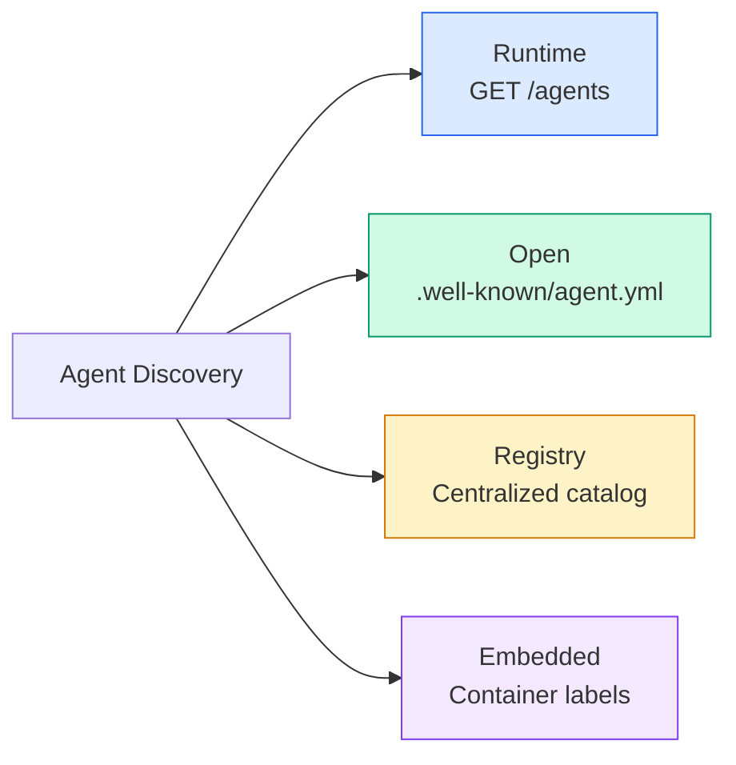

Le **AgentManifest**est plus simple que la carte d'agent d'A2A:

```json
{
  "name": "summarizer",
  "description": "Summarizes documents with source citations",
  "input_content_types": ["text/plain", "application/pdf"],
  "output_content_types": ["text/plain", "application/json"],
  "metadata": {
    "tags": ["summarization", "RAG"],
    "framework": "BeeAI",
    "capabilities": [
      {
        "name": "Document Summarization",
        "description": "Condenses long documents into key points"
      }
    ],
    "recommended_models": ["llama3.3:70b-instruct-fp16"],
    "license": "Apache-2.0",
    "programming_language": "Python"
  }
}
```

#### Exécution du cycle de vie

ACP utilise "Runs" au lieu de "Tâches".

| Mode | Behavior |
|---|---|
| `sync` | Blocking. Response contains the complete result. |
| `async` | Returns 202 immediately. Poll `GET /runs/{id}` for status. |
| `stream` | SSE stream. Events fire as the agent works. |

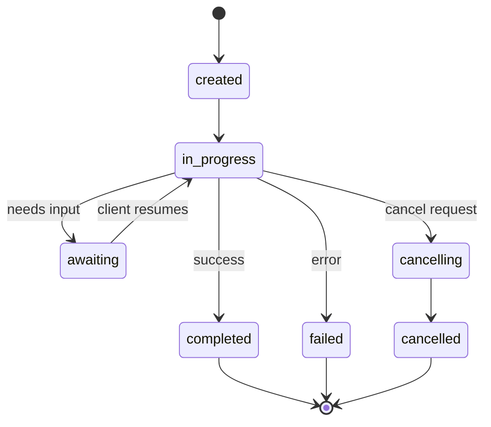

#### TrajectorieLes métadonnées (la piste d'audit)

C'est le différenciateur clé de l'ACP. Chaque partie du message peut contenir des métadonnées montrant exactement ce que l'agent a fait:

```json
{
  "role": "agent/researcher",
  "parts": [
    {
      "content_type": "text/plain",
      "content": "The weather in San Francisco is 72F and sunny.",
      "metadata": {
        "kind": "trajectory",
        "message": "I need to check the weather for this location",
        "tool_name": "weather_api",
        "tool_input": { "location": "San Francisco, CA" },
        "tool_output": { "temperature": 72, "condition": "sunny" }
      }
    }
  ]
}
```

Pour les industries réglementées, c'est de l'or. Chaque réponse est accompagnée d'une chaîne de raisonnement prouvable: quels outils ont été appelés, quels inputs ont été utilisés, quels résultats ont été reçus.

ACP appuie également **CitationMetadata**pour l'attribution de la source:

```json
{
  "kind": "citation",
  "start_index": 0,
  "end_index": 47,
  "url": "https://weather.gov/sf",
  "title": "NWS San Francisco Forecast"
}
```

### ANP (protocole de réseau d'agents)

**Created by:**Communauté open source (fondée par GaoWei Chang)
**Repo:** [github.com/agent-network-protocol/AgentNetworkProtocol](https://github.com/agent-network-protocol/AgentNetworkProtocol)
**Problem:**Comment les agents de différentes organisations peuvent-ils se faire confiance sans autorité centrale ?

L' ANP est le **decentralized identity protocol**Il construit la confiance en utilisant des identifiants décentralisés W3C (DID) et le cryptage de bout en bout.

L'ANP est constitué de trois couches:

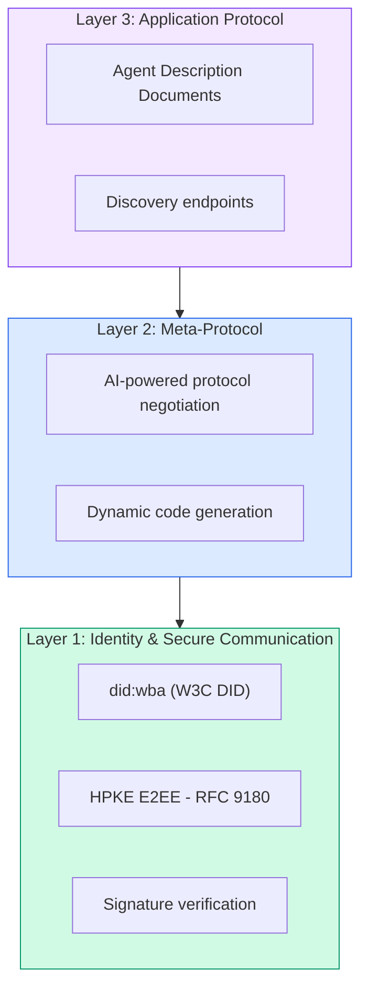

#### Documents de la DID (structure réelle)

L' ANP utilise une méthode personnalisée appelée `did:wba`Le DID .`did:wba:example.com:user:alice`résolue à `https://example.com/user/alice/did.json`- Le numéro de la liste:

```json
{
  "@context": [
    "https://www.w3.org/ns/did/v1",
    "https://w3id.org/security/suites/jws-2020/v1",
    "https://w3id.org/security/suites/secp256k1-2019/v1"
  ],
  "id": "did:wba:example.com:user:alice",
  "verificationMethod": [
    {
      "id": "did:wba:example.com:user:alice#key-1",
      "type": "EcdsaSecp256k1VerificationKey2019",
      "controller": "did:wba:example.com:user:alice",
      "publicKeyJwk": {
        "crv": "secp256k1",
        "x": "NtngWpJUr-rlNNbs0u-Aa8e16OwSJu6UiFf0Rdo1oJ4",
        "y": "qN1jKupJlFsPFc1UkWinqljv4YE0mq_Ickwnjgasvmo",
        "kty": "EC"
      }
    },
    {
      "id": "did:wba:example.com:user:alice#key-x25519-1",
      "type": "X25519KeyAgreementKey2019",
      "controller": "did:wba:example.com:user:alice",
      "publicKeyMultibase": "z9hFgmPVfmBZwRvFEyniQDBkz9LmV7gDEqytWyGZLmDXE"
    }
  ],
  "authentication": [
    "did:wba:example.com:user:alice#key-1"
  ],
  "keyAgreement": [
    "did:wba:example.com:user:alice#key-x25519-1"
  ],
  "humanAuthorization": [
    "did:wba:example.com:user:alice#key-1"
  ],
  "service": [
    {
      "id": "did:wba:example.com:user:alice#agent-description",
      "type": "AgentDescription",
      "serviceEndpoint": "https://example.com/agents/alice/ad.json"
    }
  ]
}
```

Les points clés à noter:
- **Key separation**Les clés de signature (secp256k1) sont séparées des clés de chiffrement (X25519).
- **`humanAuthorization`**Les clés doivent être utilisées par l'homme avant d'être utilisées.
- **`keyAgreement`**Les clés sont utilisées pour le chiffrement de bout en bout HPKE (RFC 9180).
- Le **service**la section renvoie au document de description de l'agent.

#### Comment la confiance fonctionne dans l'ANP

L' ANP le fait **not**utiliser un graphique de confiance ou d'approbation.

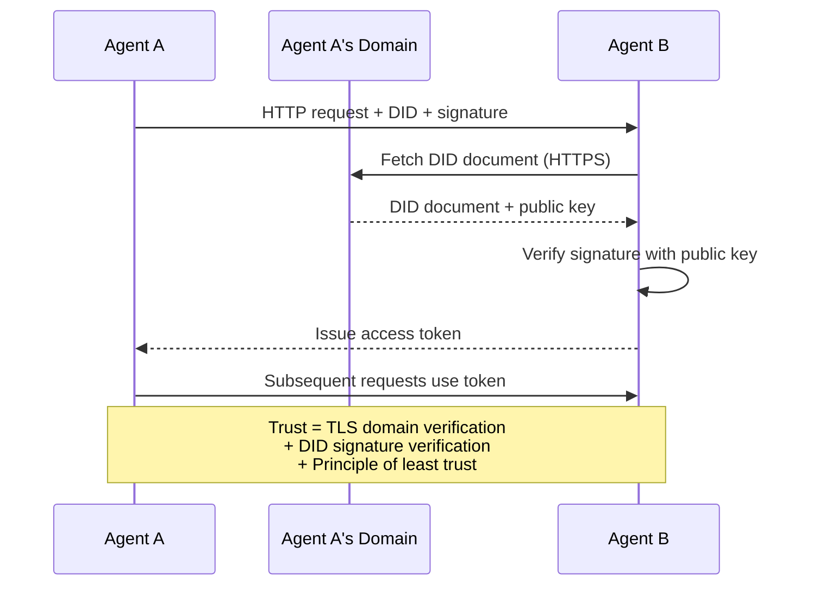

La confiance vient de trois sources:
1. **Domain-level TLS**vérifie l'hôte du document DID
2. **DID cryptographic signatures**vérifier l'identité de l'agent
3. **Principle of least trust**ne donne que des autorisations minimales

Il n'y a pas de propagation de confiance basée sur des rumeurs ou de PageRank.

#### Négociation du protocole méta

C'est la fonctionnalité la plus nouvelle de l'ANP. Quand deux agents d'écosystèmes différents se rencontrent, ils n'ont pas besoin de formats de données préconnus.

```json
{
  "action": "protocolNegotiation",
  "sequenceId": 0,
  "candidateProtocols": "I can communicate using:\n1. JSON-RPC with hotel booking schema\n2. REST with OpenAPI 3.1 spec\n3. Natural language over HTTP",
  "modificationSummary": "Initial proposal",
  "status": "negotiating"
}
```

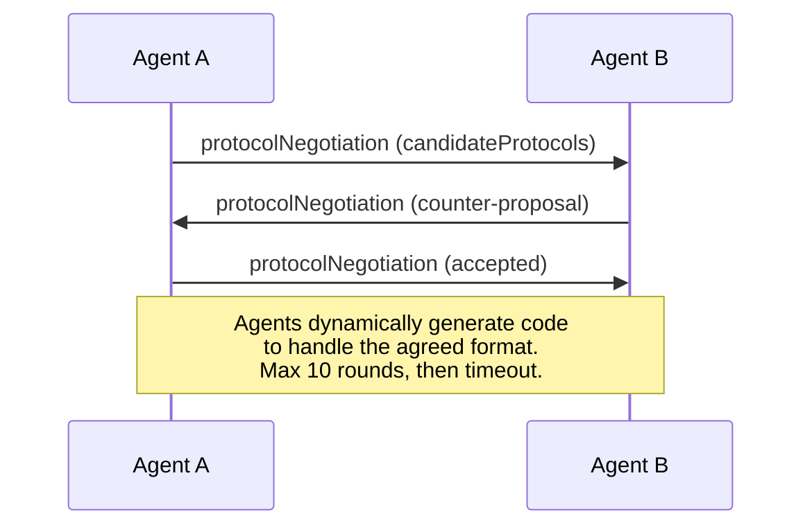

Les agents vont et viennent (maximum 10 tirs) jusqu'à ce qu'ils se mettent d'accord sur un format, puis génèrent dynamiquement du code pour le manipuler.`negotiating`- Je suis là .`rejected`- Je suis là .`accepted`- Je suis là .`timeout`- Je suis désolé .

Cela signifie que deux agents qui ne se sont jamais vus peuvent comprendre comment communiquer sans que personne ne définisse un schéma partagé.

### Comparaison (corrigée)

| | MCP | A2A | ACP | ANP |
|---|---|---|---|---|
| **Created by** | Anthropic | Google / Linux Foundation | IBM / BeeAI | Community |
| **Spec format** | JSON-RPC | JSON-RPC / REST / gRPC | OpenAPI 3.1 (REST) | JSON-RPC |
| **Primary use** | Agent to Tool | Agent to Agent | Agent to Agent | Agent to Agent |
| **Discovery** | Tool listing | `/.well-known/agent-card.json` | `GET /agents`, `/.well-known/agent.yml` | `/.well-known/agent-descriptions`, DID service endpoints |
| **Identity** | Implicit (local) | Security schemes (OAuth, mTLS) | Server-level | W3C DID (`did:wba`) with E2EE |
| **Audit trail** | N/A | Basic (task history) | TrajectoryMetadata (tool calls, reasoning) | Not formally specified |
| **State machine** | N/A | 9 task states | 7 run states | N/A |
| **Streaming** | N/A | SSE | SSE | Transport-agnostic |
| **Unique feature** | Tool schemas | Agent Cards + Skills | Trajectory audit trail | Meta-protocol negotiation |
| **Best for** | Tools & data | Dynamic collaboration | Regulated industries | Cross-org trust |
| **Status** | Stable | Stable (v1.0) | Merging into A2A | Active development |

### Comment ils travaillent ensemble

Ces protocoles ne sont pas mutuellement exclusifs.

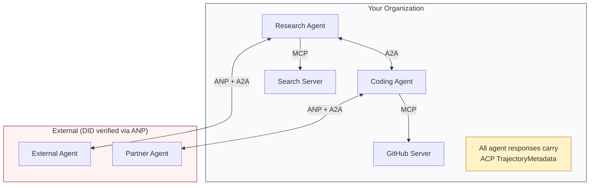

- **MCP**connecte chaque agent à ses outils
- **A2A**gère la collaboration entre les agents (internes et externes)
- **ACP**Enveloppe les réponses dans des métadonnées de trajectoire pour une vérifiabilité
- **ANP**fournit une vérification d'identité pour les agents que vous ne contrôlez pas

```figure
swarm-message-bus
```

## Faites-le

### Étape 1: Types de messages principaux

Chaque système multi-agent commence par un format de message.

```typescript
import crypto from "node:crypto";

type MessageRole = "user" | "agent";

type MessagePart =
  | { kind: "text"; text: string }
  | { kind: "data"; data: unknown; mediaType: string }
  | { kind: "file"; name: string; url: string; mediaType: string };

type TrajectoryEntry = {
  reasoning: string;
  toolName?: string;
  toolInput?: unknown;
  toolOutput?: unknown;
  timestamp: number;
};

type AgentMessage = {
  id: string;
  role: MessageRole;
  parts: MessagePart[];
  trajectory?: TrajectoryEntry[];
  replyTo?: string;
  timestamp: number;
};

function createMessage(
  role: MessageRole,
  parts: MessagePart[],
  replyTo?: string
): AgentMessage {
  return {
    id: crypto.randomUUID(),
    role,
    parts,
    replyTo,
    timestamp: Date.now(),
  };
}

function textMessage(role: MessageRole, text: string): AgentMessage {
  return createMessage(role, [{ kind: "text", text }]);
}
```

Remarque: `MessagePart`est multimodal (texte, données structurées, fichiers) tout comme les spécifications A2A et ACP réelles. `TrajectoryEntry`Il est également possible de détecter les données de la chaîne de raisonnement, en correspondant aux métadonnées de la trajectoire de l'ACP.

### Étape 2: Carte d'agent A2A et registre

Construire une découverte d'agent qui correspond à la vraie spécification A2A:

```typescript
type Skill = {
  id: string;
  name: string;
  description: string;
  tags: string[];
  inputModes: string[];
  outputModes: string[];
};

type AgentCard = {
  name: string;
  description: string;
  version: string;
  url: string;
  capabilities: {
    streaming: boolean;
    pushNotifications: boolean;
  };
  defaultInputModes: string[];
  defaultOutputModes: string[];
  skills: Skill[];
};

class AgentRegistry {
  private cards: Map<string, AgentCard> = new Map();

  register(card: AgentCard) {
    this.cards.set(card.name, card);
  }

  discoverBySkillTag(tag: string): AgentCard[] {
    return [...this.cards.values()].filter((card) =>
      card.skills.some((skill) => skill.tags.includes(tag))
    );
  }

  discoverByInputMode(mimeType: string): AgentCard[] {
    return [...this.cards.values()].filter(
      (card) =>
        card.defaultInputModes.includes(mimeType) ||
        card.skills.some((skill) => skill.inputModes.includes(mimeType))
    );
  }

  resolve(name: string): AgentCard | undefined {
    return this.cards.get(name);
  }

  listAll(): AgentCard[] {
    return [...this.cards.values()];
  }
}
```

C'est beaucoup plus riche qu'une simple carte nom-à-capacité. Vous pouvez découvrir des agents par les balises de compétences, par les types de MIME ou par nom, comme le vrai A2A.

### Étape 3: cycle de vie des tâches A2A

Construire la machine d' état de tâche complète:

```typescript
type TaskState =
  | "submitted"
  | "working"
  | "input-required"
  | "auth-required"
  | "completed"
  | "failed"
  | "canceled"
  | "rejected";

const TERMINAL_STATES: TaskState[] = [
  "completed",
  "failed",
  "canceled",
  "rejected",
];

type TaskStatus = {
  state: TaskState;
  message?: AgentMessage;
  timestamp: number;
};

type Artifact = {
  id: string;
  name: string;
  parts: MessagePart[];
};

type Task = {
  id: string;
  contextId: string;
  status: TaskStatus;
  artifacts: Artifact[];
  history: AgentMessage[];
};

type TaskEvent =
  | { kind: "statusUpdate"; taskId: string; status: TaskStatus }
  | {
      kind: "artifactUpdate";
      taskId: string;
      artifact: Artifact;
      append: boolean;
      lastChunk: boolean;
    };

type TaskHandler = (
  task: Task,
  message: AgentMessage
) => AsyncGenerator<TaskEvent>;

class TaskManager {
  private tasks: Map<string, Task> = new Map();
  private handlers: Map<string, TaskHandler> = new Map();
  private listeners: Map<string, ((event: TaskEvent) => void)[]> = new Map();

  registerHandler(agentName: string, handler: TaskHandler) {
    this.handlers.set(agentName, handler);
  }

  subscribe(taskId: string, listener: (event: TaskEvent) => void) {
    const existing = this.listeners.get(taskId) ?? [];
    existing.push(listener);
    this.listeners.set(taskId, existing);
  }

  async sendMessage(
    agentName: string,
    message: AgentMessage,
    contextId?: string
  ): Promise<Task> {
    const handler = this.handlers.get(agentName);
    if (!handler) {
      const task = this.createTask(contextId);
      task.status = {
        state: "rejected",
        timestamp: Date.now(),
        message: textMessage("agent", `No handler for ${agentName}`),
      };
      return task;
    }

    const task = this.createTask(contextId);
    task.history.push(message);
    task.status = { state: "submitted", timestamp: Date.now() };

    this.processTask(task, handler, message).catch((err) => {
      task.status = {
        state: "failed",
        timestamp: Date.now(),
        message: textMessage("agent", String(err)),
      };
    });
    return task;
  }

  getTask(taskId: string): Task | undefined {
    return this.tasks.get(taskId);
  }

  cancelTask(taskId: string): boolean {
    const task = this.tasks.get(taskId);
    if (!task || TERMINAL_STATES.includes(task.status.state)) return false;
    task.status = { state: "canceled", timestamp: Date.now() };
    this.emit(taskId, {
      kind: "statusUpdate",
      taskId,
      status: task.status,
    });
    return true;
  }

  private createTask(contextId?: string): Task {
    const task: Task = {
      id: crypto.randomUUID(),
      contextId: contextId ?? crypto.randomUUID(),
      status: { state: "submitted", timestamp: Date.now() },
      artifacts: [],
      history: [],
    };
    this.tasks.set(task.id, task);
    return task;
  }

  private async processTask(
    task: Task,
    handler: TaskHandler,
    message: AgentMessage
  ) {
    task.status = { state: "working", timestamp: Date.now() };
    this.emit(task.id, {
      kind: "statusUpdate",
      taskId: task.id,
      status: task.status,
    });

    try {
      for await (const event of handler(task, message)) {
        if (TERMINAL_STATES.includes(task.status.state)) break;

        if (event.kind === "statusUpdate") {
          task.status = event.status;
        }
        if (event.kind === "artifactUpdate") {
          const existing = task.artifacts.find(
            (a) => a.id === event.artifact.id
          );
          if (existing && event.append) {
            existing.parts.push(...event.artifact.parts);
          } else {
            task.artifacts.push(event.artifact);
          }
        }
        this.emit(task.id, event);
      }
    } catch (err) {
      task.status = {
        state: "failed",
        timestamp: Date.now(),
        message: textMessage("agent", String(err)),
      };
      this.emit(task.id, {
        kind: "statusUpdate",
        taskId: task.id,
        status: task.status,
      });
    }
  }

  private emit(taskId: string, event: TaskEvent) {
    for (const listener of this.listeners.get(taskId) ?? []) {
      listener(event);
    }
  }
}
```

Cela implique le cycle de vie des tâches A2A réelles: soumis, travaillant, requis, états terminaux. Les gestionnaires sont des générateurs asynchronous qui produisent des événements (mises à jour de statut et fragments d'artefact) correspondant au modèle de streaming SSE.

### Étape 4: Voie d'audit au style ACP

Communiquer avec le suivi de la trajectoire:

```typescript
type AuditEntry = {
  runId: string;
  agentName: string;
  input: AgentMessage[];
  output: AgentMessage[];
  trajectory: TrajectoryEntry[];
  status: "created" | "in-progress" | "completed" | "failed" | "awaiting";
  startedAt: number;
  completedAt?: number;
  sessionId?: string;
};

class AuditableRunner {
  private log: AuditEntry[] = [];
  private handlers: Map<
    string,
    (input: AgentMessage[]) => Promise<{
      output: AgentMessage[];
      trajectory: TrajectoryEntry[];
    }>
  > = new Map();

  registerAgent(
    name: string,
    handler: (input: AgentMessage[]) => Promise<{
      output: AgentMessage[];
      trajectory: TrajectoryEntry[];
    }>
  ) {
    this.handlers.set(name, handler);
  }

  async run(
    agentName: string,
    input: AgentMessage[],
    sessionId?: string
  ): Promise<AuditEntry> {
    const entry: AuditEntry = {
      runId: crypto.randomUUID(),
      agentName,
      input: structuredClone(input),
      output: [],
      trajectory: [],
      status: "created",
      startedAt: Date.now(),
      sessionId,
    };
    this.log.push(entry);

    const handler = this.handlers.get(agentName);
    if (!handler) {
      entry.status = "failed";
      return entry;
    }

    entry.status = "in-progress";
    try {
      const result = await handler(input);
      entry.output = structuredClone(result.output);
      entry.trajectory = structuredClone(result.trajectory);
      entry.status = "completed";
      entry.completedAt = Date.now();
    } catch (err) {
      entry.status = "failed";
      entry.trajectory.push({
        reasoning: `Error: ${String(err)}`,
        timestamp: Date.now(),
      });
      entry.completedAt = Date.now();
    }
    return entry;
  }

  getFullAuditLog(): AuditEntry[] {
    return structuredClone(this.log);
  }

  getAuditLogForAgent(agentName: string): AuditEntry[] {
    return structuredClone(
      this.log.filter((e) => e.agentName === agentName)
    );
  }

  getAuditLogForSession(sessionId: string): AuditEntry[] {
    return structuredClone(
      this.log.filter((e) => e.sessionId === sessionId)
    );
  }

  getTrajectoryForRun(runId: string): TrajectoryEntry[] {
    const entry = this.log.find((e) => e.runId === runId);
    return entry ? structuredClone(entry.trajectory) : [];
  }
}
```

Chaque exécution d'agent produit une entrée d'audit complète: ce qui est entré, ce qui est sorti, et la trajectoire complète des appels d'outils et des étapes de raisonnement entre les deux. Vous pouvez demander par agent, par session ou par course individuelle.

### Étape 5: Vérification de l'identité de style ANP

Construire une identité et une vérification basées sur le DID:

```typescript
type VerificationMethod = {
  id: string;
  type: string;
  controller: string;
  publicKeyDer: string;
};

type DIDDocument = {
  id: string;
  verificationMethod: VerificationMethod[];
  authentication: string[];
  keyAgreement: string[];
  humanAuthorization: string[];
  service: { id: string; type: string; serviceEndpoint: string }[];
};

type AgentIdentity = {
  did: string;
  document: DIDDocument;
  privateKey: crypto.KeyObject;
  publicKey: crypto.KeyObject;
};

class IdentityRegistry {
  private documents: Map<string, DIDDocument> = new Map();

  publish(doc: DIDDocument) {
    this.documents.set(doc.id, doc);
  }

  resolve(did: string): DIDDocument | undefined {
    return this.documents.get(did);
  }

  verify(did: string, signature: string, payload: string): boolean {
    const doc = this.documents.get(did);
    if (!doc) return false;

    const authKeyIds = doc.authentication;
    const authKeys = doc.verificationMethod.filter((vm) =>
      authKeyIds.includes(vm.id)
    );

    for (const key of authKeys) {
      const publicKey = crypto.createPublicKey({
        key: Buffer.from(key.publicKeyDer, "base64"),
        format: "der",
        type: "spki",
      });
      const isValid = crypto.verify(
        null,
        Buffer.from(payload),
        publicKey,
        Buffer.from(signature, "hex")
      );
      if (isValid) return true;
    }
    return false;
  }

  requiresHumanAuth(did: string, operationKeyId: string): boolean {
    const doc = this.documents.get(did);
    if (!doc) return false;
    return doc.humanAuthorization.includes(operationKeyId);
  }
}

function createIdentity(domain: string, agentName: string): AgentIdentity {
  const did = `did:wba:${domain}:agent:${agentName}`;
  const { publicKey, privateKey } = crypto.generateKeyPairSync("ed25519");

  const publicKeyDer = publicKey
    .export({ format: "der", type: "spki" })
    .toString("base64");

  const keyId = `${did}#key-1`;
  const encKeyId = `${did}#key-x25519-1`;

  const document: DIDDocument = {
    id: did,
    verificationMethod: [
      {
        id: keyId,
        type: "Ed25519VerificationKey2020",
        controller: did,
        publicKeyDer,
      },
      {
        id: encKeyId,
        type: "X25519KeyAgreementKey2019",
        controller: did,
        publicKeyDer,
      },
    ],
    authentication: [keyId],
    keyAgreement: [encKeyId],
    humanAuthorization: [],
    service: [
      {
        id: `${did}#agent-description`,
        type: "AgentDescription",
        serviceEndpoint: `https://${domain}/agents/${agentName}/ad.json`,
      },
    ],
  };

  return { did, document, privateKey, publicKey };
}

function signPayload(identity: AgentIdentity, payload: string): string {
  return crypto
    .sign(null, Buffer.from(payload), identity.privateKey)
    .toString("hex");
}
```

Cela reflète le véritable modèle d'identité de l'ANP: les agents disposent de documents DID avec une authentification séparée, un accord clé et des clés d'autorisation humaine.`IdentityRegistry`simule la résolution DID (en production, ce serait des extractions HTTP vers le domaine de l'agent).

### Étape 6: Porte de démarrage du protocole

Connectez les quatre protocoles dans un système unifié:

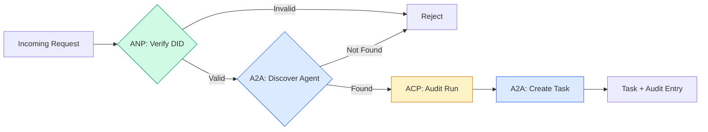

```typescript
class ProtocolGateway {
  private registry: AgentRegistry;
  private taskManager: TaskManager;
  private auditRunner: AuditableRunner;
  private identityRegistry: IdentityRegistry;

  constructor(
    registry: AgentRegistry,
    taskManager: TaskManager,
    auditRunner: AuditableRunner,
    identityRegistry: IdentityRegistry
  ) {
    this.registry = registry;
    this.taskManager = taskManager;
    this.auditRunner = auditRunner;
    this.identityRegistry = identityRegistry;
  }

  async delegateTask(
    fromDid: string,
    signature: string,
    targetAgent: string,
    message: AgentMessage,
    sessionId?: string
  ): Promise<{ task: Task; audit: AuditEntry } | { error: string }> {
    if (!this.identityRegistry.verify(fromDid, signature, message.id)) {
      return { error: "Identity verification failed" };
    }

    const card = this.registry.resolve(targetAgent);
    if (!card) {
      return { error: `Agent ${targetAgent} not found in registry` };
    }

    const audit = await this.auditRunner.run(
      targetAgent,
      [message],
      sessionId
    );
    const task = await this.taskManager.sendMessage(targetAgent, message);

    return { task, audit };
  }

  discoverAndDelegate(
    fromDid: string,
    signature: string,
    skillTag: string,
    message: AgentMessage
  ): Promise<{ task: Task; audit: AuditEntry } | { error: string }> {
    const candidates = this.registry.discoverBySkillTag(skillTag);
    if (candidates.length === 0) {
      return Promise.resolve({
        error: `No agents found with skill tag: ${skillTag}`,
      });
    }
    return this.delegateTask(
      fromDid,
      signature,
      candidates[0].name,
      message
    );
  }
}
```

La passerelle fait quatre choses en un appel:
1. **ANP**: Vérifie l'identité de l'appelant par la signature DID
2. **A2A**: Découvre l'agent cible et vérifie les capacités
3. **ACP**: Enveloppe l'exécution dans une piste d'audit avec trajectoire
4. **A2A**: Crée une tâche avec suivi complet du cycle de vie

### Étape 7: Rassemblez le tout

```typescript
async function protocolDemo() {
  const registry = new AgentRegistry();
  registry.register({
    name: "researcher",
    description: "Searches and summarizes findings",
    version: "1.0.0",
    url: "https://researcher.local/a2a/v1",
    capabilities: { streaming: true, pushNotifications: false },
    defaultInputModes: ["text/plain"],
    defaultOutputModes: ["text/plain", "application/json"],
    skills: [
      {
        id: "web-research",
        name: "Web Research",
        description: "Searches the web",
        tags: ["research", "search", "summarization"],
        inputModes: ["text/plain"],
        outputModes: ["application/json"],
      },
    ],
  });
  registry.register({
    name: "coder",
    description: "Writes code from specs",
    version: "1.0.0",
    url: "https://coder.local/a2a/v1",
    capabilities: { streaming: false, pushNotifications: false },
    defaultInputModes: ["text/plain", "application/json"],
    defaultOutputModes: ["text/plain"],
    skills: [
      {
        id: "code-gen",
        name: "Code Generation",
        description: "Generates code",
        tags: ["coding", "generation"],
        inputModes: ["text/plain", "application/json"],
        outputModes: ["text/plain"],
      },
    ],
  });

  const taskManager = new TaskManager();
  const auditRunner = new AuditableRunner();

  const researchTrajectory: TrajectoryEntry[] = [];

  taskManager.registerHandler(
    "researcher",
    async function* (task, message) {
      yield {
        kind: "statusUpdate" as const,
        taskId: task.id,
        status: { state: "working" as const, timestamp: Date.now() },
      };

      researchTrajectory.push({
        reasoning: "Searching for React 19 documentation",
        toolName: "web_search",
        toolInput: { query: "React 19 compiler features" },
        toolOutput: {
          results: ["react.dev/blog/react-19", "github.com/react/react"],
        },
        timestamp: Date.now(),
      });

      researchTrajectory.push({
        reasoning: "Extracting key findings from search results",
        toolName: "doc_analysis",
        toolInput: { url: "react.dev/blog/react-19" },
        toolOutput: {
          summary:
            "React 19 compiler auto-memoizes, no manual useMemo needed",
        },
        timestamp: Date.now(),
      });

      yield {
        kind: "artifactUpdate" as const,
        taskId: task.id,
        artifact: {
          id: crypto.randomUUID(),
          name: "research-results",
          parts: [
            {
              kind: "data" as const,
              data: {
                findings: [
                  "React 19 compiler auto-memoizes components",
                  "No more manual useMemo/useCallback needed",
                  "Compiler runs at build time, not runtime",
                ],
                sources: ["react.dev/blog/react-19"],
              },
              mediaType: "application/json",
            },
          ],
        },
        append: false,
        lastChunk: true,
      };

      yield {
        kind: "statusUpdate" as const,
        taskId: task.id,
        status: { state: "completed" as const, timestamp: Date.now() },
      };
    }
  );

  auditRunner.registerAgent("researcher", async () => ({
    output: [
      textMessage("agent", "React 19 compiler auto-memoizes components"),
    ],
    trajectory: researchTrajectory,
  }));

  const identityRegistry = new IdentityRegistry();

  const coderIdentity = createIdentity("coder.local", "coder");
  const researcherIdentity = createIdentity("researcher.local", "researcher");

  identityRegistry.publish(coderIdentity.document);
  identityRegistry.publish(researcherIdentity.document);

  const gateway = new ProtocolGateway(
    registry,
    taskManager,
    auditRunner,
    identityRegistry
  );

  console.log("=== Protocol Demo ===\n");

  console.log("1. Agent Discovery (A2A)");
  const researchAgents = registry.discoverBySkillTag("research");
  console.log(
    `   Found ${researchAgents.length} agent(s):`,
    researchAgents.map((a) => a.name)
  );

  console.log("\n2. Identity Verification (ANP)");
  const message = textMessage("user", "Research React 19 compiler features");
  const signature = signPayload(coderIdentity, message.id);
  const verified = identityRegistry.verify(
    coderIdentity.did,
    signature,
    message.id
  );
  console.log(`   Coder DID: ${coderIdentity.did}`);
  console.log(`   Signature verified: ${verified}`);

  console.log("\n3. Task Delegation (A2A + ACP + ANP)");
  const result = await gateway.delegateTask(
    coderIdentity.did,
    signature,
    "researcher",
    message,
    "session-001"
  );

  if ("error" in result) {
    console.log(`   Error: ${result.error}`);
    return;
  }

  console.log(`   Task ID: ${result.task.id}`);
  console.log(`   Task state: ${result.task.status.state}`);
  console.log(`   Artifacts: ${result.task.artifacts.length}`);

  console.log("\n4. Audit Trail (ACP)");
  console.log(`   Run ID: ${result.audit.runId}`);
  console.log(`   Status: ${result.audit.status}`);
  console.log(`   Trajectory steps: ${result.audit.trajectory.length}`);
  for (const step of result.audit.trajectory) {
    console.log(`     - ${step.reasoning}`);
    if (step.toolName) {
      console.log(`       Tool: ${step.toolName}`);
    }
  }

  console.log("\n5. Full Audit Log");
  const fullLog = auditRunner.getFullAuditLog();
  console.log(`   Total runs: ${fullLog.length}`);
  for (const entry of fullLog) {
    const duration = entry.completedAt
      ? `${entry.completedAt - entry.startedAt}ms`
      : "in-progress";
    console.log(`   ${entry.agentName}: ${entry.status} (${duration})`);
  }
}

protocolDemo().catch((err) => {
  console.error("Protocol demo failed:", err);
  process.exitCode = 1;
});
```

## Ce qui ne va pas

Les protocoles résolvent le chemin du bonheur.

**Schema drift.**L' agent A publie une publicité sur la carte de l' agent .`application/json`Le système de détection de données est un système de détection de données.`version`sur Agent Cards pour cette raison.

**State machine violations.**Un agent de gestion donne une`completed`Le code de votre code renvoie silencieusement les mises à jour ou lance.`TaskManager`Le Conseil a adopté une décision de la Commission en`break`après les états terminaux.

**Trust resolution failures.**L'agent A tente de vérifier le DID de l'agent B, mais le domaine de l'agent B est en panne. Le document DID ne peut pas être récupéré. Vous échouez à ouvrir (accepter des agents non vérifiés) ou à fermer (rejeter tout)? ANP recommande de fermer avec le principe de la moindre confiance.

**Trajectory bloat.**L'enregistrement de la trajectoire ACP est puissant mais coûteux. Un agent complexe qui fait 200 appels d'outils par course produit des entrées d'audit massives.

**Discovery thundering herd.**50 agents à la demande .`GET /agents`Réparer: cache des cartes d'agent avec TTL, intervalles de découverte par étape, ou utiliser l'enregistrement basé sur push au lieu de sondage.

## Utilisez-le

### Des mises en œuvre réelles

**A2A**C'est le plus mature.[official spec](https://github.com/google/A2A)Les SDK pour Python et TypeScript. Si vos agents ont besoin de découverte dynamique et de collaboration, commencez ici.

**ACP**Il est en fusion avec A2A.[BeeAI project](https://github.com/i-am-bee/acp)L'utilisation de modèles ACP (enregistrement de trajectoires, cycle de vie de course) même si vous utilisez A2A comme transport.

**ANP**C'est le plus expérimental.[community repo](https://github.com/agent-network-protocol/AgentNetworkProtocol)Le concept de négociation des méta-protocoles est vraiment nouveau.

**MCP**Si vous voulez que les agents utilisent des outils, MCP est la norme.

### Choisir le bon protocole

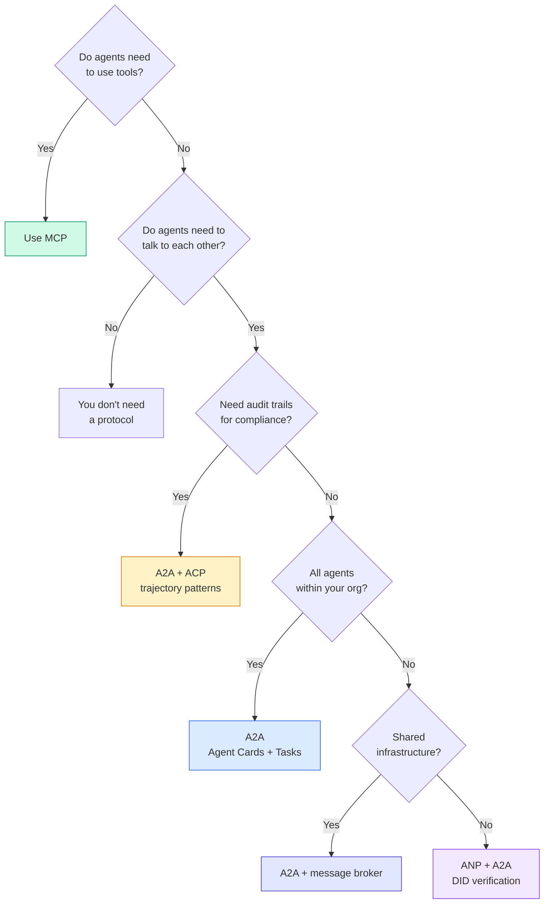

## La faire partir

Cette leçon donne:
- `code/main.ts`-- mise en œuvre complète des quatre protocoles
- `outputs/prompt-protocol-selector.md`-- une requête qui vous aide à choisir les protocoles pour votre système

## Exercices

1. **Multi-hop task delegation.**Élargir le `TaskManager`Le chercheur reçoit une tâche, délègue "rechercher" et "récapituler" les sous-tâches à deux agents spécialisés, attend que les deux soient terminés, puis fusionne les résultats dans ses propres artefacts.

2. **Streaming audit trail.**Modifier le `AuditableRunner`Au lieu d'attendre le résultat complet, rendement `AuditEntry`Les données sont mises à jour en temps réel à mesure que les entrées de trajectoire sont ajoutées.

3. **DID rotation.**Ajoutez la rotation de la clé à la `IdentityRegistry`Un agent doit pouvoir publier un nouveau document DID avec des clés mises à jour tout en conservant une `previousDid`Les vérificateurs doivent accepter les signatures de la clé actuelle et précédente pendant une période de grace.

4. **Protocol negotiation.**Mettre en œuvre le concept de méta-protocole de l'ANP.`protocolNegotiation`Les messages avec des formats candidats (par exemple, "Je peux parler JSON-RPC" contre "Je préfère REST"). Après trois tours maximum, ils s'accordent sur un format ou un délai. Le format convenu détermine lequel `TaskManager`ou `AuditableRunner`Ils l'utilisent.

5. **Rate-limited discovery.**Ajouter un `RateLimitedRegistry`Enveloppe qui cache les recherches de la carte d'agent avec un TTL configurable et limite les requêtes de découverte par agent par seconde. Simuler un troupeau de 100 agents se découvrant à la démarrage et mesurer la différence.

## Les termes clés

| Term | What people say | What it actually means |
|------|----------------|----------------------|
| MCP | "The protocol for AI tools" | A client-server protocol for agents to discover and use tools. Agent-to-tool, not agent-to-agent. |
| A2A | "Google's agent protocol" | A peer-to-peer protocol for agent collaboration under the Linux Foundation. Discovery via Agent Cards, 9-state task lifecycle, streaming via SSE. Supports JSON-RPC, REST, and gRPC bindings. |
| ACP | "Enterprise agent messaging" | IBM/BeeAI's REST API for agent runs with TrajectoryMetadata: every response carries the full chain of reasoning and tool calls. Merging into A2A. |
| ANP | "Decentralized agent identity" | A community protocol using `did:wba` (DID) for cryptographic identity, HPKE for E2EE, and AI-powered meta-protocol negotiation for agents that have never seen each other. |
| Agent Card | "An agent's business card" | A JSON document at `/.well-known/agent-card.json` describing skills, supported MIME types, security schemes, and protocol bindings. |
| DID | "Decentralized ID" | W3C standard for cryptographically verifiable identities hosted on the agent's own domain. ANP uses `did:wba` method. |
| TrajectoryMetadata | "The audit receipt" | ACP's mechanism for attaching reasoning steps, tool calls, and their inputs/outputs to every agent response. |
| Meta-protocol | "Agents negotiating how to talk" | ANP's approach where agents use natural language to dynamically agree on data formats, then generate code to handle them. |
| Task | "A unit of work" | A2A's stateful object tracking work from submission through completion. Immutable once terminal. |

## Pour en savoir plus

- [Google A2A specification](https://github.com/google/A2A)-- spécifications officielles et SDK (v1.0.0, Fondation Linux)
- [IBM/BeeAI ACP specification](https://github.com/i-am-bee/acp)-- Spécifications OpenAPI 3.1 pour les coulées d'agents et les métadonnées de trajectoire
- [Agent Network Protocol](https://github.com/agent-network-protocol/AgentNetworkProtocol)-- identité basée sur le DID, E2EE, négociation des méta-protocoles
- [Model Context Protocol docs](https://modelcontextprotocol.io/)-- Spécification MCP d'Anthropic (couverte dans la phase 13)
- [W3C Decentralized Identifiers](https://www.w3.org/TR/did-core/)-- la norme d'identité qui sous-tend l'ANP
- [RFC 9180 (HPKE)](https://www.rfc-editor.org/rfc/rfc9180)-- le système de cryptage utilisé par l'ANP pour E2EE
- [FIPA Agent Communication Language](http://www.fipa.org/specs/fipa00061/SC00061G.html)-- le précurseur académique des protocoles d'agents modernes
