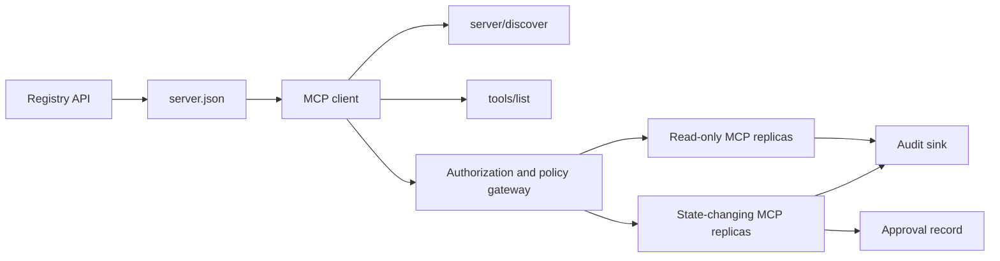

# Capstone 13: Serveur MCP sans État avec registre et gouvernance

> Le MCP de production n'est pas un processus de serveur. Il s'agit d'une chaîne de contrats: métadonnées publiées, découverte en direct, enveloppe de demande sans statut, autorisation, politique, audit et preuve de déploiement.

**Type:** Capstone
**Languages:** Python and TypeScript reference models; any production language
**Prerequisites:** Phase 11, Phase 13, Phase 14, Phase 17, and Phase 18
**Required MCP deep dives:** [Lesson 28: Tool Contracts](../../../13-tools-and-protocols/28-mcp-tool-contracts-and-content/docs/en.md)- Je suis là .[Lesson 29: Reliability](../../../13-tools-and-protocols/29-mcp-reliability-cancellation-and-flow-control/docs/en.md)- Je suis là .[Lesson 30: Registry Supply Chain](../../../13-tools-and-protocols/30-mcp-registry-supply-chain-and-drift/docs/en.md), et [Lesson 31: Conformance Operations](../../../13-tools-and-protocols/31-mcp-conformance-versioning-and-operations/docs/en.md)
**Protocol target:**MCP `2026-07-28`
**Time:** ~25 hours

## Objectifs d'apprentissage

- Exécuter la demande et l'enveloppe de résultats du PCM sans État.
- Gardez les métadonnées du Registre séparées de la découverte du protocole en direct.
- Construire une découverte déterministe et consciente de l'outil de cache.
- Appliquer la politique de l'émetteur, du public, de la portée et de l'approbation pour chaque appel d'outil.
- Déployer HTTP en continu sans affinité de session.
- Prouver le comportement au fil, l'autorisation, la politique, le registre et les limites de vérification.

## Voie préalable requise du MCP

Résultats des quatre leçons de phase 13 liées en ordre avant de traiter cette pierre angulaire comme prête à la production:

1. [Lesson 28](../../../13-tools-and-protocols/28-mcp-tool-contracts-and-content/docs/en.md)définit l'outil, le schéma, le contenu, la pagination, la réalisation, le routage et les contrats d'erreur que ce serveur doit exposer.
2. [Lesson 29](../../../13-tools-and-protocols/29-mcp-reliability-cancellation-and-flow-control/docs/en.md)définit les courses d'annulation, les délais, l'idempotence, la contrainte, la réessaye et le comportement de reconnexion.
3. [Lesson 30](../../../13-tools-and-protocols/30-mcp-registry-supply-chain-and-drift/docs/en.md)définit l'espace de noms, la provenance, le pin d'admission, l'état du registre, le dérivé, le registre et les preuves de retour.
4. [Lesson 31](../../../13-tools-and-protocols/31-mcp-conformance-versioning-and-operations/docs/en.md)définit les transcriptions dorées et négatives, les âges de version stricts, les vérifications des différentiels SDK, la preuve de proxy, la rédaction, la santé et le dépistage des sorties.

La pierre angulaire intègre ces artefacts. Elle ne les remplace pas par un test SDK de chemin heureux.

## Le problème

Une plateforme interne a besoin d'outils de données à lire uniquement et d'un petit ensemble d'outils de changement d'état. Les développeurs doivent être en mesure de découvrir le serveur, de comprendre comment se connecter, d'inspecter ses capacités en direct et d'appeler uniquement les opérations qu'ils sont autorisés à utiliser.

La partie difficile est de ne pas enregistrer une fonction, la partie difficile est de garder six vérités différentes alignées:

1. `server.json`indique où le serveur peut être installé ou atteint.
2. `server/discover`dit ce que le processus en direct soutient maintenant.
3. Chaque requête indique quelle révision de protocole et les capacités du client qu'elle utilise.
4. L'autorisation lie un appelant à l'émetteur, à la ressource et aux champs d'application corrects.
5. La politique décide si cette action spécifique peut être exécutée.
6. Les preuves de vérification enregistrent ce qui a franchi la frontière sans divulguer des secrets ou des charges utiles sensibles.

Si l'une de ces dérives, la plateforme peut répertorier un serveur inaccessible, router un client incompatible, accepter un jeton émis pour une autre ressource ou exposer une action destructive sans l'examen prévu.

## Les deux couches de découverte

Le registre et le serveur MCP en direct répondent à des questions différentes.

| Layer | Contract | Question it answers |
|---|---|---|
| Publication | `server.json` and Registry API | What is this server, where is its package or remote endpoint, and how is it configured? |
| Runtime | `server/discover` | Which protocol versions, capabilities, extensions, and server identity does this process support? |

Le registre officiel utilise une version modifiée `server.json`Une entrée distante peut nommer une URL HTTP Streamable:

```json
{
  "$schema": "https://static.modelcontextprotocol.io/schemas/2025-12-11/server.schema.json",
  "name": "com.example/internal-readonly",
  "title": "Internal Read-Only Tools",
  "description": "Read-only incident and data lookup tools.",
  "version": "1.0.0",
  "remotes": [
    {
      "type": "streamable-http",
      "url": "https://mcp.internal.example.com/readonly"
    }
  ]
}
```

La version du schéma du Registre et la révision du protocole MCP sont indépendantes. Ne réécrivez pas une date pour correspondre à l'autre. Validez chaque document par rapport à son propre contrat.

La validité du schéma ne prouve pas la propriété de l'espace de noms.`example.com`utilise l' espace de noms du DNS inverse `com.example/*`Le flux d'authentification du Registre prouve cette propriété.

Le modèle stdlib `validate_registry_document`La fonction est intentionnellement un validateur partiel de profil à distance.`name`- Je suis là .`description`, et `version`champs; optionnel `title`; les restrictions de nom et de longueur publiées; la forme de la version en béton; et chaque `streamable-http`ou `sse`la forme HTTP(S) URL de la télécommande. Il nécessite également une non-vide `remotes`La liste est complète car cette pierre de fond est toujours en vie.`validate_publisher_namespace`vérifie séparément le nom par rapport au domaine de l'éditeur vérifié, alors que `validate_runtime_alignment`compare le nom de la publication et la version avec le live `serverInfo`. Le schéma officiel prend également en charge les enregistrements uniquement pour les paquets et les champs plus éloignés. Avant la publication, validez l'ensemble du document avec le schéma officiel JSON fiché ou `mcp-publisher`; ne présente pas ce sous-ensemble sans dépendance comme validation complète du schéma.

Le serveur doit mettre en œuvre `server/discover`Ce client capstone le fait après avoir résolu le point final et reçoit la révision du protocole actuel et les fonctionnalités en direct:

```json
{
  "resultType": "complete",
  "supportedVersions": ["2026-07-28"],
  "capabilities": {
    "tools": {
      "listChanged": false
    }
  },
  "_meta": {
    "io.modelcontextprotocol/serverInfo": {
      "name": "com.example/internal-readonly",
      "version": "1.0.0"
    }
  },
  "ttlMs": 3600000,
  "cacheScope": "public"
}
```

Un catalogue privé peut indexer des données de propriété, d'examen ou de cycle de vie supplémentaires, mais il ne doit pas inventer ces données comme champs de fil ou racine MCP `server.json`Les données personnalisées publiques sont nécessaires, utilisez les informations de l'enregistrement `_meta.io.modelcontextprotocol.registry/publisher-provided`prolongation et rester dans sa limite de 4 KB.

## Cœur des PAM sans État

Révision du PCM `2026-07-28`supprime les sessions de protocole et les`initialize`- Je suis là .`notifications/initialized`Il enlève aussi.`Mcp-Session-Id`- Je suis désolé .

Chaque demande contient le contexte du protocole dans `params._meta`- Le numéro de la liste:

```json
{
  "io.modelcontextprotocol/protocolVersion": "2026-07-28",
  "io.modelcontextprotocol/clientCapabilities": {},
  "io.modelcontextprotocol/clientInfo": {
    "name": "internal-platform-client",
    "version": "1.0.0"
  }
}
```

La version et les capacités sont des faits de demande, pas des faits de connexion. Un équilibrateur de charge peut envoyer des demandes consécutives à différentes réplices saines parce que l'une ou l'autre réplica peut valider la demande du message lui-même.

Les résultats ordinaires comprennent `resultType: "complete"`Les serveurs doivent placer leur identité dans `_meta.io.modelcontextprotocol/serverInfo`Une version manquante ou non de protocole de chaîne est des paramètres invalides `-32602`- Une erreur .`-32022`est uniquement pour une chaîne fournie qui n'est pas prise en charge, avec exactement `{"supported": ["2026-07-28"], "requested": "..."}`comme ses données.

### Découverte cachéable

`tools/list`Les résultats doivent être déterministes pour le même ensemble d'outils efficaces.

- `ttlMs`, un indice de fraîcheur pour le client;
- `cacheScope`, soit `public`ou `private`Le dépôt de la commission
- un ordre d'outils stable permettant aux listes identiques de réutiliser les caches rapides;
- `resultType: "complete"`et les métadonnées d'identité du serveur.

L' autorisation par utilisateur devrait normalement produire `cacheScope: "private"`. Ne pas mettre la visibilité des outils spécifiques à l'utilisateur derrière un cache public partagé.

## HTTP par flux

Un serveur réseau expose un point final MCP qui accepte POST. Chaque demande ou notification JSON-RPC reçoit son propre POST.

Pour une demande, le serveur renvoie soit un objet JSON ou un flux SSE porté à cette demande.`subscriptions/listen`La requête contient des notifications de changement opt-in. Il n'y a pas de flux GET autonome, de session DELETE, d'en-tête de session ou `Last-Event-ID`réplique dans le transport courant.

Chaque demande comprend:

- `MCP-Protocol-Version`, correspondant aux métadonnées du corps;
- `Mcp-Method`, correspondant à la méthode JSON-RPC;
- `Mcp-Name`pour `tools/call`- Je suis là .`resources/read`, et `prompts/get`Le dépôt de la commission
- `Accept: application/json, text/event-stream`- Je suis désolé .

Rejeter les en-têtes miroirés non correspondants avec les spécifications `-32020`erreur. Valider `Origin`, lier les serveurs de développement locaux à la sauvegarde en boucle, authentifier les clients distants et traiter une réponse SSE fermée à la demande comme une annulation.



```figure
cf-mcp-gate
```

## Autorisation et politique

Les métadonnées de transport ne sont pas une autorisation.

Pour les serveurs distants:

1. Découvrez les métadonnées de ressources protégées.
2. Sélectionnez le serveur d'autorisation pour cette ressource.
3. Préférer les documents de métadonnées de l'ID du client pour l'enregistrement du client.
4. Envoyez l'indicateur de ressources pendant l'autorisation.
5. Valider une retournée `iss`la valeur par rapport au serveur d'autorisation enregistré pour le flux.
6. Les informations de base des clients par émetteur.
7. Valider l'émetteur des jetons, le public ou la ressource, l'expiration et les champs d'application sur le serveur MCP.
8. Appliquer une deuxième décision politique à l'outil et aux arguments concrets.

Annotations d' outils telles que `readOnlyHint`et `destructiveHint`Ils ne sont pas des contrôles d'autorisation fiables.

### L'approbation est un enregistrement, pas un champ magique

Un appel changeant d'état nécessite un enregistrement d'approbation lié à l'acteur, à l'outil, aux arguments normalisés ou à la digestion, à l'environnement cible, à l'expiration et à la politique d'utilisation unique ou répétée.

Le modèle Python hashes JSON canonique avec des clés triées, puis lie ce digeste avec le sujet du jeton, le nom de l'outil, l'URL du serveur et l'expiration.

Gardez les outils à haut risque sur une surface révisionnable séparément lorsque cela réduit considérablement le rayon d'explosion.

## Faites-le

### 1. Modèle de métadonnées de publication

Créer et valider le schéma `server.json`. Inclure un nom stable dans l'espace de noms authentifié pour l'éditeur, plus version, description, officiel `repository`ou `packages`Les données métadonnées, le cas échéant, et un transport à distance ou en studio.

### 2. Implémentation de la découverte en direct

Mise en œuvre `server/discover`Avant toute fonction RPC. Publiez les versions de protocole, les capacités, les extensions et l'identité du serveur pris en charge. Ajoutez un cas de rejet de version en utilisant `-32022`- Je suis désolé .

### 3. Mettre en œuvre l'enveloppe sans État

Requérir la version du protocole et les capacités du client dans chaque demande. Retour `resultType`supprimer l'état d'initialisation, les cache de capacité de connexion et les identifiants de session.

### 4. Construire la surface de l'outil

Commencez par deux outils uniquement lus et un outil de changement d'état. Donnez à chacun un schéma JSON limité, une description précise, une forme déterministe des résultats et des annotations honnêtes. Ajoutez des schèmes de sortie lorsque les clients s'appuient sur des résultats structurés.

### 5. Ajouter une liste de cache

Retour des outils en ordre stable avec `ttlMs`et `cacheScope`. Exercer séparément le comportement de notification de l'expiration du cache et de modification de la liste.

### 6. Ajouter l'autorisation et la politique

Valider l'émetteur, le public, l'expiration et la portée. Exécuter une décision de politique pour chaque appel d'outil. Lier les approbations à des actions précises à haut risque. Nier les approbations manquantes ou périmé avant d'exécuter un gestionnaire.

### 7. Registre séparé et validation de l'exécution

Valider le statisque `server.json`enregistrer, puis sonde le point d'extrémité à distance avec `server/discover`. Le dérivé de rapport lorsque la télécommande, l'identité, la version ou les capacités requises publiées ne sont pas d'accord avec le processus en direct.

### 8. Ajouter des preuves d'audit

Enregistrer un acteur, un émetteur, une ressource, un outil, une décision de politique, un identifiant de demande, un contexte de trace, une latence et un résultat. Rédacter ou digérer des arguments et des résultats sensibles avant de persister. Garder le fond d'audit hors du contexte visible du modèle.

### 9. Exercer une mise à l'échelle horizontale

Mettez deux répliques sans état derrière un équilibreur de charge. Envoyez au moins 100 demandes en même temps. Montrez que la précision ne dépend pas de l'affinité. Si un outil a besoin d'un état d'appel croisé, cochez une poignée opaque explicite et stockez-la dans un système durable partagé.

### 10. Il faut traverser le fil réel .

Exécutez des vérifications de conformité contre la binaire du serveur réel. Capturez les en-têtes de requête et les corps JSON, pas seulement les objets SDK. Exercez une version incorrecte, une incompatibilité des en-têtes, une portée manquante, un public incorrect, des arguments malformés, une défaillance du gestionnaire, une annulation et une expiration du cache.

## Les éléments de preuve requis

Une soumission est incomplète jusqu'à ce qu'elle contient les cinq catégories de preuves:

| Evidence | Minimum proof | Source lesson |
|---|---|---|
| Wire | Redacted raw headers and JSON-RPC bodies for golden and negative cases, including metadata type failure, header mismatch, unsupported version, missing or unknown `resultType`, notification no-response, and response ID matching | [Lesson 31](../../../13-tools-and-protocols/31-mcp-conformance-versioning-and-operations/docs/en.md) |
| Proxy | The same stable case run directly and through the deployed intermediary, with ingress, origin, and egress status and body digests; prove protocol errors are not collapsed into generic 500 responses and streaming is not buffered | [Lessons 29](../../../13-tools-and-protocols/29-mcp-reliability-cancellation-and-flow-control/docs/en.md) and [31](../../../13-tools-and-protocols/31-mcp-conformance-versioning-and-operations/docs/en.md) |
| Admission | Verified publisher namespace, immutable Registry record digest, artifact or remote provenance, live `server/discover` identity and capability observation, descriptor pin, current Registry status, and admission-ledger event | [Lesson 30](../../../13-tools-and-protocols/30-mcp-registry-supply-chain-and-drift/docs/en.md) |
| Retry | A cancellation-versus-completion race, explicit timeout, safe read retry, mutation idempotency key, reconnect refetch, and proof that request cancellation cannot silently become durable task cancellation | [Lesson 29](../../../13-tools-and-protocols/29-mcp-reliability-cancellation-and-flow-control/docs/en.md) |
| Rollback | Exact previous version, admission and artifact digests, descriptor pin, active Registry status, current health window, route restoration result, and redacted decision evidence | [Lessons 30](../../../13-tools-and-protocols/30-mcp-registry-supply-chain-and-drift/docs/en.md) and [31](../../../13-tools-and-protocols/31-mcp-conformance-versioning-and-operations/docs/en.md) |

Conservez un digeste du pack édité avec la publication. Si une classe manque, conservez la publication. Ne déduisez pas le comportement de proxy d'un dispatcher en cours de processus, l'admission à partir de la présence du Registre, réessayez la sécurité à partir d'un nouvel identifiant JSON-RPC ou la préparation au retour à partir du déploiement précédent.

## Modèles de référence locaux

Le modèle Python démontre les métadonnées du registre, la validation de l'espace de noms de l'éditeur DNS inverse, les vérifications d'identité de publication à exécution, la découverte en direct, la liste des outils déterministes, les métadonnées par demande, l'émetteur de confiance, le public, les vérifications d'expiration et de portée, les approbations liées aux actions, un validateur partiel du registre documenté, la politique et l'audit sans ouvrir une prise réseau:

```bash
cd phases/19-capstone-projects/13-mcp-server-with-registry
python3 code/main.py
python3 -m unittest discover -s code/tests -v
```

Le projet TypeScript expose la forme JSON-RPC sans état sur le studio sans un SDK MCP.`tools/call`le chemin impose les mêmes schémas d' entrée limitées annoncés par `tools/list`; les arguments invalides pour un outil connu rendent un résultat complet avec `isError: true`sans invoquer l'exécuteur:

```bash
cd phases/19-capstone-projects/13-mcp-server-with-registry/code/ts
npm install
npm run typecheck
npm test
npm run demo
```

Ces modèles prouvent la logique du contrat local. Ils ne prouvent pas les en-têtes HTTP, l'échange OAuth, la publication du registre, l'intégration OPA, l'équilibrage de charge ou le reçu du collectionneur.

## Exemple de fil

```http
POST /mcp HTTP/1.1
Host: mcp.internal.example.com
Content-Type: application/json
Accept: application/json, text/event-stream
MCP-Protocol-Version: 2026-07-28
Mcp-Method: tools/call
Mcp-Name: postgres.readonly
Authorization: Bearer REDACTED

{
  "jsonrpc": "2.0",
  "id": 42,
  "method": "tools/call",
  "params": {
    "name": "postgres.readonly",
    "arguments": {"sql": "SELECT 1"},
    "_meta": {
      "io.modelcontextprotocol/protocolVersion": "2026-07-28",
      "io.modelcontextprotocol/clientCapabilities": {},
      "io.modelcontextprotocol/clientInfo": {
        "name": "internal-platform-client",
        "version": "1.0.0"
      }
    }
  }
}
```

## La faire partir

Envoyer un référentiel contenant:

- un schéma-valid `server.json`Le dépôt de la commission
- les surfaces de serveur uniquement lisibles et modifiant l'état;
- `server/discover`, déterministe `tools/list`, et les politiques sont mises en place .`tools/call`Le dépôt de la commission
- une déploiement HTTP diffusable avec deux réplices interchangeables;
- l'intégration des autorisations et des approbations;
- un éditeur de registre ou un adaptateur API privé de registre;
- les définitions de politiques et les dossiers d'approbation liés à l'action;
- la production de vérification et la propagation des traces modifiées;
- preuve de défaillance par câble et par procuration;
- l'admission, la réévaluation, la santé et les preuves de retour avec une résolution du dossier édité.

| Weight | Criterion | Evidence |
|---:|---|---|
| 25 | Protocol correctness | Stateless request metadata, discovery, results, headers, and negative cases |
| 20 | Authorization | Issuer, audience, expiry, scope, and action-bound approval cases |
| 15 | Registry integrity | Valid `server.json`, publication record, live discovery probe, and drift report |
| 15 | Policy and safety | Allow, deny, malformed, stale approval, and sensitive-data cases |
| 15 | Scale and reliability | Two replicas, no affinity dependency, cancellation, timeout, and recovery |
| 10 | Auditability | Redacted receiver-side audit and trace evidence |

## Exercices

1. Modifiez l'URL distante publiée tout en laissant le serveur en direct inchangé. Faites rapport de validation du registre la dérive exacte.
2. Envoyez-moi .`tools/list`deux fois avec les mêmes entrées et prouver l'ordre des outils en octets stables.`ttlMs`et rafraîchir.
3. Envoyez un corps valide avec un autre.`MCP-Protocol-Version`En tête, retour`-32020`et ne pas invoquer la politique ou l'outil.
4. Mentez un jeton pour le serveur à lecture seule et présentez-le au serveur en mutation d'état.
5. Lier une approbation à un digeste d'argument normalisé. Modifier un champ et prouver que l'approbation ne peut pas être reproduite.
6. Routez les appels consécutifs vers des réplices alternatives. Remplacez la mémoire de processus cachée par une poignée partagée explicite partout où le flux de travail a besoin de persistance.
7. Brisez une connexion SSE scopée par la demande et réessayez avec un nouvel ID de demande JSON-RPC.`Last-Event-ID`le chemin de récupération est utilisé.

## Les termes clés

| Term | What people say | What it actually means |
|---|---|---|
| Stateless MCP | "No state anywhere" | No protocol session; cross-call state is explicit and server-managed |
| `server.json` | "The tool manifest" | Registry metadata for naming, packaging, configuration, and transports |
| `server/discover` | "The handshake" | A normal mandatory RPC for live versions and capabilities, not a session initializer |
| Cache scope | "Can I cache it?" | Whether a cacheable result is safe for shared or private reuse |
| Policy decision | "The token allows it" | A separate decision over actor, tool, target, arguments, and context |
| Approval record | "A human clicked yes" | Evidence bound to one actor and consequential action under an expiry policy |
| Explicit handle | "A session ID" | Ordinary application data for named server-managed state, not protocol connection state |

## Pour en savoir plus

- [MCP 2026-07-28 key changes](https://modelcontextprotocol.io/specification/2026-07-28/changelog)
- [Streamable HTTP](https://modelcontextprotocol.io/specification/2026-07-28/basic/transports/streamable-http)
- [Server discovery](https://modelcontextprotocol.io/specification/2026-07-28/server/discover)
- [MCP authorization](https://modelcontextprotocol.io/specification/2026-07-28/basic/authorization)
- [Official Registry server.json requirements](https://github.com/modelcontextprotocol/registry/blob/main/docs/reference/server-json/official-registry-requirements.md)
- [Official Registry OpenAPI contract](https://registry.modelcontextprotocol.io/openapi.yaml)
