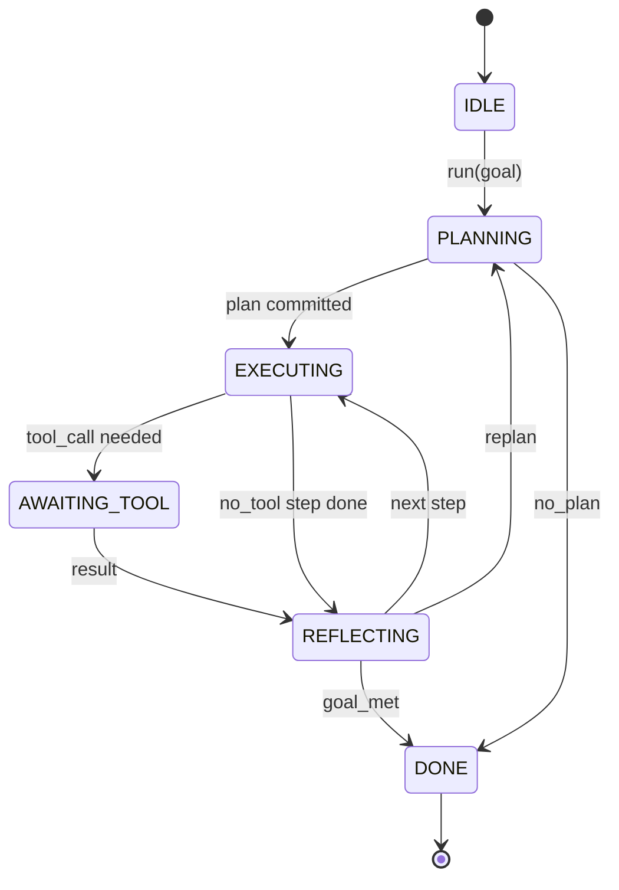

# Contract de boucle d'agent Harness

> Le harnais est l'agent, le modèle est un coprocesseur, cette leçon gelera le contrat de boucle dans lequel vous pouvez brancher n'importe quel modèle.

**Type:** Build
**Languages:** Python
**Prerequisites:** Phase 13 lessons 01-07, Phase 14 lesson 01
**Time:** ~90 minutes

## Objectifs d'apprentissage
- Définir une boucle d'utilisation d'agent comme une machine d'état déterministe avec des transitions explicites.
- Mettre en œuvre dix thèmes de cycle de vie dans lesquels les opérateurs mettent en œuvre des politiques, des télémétres et des barreaux.
- Définir deux points de tirage où la boucle renvoie le contrôle à l'appelant et reprend sur une nouvelle entrée.
- Faire respecter les budgets par séance (virages, appels à l'outil, horloges murales) sans fuite partielle de l'état sur le dépassement.
- Émettez un flux typé de onze types d'événements afin que les UI et les traceurs en aval puissent s'abonner sans inspecter directement la boucle.

```figure
cf-loop-contract
```

## Le cadre

Un agent de codage qui fonctionne sans surveillance pendant quarante tours n'est pas une boucle de chat. C'est une machine d'état dont les nœuds peuvent être interceptés par l'opérateur et dont les bords peuvent être vérifiés par l'opérateur. Une fois que vous écrivez le contrat, le swap de modèles, d'outils ou de politiques cesse d'être un réfacteur. Il devient un appel d'enregistrement.

Cette leçon construit ce contrat. Nous nommons six États, dix sujets de crochet, deux points de tirage, onze types d'événements et une enveloppe budgétaire. Tout le reste dans le harnais (réjiste d'outils, transport JSON-RPC, dispatcher, planificateur) se branche dans cette forme.

## Les États

La boucle a six états, cinq sont actifs, un est terminal.



`IDLE`est le seul point d'entrée légal. `DONE`C'est la seule issue légale.`AWAITING_TOOL`C'est le seul état qui produit un point de traction.

La machine d'état est déterministe. étant donné le même journal d'événement, le harnais entre de nouveau dans le même état. Cette propriété est ce qui vous permet de refaire des sessions pour débogage sans réappeler le modèle.

## Les sujets de crochet

Les crochets sont la couture de l'opérateur dans la boucle. Le harnais met en marche dix sujets. Chaque sujet accepte un nombre quelconque d'abonnés. Les abonnés tirent en ordre d'inscription. Un abonné peut muter la charge utile, augmenter pour annuler le tour, ou retourner une sentinelle pour sauter l'étape suivante.

```text
before_plan         after_plan
before_tool_call    after_tool_call
before_step         after_step
on_error
on_pause
on_budget_exceeded
on_complete
```

La forme reflète ce que Claude Code, Cursor et OpenCode ont convergé vers la mi-2025.`rm -rf`Il vit à`before_tool_call`Un crochet qui envoie une portée OpenTelemetry vit dans`after_step`Un crochet qui reprend une séance en pause vit dans la`on_pause`- Je suis désolé .

## Les points de tir

La boucle donne le contrôle deux fois.`AWAITING_TOOL`Il est donc important de prendre en compte les résultats obtenus.`on_pause`lorsque le budget est épuisé ou qu'un crochet demande explicitement une révision humaine.

Un point de tir n'est pas une exception, c'est un retour.`resume(payload)`Le harnais reprend son emplacement. C'est la même forme qu'un générateur Python. Le transport sur le point de traction est votre choix. Dans un TUI, c'est la pression de clavier. Sur MCP, c'est le système de commande.`tools/call`C'est un sondage d'emploi.

## Le flux d'événements

La boucle applique des événements à un flux typé à des points spécifiques du contrat. Le flux est uniquement applique-et les abonnés peuvent le reproduire à partir de n'importe quel décalage. Les onze types d'événements mis en œuvre sont:

- `session.start` émis une fois lorsque `run(goal)`est appelé
- `plan.draft` émis lorsque le planificateur renvoie un projet de plan
- `plan.commit` émis après que le projet a été engagé en tant que plan actif
- `step.start` émis au début de chaque étape d'exécution
- `step.end` émis à la fin de chaque étape d'exécution
- `tool.call` émis lorsqu'une étape nécessitant un outil donne le contrôle à l'appelant
- `tool.result` émis sur CV avec un résultat d'outil
- `tool.error` émis sur le CV avec une erreur ou lorsqu'un crochet fait l'avortement de l'appel
- `budget.warn` émis lorsque la limite budgétaire est atteinte
- `session.pause` émis lorsque la boucle donne sur une pause (budget ou crochet)
- `session.complete` émis une fois lorsque la boucle atteint `DONE`

Les événements ne reproduisent pas les charges utiles des crochets. Les crochets sont impératifs (mutation, annulation). Les événements sont observationnels (enregistrement, navire).

## L'enveloppe budgétaire

Une session comporte trois limites. compte de tour, compte d'appel d'outil, seconde de l'horloge murale. Chaque tour augmente d'une. Chaque appel d'outil augmente les appels d'outil d'une. Wall-clock est vérifié à chaque transition d'état. Quand une limite est atteinte, la boucle se déclenche.`on_budget_exceeded`, émet`budget.warn`, puis des transitions vers `IDLE`avec une raison dépassant le budget sur le prochain point de tir.

Le budget n'est pas un interrupteur de mort, c'est un rendement.

## Ce que cette leçon ne fait pas

Il n'appelle pas un modèle, il n'enregistre pas de vrais outils, il n'implique pas de transport, ce sont les quatre prochaines leçons.

Le planificateur déterministe en `main.py`Il renvoie un plan de trois étapes, dont deux nécessitent un résultat d'outil.

## Comment lire le code

`HarnessLoop`Il tient l'état, il tire des crochets, il émet des événements.`Budget`Il y a des limites.`Event`est la enveloppe typée sur le courant. `HookRegistry`est la table d'expédition. `_transition`est la seule fonction qui change d'état, donc les invariants de la machine d'état vivent dans un seul endroit.

Lire `main.py`Puis lisez.`code/tests/test_loop.py`Les tests identifient chaque transition et chaque ordre de tir.

## On va plus loin

La partie la plus difficile de la construction d'un harnais dans la production n'est pas la machine d'État. Elle rend le contrat exécutoire. Le contrat doit survivre à une recharge chaude du planificateur. Il doit survivre à un outil qui renvoie JSON malformé. Il doit survivre à un crochet qui soulève en`before_tool_call`Les tests de cette leçon exercent ces modes d'échec, les exécutent, les cassent, les ajoutent.

La leçon suivante ajoute le registre des outils. Après cela, le transport JSON-RPC. Après cela, le dispatcher.
