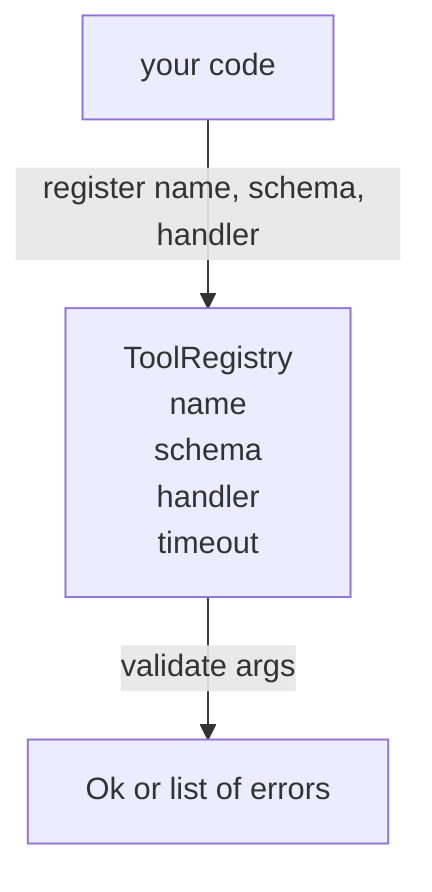

# Registre d'outils avec validation du schéma

> Un outil que l'agent ne peut pas valider est un outil que l'agent ne peut pas appeler.

**Type:** Build
**Languages:** Python
**Prerequisites:** Phase 13 lessons 01-07, Phase 14 lesson 01
**Time:** ~90 minutes

## Objectifs d'apprentissage
- Tenez un registre typé du nom de l'outil → schema → manipulateur que le dispatcher peut demander une fois et faire confiance après.
- Implémenter un sous-ensemble JSON Schema 2020-12 qui couvre les mots clés que 90% des appels à l'outil utilisent réellement.
- Retourner des chemins d'erreur précis en forme de pointeur json afin que le modèle puisse se corriger en un seul tour de retour.
- Rejeter la réinscription sans annulation explicite, car les annonces silencieuses sont la façon dont les catalogues d'outils de production dérivent.
- Gardez le validateur pur (pas d'entrée/sortie, pas de temps, pas de globes) afin qu'il puisse être redirigé sur un journal de répétition.

```figure
cf-registry-validate
```

## Pourquoi le registre précède l'outil

Un agent de codage en 2026 a plus d'outils enregistrés que le modèle ne peut s'adapter à une seule fenêtre contextuelle. Un harnais non trivial enregistrera deux cents outils et surfacera 10 à 40 à chaque tour. Le registre est la source de vérité pour "quels outils existent", "quelle forme leurs arguments prennent", et "quels manipulateurs j'appelle". Une fois ces trois réponses fixées, le reste du harnais peut cesser de deviner.

L'erreur que nous évitons est de livrer des manipulateurs sans schéma, ou des schèmes de livraison sans validation. Les deux sont communs. Les deux transforment la couche suivante (le dispatcher dans la leçon vingt-troisième) en un jeu de devinettes où le seul mode d'échec est une trace de pile du manipulateur.

## À quoi ressemble un enregistrement d'outils

```text
ToolRecord
  name        : str          (unique, lowercase alphanumeric and underscore segments separated by dots, e.g., snake_case.segment.case)
  description : str          (one line, shown to the model)
  schema      : dict         (JSON Schema 2020-12 subset)
  handler     : Callable     (async or sync, returns Any)
  idempotent  : bool         (dispatcher uses this for retry decisions)
  timeout_ms  : int          (override per-tool dispatcher default)
```

Le schéma est le seul champ que le validateur touche. Le gestionnaire est opaque. Nous les séparons délibérément. Le schéma est des données. Le gestionnaire est un code. Le mélanger vous incite à mettre la logique de validation à l'intérieur du gestionnaire, qui est le bug que nous arrêtons.

## Le sous-ensemble JSON Schema 2020-12

La spécification complète de 2020-12 est un document. Nous avons besoin de huit mots clés.

```text
type           string / number / integer / boolean / object / array / null
properties     map of property name -> schema
required       list of property names
enum           list of allowed primitive values
minLength      integer, applies to strings
maxLength      integer, applies to strings
pattern        ECMA-262-compatible regex, applies to strings
items          schema applied to every array element
```

Les mots clés que nous n'ajoutons pas (oneOf, anyOf, allOf, $ref, conditionnels) sont valables dans les schémas de production mais transforment le validateur en un marcheur d'arbre avec des cycles. Nous construisons un registre, pas un moteur de schéma JSON.

## Json des voies d'erreur du pointeur

Lorsque la validation échoue, le validateur renvoie une liste d'erreurs. Chaque erreur porte un chemin json-pointer dans l'entrée. Un pointer est une séquence de noms de propriétés et d'indices d'un tableau préfichée par un arrêt.

```text
{"a": {"b": [1, 2, "x"]}}
                    ^
                    /a/b/2
```

Le modèle lit mieux les chemins d'erreur que les phrases. Si un schéma le demande `args.user.email`et le modèle a passé un nombre entier, l'erreur devrait être `/user/email`avec `expected_type: string`Le modèle le corrige dans l'appel suivant sans un round de langage naturel.

## Enregistrement et annulation

`register(name, schema, handler, **opts)`refuse par défaut la réinscription.`override=True`Deux parties de la base de code enregistrant silencieusement le même nom d'outil sont le type de bug qui prend une semaine à trouver en production.

Le registre expose trois méthodes de lecture. `get(name)`retourne le record ou augmente. `validate(name, args)`retourne une `Ok`ou une liste d'erreurs. `names()`renvoie les noms des outils dans l'ordre d'enregistrement.

## Ce que le validateur est et ce qu'il n'est pas

Il est un seul passage sur l'arbre de schéma, récursif. Il est pur. Il n'appelle pas les manipulateurs. Il ne force pas les types (une chaîne `"42"`Il ne se tronque pas en silence.

Le dépêcheur de la leçon vingt-troisième ajoute des couches de temps et de sable. Le registre ajoute une forme.

## La forme



## Comment lire le code

`code/main.py`définit `ToolRegistry`- Je suis là .`ToolRecord`- Je suis là .`ValidationError`Le validateur envoie des messages à l'adresse suivante:`schema["type"]`(ou traite un schéma avec `enum`chaque validateur de type renvoie soit une liste vide, soit une liste de `ValidationError`Le marcheur de haut niveau concatenera les erreurs et prépente les segments de chemin à mesure qu'il descend.

`code/tests/test_registry.py`couvre l'enregistrement, l'annulation, le succès de la validation, l'échec de la validation avec les chemins et chaque mot clé du sous-ensemble.

## On va plus loin

Les deux extensions que vous aurez besoin une fois que cette leçon sera terminée`$ref`résolution contre un bloc de définitions locales, et `additionalProperties: false`Les deux sont petits, les deux sont communs à ajouter à mesure que le catalogue des outils dépasse les cinquante outils.

La leçon suivante (vingt-deux) construit le transport en studio JSON-RPC qui fait apparaître ce registre à un client modèle.
