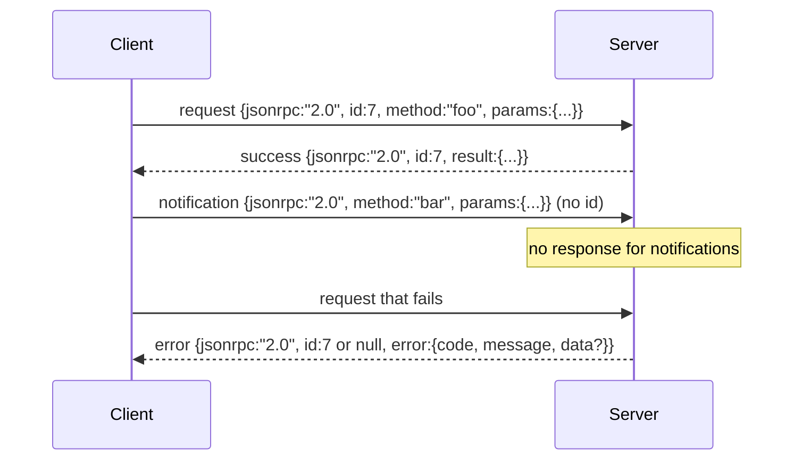

# JSON-RPC 2.0 sur le stdio à ligne nouvelle délimitée

> Le transport entre un client modèle et un serveur d'outils est JSON-RPC sur stdio.

**Type:** Build
**Languages:** Python
**Prerequisites:** Phase 13 lessons 01-07, Phase 14 lesson 01
**Time:** ~90 minutes

## Objectifs d'apprentissage
- Parlez JSON-RPC 2.0 encadré comme JSON délimité à nouvelle ligne sur stdin et stdout.
- Mettez en carte les cinq codes d'erreur standard (-32700, -32600, -32601, -32602, -32603) et les surmontez avec la bonne sémantique.
- Distinguer les demandes, les réponses, les notifications et les lots sans inventer de nouvelles clés d'enveloppe.
- Traiter une erreur de partage par ligne sans empoisonner le reste du courant.
- Construisez une démo auto-terminante à l'aide de io.BytesIO pour que la leçon se déroule sans générer un processus enfant.

```figure
cf-jsonrpc-frames
```

## Pourquoi JSON-RPC reste la langue officielle

Un agent de codage en 2026 parle à peut-être douze serveurs d'outils en une seule session. Chaque serveur est un processus séparé ou un point d'extrémité distant. Le format du fil est le même depuis 2013. JSON-RPC 2.0 est une spécification de deux pages. Il survit parce que les alternatives (gRPC, HTTP par appel, binaire personnalisé) imposent tous un compromis JSON-RPC ne: ils choisissent soit le streaming ou le batchage ou le transport-coupling. JSON-RPC est symétrique entre stdio, sockets, websockets et HTTP, et un client peut exécuter un serveur qu'il n'a jamais vu si les deux honorent la spécification.

Cette leçon construit la variante stdio. JSON délimité en ligne neuve. Chaque requête est une ligne. Chaque réponse est une ligne. La limite de transport est `\n`- Je suis désolé .

## La forme du fil

Il existe quatre formes de enveloppe, deux par le client, deux par le serveur.



Une notification n' a pas été faite `id`Si un serveur retourne une réponse à une notification, le client n'a aucun moyen de l'attacher à un site d'appel. Cette seule règle permet de simplifier les mathématiques de l'encadrement.

Un lot est un ensemble de requêtes ou de notifications JSON. Le serveur répond avec un ensemble de réponses, dans n'importe quel ordre, une par entrée non-notification. Si chaque entrée du lot est une notification, le serveur ne renvoie rien.

## Les cinq codes d'erreur

```text
-32700  Parse error      JSON could not be parsed
-32600  Invalid Request  Envelope shape is wrong
-32601  Method not found
-32602  Invalid params
-32603  Internal error
```

Les codes entre -32000 et -32099 sont réservés aux erreurs définies par le serveur. Tout le reste est défini par l'application. La leçon s'accroche aux cinq. Si votre gestionnaire le soulève, le transport l'enveloppe comme -32603 avec le nom de classe exceptionnel dans `data.exception`- Je suis désolé .

Une erreur de partage a une règle spéciale.`id`La réponse est `null`, parce que la demande n'a jamais été analysée assez pour extraire une identification.

## Le cadre de la nouvelle ligne et la démo BytesIO

Le transport lit une ligne à la fois.`\n`Si une ligne ne peut pas être analysée, le transport écrit une réponse -32700 avec `id: null`Le courant n'est pas empoisonné, la ligne suivante est analysée fraîche.

Pour la leçon , nous envelopperons une`io.BytesIO`Le serveur lit les requêtes jusqu'à EOF, écrit les réponses pour chacune et retourne. Le client lit les réponses. Aucun processus de reproduction. Aucun temps de sortie. Le comportement de transport est identique à un vrai sous-processus pipe parce que Python `io`l' interface présente la même chose `.readline()`et `.write()`Le contrat.

## Métode d'expédition

Le transport ne sait pas quelles méthodes existent.`handler(method, params)`Les codes de l'exception sont trois classes de codes spécifiques.

```text
MethodNotFound -> -32601
InvalidParams  -> -32602
Anything else  -> -32603 with exception name in data
```

Le transport ne voit jamais un registre des outils. Le registre est derrière le gestionnaire. C'est la couche que nous voulons. Le transport parle JSON-RPC. Le registre parle des formes d'outils. Le dispatcher (leçon vingt-trois) les couture ensemble.

## Comportement de flux sur les erreurs

```text
client writes              server reads             server writes
---------------            -----------              -------------
{...valid request...}      parses ok                {...response, id matches...}
{...broken json...         parse fails              {id:null, error: -32700}
{...valid request...}      parses ok                {...response, id matches...}
{...missing method...}     invalid envelope         {id:X, error: -32600}
```

Une ligne JSON cassée ne met pas fin à la boucle.`method`Le champ ne ferme pas la boucle. Une exception de manipulateur ne ferme pas la boucle. Le transport continue de lire jusqu'à ce que le EOF.

## Les notifications et les flux asymétriques

Une notification est un service de mise à jour et d'oubli. Le harnais utilise des notifications pour les événements de progrès, les signaux d'annulation et les lignes de journaux.

La leçon met en œuvre un assistant de notification sortant, `write_notification`Le serveur l'utilise pour émettre des progrès pendant qu'une demande est en vol. La démo montre le modèle: une demande entre, le gestionnaire émet deux notifications de progrès, puis écrit la réponse finale.

## Comment lire le code

`code/main.py`définit `StdioTransport`, l' assistant de partage (`parse_request`), les trois auteurs (`write_response`- Je suis là .`write_error`- Je suis là .`write_notification`), et la boucle d'expédition `serve`Les constantes du code d'erreur sont actives à la portée du module.

`code/tests/test_transport.py`couvre les cinq codes d'erreur, les notifications (aucune réponse n'est écrite), les lots (array in, array out, notifications saisies), le JSON cassé (erreur de partage puis continue) et le flux asymétrique où un gestionnaire écrit une notification au milieu de l'appel.

## On va plus loin

Ce transport suffit pour les leçons qui suivent. Les transports de production ajoutent trois choses.`id`Il est déjà nécessaire d'avoir une trace d'identité externe dans un réseau.`$/cancelRequest`et une poignée de main de négociation de type contenu pour que la même prise puisse parler JSON-RPC et HTTP en continu. Aucun de ces deux ne change le fil. Ils ajoutent des métadonnées.
