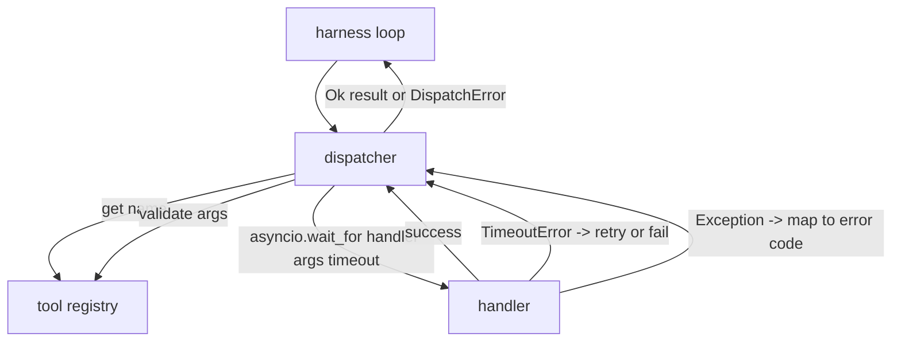
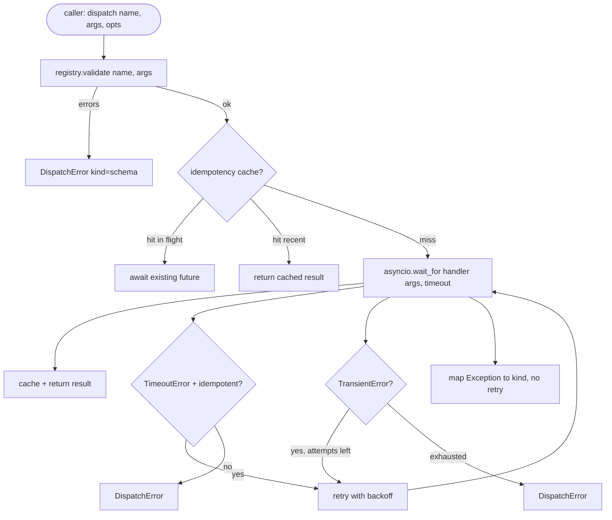

# Dispatcher d'appels de fonction

> Le dispatcher est là où le harnais paie pour chaque promesse faite par le schéma, délais, retries, dédupe, cartographie d'erreur, tout sur une seule couture.

**Type:** Build
**Languages:** Python
**Prerequisites:** Phase 13 lessons 01-07, Phase 14 lesson 01
**Time:** ~90 minutes

## Objectifs d'apprentissage
- Enveloppez un gestionnaire d'outils dans un délai par appel qui renvoie une erreur de typage au lieu de suspendre la boucle.
- Appliquez une nouvelle tentative de retrait exponentielle avec jitter et un nombre maximal d'essais.
- Une répétition déduplicée sur une clé d'idempotence afin qu'une répétition qui court avec une version originale lente ne soit pas effectuée deux fois.
- Les exceptions du manipulateur de carte et les défauts de transport sur une seule enveloppe d'erreur comprennent déjà la boucle de harnais.
- Envoyer parallèlement avec une limite de simultanéité afin qu'un ventilateur de quarante appels d'outils n'épuise pas la boucle d'événements.

```figure
cf-dispatch-retry
```

## Où le dispatcher est assis

Le transport (leçon vingt-deux) alimente la boucle. La boucle envoie un appel d'outil au dispatcher. Le dispatcher appelle le registre, exécute le gestionnaire et renvoie soit un résultat, soit une enveloppe d'erreur en forme de JSON-RPC.



Le dispatcher est la seule couche qui connaît les timers, les retries et l'idempotence.

## Temps de réparation

Chaque outil a un délai par défaut.`timeout_ms`Le dispatcher le supprime d'un surcall lorsque le harnais passe un.`asyncio.wait_for`À l'heure de l'intervalle, la tâche de gérant est annulée et le dispatcher revient.`DispatchError(kind="timeout")`- Je suis désolé .

Un délai de temps n'est pas une erreur récurrente par défaut pour les outils non idempotents.`db.write`Le dépêcheur honore le dépêcheur qui a été envoyé par le dépêcheur.`idempotent`Les outils idempotents sont réessayés.

## Retries avec une rétroaction exponentielle

La politique de retrait est de trois tentatives maximum.

```text
attempt 1  -> delay 0
attempt 2  -> delay 0.1s * (1 + random[0..0.5])
attempt 3  -> delay 0.4s * (1 + random[0..0.5])
```

- Je ne sais pas .`timeout`et `transient`erreurs réessayer.`schema`erreur, une `not_found`, ou un `internal`Les erreurs de schéma sont déterministes, les erreurs de schéma ne changent pas le résultat et détruisent le budget.

Si le budget de l'appelant n'a plus de clics de l'outil, le dispatcher échoue rapidement à la première tentative et revient `kind="budget_exceeded"`- Je suis désolé .

## Déduction de la clé d'idempotence

Une nouvelle tentative qui prend feu alors que l'original est toujours en vol est un vrai bug de production. Le premier appel est suspendu à quatre points neuf secondes (à peine sous le temps d'arrêt). La nouvelle tentative prend feu à cinq secondes. Maintenant deux demandes courent contre le même backend. Si l'outil est`payments.charge`Tu as fait deux charges.

Le dispatcher accepte une option`idempotency_key`Si la même clé est en vol lorsque l'appel arrive, le dispatcher attend le futur en vol et renvoie son résultat.

La clé est la responsabilité de l'appelant.`f"{step_id}:{tool_name}:{hash(args)}"`Le dispatcher n'invente pas de clés, car dériver une clé à partir d'arguments seul rend deux appels sémantiquement différents semblables.

## Enveloppe d'erreur

Une expédition ratée renvoie une seule forme.

```text
DispatchError
  kind        : "timeout" | "transient" | "schema" | "not_found" | "internal" | "budget_exceeded"
  message     : str
  attempts    : int
  jsonrpc_code: int   (one of -32601, -32602, -32603)
```

Les cartes de la boucle de harnais `kind`dans l'État suivant. `schema`et `not_found`Allez à la`on_error`et déclencher un replan. `timeout`et `transient`Allez à la`on_error`et peut ou non se réorganiser en fonction des tentatives. `budget_exceeded`déclencheurs `on_budget_exceeded`- Je suis désolé .

## Limite de concurrence pour les émetteurs-fants

`gather(*calls)`Il est également possible de faire une mise à jour de la connexion de l'appareil de connexion avec les utilisateurs.

Le dispatcher enveloppe .`gather`Dans un sémafor. La limite par défaut de synchronisation est de huit. Chaque appel acquiert le sémafor avant d'être expédié et est libéré à la fin.`gather`- une sortie en forme mais la programmation réelle est limitée.

## Flux pour un appel



## Comment lire le code

`code/main.py`définit `Dispatcher`- Je suis là .`DispatchError`, et `TransientError`Le dispatcher prend un registre de la construction.`dispatch(name, args, ...)`Les délais de sortie sont appliqués en ligne à l'intérieur.`_run_with_retries`en utilisant `asyncio.wait_for`- Je suis là .`gather_bounded(calls)`Il y a beaucoup de dépêches avec la limite de simultanéité.

`code/tests/test_dispatcher.py`couvre le tir de temps-out, la réessayer sur transitoire, le non-réessayer sur l'erreur de schéma, la déduction d'idempotence (deux appels simultanés avec la même clé pour une invocation de traitement) et la limitation de la simultanée (le semaphore en action).

Les tests utilisent `asyncio.sleep(0)`et déterministe `Counter`- les manipulateurs basés, de sorte qu'ils terminent en millisecondes et ne dépendent pas du timing de l'horloge murale.

## On va plus loin

Deux extensions sont ajoutées par les dispatchers de production. Premièrement, un enregistrement structuré à chaque transition (ce qui vous est déjà donné par le flux d'événements de la boucle, mais le dispatcher doit également émettre `dispatch.attempt`et `dispatch.retry`Deuxièmement, les interrupteurs: après N défaillances dans une fenêtre, un outil obtient une période de refroidissement où les envois reviennent immédiatement avec `kind="circuit_open"`Ils se sont tous les deux montés sur ce dispatcher sans changer de contrat.

Leçon 24 colonne le dispatcher à un agent de planification et d'exécution pour que vous puissiez voir les quatre pièces en mouvement.
