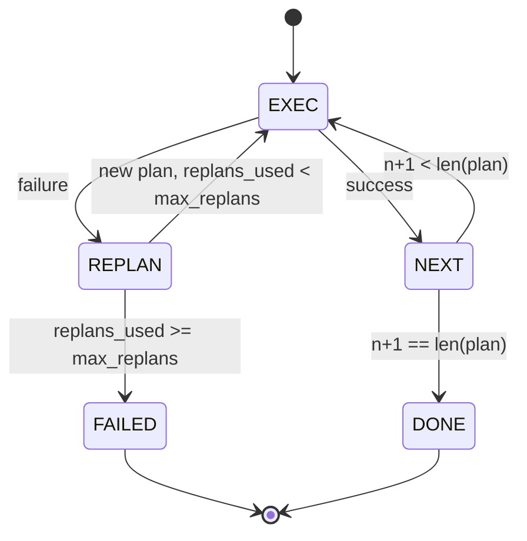

# Plan d'exécution du flux de contrôle

> Un plan qui ne peut survivre à un échec est un script. Un script qui peut replaner est un agent.

**Type:** Build
**Languages:** Python
**Prerequisites:** Phase 13 lessons 01-07, Phase 14 lesson 01
**Time:** ~90 minutes

## Objectifs d'apprentissage
- Représenter un plan comme une liste ordonnée d'étapes typées afin que l'exécuteur puisse raisonner sur les progrès et les résultats.
- Exécuter les étapes séquentiellement avec une défaillance contrôlée remise au planificateur.
- Replantez le curseur actuel avec l'erreur antérieure dans le contexte afin que le prochain plan soit informé.
- Émettre un plan différent à chaque révision afin qu'un traceur en aval ou une interface utilisateur puisse montrer pourquoi le plan a changé.
- Il faut appliquer deux budgets: un plafond d'escalier dur et un plafond de replan dur.

```figure
cg-plan-replan
```

## Planifier et exécuter, pas en chaîne de pensée

Un agent de chaîne de pensée émet des jetons et laisse la boucle deviner où l'appel à l'outil se termine. Un agent de plan-et-exécution émet d'abord un plan structuré, puis exécute chaque étape déterministiquement. Le plan est les données que le harnais peut introspecter. L'exécution est le harnais exécutant ces données via un dispatcher.

Deux pièces: un planificateur qui produit un plan, un exécuteur qui exécute le plan, le travail intéressant est ce qui se passe quand l'exécuteur frappe un échec.

```text
1. Abort         (return failed, surface the error)
2. Skip          (mark step failed, continue with the rest)
3. Replan        (hand the error to the planner, get a new plan from the cursor)
```

Replan est celui qui transforme un script en agent.

## La forme de l'étape

```text
Step
  id              : int           (monotonic within a plan revision)
  tool_name       : str
  args            : dict
  expected_outcome: str           (planner's stated success condition)
  result          : Any | None
  error           : str | None
```

`expected_outcome`est une phrase courte que le planificateur émet à côté de la étape. Elle n'est pas appliquée par l'exécuteur. Elle est pour deux raisons: le réplanificateur la lit lors de la révision du plan; le flux d'événements l'émet pour qu'un traceur puisse montrer "cette étape était censée faire X".

## La forme du planificateur

```python
def planner(goal: str, history: list[Step], last_error: str | None) -> list[Step]:
    ...
```

Une fonction pure.`goal`est l'objectif de l'utilisateur. `history`est les étapes déjà exécutées (avec les résultats et les erreurs remplies). `last_error`est Aucun sur le premier appel et le dernier message d'échec sur chaque appel ultérieur. Le planificateur renvoie le plan suivant à partir du curseur.

Le planificateur ne connaît pas l'exécuteur, il ne connaît pas les retries, il ne connaît pas les temps d'arrêt, il produit un plan, c'est tout.

## L'exécuteur

L'exécuteur est une petite machine d'état. Chaque étape passe par le dispatcher. Le résultat est l'une des trois choses: succès, défaillance-replanable, défaillance-fatal. défaillances replantables remettre au planificateur. défaillances fatales (budget dépassé, plafond de replan atteint) retourner une`FAILED`résultat de la séance.



## Différences de plan en révision

Lorsque le planificateur renvoie un nouveau plan après un échec, l'exécuteur émet un `plan.diff`événement avec trois champs.

```text
removed: list of step ids that were in the old plan and are not in the new
added  : list of step ids in the new plan that were not in the old
revised: list of step ids whose tool_name or args changed
```

Un traceur ou une interface utilisateur peut rendre cela comme une percée sur les étapes supprimées et un point de repère sur les étapes ajoutées.

## Deux budgets, tous deux difficiles

`max_steps`Un plan linéaire en cinq étapes qui se replante deux fois et ajoute trois étapes à chaque fois qu'il atteint seize exécutions et dépasserait le budget. L'exécuteur refusera le replan et retournera FAILED.

`max_replans`Le plan de réparation est de 5 fois, ce qui est la limite la plus importante. Un plan qui renvoie le même plan cassé cinq fois consécutives serait autrement en boucle jusqu'à ce que le budget de l'étape le saisisse.

## Le planificateur déterministe dans cette leçon

Nous n'appelons pas un modèle dans cette leçon.`last_error`- Je suis désolé .

```text
last_error is None    -> emit a four-step plan
last_error matches X  -> emit a three-step plan that routes around X
last_error matches Y  -> emit a two-step plan that gives up gracefully
otherwise             -> return [] (signals nothing to replan)
```

Cela suffit à tester le comportement de l'exécuteur sur chaque chemin de transition: succès, replan-une fois, replan-deux fois, replan-épuisement, et l'épuisement de budget étape.

## Forme de résultat

```text
SessionResult
  status      : "completed" | "failed"
  reason      : str     ("goal_met" | "step_budget" | "replan_budget" | "no_plan")
  history     : list[Step]
  revisions   : list[PlanDiff]
  events      : list[Event]
```

Le dispatcher de la leçon vingt-troisième est celui qui exécute chaque étape. Le registre de la leçon vingt-un valide les args de chaque étape. Le transport de la leçon vingt-deux supprimerait tout ce flux sur JSON-RPC à un client modèle.

## Comment lire le code

`code/main.py`définit `PlanExecuteAgent`- Je suis là .`Step`- Je suis là .`PlanDiff`- Je suis là .`SessionResult`L'exécuteur est un seul.`run(goal)`méthode qui renvoie un `SessionResult`. La différence de plan est calculée en comparant les identifiants de étape et `(tool_name, args)`Les deux.

`code/tests/test_agent.py`couvre un succès linéaire, un échec au milieu du plan qui se replante une fois, un épuisement qui revient `failed:replan_budget`, l'épuisement budgétaire progressif et le format de l'événement différent de plan.

## On va plus loin

Deux extensions que vous aurez besoin une fois que vous avez branché ce modèle à un modèle réel. Premièrement, la mise en cache partielle du plan: quand un plan réussit pour les trois premières étapes de six étapes et puis échoue, vous ne voulez pas réexécuter les trois premières. L'exécuteur garde déjà l'historique; le planificateur a juste besoin de le lire. Deuxièmement, branches parallèles: l'exécuteur actuel est strictement séquentiel. Un planificateur qui émet une branche indépendante (`gather_step`Au lieu de `next_step`) peut effectuer simultanément deux appels à l'outil par l'intermédiaire du dispatcher.

Les deux ajoutent une complexité réelle. Les deux sont plus faciles à ajouter une fois que l'exécuteur linéaire est fixé. C'est ce que fait cette leçon.
