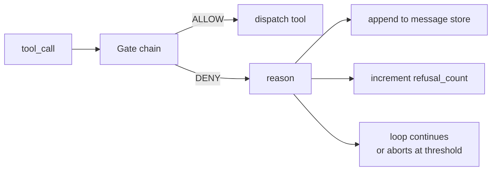
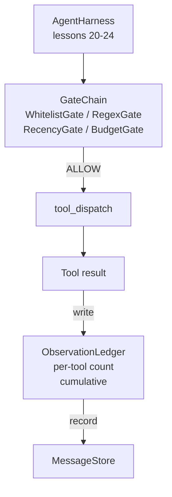

# Leçon de Capstone 25: Ports de vérification et budget d'observation

> Un harnais d'agent sans couche de vérification est un souhait dans un gilet de tranchée. Cette leçon construit la chaîne de passerelle déterministe qui décide si un appel à l'outil est autorisé à tirer, combien de sa sortie l'agent est autorisé à voir, et quand la boucle doit s'arrêter parce que l'agent a lu trop. La chaîne est une fonction de petites portes nommées plus un registre d'observation qui suit chaque jeton que le modèle a montré.

**Type:** Build
**Languages:** Python (stdlib)
**Prerequisites:** Phase 19 · 20-24 (Track A1: agent loop, tool registry, message store, prompt builder, model router), Phase 14 · 33 (instructions as constraints), Phase 14 · 36 (scope contracts), Phase 14 · 38 (verification gates)
**Time:** ~90 minutes

## Objectifs d'apprentissage

- Construire une`VerificationGate`protocole avec une déterministe `evaluate(call)`méthode.
- Composer le budget, la récente, la liste blanche et les portes regex dans une chaîne avec la sémantique à court circuit.
- Suivre chaque observation à travers un `ObservationLedger`à la clé par outil et tournée.
- Refuser une demande d'outil lorsque le budget cumulé d'observation serait dépassé.
- Surface structurée `GateDecision`enregistrer que l'observabilité en aval peut être absorbée.

## Le problème

Lorsqu'un harnais d'agent permet au modèle d'appeler librement les outils, trois classes de bugs apparaissent dans la première heure de l'utilisation réelle.

Le premier est l'observation illimitée. Un grep sur un repo de 200K ligne dépose un demi-million de jetons de sortie dans le tour suivant. Le modèle voit un match par kilobyte et le reste du contexte est gaspillé. La facture de jetons est grande et l'agent est maintenant pire, pas mieux, à la tâche.

La deuxième est la récente périmée. Une tâche de longue durée accumule cinquante appels à l'outil. Le modèle relise le premier read_file à partir du troisième virage comme s'il s'agissait d'un état en direct. Les modifications effectuées au virage quarante-sept ne sont jamais affichées car le constructeur prompt a sérialisé les premières observations en premier.

La troisième est le "Creeper du privilège".`web_search`, puis finit par s' enfuir .`shell`Parce que le modèle a inventé un nom d'outil et le harnais a été désactivé par défaut.

Une passerelle de vérification est le composant du harnais qui dit non. Ce n'est pas un modèle. Ce n'est pas un juge. C'est une fonction déterministe de `(call, history, ledger)`Le modèle est indiqué, la boucle se poursuit ou s'arrête.

## Le concept



Une porte est tout ce qui a une`evaluate(call, ctx) -> GateDecision`La chaîne est une liste ordonnée. Les courts-circuits d'évaluation sur le premier refus.

Cette leçon porte sur quatre portes:

- `WhitelistGate`Les noms des outils autorisés sont explicites, tout ce qui est à l'extérieur est refusé, c'est la porte la moins chère et se déroule en premier.
- `RegexGate`. Les arguments de l' outil sont combinés avec un regex. Utilisés pour refuser les appels à coque avec `rm -rf`C'est une question de sécurité, ou d'appels HTTP vers des adresses IP internes.
- `RecencyGate`. Le modèle ne voit que les observations des dernières virages N. Les observations plus anciennes sont masquées. La passerelle refuse un appel à l'outil dont le résultat prolongerait une fenêtre d'observation déjà vieillissante.
- `BudgetGate`. Les jetons cumulés que le modèle a lus au cours de la session ont un plafond.

Le registre d'observation est la comptabilité. Chaque appel d'outil réussi écrit une ligne: nom de l'outil, tour, jetons émis, cumulatif. Le registre répond à deux questions: combien le modèle a vu total, et combien il a vu de l'outil X. La passerelle budgétaire lit la première. Une passerelle budgétaire par outil, que vous écrirez comme exercice, lit la seconde.

```figure
cg-gate-chain
```

## Architecture



Le harnais demande à la chaîne. La chaîne signe ou refuse. Si elle signe, l'outil fonctionne, le registre marche, et le résultat est joint au magasin de messages. Si elle refuse, le modèle reçoit le refus en tant que message système et la boucle décide de réessayer ou d'annuler.

## Ce que vous allez construire

La mise en œuvre est unique `main.py`Plus des tests.

1. `Observation`et `ToolCall`les classes de données définissent les formes de fil.
2. `ObservationLedger`enregistrements `(turn, tool, tokens)`lignes et réponses `cumulative()`et `per_tool(name)`- Je suis désolé .
3. `GateDecision`porte `(allow, reason, gate_name)`- Je suis désolé .
4. `VerificationGate`Chaque porte implémentera`evaluate(call, ctx)`- Je suis désolé .
5. `GateChain`Il appelle chaque porte, renvoie le premier refus, ou renvoie autorise si chaque porte passe.
6. La démo fait une petite boucle d'agent synthétique, trois tours, le troisième tour démarre la porte budgétaire et la boucle rapporte un refus net avec un nombre de refus non nul.

Le compteur de jetons est intentionnellement stupide .`len(text) // 4`Le but de cette leçon est la plomberie de la porte, pas le jeton.

## Pourquoi l'ordre de la chaîne compte

Le déni est moins cher qu'une permission.`WhitelistGate`est en O(1) recherche de hachage. `RegexGate`fonctionne dans le modèle O( * argv). `RecencyGate`Il lit une petite tranche de la boutique de messages.`BudgetGate`Vous les commandez en augmentant le coût, donc un appel refusé court-circuite avant de faire le travail coûteux.

Les autres éléments de la liste blanche sont les plus forts: cet outil n'est pas dans le contrat. La porte regex est la suivante: cet argument n'est pas dans le contrat. La récente vient après: le harnais est toujours intéressant mais l'appel est structurellement légal. Le budget est le dernier parce que, par définition, il ne tire que lorsque tout le reste est passé.

## Comment cela se compose avec le reste de la piste A

Les leçons précédentes vous ont donné la boucle, le registre des outils, le magasin de messages, le constructeur de requêtes et le routeur modèle. Cette leçon ajoute la couche entre le modèle et les outils. Leçon 26 envoie la boîte à sable à laquelle le dispatcher remet l'appel à l'outil une fois que la chaîne de portes dit "AJOURDIR". La leçon 27 envoie le harnais d'évaluation qui enregistre le refus comme un signal de qualité. La leçon 28 intègre les décisions de la porte dans les champs OpenTelemetry. La leçon 29 met le lot dans un agent de codage en activité.

## Je le fais

```bash
cd phases/19-capstone-projects/25-verification-gates-observation-budget
python3 code/main.py
python3 -m pytest code/tests/ -v
```

La démo imprime une trace tour à tour comprenant chaque décision de porte et sort de zéro.
