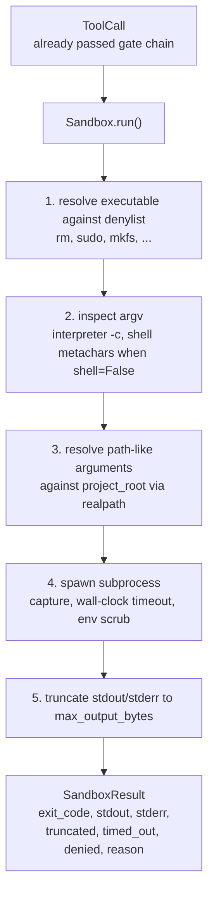
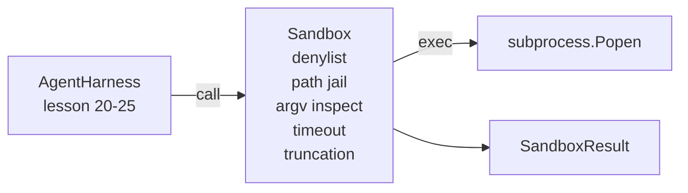

# Leçon de Capstone 26: Coureur de la boîte à sable avec Denylist et la prison Path

> La passerelle de vérification décide si un appel à l'outil doit être exécuté. La boîte à sable décide de ce qui se passe quand elle le fait. Cette leçon envoie un sous-processus qui refuse les exécutables dangereux, refuse les formes d'argv dangereuses, enferme chaque chemin de fichier vers une racine de projet, réduit la sortie surdimensionnée et tue les processus en fuite sur un temps de temps de temps de l'horloge murale. Il s'agit de la deuxième de deux couches situées entre le modèle et le système d'exploitation.

**Type:** Build
**Languages:** Python (stdlib)
**Prerequisites:** Phase 19 · 25 (verification gates and observation budget), Phase 14 · 33 (instructions as constraints), Phase 14 · 38 (verification gates)
**Time:** ~90 minutes

## Objectifs d'apprentissage

- Construire une`Sandbox`enveloppe de classe `subprocess.run`avec un délai, une capture et une troncation.
- Refuser un commandement par nom contre un dényliste et par structure contre un inspecteur argv.
- Rejeter tout argument de chemin qui résulte de l'extérieur d'une racine de projet déclarée.
- Refusez les métacharacters de la coque quand le mode de coque est désactivé.
- Retour à une structure `SandboxResult`que l'observabilité en aval et le harnais d'évaluation peuvent absorber.

## Le problème

Un agent de codage capable de se débarrasser peut installer des portes arrières, exfiltrer des clés, briquer un ordinateur portable du développeur et rassembler une facture de cloud en un seul tour. La défense la moins chère est de ne pas lui donner de coquille.

Trois classes d'échecs se reproduisent dans les traces d'agents.

Le premier est un exécutable dangereux.`sudo`- Je suis là .`chmod -R 777`- Je suis là .`rm -rf`- Je suis là .`mkfs`- Je suis là .`dd`Aucun d'eux ne fait partie d'un groupe d'agents.

Le second est le trucs de l'argue. Un modèle qui n'a pas été dit de coquille conduira une attaque par un interprète:`python3 -c "import os; os.system('rm -rf /')"`- Je suis là .`bash -c '...'`- Je suis là .`node -e '...'`- Je suis là .`perl -e '...'`La boîte à sable doit savoir que tout interprète fonctionne avec un`-c`- comme flag est juste un appel à l'explosif avec des étapes supplémentaires.

Le troisième est l'évasion par le chemin.`./src/main.py`et au lieu de cela, il lit`../../etc/passwd`La boîte à sable enferme chaque argument en le résolvant à travers .`os.path.realpath`et affirmant le préfixe.

La sandbox n'est pas une limite de sécurité au sens du système d'exploitation. Un attaquant déterminé avec exécution de code peut toujours éclater. La sandbox est une garde-foule de développement: elle rend les modes de défaillance courants bruyants et empêche l'agent de faire des dommages par pure ineptilité.

## Le concept



La boîte à sable a quatre axes de refus: nom, argv, chemin, structure. Chaque axe est une fonction pure de l'appel, pas de sous-processus encore. Le sous-processus ne se reproduit qu'après chaque axe a passé.

Le `SandboxResult`Les codes de sortie sont les conventionnels: 0 succès, non-zéro défaillance, plus trois codes sentinelle pour refusé (-100), timed_out (-101), et tronqué (le code de sortie est le vrai, avec un ensemble de drapeaux).

```figure
cg-path-jail
```

## Architecture



Le dényliste est un ensemble de noms de base exécutables.`/bin/rm`- Je suis là .`/usr/bin/rm`L'inspecteur argv connaît la forme de l'interprète: tout argv où argv[0] est un interprète et tout arg ultérieur commence par `-c`ou `-e`Les métacharacters de Shell (`;`- Je suis là .`|`- Je suis là .`&`- Je suis là .`>`- Je suis là .`<`, les coussinets,`$()`) cause un refus lorsque l'appel n'a pas demandé explicitement une coquille.

La prison de chemin est la pièce la plus subtile.`project_root`Tout argument qui ressemble à un chemin (contient`/`ou correspondant à un fichier existant) est normalisé par`os.path.realpath`, puis vérifié contre le chemin réel de la racine du projet. Si la cible résolue n'est pas sous la racine, refus. Les tentatives d'évasion de Symlink (un symlink dans la racine du projet qui pointe vers l'extérieur) sont bloquées en vérifiant le chemin réel, pas le chemin littéral.

## Ce que vous allez construire

La mise en œuvre est `main.py`Plus un test de dir.

1. `SandboxResult`classe de données: code de sortie, stdout, stderr, tronqué, dépassé, refusé, raison, durée_ms.
2. `SandboxConfig`classe de données: projet_root, max_output_bytes, timeout_seconds, denylist, interprète_block.
3. `Sandbox`classe: `run(argv, *, shell=False, cwd=None)`retourne une `SandboxResult`- Je suis désolé .
4. Les aides internes au refus: `_check_executable_denylist`- Je suis là .`_check_argv_interpreter`- Je suis là .`_check_shell_metachars`- Je suis là .`_check_path_jail`- Je suis désolé .
5. Truncation de sortie avec un clair `truncated`le drapeau et une ligne marquante dans le courant capturé.
6. Démo en bas: une séquence d'appels légitimes et contradictoires.

La boîte à sable utilise `subprocess.run`avec `shell=False`par défaut et `capture_output=True`Le temps de la mise en garde des murs utilise le`timeout`argument; sur `TimeoutExpired`, la boîte à sable tue le groupe de processus et synthétise un résultat Sandbox.

## Pourquoi ce n'est pas une vraie boîte à sable ?

La boîte à sable de leçon n'utilise pas d'espaces de noms, de groupes, de seccomp, de gVisor, de Firecracker ou d'aucune isolation au niveau du noyau. Tout ce que le sous-processus peut faire, la boîte à sable peut le faire. La protection est structurelle: l'agent est privé des invocations dangereuses les plus courantes, et le refus fort devient observable au lieu de fonctionner silencieusement.

Pour les agents de production, vous coupez en haut: exécuter à l'intérieur d'un conteneur Docker non privilégié, exécuter à l'intérieur d'une microVM, déposer des capacités, monter le projet de base en lecture seule et un scratch dir en lecture-écriture, définir une limite de mémoire et de processeur, frotter l'environnement à une liste blanche sûre connue.

## Je le fais

```bash
cd phases/19-capstone-projects/26-sandbox-runner-denylist
python3 code/main.py
python3 -m pytest code/tests/ -v
```

La démo crée un répertoire temporaire, y met un fichier propre, puis exécute une batterie d'appels. Les appels légaux réussissent. Les appels refusés retournent SandboxResult avec `denied=True`Les temps de retrait sont de retour.`timed_out=True`- Des ensembles de tronçage`truncated=True`La démo imprime une table JSON des résultats et sort de zéro.

## Comment cela se compose avec le reste de la piste A

La leçon 25 produit la chaîne de sortie de la porte. La leçon 26 est l'exécuteur qui fonctionne après une sortie de la porte ALLOW. L'utilisation de l'évaluation de la leçon 27 compare les résultats de la boîte à sable avec le code de sortie attendu par tâche. La leçon 28 émet un `gen_ai.tool.execution`à chaque tour`Sandbox.run`Le démonstrateur de fin à fin de la leçon 29 envoie un véritable agent de codage à travers les deux couches.
