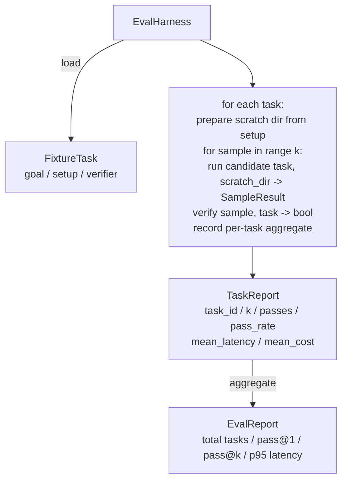

# Leçon 27: Réservation équivalente avec des tâches fixes

> Un agent de codage n'est que aussi bon que la suite de tâches que vous mesurez. Cette leçon construit un harnais d'évaluation qui prend un dossier de tâches fixes, exécute chacune à travers un agent candidat, les scores passent ou échouent à travers un vérificateur déterministe, et agrégent les résultats en pass@1, pass@k, latence moyenne et coût moyen. Le harnais est la source de vérité qui vous permet de voir une régression d'un réfacteur.

**Type:** Build
**Languages:** Python (stdlib)
**Prerequisites:** Phase 19 · 25 (verification gates), Phase 19 · 26 (sandbox runner), Phase 14 · 30 (eval-driven agent development), Phase 14 · 19 (SWE-bench and GAIA benchmarks)
**Time:** ~90 minutes

## Objectifs d'apprentissage

- Définir une tâche de fixation comme un triple de but, de configuration et de vérificateur.
- Score plusieurs échantillons par tâche et calculer pass@1 et pass@k.
- Aggreger la latence et le coût en moyenne et en 95e percentile.
- Les vérificateurs déterministiques (diff du fichier, code de sortie, regex match) sont transformés en fonctions réutilisables.
- Émettez un rapport JSON structuré que le script de suivi de régression peut ingérer.

## Le problème

Trois modes d'échec, des paramètres de référence pour les agents de plaie construits sans harnais d'évaluation.

Le premier est un passage non vérifié. L'agent dit avoir corrigé le bug, les regards humains sur le diff, la suite est marquée en vert, et trois semaines plus tard le test de régression surfaces le même bug.

La deuxième est une régression non détectée. Un changement dans le modèle prompt rend l'agent 4% meilleur sur la tâche bruyante et 14% pire sur la quiétude. Sans un ensemble d'or et un score par tâche, la régression se déplace dans le principal et ne surgit que lorsqu'un client se plaint.

Le troisième est le dérivé par tâche. L'évaluation a été menée lundi avec 100 tâches et vendredi avec 95 d'entre elles, parce que quelqu'un a renommé cinq fixtures. Le taux de réussite semble être une amélioration de 5%.

Le harnais est le programme qui transforme ces échecs en faits, il fonctionne à chaque fois, dans un ordre reproduisable, contre un vérificateur qui renvoie vrai ou faux sur un contrôle déterministe.

## Le concept

```mermaid
flowchart LR
  F1[fixtures/task_001/<br/>task.json + expected/] --> Harness
  F2[fixtures/task_002/<br/>...] --> Harness
  Harness[Harness<br/>for each task:<br/>setup / run agent k samples /<br/>verify each sample /<br/>record latency, cost]
  Harness --> Report[EvalReport<br/>pass@1 / pass@k<br/>mean ms / p95 ms<br/>mean cost]
```

Une .`FixtureTask`est un petit fichier JSON plus une option `expected/`Le JSON déclare un `id`, une `goal`(le rappel transmis à l'agent),`setup`bloc (fichiers à déposer dans le scratch dir), et un `verifier`Le bloc de vérification nomme une fonction dans le registre de vérification de l'harnais et fournit ses arguments.

Trois formes de vérificateur couvrent la plupart des tâches utiles.

La première est `file_equals`Après l'exécution de l'agent, comparez un fichier nommé avec un contenu attendu. Cela capture les tâches "réparer ce bug de cette manière exacte".

La deuxième est `regex_match`. Le contenu du fichier nommé est associé à un regex. Cela capture "la fonction doit exister et retourner X" tâches où il y a beaucoup de solutions acceptables.

Le troisième est `shell_exit_zero`. Le harnais exécute une commande de coque (à travers la boîte à sable de la leçon 26) et passe la tâche uniquement si la commande sort de zéro.

Le harnais réalise chaque tâche .`k`Les temps passent.`1 - (1 - p)^k`où p est le taux de réussite empirique; le harnais rapporte également des nombres bruts afin que vous puissiez repérer la variance. La latence est le mur-horloge par échantillon. Le coût est ce que l'agent rapporte lui-même (compte de jetons, USD ou les deux); le harnais le résume sur les échantillons et présente les nombres par tâche et agrégés.

```figure
pass-at-k
```

## Architecture



Le candidat est un appelable:`Callable[[FixtureTask, str], SampleResult]`Le harnais crée le répertoire de rayures via`tempfile.mkdtemp()`Le harnais ne se soucie pas du fonctionnement du candidat. Le candidat pourrait être un applicateur de patch déterministe (utile pour les auto-tests de harnais), un vrai agent LLM, un fuzzer.

## Ce que vous allez construire

`main.py`les navires:

1. `FixtureTask`classe de données.
2. `SampleResult`classe de données: success_self_reported, latency_ms, cost_units, modifications.
3. `TaskReport`- Je suis là .`EvalReport`classes de données avec `to_dict()`- Je suis désolé .
4. `VerifierRegistry`Le nom du vérificateur de mapping pour fonctionner.
5. `EvalHarness`classe. exécute un répertoire de tâches contre un candidat. Retourne EvalReport.
6. Cinq tâches de fixation regroupées `tasks/`- Le numéro de la liste:
   - - Un à un .`fizzbuzz`
   - Retour manquant en `factorial`
   - erreur de frappe dans le message d'erreur
   - corps de fonction vide
   - décalage par décalage dans la liste liée
7. Un candidat de référence déterministe (`apply_known_fixes`) le harnais utilise pour démontrer un passage propre@1 de 1.0.
8. La démo imprime le JSON de l'EvalReport et sort de zéro.

Les tâches de fichier sont regroupées en fichiers JSON dans `tasks/`plus les fichiers source partagés en `tasks/<id>/buggy/`et `tasks/<id>/expected/`Le harnais copie le buggy dans un grappillage, le remet au candidat, et vérifie contre les attentes.

## Pourquoi pas@k et pas seulement pas@1

Les vrais agents de LLM sont stochastiques. Un pass@1 de 0,6 semble un échec. Un pass@5 de 0,95 dit que l'agent obtient la bonne réponse la plupart du temps mais choisit mal sur les premiers échantillons. La correction est le prélèvement et le classement, pas toujours plus de formation. Pass@k rend cela visible.

Pass@k est rapporté à côté de pass@1 parce que pass@k fait référence à une erreur réelle: si le modèle obtient la bonne réponse une fois sur vingt tentatives, vous n'avez pas d'agent utile.

## Comment cela se compose avec le reste de la piste A

La leçon 25 a produit la chaîne de portes, la leçon 26 a produit la boîte à sable.`shell_exit_zero`Leur test de la méthode de test de la méthode de test de test de test de test de test de test de test de test de test de test de test de test de test de test de test de test de test de test de test de test de test de test de test de test de test de test de test de test de test de test de test de test de test de test de test de test de test de test de test de test de test de test de test de test de test de test de test de test de test de test de test de test de test de test de test de test de test de test de test de test de test de test de test de test de test de test de test de test de test de test de test de test de test de test de test de test de test de test de test de test de test de test de test de test de test de test de test de test de test de test de test de test de test de test de test de test de test de test de test de test de test de test de test de test de test de test de test de test de test de test de test de test de test de test de test de test de test de test de test de test de test de test de test de test de test de test de test de test de test de test de test de test de test de test de test de test de test de test de test de test de test de test de test de test de test de test de test de test de test de test de test de test de test de test de test de test de test de test de test de test de test de test de test de test de test de test de test de test de test de test de test de test de test de test de test de test de test de test de test de test de test de test de test de test de test de test de test de test de test de test de test de test de test de test de test de test de test de test de test de test de test de test de test de test de test de test de test de test de test de test de test de test de test de test de test de test de test de test de test de test de test de test de test de test de test de test de test de test de test de test de test de test de test de test de test de test de test de test de test de test de test de test de test de test de test de test de test de test de

## Je le fais

```bash
cd phases/19-capstone-projects/27-eval-harness-fixture-tasks
python3 code/main.py
python3 -m pytest code/tests/ -v
```

La démo imprime le rapport Eval en JSON, y compris pass@1, pass@5, latence moyenne et décomposition par tâche. Le code de sortie est zéro. Les tests couvrent les fonctions de vérification, le maths pass@k, le chargement des fichiers et le harnais de bout en bout contre le candidat de référence regroupé.
