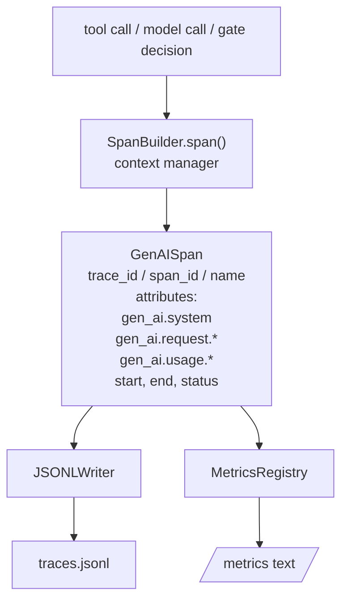
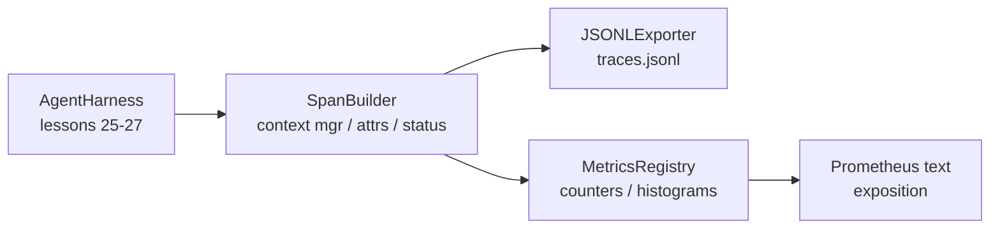

# Leçon de Capstone 28: Observabilité avec les spans OTel GenAI et les métriques Prometheus

> Un harnais d'agent sans observabilité est une boîte noire qui coûte de l'argent. Cette leçon ronde manuellement un constructeur de span qui émet des enregistrements conformes aux conventions sémantiques OpenTelemetry GenAI, les écrit dans un fichier JSON-Lines une période par ligne, et expose des compteurs et des histogrammes dans le format de texte Prometheus.

**Type:** Build
**Languages:** Python (stdlib)
**Prerequisites:** Phase 19 · 25 (verification gates), Phase 19 · 26 (sandbox), Phase 19 · 27 (eval harness), Phase 13 · 20 (OpenTelemetry GenAI), Phase 14 · 23 (OTel GenAI conventions)
**Time:** ~90 minutes

## Objectifs d'apprentissage

- Construire une classe de données de span façonnée selon les conventions sémantiques OpenTelemetry GenAI.
- Implémenter un exportateur JSONL qui écrit une période autonome par ligne.
- Construire des compteurs et des histogrammes avec des étiquettes et une exposition au format texte Prometheus.
- Envelopper tout appel dans un gestionnaire de contexte de durée qui enregistre la durée, l'état et les exceptions.
- Vérifiez que les émissions de rayons vont et viennent `json.loads`et correspondent à la forme de la spécification.

## Le problème

Un agent de codage en production produit trois classes d'artefact à chaque tour: un appel de modèle, une exécution d'outil et une décision de passerelle de vérification.

Le premier mode d'échec est la trace manquante. Quelque chose est allé mal mardi mais le seul enregistrement est un journal de chat de 500 lignes. Il n'y a pas de enregistrement de l'outil qui a été exécuté, combien de temps il a pris, combien de jetons sont entrés dans le prompt, ou si la passerelle a refusé quelque chose.

Le deuxième mode d'échec est la trace imperceptible. Le harnais a écrit des extensions mais a utilisé ses propres noms de champs ad hoc. Rien dans Grafana, Honeycomb, Jaeger ou le CLI local ne peut les lire.

Le troisième mode d'échec est la métrique non agrégée. Vous pouvez voir un appel d'outil lent dans la trace, mais vous ne pouvez pas répondre " quelle est la latence p95 des appels de read_file au cours de la dernière heure ? " car il n'y a pas de métriques, seulement des traces.

Les conventions sémantiques OpenTelemetry GenAI existent exactement pour cela. Ils définissent un petit ensemble d'attributs standard que les émetteurs de champs de LLM partagent. Si votre harnais écrit ces attributs, chaque backend compatible avec OTel peut les lire.

## Le concept



Chaque opération dans le harnais produit une durée. Une durée a un identifiant de trace (l'invocation de l'agent entier), un identifiant de durée (cette opération), un nom (p. ex. `gen_ai.chat`- Je suis là .`gen_ai.tool.execution`), les attributs qui suivent les conventions de GenAI, un temps de début et de fin et un statut.

Les conventions de la GenAI standardisent ces clés d' attribut: `gen_ai.system`(qui est le fournisseur, par exemple `anthropic`- Je suis là .`openai`), `gen_ai.request.model`(identifiant du modèle), `gen_ai.request.max_tokens`- Je suis là .`gen_ai.usage.input_tokens`- Je suis là .`gen_ai.usage.output_tokens`- Je suis là .`gen_ai.response.model`- Je suis là .`gen_ai.response.id`- Je suis là .`gen_ai.operation.name`, plus des clés spécifiques à l' outil `gen_ai.tool.name`et `gen_ai.tool.call.id`- Je suis désolé .

L'exporteur écrit JSONL. Un objet JSON par ligne. C'est le format le plus simple possible que les outils en aval peuvent diffuser, saisir et importer. Un véritable exportateur OTel parlerait OTLP gRPC; l'exporteur JSONL de la leçon est l'équivalent hors ligne et sort de zéro sur chaque poste de travail.

Les métriques sont en direct à côté des traces.`tools_called_total{tool="read_file"}`Un histogramme enregistre la latence observée: `tool_latency_ms{tool="read_file"}`Les deux se sérialisent dans le format d'exposition de texte Prometheus, qui est la norme de facto pour les mesures basées sur la traction.

```figure
trace-spans
```

## Architecture



Le constructeur d' espace est une petite classe avec un`span(name, attrs)`méthode qui renvoie un gestionnaire de contexte. Le gestionnaire de contexte enregistre l'heure de début à l'entrée, enregistre l'heure de fin à l'exit, attache une exception si une a été levée et pousse l'expérience finalisée à l'exportateur.

Le registre des mesures est de deux dictes.`{(name, frozen_labels): int}`Les histogrammes conservent des échantillons bruts dans une liste et les sérialisent dans les seins d'histogrammes Prometheus au moment de l'exposition.

## Ce que vous allez construire

`main.py`les navires:

1. `GenAISpan`classe de données: trace_id, span_id, parent_span_id, nom, attributs, start_unix_nano, end_unix_nano, statut, status_message, événements.
2. `SpanBuilder`classe avec `span(name, attrs, parent=None)`le gestionnaire de contexte.
3. `JSONLExporter`classe avec `export(span)`qui ajoute une ligne.
4. `Counter`et `Histogram`classes plus `MetricsRegistry`- Je suis désolé .
5. `prometheus_exposition(registry)`qui produit une sortie en format texte.
6. `wrap_tool_call(name)`décorateur qui émet une durée et met à jour les métriques.
7. Demo: synthétise une invocation complète d'agent (gen_ai.chat span autour des spans d'outils), écrit traces.jsonl, imprime l'exposition Prometheus, sort de zéro.

L'identifiant de span et l'identifiant de trace sont des chaînes hexagonale de 16 bytes, générées à partir de `os.urandom`L'exportateur ne lance jamais, les erreurs IO apparaissent mais le harnais continue de fonctionner.

L'histogramme a un ensemble de bouquet fixe (le nombre de temps de latence par défaut OTel en millisecondes: 5, 10, 25, 50, 100, 250, 500, 1000, 2500, 5000, 10000, +Inf). Les échantillons sont stockés sous forme de liste; l'exposition compute les comptes par bouquet sur demande.

## Pourquoi roule à la main au lieu d'ouverture-métrie-sdk

Le SDK OTel Python est une vraie dépendance. Il s'agit également de plusieurs milliers de lignes de code, de plusieurs processus pour l'exportateur OTLP et d'un coût de fonctionnement qui inonde un budget de leçon. La version roulée à la main enseigne le format de fil.

Les conventions sont stables. Le format de fil émis par la leçon continuera à être analysé en 2030 parce que OTel ne casse jamais les noms d'attributs GenAI; ils en ajoutent seulement de nouveaux.

## Comment cela se compose avec le reste de la piste A

La leçon 25 produit la chaîne de portes. La leçon 26 produit la boîte à sable. La leçon 27 produit le harnais d'évaluation. La leçon 28 rend les trois observables. La leçon 29 enveloppe chaque étape de la démo de bout en bout en spans et imprime le texte de Prometheus à la fin.

## Je le fais

```bash
cd phases/19-capstone-projects/28-observability-otel-traces
python3 code/main.py
python3 -m pytest code/tests/ -v
```

La démo émet une `traces.jsonl`Dans le dir de travail de la leçon (nettoyé à la fin), il imprime ensuite un échantillon de trois intervalles, puis imprime l'exposition Prometheus pour les compteurs et les histogrammes.
