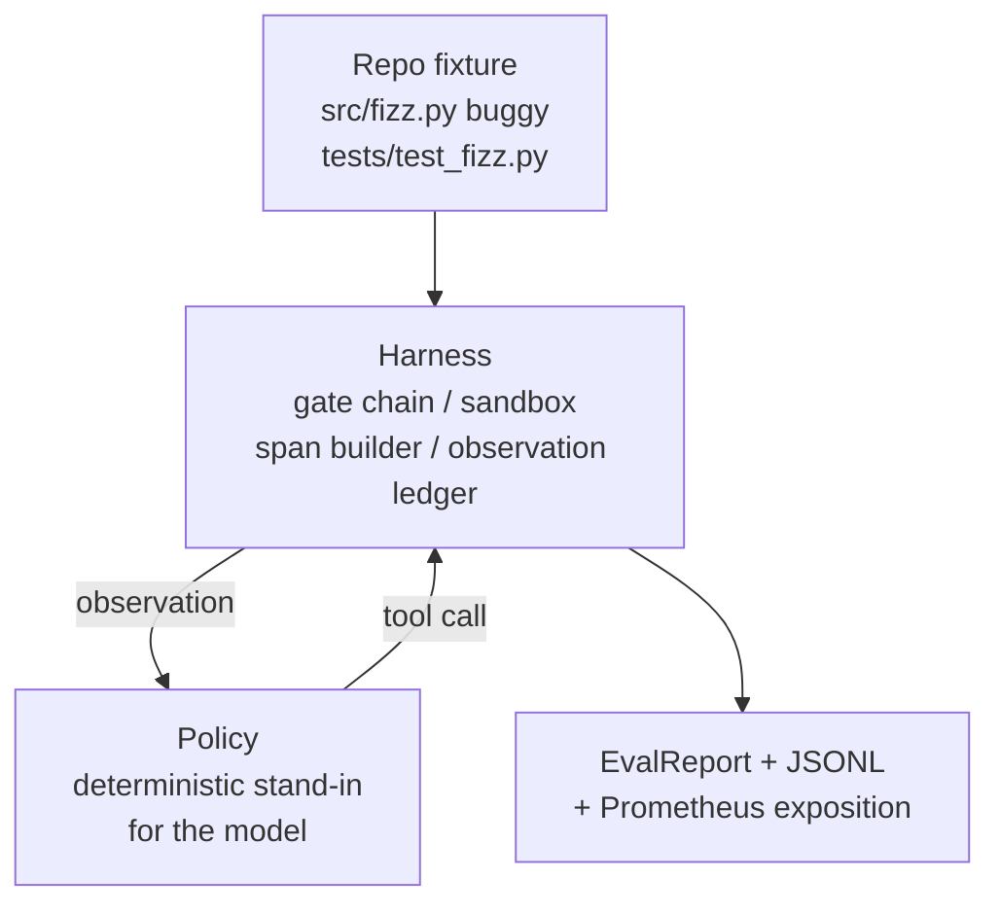
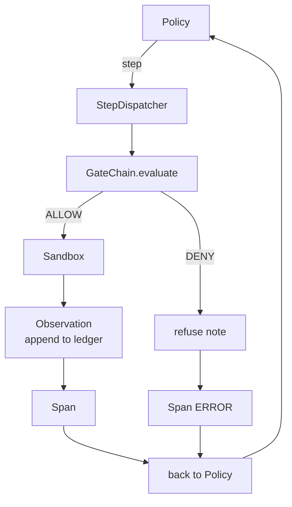

# Capstone leçon 29: agent de codage de bout en bout sur le harnais

> Le salaire de la piste A. Cette leçon suture la chaîne de passerelle, la boîte à sable, le harnais d'évaluation et l'OTel s'étend en un agent de codage qui répare un bug réel (petit, à l'échelle fixe) dans un projet Python multi-fichiers. L'agent est une politique déterministe, pas un LLM; la substitution rend la leçon reproduisable et montre que le harnais a été la partie intéressante tout le temps. Le contrat est identique: un modèle réel s'insère dans la couture de la politique.

**Type:** Build
**Languages:** Python (stdlib)
**Prerequisites:** Phase 19 · 25 (verification gates), Phase 19 · 26 (sandbox), Phase 19 · 27 (eval harness), Phase 19 · 28 (observability), Phase 14 · 38 (verification gates), Phase 14 · 41 (workbench for real repos), Phase 14 · 42 (agent workbench capstone)
**Time:** ~90 minutes

## Objectifs d'apprentissage

- Composer la chaîne de porte, la boîte à sable, le harnais d'évaluation et le constructeur d'espace en une seule boucle d'agent.
- Implémenter une politique déterministe qui utilise le fichier read_file, les tests run_tests et write_file pour corriger un bug d'installation.
- Faire appliquer un budget global de étapes plus un budget de jetons d'observation sur une course de bout en bout.
- Émettez des traces complètes OTel GenAI et des métriques Prometheus pour la durée complète.
- Vérifiez que l'agent résout le problème en moins de 12 étapes avec zéro sortie de porte sur les outils juridiques.

## Le problème

La plupart des démonstrations d'agents fonctionnent en isolement: une boîte à sable par elle-même, un harnais d'évaluation par lui-même, un émetteur de span par lui-même.

La chaîne de portes dit "AUTHED", mais la boîte à sable refuse pour une raison que la chaîne n'a pas anticipée. L'appareil d'évaluation enregistre un passage mais les spans OTel disent que la passerelle a refusé un outil que l'agent prétend avoir utilisé. Le compteur Prometheus est augmenté deux fois lorsqu'il doit être augmenté une fois. Le budget de l'observation est dépassé mais l'agent a continué parce que le budget était suivi dans la chaîne et la boîte à sable ne savait pas.

Cette leçon est le test d'intégration pour toute la piste. L'agent doit faire quatre choses pour l'ordre: lire le projet, exécuter les tests, identifier le bug de l'échec du test, écrire la correction, réexécuter les tests, et arrêter. Chaque opération passe par la chaîne de passerelle. Chaque exécution d'outil passe par la boîte à sable. Chaque étape est enveloppée dans une période. Le harnais d'évaluation marque tout à la fin.

## Le concept



La politique de l'agent est une machine d'État.

`SURVEY`L'agent lit la liste du projet.

`RUN_TESTS`Si les tests passent, la machine d'état s'arrête avec succès.

`INSPECT`L'agent lit le fichier source défaillant.

`FIX`L'agent écrit le fichier corrigé.

`VERIFY`Si les tests passent, arrêtez le succès.

Chaque état correspond à un appel à l'outil. Chaque appel à l'outil passe par la chaîne de passerelle. Si un appel à l'outil est refusé, l'agent rapporte le refus dans la trace et s'arrête.

Le bug de l' appareil est un coup par coup dans `fizz.py`La politique déterministe détecte le bug du message d'échec de l'essai via un regex et émet le fichier corrigé.

```figure
cg-harness-weave
```

## Architecture



La leçon est indépendante. Chaque élément primitif de la leçon précédente est réimplémenté à une échelle minimale en`main.py`Les noms correspondent exactement aux leçons 25-28 de sorte que la cartographie conceptuelle est sans ambiguïté.

## Ce que vous allez construire

`main.py`les navires:

1. Les primitifs de harnais minimaux, copiés avec les mêmes noms que les leçons 25-28:`GateChain`- Je suis là .`Sandbox`- Je suis là .`ObservationLedger`- Je suis là .`SpanBuilder`- Je suis là .`MetricsRegistry`- Je suis désolé .
2. `CodingAgentPolicy`classe: machine d'état avec cinq états.
3. `Repo`aide: prépare un scratch dir avec le raccordement de buggy.
4. `AgentRun`classe: conduit la police, expédie à travers le harnais, renvoie un `AgentRunReport`- Je suis désolé .
5. Un appareil intégré (`fixture_repo/`) avec src/fizz.py, tests/test_fizz.py et un arbre attendu/ pour le harnais d'évaluation.
6. Démo: exécute la politique de bout en bout, imprime la trace étape par étape, affirme le passage, imprime les mesures.

Le fichier regroupé a la même forme que la structure de tâches de la leçon 27: un fichier buggy et un fichier test. Le message d'échec du test contient suffisamment d'informations pour que la politique déterministe identifie le fichier.

## Pourquoi la politique n'est pas une LLM

Un vrai LLM nécessite une clé API, un appel réseau et une stochasticité non vérifiable. L'harnais est la partie qui intéresse le cours. Subbing dans une politique déterministe permet à la leçon de fonctionner sur n'importe quel ordinateur portable de développeur avec zéro dépendance externe et permet à la suite de test d'affirmer le nombre exact de étapes.

La politique de la leçon est un sous-ensemble strict de ce qu'un agent LLM fait. La politique lit le repo, voit le test échoué, identifie la ligne et émet une correction.

## Ce que la démo affirme

La démo de bout en bout affirme cinq choses au moment de la sortie, et la suite de tests les réaffirme programmatiquement.

La politique a résolu le problème en moins de 12 étapes.

Le budget de l'observation n'a jamais été dépassé.

Les démentis de la porte zéro ont été tirés sur des outils juridiques.

Chaque étape a une durée correspondante dans les traces. jsonl.

L' exposition Prometheus contient une `tools_called_total{tool="read_file"}`l'entrée et une `tool_latency_ms`l'histogramme.

## Comment cela se compose avec le reste de la piste A

Cette leçon est l'intégration. La leçon 25 a écrit la chaîne de passerelle. La leçon 26 a écrit la boîte à sable. La leçon 27 a écrit le harnais d'évaluation. La leçon 28 a écrit l'observabilité. La leçon 29 prouve qu'ils fonctionnent comme un système.

## Je le fais

```bash
cd phases/19-capstone-projects/29-end-to-end-coding-task-demo
python3 code/main.py
python3 -m pytest code/tests/ -v
```

La démo imprime une trace par étape, le rapport d'évaluation final et l'exposition Prometheus. Le code de sortie est zéro. Les tests couvrent les transitions de l'état de la politique, les refus de passerelle sur les appels d'outils synthétiques, l'exécution de bout en bout sur le fichier regroupé et les invariants de budget étape.
