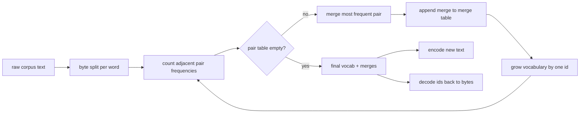
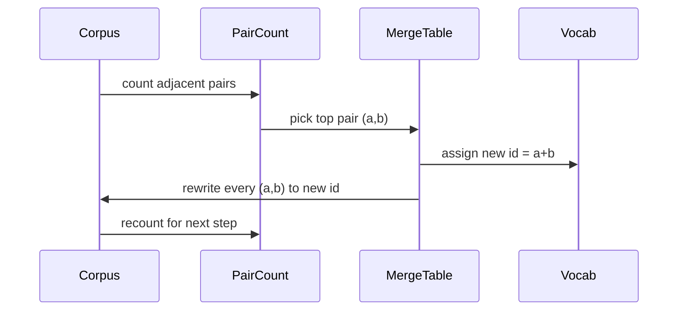

# Le Tokenizer BPE à partir de zéro

> Les octets sont entrés, les identifiants sortis, les identifiants retournés aux mêmes octets.

**Type:** Build
**Languages:** Python
**Prerequisites:** Phase 04 lessons, Phase 07 transformer lessons
**Time:** ~90 minutes

## Objectifs d'apprentissage
- Formez un vocabulaire de codage par paires de octets à partir d'un corpus de texte brut en fusionnant à plusieurs reprises la paire de symboles adjacents la plus fréquente.
- Implémenter une table de fusion déterministe et l'appliquer au texte frais pour produire un flux d'id de sous-parts.
- Retour-retour d'entrée arbitraire UTF-8 à l'identifiant et retour sans perte d'information.
- Réserver et protéger des jetons spéciaux (`<|endoftext|>`- Je suis là .`<|pad|>`) afin qu'ils survivent à l'entraînement et au décoding.
- Pourquoi un alphabet de niveau octet est le bon plancher pour un jeton à usage général.

```figure
cap-bpe-merge
```

## Le cadre

Un modèle de langage ne voit jamais le texte. Il voit les nombres entiers. La carte d'une chaîne à une liste d'entiers et le retour est le jeton.

La famille dominante de jetons de sous-parts pour les modèles de texte général est le codage par paires de octets. L'idée est petite. Commencez par un alphabet connu. Trouvez la paire de symboles adjacentes qui apparaît le plus souvent dans le corpus d'entraînement. Fusez-la dans un nouveau symbole. Répétez jusqu'à ce que le vocabulaire atteigne la taille cible.

Nous allons construire la variante au niveau des octets. L'alphabet est les 256 octets bruts, pas les points de code Unicode. Ce choix est ce qui permet au tokeniser de gérer toute entrée UTF-8 sans revenir à un jeton inconnu.

## Le pipeline



Si vous modifiez l'ordre de fusion à l'inférence, vous décodez un flux d'id différents.

## L'alphabet en octets

Les 256 premiers identifiants sont réservés aux octets bruts 0x00 à 0xFF. Cela garantit que chaque chaîne d'entrée peut être exprimée dans le vocabulaire avant qu'une fusion ne se produise. Après le bloc de octets, nous réservons une petite plage pour des jetons spéciaux.

Le pré-tokenizer divise le corpus sur des espaces blancs et des limites de ponctuation avant que la formation ne le voie. Sans cette division, l'étape de fusion BPE apprendrait avec plaisir des fusions qui traversent les limites des mots et le vocabulaire se remplit de phrases entières communes.

## Le cycle d'entraînement

Pour chaque étape d'entraînement, la boucle fait trois choses. Elle parcourt chaque mot dans le corpus et compte la fréquence à laquelle chaque paire de symboles courants adjacents apparaît, pondérée par la fréquence à laquelle le mot lui-même apparaît. Elle choisit la paire avec le plus grand nombre. Elle réécrit chaque occurrence de cette paire en un seul nouveau symbole dont l'id est la prochaine fente libre dans le vocabulaire. Puis elle enregistre la fusion.



Le coût de chaque étape est linéaire dans la taille du corpus exprimé comme une liste de séquences de symboles. Pour un million de mots et un vocabulaire cible de dix mille ids, la boucle se complète en quelques secondes parce que les séquences de symboles se rétrécissent à mesure que les fusions atterrissent.

## Enchanger du texte frais

L'inference n'appelle pas le compteur de fusion. Il applique la table de fusion dans le même ordre qu'elle a été apprise. Pour un mot nouveau, l'encodeur commence par la division en octets. Il scanne la séquence actuelle pour la fusion la plus basse (la première qui s'applique). Il effectue cette fusion. Il scanne à nouveau. La boucle se termine quand aucune fusion dans la table ne s'applique à la séquence actuelle.

L'ordre par rang est la propriété qui rend le codage déterministe et correspond au comportement d'entraînement sur la même entrée. Une fusion apprise en premier se trouve en haut de la table et est appliquée en premier. Si deux fusions pourraient s'appliquer à la même position, la plus basse rang gagne.

## Tokens spéciaux

Les jetons spéciaux sont des identifiants que le flux de octets ne peut jamais produire. Nous les réservons à la main.

- `<|endoftext|>`Il indique au modèle "un nouveau document commence ici, ne laissez pas le contexte de l'ancien s'échapper".
- `<|pad|>`Le masque de perte le cache pendant l'entraînement.

Le codeur accepte un drapeau pour permettre des jetons spéciaux dans l'entrée.`<|endoftext|>`et `<|pad|>`Avec le drapeau, les chaînes littérales sont mappées à leurs identifiants réservés et ne sont pas soumises à aucune fusion.

## Garantissement de retour

Le décodeur concatenera l'expansion en octets de chaque id dans l'ordre. Comme chaque id est soit un octet brut, soit la concatenation de deux ids connus précédemment, l'expansion récursive se termine toujours en octets bruts. Le décodeur renvoie ensuite la chaîne UTF-8 que ces octets orthographient.

La suite de tests de cette leçon vérifie cette propriété sur une phrase invisible, sur une phrase avec un émoji Unicode, et sur une phrase qui contient un mot-clé `<|endoftext|>`Je vous en prie.

## Ce que cette leçon ne fait pas

Il ne construit pas de pré-tokenizer à régex, à la manière des plus grands tokenizeurs de production. Le pré-kenizer ici est un petit espace blanc et une fraction de ponctuation. Il suffit de créer des fusions raisonnables sur un petit corpus de formation et le contrat avec le reste de la chaîne de cours reste le même. La leçon suivante traite le tokenizer comme une boîte noire et construit le jeu de données de fenêtre coulissante en haut.

Il ne parallèle pas le compteur de paires. Une boucle en Python sur un corpus de quelques milliers de mots se termine en moins d'une seconde. Pour les plus grands corpus, le mouvement évident est de compter par paires par mot en parallèle et de réduire.

## Comment lire le code

`main.py`définit quatre objets. `BPETokenizer`contient le vocabulaire, la table de fusion et la table des jetons spéciaux. `train`est la boucle d'entraînement. `encode`est le chemin de l'inférence. `decode`La démo en bas entraîne un petit jeton sur un corpus intégré, encode une phrase prolongée, décode les identifiants et imprime les deux.`code/tests/test_bpe.py`Pin la propriété aller-retour, la réservation de jeton spécial, et la commande de fusion.

Exécutez la démo. Puis modifiez la taille du vocabulaire cible dans la démo de 300 à 600 et regardez comment la longueur codée de la phrase retenue diminue. Cette courbe est la courbe de compression BPE.
