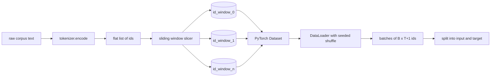
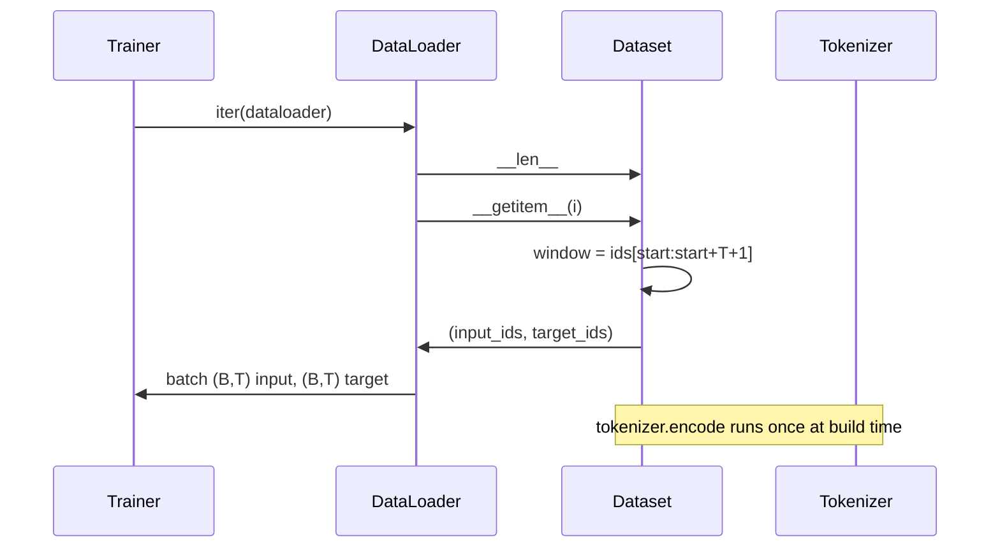

# Un ensemble de données sélectionné avec une fenêtre coulissante

> Une course de pré-entraînement est une fonction des identifiants de jeton aux gradients.

**Type:** Build
**Languages:** Python
**Prerequisites:** Phase 04 lessons, Phase 07 transformer lessons, Lesson 30 of this phase
**Time:** ~90 minutes

## Objectifs d'apprentissage
- Convertir un corpus brut en un flux d'identifiants de jetons en appelant le tokeniseur une fois.
- Couper le flux d'identification en fenêtres de longueur fixe avec une étape de chevauchement configurable.
- Construisez un ensemble de données PyTorch qui renvoie les tensors d'entrée et de cible pour la prédiction du prochain jeton.
- Enveloppez l'ensemble de données dans un DataLoader avec un mélange déterministe semé par époque.
- Résumé de la différence entre la progression, la redondance et la taille effective des ensembles de données.

```figure
cap-sliding-window
```

## Le cadre

Une course de pré-entraînement lit un lot d'identifiants de jetons à la fois et met à jour le modèle.`(B, T)`les identifiants d'entrée et `(B, T)`Les données sont des données qui sont utilisées pour la production de données, et qui sont utilisées pour la production de données, et qui sont utilisées pour la production de données.

Cette leçon construit le pipeline. Le tokenizer de la leçon précédente transforme le texte en une longue liste plate d'id. Une fenêtre coulissante tranche cette liste en exemples d'entraînement. Un ensemble de données personnalisé expose les exemples en tant que tensors. Un DataLoader les batte et les mélange avec une graine connue.

## Le contrat de forme

Une LM causale consomme des id de forme `(B, T)`où `B`est la taille du lot et `T`La longueur du contexte.`t`est l'entrée à la position `t+1`- Cela signifie que chaque exemple de formation couvre`T+1`Les étapes de la fenêtre contrôlent la quantité de chevauchement entre les exemples consécutifs.



Le trancheur ne se chevauchera jamais avec la limite du corpus. si la dernière fenêtre n'a pas assez d'identifiants pour remplir`T+1`La coupeuse la laisse tomber.`<|pad|>`C'est aussi un choix valable mais il complique le masque de perte.

## Pourquoi une fenêtre coulissante

Un corpus de pré-entraînement est un long flux d'identifiants. Si le modèle ne voyait que des fenêtres non superposées, chaque exemple de formation l'enseignerait de la même façon.`T`L'ajustement de la marche déplace ces limites autour de sorte que le modèle voit des tâches plus diverses de prédiction-prochain jeton.

Un pas en avant .`T`Les fenêtres ne se chevauchent pas.`T // 2`Les données de base sont ainsi supprimées en fonction de la quantité de données utilisées.`1`produit une superposition maximale et augmente le ensemble de données d'un facteur de `T`Le coût est plus calculé par époque. L'avantage est plus de diversité de limites. La plupart des courses de pré-entraînement utilisent une étape égale à la longueur du contexte car le corpus est déjà beaucoup plus grand que le modèle ne peut terminer en une seule époque, de sorte que l'argument de diversité de limites est plus faible.

## La classe de l' ensemble de données

Un ensemble de données PyTorch comporte deux méthodes requises. `__len__`renvoie le nombre d'exemples. `__getitem__`Notre ensemble de données stocke le flux d'id codé et la marche. L'indexation en lui compute le début de la fenêtre en mouvement de sorte que le coût de la mémoire est une copie du flux d'id indépendamment du nombre d'exemples que la marche produit.



Le changement à l' intérieur se produit .`__getitem__`- Le jeu de données renvoie`(input, target)`où `input = window[:-1]`et `target = window[1:]`Les deux sont des longs tensors PyTorch, et la boucle d'entraînement les traite comme la vérité au sol.

## Le mélange déterministe

Un DataLoader avec `shuffle=True`Il est utilisé pour lire un générateur aléatoire PyTorch.`torch.Generator`Si vous avez une différence de deux courbes, vous pouvez voir les données dans différents ordres et les courbes de perte divergent pour des raisons qui ne sont pas liées au changement.

Le contrat de semence dans cette leçon est simple.`epoch_seed = base_seed + epoch_index`- la semence de base est transmise à la construction. l'indice d'époque est augmenté par l'entraîneur au sommet de chaque époque. une répétition avec la même semence de base voit toujours le même ordre dans chaque époque.

## Pratiquateur de lot

Le prélèvement par défaut de PyTorch choisit des indices uniformément au hasard avec le remplacement désactivé. C'est ce que nous voulons pour la pré-entraînement. Pour le finetuning sur un petit ensemble de données le contrat est le même. Le DataLoader assemble un lot en appelant `__getitem__` `B`Parce que chaque exemple est de la même longueur par construction, aucune logique de rembourrage n'est nécessaire.

La leçon est toujours là .`num_workers=0`Dans une production, les travailleurs parallèlement les`__getitem__`Avec notre pipeline qui est principalement un no-op parce que le travail est juste une tranche d'un tensor en mémoire, mais la même API de Dataset prend en charge les travailleurs propre.

## Exemples de comptage

Pour un flux d' id de longueur `N`, une longueur de contexte `T`, et une étape `S`, le nombre d'exemples est `max(0, 1 + (N - (T + 1)) // S)`. La leçon expose ce calcul comme une méthode statique sur le Dataset afin que le formateur puisse calculer les étapes totales par époque sans itération.

## Ce que cette leçon ne fait pas

Le flux de disque est un problème séparé qui se connecte en remplaçant le stockage mais conserve le contrat du Dataset.

Il ne traite pas de documents multiples. Le corpus est traité comme un flux d'identification continu.`<|endoftext|>`Le modèle apprend à prédire autour de la limite.

## Comment lire le code

`main.py`Il y a deux classes et un assistant.`SlidingWindowDataset`est le PyTorch Dataset. `make_dataloader`renvoie un DataLoader configuré avec un générateur semé. `_encode_corpus_to_ids`La démo en bas construit un petit tokenizer en cours de processus, encode un corpus intégré, construit le jeu de données et le chargement de données, imprime un lot et affirme le contrat de forme.`code/tests/test_dataset.py`Fixez la formule du nombre de fenêtres, la propriété de décalage par un, le mélange déterministe et le décalage des pas.

Exécutez la démo, puis changez la longueur du contexte de 16 à 32 et regardez comment le nombre d'exemples par époque diminue. Ce nombre est votre budget étape par époque.
