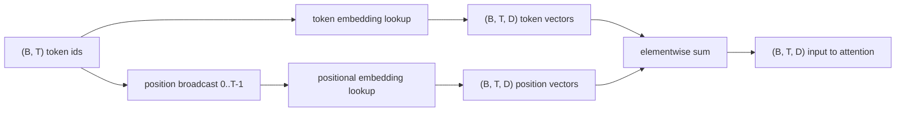
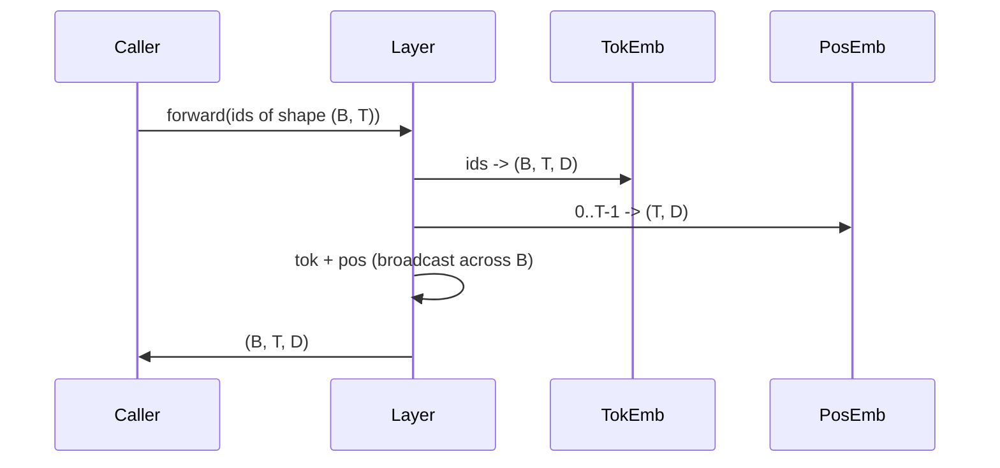

# Les embellissements des jetons et des positions

> Les ids sont des nombres entiers. Le modèle veut des vecteurs. Deux tables de recherche sont placées entre elles, et le choix de la positionne forme ce que le modèle peut apprendre.

**Type:** Build
**Languages:** Python
**Prerequisites:** Phase 04 lessons, Phase 07 transformer lessons, Lessons 30 and 31 of this phase
**Time:** ~90 minutes

## Objectifs d'apprentissage
- Construisez une table de recherche intégrée à des symboles qui cartographiera les identifiants du vocabulaire en vecteurs denses.
- Construisez une table de recherche d'intégration de position apprise indexée par position.
- Construire une intégration positionnelle sinusoïdale fixe indexée par position sans paramètres.
- Composer des embeddings de jetons et de positions dans une seule entrée pour un bloc transformateur.
- Contraste apprises et incrustations sinusoïdes sur la généralisation de la longueur et le nombre de paramètres.

```figure
cc-embedding-lookup
```

## Le cadre

Le premier contact du modèle avec un id de jeton est une recherche de rangées dans la matrice d'embedding de jeton. La matrice a une ligne par id vocabulaire et une colonne par dimension de modèle. La recherche renvoie un vecteur que le reste du modèle traite comme le sens de l'id. Backprop met à jour les rangées qui ont été utilisées dans le pass avant.

Les jetons d'identification seuls n'ont pas d'ordre. Le modèle a besoin d'un deuxième signal qui lui indique que la position 1 est différente de la position 17. Les deux options dominantes pour ce signal sont une intégration positionnelle apprise (une deuxième table de recherche, une rangée par position) et une intégration positionnelle sinusoïdale fixe (une formule mathématique sans paramètres). Le choix a des conséquences. Une table apprise est un paramètre et est délimitée par la longueur maximale du contexte sur laquelle le modèle a été formé. Une table sinusoïdale est sans paramètres en théorie et la formule s'étend à n'importe quelle position, mais cette leçon est `SinusoidalPositionalEmbedding`précompute une table fixe à `max_context_length`et son `forward`Les modules de formation peuvent être utilisés pour les modèles de formation, mais ils peuvent être utilisés pour les modèles de formation, même si la table est suffisamment grande pour être indexée.

Cette leçon construit les deux et les compose avec le jeton intégré dans une seule entrée pour le bloc d'attention de la leçon suivante.

## Le contrat de forme

L'entrée de la phase d'intégration est un lot d' identifiants symboliques de forme `(B, T)`La sortie est un tensor de forme`(B, T, D)`où `D`est la dimension du modèle. chaque élément de lot a la même longueur de contexte `T`Chaque position a la même dimension vectorielle`D`- Je suis désolé .



La composition est une somme, pas une concatenation.`D`La valeur de la valeur de la valeur de la valeur de la valeur de la valeur de la valeur de la valeur de la valeur de la valeur de la valeur de la valeur de la valeur de la valeur de la valeur de la valeur de la valeur de la valeur de la valeur de la valeur de la valeur de la valeur de la valeur de la valeur de la valeur de la valeur de la valeur de la valeur de la valeur de la valeur de la valeur de la valeur de la valeur de la valeur de la valeur de la valeur de la valeur de la valeur de la valeur de la valeur de la valeur de la valeur de la valeur de la valeur de la valeur de la valeur de la valeur de la valeur de la valeur de la valeur de la valeur de la valeur de la valeur de la valeur de la valeur de la valeur de la valeur de la valeur de la valeur de la valeur de la valeur de la valeur de la valeur de la valeur de la valeur de la valeur de la valeur de la valeur de la valeur de la valeur de la valeur de la valeur de la valeur de la valeur de la valeur de la valeur de la valeur de la valeur de la valeur de la valeur de la valeur de la valeur de la valeur de la valeur de la valeur de la valeur de la valeur de la valeur de la valeur de la valeur de la valeur de la valeur de la valeur de la valeur de la valeur de la valeur de la valeur de la valeur de la valeur de la valeur de la valeur de la valeur de la valeur de la valeur de la valeur de la valeur de la valeur de la valeur de la valeur de la valeur de la valeur de la valeur de la valeur de la valeur de la valeur de la valeur de la valeur de la valeur de la valeur de la valeur de la valeur de la valeur de la valeur de la valeur de la valeur de la valeur de la valeur de la valeur de la valeur de la valeur de la valeur de la valeur de la valeur de la valeur de la valeur de la valeur de la valeur de la valeur de la valeur de la valeur de la valeur de la valeur de la valeur de la valeur de la valeur de la valeur de la valeur de la valeur de la valeur de la valeur de la valeur de la valeur de la valeur de la valeur de la valeur de la valeur de la valeur de la valeur de la valeur de la valeur de la valeur de la valeur de la valeur de la valeur de la valeur de la valeur de la valeur de la valeur de la valeur de la valeur de

## La matrice d'intégration de jetons

L' intégration de jeton est un tensor de forme paramétrique `(V, D)`où `V`PyTorch l'expose comme étant`nn.Embedding(V, D)`. À l'initi, les entrées sont tirées d'un petit gaussien, traditionnellement avec une moyenne de zéro et une déviation standard autour `0.02`L'initial exact est moins important que de rester cohérent sur les circuits.

Le passage vers l'avant est une opération d'indexation unique.`(B, T)`int64 à `(B, T, D)`Les deux rangées qui n'ont jamais été affichées dans le lot reçoivent un gradient zéro sur cette étape.

Une mise en œuvre subtile. L'intégration des jetons et la projection de sortie à la fin du modèle partagent souvent des poids (liage de poids). Lorsque cela se produit, chaque passage arrière touche chaque rangée de l'intégration à travers le côté de sortie.

## L'intégration positionnelle apprise

L' intégration positionnelle apprise est une seconde `nn.Embedding`de forme `(max_context_length, D)`La recherche est effectuée par position ID`0, 1, 2, ..., T-1`Le passage avant transmet ce vecteur de position à travers la dimension de lot.

L' inconvénient de la table apprise est qu' elle ne peut pas être interrogée en position.`T`si le modèle n'a été formé qu'à la position `T-1`. La ligne n'existe pas. Les modèles de production qui utilisent ce schéma ne font que cuire la longueur maximale du contexte dans l'architecture et refusent de traiter les entrées plus longues.

## L'intégration positionnelle sinusoïdale

L'intégration positionnelle sinusoïdale est une fonction de position à vecteur.`p`et caractéristique `i`produits

```python
angle = p / (10000 ** (2 * (i // 2) / D))
emb[p, 2k]     = sin(angle)
emb[p, 2k + 1] = cos(angle)
```

La fonction n'a pas de paramètres. Chaque position a un vecteur unique. La longueur d'onde varie géométriquement entre les dimensions de la fonction, de sorte que les dimensions inférieures codent la position grossière et les dimensions supérieures codent la position fine.

La propriété qui résulte du choix de `sin`et `cos`ensemble est que le vecteur à position `p + k`est une fonction linéaire du vecteur à position `p`Le modèle n'a pas besoin d'un paramètre séparé pour exprimer "regarder cinq jetons".

La leçon calcule la table sinusoïdale complète une fois construite et l'indique à l'avance.

## La composition

Le pipeline d'entrée fait trois choses en ordre. Lisez les identifiants des jetons. Cherchez les vecteurs des jetons. Ajoutez les vecteurs de position. Retournez la somme.



La radiodiffusion dans l'étape de somme réplique la `(T, D)`PyTorch traite automatiquement parce que le tensor de position a une forme`(1, T, D)`après la décompression.

## Analyse de contraste

La leçon présente les deux variantes sur les mêmes entrées et imprime deux diagnostics.

Le premier est le nombre de paramètres.`max_context_length * D`La variante sinusoïdale ajoute zéro.

La deuxième est la similitude cosine entre les embrasures à des positions voisines. La variante sinusoïdale a une décomposition lisse et prévisible parce que la fonction est continue. La variante apprise à l'initialisation a une similitude quasi aléatoire car les lignes sont dessinées de manière indépendante. Après la formation, la variante apprise développe généralement une structure lisse similaire, mais elle doit découvrir cette structure à partir des données.

## Ce que cette leçon ne fait pas

Il ne construit pas de codage positionnel rotatif (RoPE) ou AliBi. Ce sont les choix modernes dans les transformateurs de production. Ils suivent tous les deux le même contrat de forme que les emblèmes ici (appliquer une transformation dépendante de la position aux vecteurs de forme `(B, T, D)`La leçon suivante construit le bloc d'attention, et l'une des extensions facultatives est de plier rotatif dans les projections de clé de requête là-bas.

Il ne forme pas l'intégration. L'entraînement nécessite une perte, ce qui nécessite une sortie de modèle, ce qui nécessite une attention et une tête LM. C'est la leçon suivante et la suivante.

## Comment lire le code

`main.py`définit trois modules. `TokenEmbedding`Enveloppes`nn.Embedding(V, D)`- Je suis là .`LearnedPositionalEmbedding`Enveloppes`nn.Embedding(L, D)`- Je suis là .`SinusoidalPositionalEmbedding`Il précompute la table et la présente comme un tampon. `EmbeddingComposer`Les tests effectués en bas de page impriment les formes, les paramètres comptés et le diagnostic de similitude de position voisine.`code/tests/test_embeddings.py`forme de la broche, comportement de diffusion, nombre de paramètres et formule sinusoïdale.

Exécutez la démo, puis changez la dimension du modèle.`D`de 64 à 32 et observez comment les bandes de longueur d'onde sinusoïdale changent.
