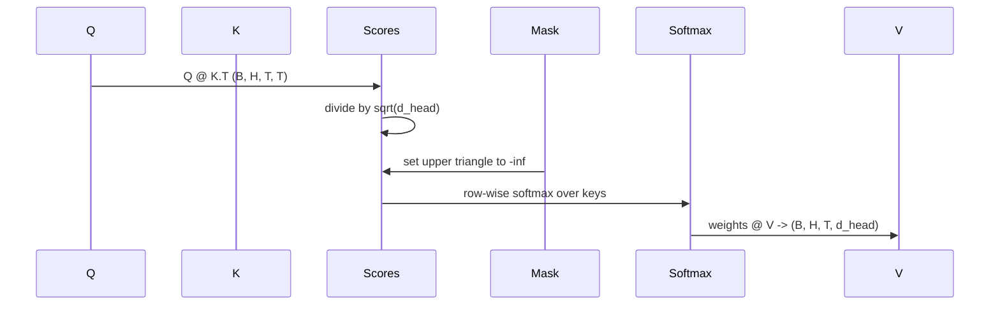

# Une attention personnelle à plusieurs têtes

> Une projection linéaire, trois vues, des têtes parallèles H, un masque.

**Type:** Build
**Languages:** Python
**Prerequisites:** Phase 04 lessons, Phase 07 transformer lessons, Lessons 30 through 32 of this phase
**Time:** ~90 minutes

## Objectifs d'apprentissage
- Implémenter une projection par lots de requête/clavier/valeur en tant que couche linéaire unique divisée en têtes H.
- Compute l'attention du produit à l'échelle de points avec la normalisation correcte et la manipulation dtype.
- Appliquez un masque causal qui empêche une position de se concentrer sur des positions futures.
- Inspectons les poids d'attention par tête pour une entrée fixe et raisonner sur ce que chaque tête regarde.
- Prenez un petit bloc d'attention sur une tâche de jouet et regardez la perte tomber à mesure que les têtes se spécialisent.

```figure
cap-multihead-attention
```

## Le cadre

L'attention est la fonction qui permet à la représentation d'un jeton de tirer des informations d'autres jetons dans la même séquence. L'attention personnelle signifie que les requêtes, les clés et les valeurs sont toutes dérivées de la même entrée.

Le modèle de mise en œuvre efficace est une couche linéaire qui projette à partir de `D`à `3 * D`et est coupé en trois points de vue, puis remodelé en têtes de taille H.`D // H`La somme matmul, la somme douce et la somme pondérée se produisent en tant qu'opérations tensorielles par lots, de sorte que les têtes fonctionnent en parallèle sur l'accélérateur.

Cette leçon construit ce bloc. Il ajoute également le masque causale de sorte que le même code fonctionne comme la couche d'attention dans un modèle de langage décodeur seulement. La leçon suivante empilera le bloc en un transformateur complet et la leçon après l'entraîne.

## Le contrat de forme

L' entrée est `(B, T, D)`La sortie est `(B, T, D)`Le masque est`(T, T)`Dans le bloc, les tensors intermédiaires ont une forme.`(B, H, T, d_head)`où `d_head = D // H`La contrainte est`D % H == 0`- Je suis désolé .

```mermaid
flowchart LR
    A["(B, T, D) input"] --> B[Linear D -> 3D]
    B --> C["split into Q, K, V"]
    C --> D["reshape to (B, H, T, d_head)"]
    D --> E["scores = Q @ K.T / sqrt(d_head)"]
    E --> F[apply causal mask]
    F --> G[softmax over keys]
    G --> H["context = weights @ V"]
    H --> I["reshape to (B, T, D)"]
    I --> J[output Linear D -> D]
    J --> K["(B, T, D) output"]
```



Les deux couches linéaires (la projection QKV et la projection de sortie) sont les seuls paramètres du bloc.

## Le QKV est divisé

La mise en œuvre naïve a trois couches linéaires distinctes, une pour Q, K et V. La plus efficace a une seule couche qui produit `3 * D`Les deux sont mathématiquement équivalents car trois multiplications de matrice séparées par`(D, D)`Les poids sont exactement une matrice multipliée par un `(3D, D)`le poids accumulé d'eux.

La version efficace est plus rapide car l'accélérateur lance un matmul au lieu de trois.

## La tête est remodelée

Après la fraction, chacun de Q, K, V est `(B, T, D)`Pour transformer cela en H parallèle problèmes d'attention, nous remodelons à`(B, T, H, d_head)`et transposer à `(B, H, T, d_head)`La dimension de la tête est maintenant à côté de la dimension du lot , donc PyTorch traite l' attention par tête comme une opération par lots .`B * H`des instances indépendantes.

La dimension d_head reste la dernière donc le score est matmul `Q @ K.transpose(-2, -1)`Le résultat est que`(B, H, T, T)`les scores d'attention par tête.

## Écalement

Les scores sont divisés par `sqrt(d_head)`Sans cette mise à l'échelle, les produits dotés se développent comme`d_head`Les degrés de la masse de l'entrée sont minuscules et les étagères d'apprentissage sont réduites par le nombre de points de l'entrée.`sqrt(d_head)`La différence de scores est constante entre les têtes.

## Le masque de causalité

Un modèle de langage décodage uniquement peut conditionner le passé uniquement lorsque vous prédisez le prochain jeton.`(T, T)`La matrice de pointage est remplacée par l'infini négatif.



Nous enregistrons le masque comme un tampon à la construction afin qu'il vit sur le même appareil que le modèle et ne fait pas partie du graphique de gradient. Le masque couvre la longueur maximale du contexte que le bloc verra jamais.`(T, T)`Dans le coin.

## La projection de sortie

Après les vecteurs de contexte par tête `(B, H, T, d_head)`, nous le transposons à `(B, T, H, d_head)`, en refaisant`(B, T, D)`, et appliquer une finale `(D, D)`La projection de sortie permet au modèle de mélanger les têtes. sans elle, les têtes H ne se recombineront jamais que par des couches ultérieures et le bloc sera artificiellement contraint.

## Inspection du poids de l'attention

La leçon révèle une `return_weights=True`Le bloc retourne les poids d'attention par tête de forme.`(B, H, T, T)`La démo imprime une carte thermique des poids d'une tête sur une entrée courte afin que vous puissiez voir la structure du triangle causale et le focus par position.

Dans un modèle formé, différentes têtes apprennent des schémas différents. Certaines têtes suivent le jeton immédiatement précédent. Certaines têtes suivent le début de la séquence. Certaines têtes diffusent l'attention presque uniformément. Le crochet d'inspection est le point d'entrée pour ce travail d'interprétation.

## La démonstration de l'entraînement

La démo en bas de `main.py`Le modèle doit donc apprendre que le jeton suivant est le même que le jeton précédent. La perte est de l'entropie croisée. Avec H=4, D=32, T=12, et un vocabulaire de 64, la perte tombe du jeton aléatoire (environ`log(64) ~ 4.16`) vers le bas à bien en dessous `1.0`sur trois époques sur la CPU.

L'objectif de la démonstration n'est pas de former un modèle utile, mais de confirmer le flux des gradients à travers chaque morceau du bloc et de faire en sorte que les têtes apprennent quelque chose sur un problème où la réponse est évidente.

## Ce que cette leçon ne fait pas

Il n'ajoute pas de bloc de transfert. La couche transformateur dans un modèle réel est l'attention suivie d'une MLP à deux couches avec une connexion résiduelle et une norme de couche autour de chacune.

Il n'implique pas de codage rotatif ou positionnel AliBi. Les deux s'appliquent à l'étape de projection QKV dans le même bloc, mais ils sont une unité d'enseignement séparée.

Il ne met pas en œuvre le cache KV pour l'inférence. Le caching des clés et des valeurs sur les passages avant est l'optimisation qui rend le décoding autorégressif rapide. Il modifie le contrat de forme sur les tensors K et V mais pas sur Q. Il appartient à la leçon d'inférence.

## Comment lire le code

`main.py`définit `MultiHeadSelfAttention`- Je suis désolé . La classe contient deux couches linéaires et un tampon de masque enregistré. Les projets de passages, les remodels, les scores, les masques, les softmaxes, les poids, les remodels et les projets à nouveau. La démo en bas construit un petit modèle qui enveloppe l'attention avec des embellissements de jetons et de positions et une tête LM, l'entraîne sur une tâche de copie pendant trois époques, et imprime la courbe de perte et une carte thermique d'attention par tête. Les tests en `code/tests/test_attention.py`le contrat de forme, la propriété de causalité, la propriété de softmax, la propriété de tête-split et le débit de gradient.

Exécutez la démo, puis augmentez.`n_heads`de 4 à 8 (maintenance `d_model=32`Je suis un homme .`d_head=4`) et voir le changement de la carte thermique.
