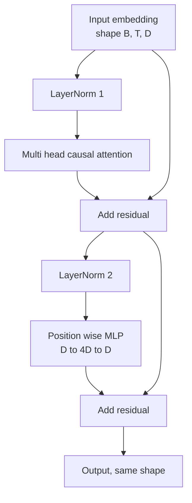
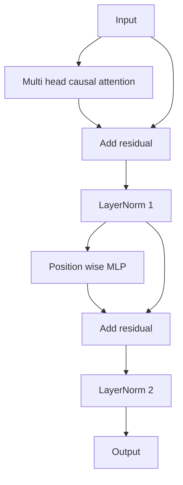

# Bloc de transformateur à partir de zéro

> Un bloc est l'unité de chaque décodeur moderne LLM. Normalité de couche, attention multi-tête, résiduelle, MLP, résiduelle. La variante pré-LN se traîne de manière stable sans chauffage. La variante post-LN est ce que le papier original a expédié. Cette leçon construit les deux, côte à côte, et montre lequel survit à une pile de 12 couches à des taux d'apprentissage communs.

**Type:** Build
**Languages:** Python
**Prerequisites:** Phase 19 lessons 30 to 33 (tokenizer, embeddings, attention math, batched data loader)
**Time:** ~90 minutes

## Objectifs d'apprentissage

- Construisez un bloc transformateur en PyTorch à partir des quatre pièces en mouvement: LayerNorm, attention causale multi-tête, connexions résiduelles, MLP positionnée.
- Placez les normes de couche en deux configurations (pré-LN et post-LN) et expliquez pourquoi on traîne de manière stable sans chauffage.
- Mettre en œuvre le masquage causal à l'intérieur de l' attention multi-tête afin de symboliser`i`Je ne vois pas les jetons .`j > i`- Je suis désolé .
- Suivez le flux de gradient à travers les deux variantes sur une pile de 12 couches et lisez le résultat sans faire la main.
- Utilisez le bloc comme unité de dépôt lorsque la leçon suivante assemble un GPT de 124 millions de paramètres.

## Le problème

Un transformateur est un bloc répété. Faites une erreur sur le bloc une fois, répétez-le douze fois, et vous expédez un modèle qui diverge dans la première époque ou qui a besoin de hacks de réchauffement le reste du chemin. Les deux modes d'échec que vous verrez dans cette leçon ne sont pas exotiques. Ils apparaissent la première fois qu'un apprenant accumule des blocs naïvement. L'une est la couche d'attention qui se tourne vers l'avenir. L'autre est la LayerNorm placée où elle ne peut pas dompter le signal résiduel à la profondeur.

Le bloc a exactement deux chemins résiduels et exactement deux positions de normalisation. Choisissez les positions correctement et le reste de la pile est juste de la comptabilité.

## Le concept

Chaque bloc de décodeur transformateur est une fonction qui prend un tensor de forme `(batch, sequence, embedding)`Il y a deux sous-couches à l'intérieur.



C'est la variante pré-LN. La LayerNorm se trouve à l'intérieur de la branche résiduelle, avant la sous-couche. La connexion résiduelle transporte le signal non normalisé vers l'avant.

La variante post-LN déplace la LayerNorm à la suite de l'ajout résiduel.



La forme est identique. Le comportement d'entraînement n'est pas. Avec post-LN, le gradient qui coule à travers le chemin résiduel doit passer par la LayerNorm.`3e-4`Le pré-LN laisse le chemin résiduel non normalisé, de sorte que les gradients se propagent nettement vers la couche d'embedding.

### Attention de plusieurs têtes

La sous-couche d'attention projette l'entrée de trois façons en tensors de requête, clé et valeur.`(B, T, D)`à `(B, H, T, D/H)`où `H`est le nombre de têtes.`softmax(Q K^T / sqrt(d_k))`par tête, masque le triangle supérieur à l'infini négatif, applique le masque via softmax, puis multiplie par `V`Les têtes sont reliées en une seule .`(B, T, D)`Le masque est la seule pièce qui fait du modèle une cause.

### Le MLP

Le MLP de position utilise le même réseau de deux couches à chaque jeton indépendamment. La largeur cachée est quatre fois plus large que la largeur de l'embedding, l'activation est GELU, et un dérapagement suit la deuxième linéaire. Aucun jeton ne parle entre lui à l'intérieur du MLP. Toutes les combinaisons de jetons se produisent en attention.

### Les connexions résiduelles font deux choses.

Ils permettent également à chaque bloc d'apprendre une mise à jour additive de la représentation en cours plutôt qu'un remplacement complet.

```figure
cc-transformer-block
```

## Faites-le

`code/main.py`les implémentations:

- `class LayerNorm`avec des échelles et des mouvements apprenables, des eps biaisés, appliqués par vecteur de jeton.
- `class MultiHeadAttention`avec `num_heads`- Je suis là .`head_dim = d_model // num_heads`, projection de QKV fusionnée, masque causal enregistrée, attention et abandon résiduel.
- `class FeedForward`avec deux couches linéaires, activation GELU, dérapagement.
- `class TransformerBlock`avec un `pre_ln`le drapeau qui change entre les deux variantes.
- Une démonstration qui construit une pile pré-LN de 6 couches et une pile post-LN de 6 couches avec des entrées et des impressions identiques (a) forme de sortie, (b) norme de gradient à l'embedding après un passage arrière.

- Je vais le faire.

```bash
python3 code/main.py
```

Résultats: vérification de la forme sur les deux piles, normes de gradients côte à côte. Le gradient d'intégration de la pile pré-LN est d'un ordre de grandeur supérieur à la pile post-LN au même rythme d'apprentissage, ce qui est le signal empirique des trains pré-LN sans chauffage.

## La pile

- `torch`pour les mathématiques tensorielles, autograd, et `nn.Module`- Le plomberie.
- - Je ne veux pas .`transformers`Le bloc est mis en œuvre à partir de primitifs.

## Modèles de production dans la nature

Trois modèles transforment le bloc de livre en quelque chose que vous pouvez expédier.

**Fused QKV projection.**Trois couches linéaires séparées coûtent trois lancements de noyau et trois matmuls.`3 * d_model`Le chemin fusionné est plus rapide sur chaque accélérateur et correspond à ce que les implémentations de référence de GPT-2, LLaMA et Mistral sont tous des navires.

**Registered causal mask buffer.**Le masque ne dépend que de la longueur maximale du contexte.`register_buffer`En oubliant cela, le masque devient un point chaud d'allocation dans un long contexte.

**Dropout in two places, not three.**Le dérapagement appartient à la suite du softmax de l'attention (dérapagement de l'attention) et après le second linéaire du MLP (dérapagement résiduel).

## Utilisez-le

- Le bloc de cette leçon se branche directement sur l'assemblage GPT de la leçon 35 sans modification.
- La variante pré-LN est celle que chaque LLM moderne utilise. La variante post-LN est celle utilisée par le papier d'attention original de 2017.
- Si vous changez le GELU en SiLU, vous avez l'activation de la famille LLaMA, la LayerNorm en RMSNorm, vous avez la normalisation de la famille LLaMA, le même squelette.

## Exercices

1. Ajouter un `bias=False`Les poids ouverts modernes LLM sont des systèmes sans biais sur les couches linéaires. Mesurer combien de paramètres vous économisez dans un modèle de 12 couches 768 dim.
2. Remplacez`nn.LayerNorm`avec un RMSNorm roulé à la main et vérifier que la forme de sortie est inchangée.
3. Ajoutez un drapeau qui renvoie les poids d' attention pour la première tête comme un `(B, T, T)`Tenteur. tracez le triangle supérieur pour confirmer qu'il est zéro après softmax.
4. Faites une vérification de santé mentale qui alimente un`(2, 16, 384)`le tensor avec `H=6`Les résultats de l'analyse de l'évolution des évolutions sont différents (par exemple,`not torch.allclose`) lorsque les poids sont initialement identiques et que le dérapagement est réglé sur zéro.

## Les termes clés

| Term | What people say | What it actually means |
|------|-----------------|------------------------|
| Pre-LN | "Pre norm" | LayerNorm inside the residual branch, before each sublayer; the residual carries the unnormalized signal |
| Post-LN | "Post norm" | LayerNorm after the residual add; what the 2017 paper shipped and what needs warmup |
| Causal mask | "Triangle mask" | The upper triangle of the attention logits set to negative infinity so token i cannot read token j when j is greater than i |
| Fused QKV | "Combined projection" | One linear of width 3D instead of three linears of width D; one kernel, one matmul |
| Residual stream | "Skip connection" | The unnormalized tensor that flows top to bottom through every block; what each block adds to |

## Pour en savoir plus

- Le cours de phase 7 02 (auto-attention à partir de zéro) pour les mathématiques d'attention sous ce bloc.
- Leur capacité de détection est de 0,7 à 0,7 à 0,7 à 0,7 à 0,7 à 0,7 à 0,7 à 0,7 à 0,7 à 0,7 à 0,7 à 0,7 à 0,7 à 0,7 à 0,7 à 0,7 à 0,7 à 0,7 à 0,7 à 0,7 à 0,7 à 0,7 à 0,7 à 0,7 à 0,7 à 0,7 à 0,7 à 0,7 à 0,7 à 0,7 à 0,7 à 0,7 à 0,7 à 0,7 à 0,7 à 0,7 à 0,7 à 0,7 à 0,7 à 0,7 à 0,7 à 0,7 à 0,7 à 0,7 à 0,7 à 0,6 à 0,6 à 0,6 à 0,6 à 0,6 à 0,6 à 0,6 à 0,6 à 0,6 à 0,6 à 0,6 à 0,6 à 0,6 à 0,6 à 0,6 à 0,6 à 0,6 à 0,6 à 0,6 à 0,6 à 0,6 à 0,6 à 0,6 à 0,6 à 0,6 à 0,6 à 0,6 à 0,6 à 0,6 à 0,6 à 0,6 à 0,6 à 0,6 à 0,6 à 0,6 à 0,6 à 0,6 à 0,6 à 0,6 à 0,6 à 0,6 à 0,6 à 0,6 à 0,6 à 0,6 à 0,6 à 0,6 à 0,6 à 0,6 à 0,6 à 0,6 à 0,6 à 0,6 à 0,6 à 0,6 à 0,6 à 0,6 à 0,6 à 0,6 à 0,6 à 0,6 à 0,6 à 0,6 en moyenne.
- L'équipe de formation de la phase 10 (leçon 04 (mini-GPT pré-entraînement) pour la procédure de formation à laquelle ce bloc s'intègre.
- La phase 19 leçon 35 (cette piste) qui empile douze de ces blocs dans un modèle GPT.
