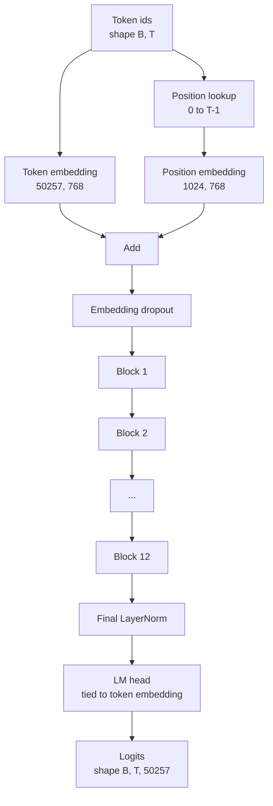
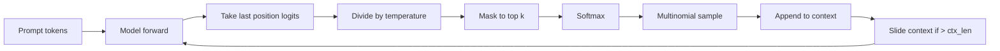

# Assemblage de modèle GPT

> Douze blocs empilés, un emblème de jeton, un emblème de position apprise, une dernière LayerNorm et une tête de modèle de langage liée. C'est le modèle GPT de 124 millions de paramètres. Cette leçon rassemble ces pièces dans une classe ouvrière, compte les paramètres pour confirmer que le modèle correspond à la forme 124M de référence et génère du texte avec échantillonnage multivariale, température et top-k.

**Type:** Build
**Languages:** Python
**Prerequisites:** Phase 19 lessons 30 to 34
**Time:** ~90 minutes

## Objectifs d'apprentissage

- Assembler le bloc transformateur de la leçon 34 dans un modèle GPT complet: intégration de jetons, intégration de position, blocs N, LayerNorm final, tête de modèle de langage.
- Reproduire la configuration de paramètres de 124 millions: vocab 50257, contexte 1024, intégrant 768, douze têtes, douze couches.
- Lier les poids de tête du modèle de langage à l'intégration de jeton et expliquer pourquoi cela permet d'économiser ~ 38 millions de paramètres à cette échelle.
- Générer du texte à partir d'un prompt avec le prélèvement multivarié, l'échelle de température et la troncalisation top-k, en tenant la longueur du contexte avec une fenêtre coulissante.
- Mesurer le nombre de paramètres et le coût de passage à l'avance par rapport à l'objectif de 124 M.

## Le problème

Un bloc transformateur ne fait rien par lui-même. Vous devez transformer les identifiants de jeton en vecteurs, mélanger les informations positionnelles, les exécuter à travers la pile et les projeter vers les logites de vocabulaire. Oubliez l'une de ces quatre étapes et le modèle ne parvient pas à rediriger, dérive dans les informations de position, ou ne peut pas parler.

La forme du modèle compte aussi. Le petit GPT-2 de référence est de 124 millions de paramètres à la configuration ci-dessus. Les chiffres ne sont pas magiques. Le vocabulaire 50257 fois intégrant 768 est la table des symboles. La position 1024 par 768 est la table des positions. Douze blocs à environ 7 millions de paramètres sont chacun de 84 millions. La tête finale réutilise la table symbolique par liaison de poids. Sumer les morceaux et vous atterrissez à 124 millions. Construire un modèle dont le nombre de paramètres ne correspond pas à la référence est un signe que vous avez câblé quelque chose de mal.

## Le concept



Les identifiants de jetons deviennent des vecteurs de jetons. Les identifiants de position deviennent des vecteurs de position. Les deux sont ajoutés et envoyés à travers la pile. La dernière LayerNorm est la pièce en dehors des blocs qui survit à chaque variante moderne. La tête LM réutilise la matrice d'embedding de jetons, ce qui signifie la liaison de poids.

### Le poids de la liaison

L' intégration du symbole a une forme .`(vocab, d_model)`. Le modèle de langue doit être projeté à partir de `d_model`Retour à `vocab`. Ce sont des transposés de l'autre. Lier les deux signifie littéralement le même tensor de paramètre, utilisé deux fois. Au vocabulaire 50257 et d_modèle 768, la matrice est de 38 millions de paramètres. Délivré, vous payez deux fois. Lié, vous payez une fois et vous obtenez également un signal de gradient légèrement plus propre parce que l'intégration et la mise à jour de tête ensemble.

### L'intégration de position est apprise, pas sinusoïdale

Le tableau de position est un paramètre de forme tensor`(1024, 768)`Le modèle recherche la position 0 à T-1 à chaque avance et ajoute la recherche à l'embedding du jeton.

### Génération: température, haut-k, multinomiale

La génération est autorégressive. À chaque étape, le modèle renvoie les logits sur le vocabulaire complet à chaque position. Vous ne prenez que la dernière position, divisez par température, masquez optionnellement tous les logits supérieurs à l'infini négatif, softmax pour obtenir des probabilités, et échantillonnez un jeton de la distribution résultante.



Trois boutons, trois comportements différents. La température proche de zéro s'effondre à la cupidité. La température un correspond à la distribution naturelle du modèle. Top-k est cupidité. Top-k quarante filtre la longue queue. Les combinaisons sont importantes; la prochaine leçon sur l'entraînement utilise la génération comme un signal d'évaluation qualitative.

```figure
cc-gpt-assembly
```

## Faites-le

`code/main.py`les implémentations:

- `class GPTConfig`classe de données avec les défauts 124M: `vocab_size=50257`- Je suis là .`context_length=1024`- Je suis là .`d_model=768`- Je suis là .`num_heads=12`- Je suis là .`num_layers=12`- Je suis là .`mlp_expansion=4`- Je suis là .`dropout=0.1`- Je suis là .`use_bias=True`- Je suis là .`weight_tying=True`- Je suis désolé .
- `class GPTModel`avec embedding symbolique, position embedding, embedding drop-out, douze `TransformerBlock`s, la dernière LayerNorm, et une `lm_head`qui se lie à l'embedding du symbole lorsque le drapeau est placé.
- Une .`count_parameters`l'aide qui renvoie le nombre unique de paramètres (donc le lien de poids est honoré dans le compte).
- Une .`generate`fonction qui fait la température, top-k, multinomiale, et le contexte de fenêtre coulissante.
- Une démo qui construit le modèle, imprime le nombre de paramètres à côté de la référence 124M, et génère une courte séquence à partir d'un prompt fixe pour montrer les extrémités du pipeline.

- Je vais le faire.

```bash
python3 code/main.py
```

Sortie: compte des paramètres aux côtés de la référence 124M, généré des identifiants de jetons à partir d'un prompt aléatoire, et une confirmation que la tête LM et le jeton intégré partagent le stockage lorsque la liaison est activée.

Pour maintenir la démo rapide, le script exécute également une petite configuration (`d_model=64`- Je suis là .`num_layers=2`Le paramètre 124M est construit mais seul le nombre de paramètres et un passage vers l'avant sont exercés.

## La pile

- `torch`pour les mathématiques tensorielles, l'autograd et les plomberie de module.
- `code/main.py`réimplante le même modèle de bloc de la leçon 34 localement.

## Modèles de production dans la nature

Trois modèles font la différence entre un modèle qui marche et un modèle qui envoie.

**Initialize the residual projections small.**La projection de sortie de l'attention et le second linéaire du MLP alimentent tous deux directement un ajout résiduel.`1 / sqrt(2 * num_layers)`Pour ces deux projections, le courant résiduel reste dans une plage raisonnable à travers douze couches.

**Cache the position id tensor, do not recompute.** `torch.arange(T)`répartit une nouvelle mémoire à chaque avance.`__init__`pour le contexte maximum, couper les premières entrées T par appel et sauter le tour d'arrivée de l'allocateur.

**Tie weights at parameter level, not just by copying.**Réglage`lm_head.weight = token_embedding.weight`Le compteur de la carte de l'optimisateur doit mettre à jour un paramètre et le graphique d'autograd doit accumuler une seule fois.

## Utilisez-le

- La classe modèle de cette leçon a la même forme que celle de la leçon suivante.
- Le remplacement de la position apprise par l'intégration de RoPE vous donne la famille LLaMA sans toucher le bloc ou la tête.
- Le remplacement du GELU par le SiLU et du LayerNorm par le RMSNorm vous donne le reste des changements de la famille LLaMA.
- La fonction de génération fonctionne avec n'importe quelle source de logits, pas seulement ce modèle. Vous pouvez extraire des logits d'un fichier GPT-2 prétrainé dans la leçon 37 et réutiliser la même boucle de génération.

## Exercices

1. Détachez la tête de LM de l'intégration du jeton et recontrez les paramètres. Vérifiez que le delta est 50257 fois 768 = 38 millions.
2. Remplacez la position apprise par une table sinusoïdale calculée au moment de la construction.
3. Ajouter un `greedy=True`La génération qui saute l'échantillonnage et choisit argmax.
4. Ajouter un `repetition_penalty`bouton qui divise la logite de tout jeton dans l'historique de prompt ou généré par une constante avant softmax. Afficher sur un prompt fixe que les valeurs supérieures à une réduisent le nombre de répétitions dans la sortie.
5. Ajouter `top_p`(nucle) prélèvement d'échantillons à côté de `top_k`. Vérifiez en deux lignes que la somme des probabilités des jetons détenus dépasse `top_p`- Je suis désolé .

## Les termes clés

| Term | What people say | What it actually means |
|------|-----------------|------------------------|
| Weight tying | "Tied embeddings" | The LM head and the token embedding share the same parameter tensor; saves vocab times d_model parameters and matches the GPT-2 reference |
| Position embedding | "Learned positions" | A separate table of shape (context length, d_model) added to token vectors; learned end to end |
| Sliding window context | "Context cap" | When the prompt plus generated tokens exceed the context length, drop the oldest tokens so the active window fits |
| Top-k sampling | "K truncation" | Keep the K logits with the highest values, mask the rest to negative infinity, softmax over the remainder |
| Temperature | "Sampling temperature" | Divide logits by T before softmax; T less than 1 sharpens, T equal to 1 keeps the natural distribution, T greater than 1 flattens |

## Pour en savoir plus

- La phase 19 leçon 34 pour le bloc que ce modèle empile.
- La phase 19 leçon 36 pour la boucle d'entraînement qui conduit ce modèle avec perte d'entropie croisée.
- La phase 19 de la leçon 37 pour le chargement des poids GPT-2 préentraînés dans cette architecture exacte.
- Le cours de phase 7 07 (modélisation du langage de causalité GPT) pour les mathématiques de la prochaine prédiction de jetons.
- Le programme de formation est basé sur la phase 10 de la leçon 04 (mini-GPT pré-entraînement) pour la procédure de formation initiale sur la même architecture.
