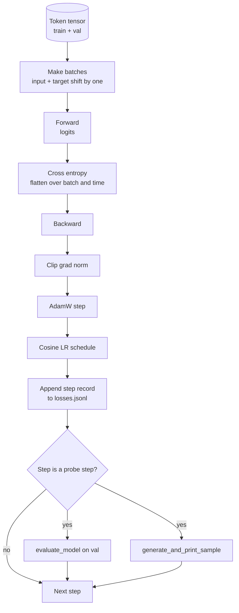

# Circuit de formation et évaluation

> Une boucle qui ne mesure pas est une boucle qui ment. Cette leçon construit la boucle d'entraînement qui conduit le modèle GPT: AdamW avec une fraction de déclin de poids, un réchauffement plus un calendrier de taux d'apprentissage cosine, un`calc_loss_batch`- un assistant, un`evaluate_model`- la transmission des données conservées,`generate_and_print_sample`Une sonde qualitative à chaque étape de K, et un journal JSONL de pertes que vous pouvez tracer après.

**Type:** Build
**Languages:** Python
**Prerequisites:** Phase 19 lessons 30 to 35
**Time:** ~90 minutes

## Objectifs d'apprentissage

- Construisez une boucle d'entraînement qui calcule la perte d'entropie croisée avec l'entrée correcte et l'alignement cible pour la prochaine prédiction de jeton.
- Configurer AdamW avec une décomposition de poids appliquée aux tensors de poids et non à des tensors de LayerNorm ou de biais.
- Mettre en œuvre un calendrier de taux d'apprentissage avec réchauffement linéaire et déclin cossinal, et lire le LR résultant au fil du temps.
- Évaluer sur une fraction prolongée avec `evaluate_model`Donc la perte d'évaluation est comparable entre les courses.
- Générer un échantillon qualitatif à chaque étape K avec `generate_and_print_sample`pour détecter la divergence avant que la courbe de perte ne le fasse.
- Persistez à chaque perte de l'étape à JSONL afin que vous puissiez recharger, tracer et expédier le journal de formation en tant que livrable.

## Le problème

Un script d'entraînement qui imprime la perte mais ne fait rien d'autre échoue de trois façons. Il ne peut pas vous dire si la perte diminue pour la bonne raison (le modèle pourrait surpasser l'ensemble de formation et ne jamais apprendre). Il ne peut pas vous dire si une divergence commence (la perte peut augmenter d'un pas et se remettre, ou d'un pas et s'écraser). Il ne peut pas vous dire ce que le modèle a appris (perte est une échelle; échantillon généré est un paragraphe). Les trois défaillances se cachent à moins que la boucle ne mesure.

La boucle dans cette leçon mesure trois façons. Perdre sur le lot de formation à chaque étape. Perdre sur un lot prolongé à chaque étape K. Une continuation générée à partir d'un prompt fixe à chaque étape K. Le journal de formation se déplace en JSONL de sorte que l'artefact est le témoignage de la boucle.

## Le concept



Les deux pièces non évidentes sont l'alignement de perte et la fraction de décomposition AdamW.

### L'alignement des pertes

Le modèle prédit le prochain jeton à chaque position.`[t0, t1, t2, t3]`, le lot cible doit être `[t1, t2, t3, t4]`L' entropie croisée est calculée sur la forme plate .`(batch * seq, vocab)`contre la cible plate `(batch * seq,)`Oubliez le changement et vous entraînez le modèle à se prédire, ce qui converge à zéro perte tout en apprenant rien d'utile.

### Le décomposition d'AdamW

La dégradation du poids régularise les tensors de poids mais pas les échelles ou les biais de normalisation. La dégradation sur l'échelle LayerNorm conduit lentement l'échelle à zéro et rompt la normalisation. La dégradation sur un biais est mathématiquement inoffensive mais un gaspillage de cycles. La division standard est: les tensors en forme de matrice (poids linéaires, tables d'intégration) se dégradent, tout ce qui ressemble à une échelle ou à un changement ne le fait pas.

### Réchauffement plus calendrier cosine

Le réchauffement rampe le taux d'apprentissage de zéro à la cible sur quelques centaines d'étapes afin que l'état d'optimisation ait le temps de peupler. La décomposition cosine réduit le taux d'apprentissage vers zéro sur les étapes restantes afin que la phase finale ajuste les poids à une petite taille de étape. La combinaison est le programme le plus courant dans la formation LLM en poids ouvert car elle élimine la plupart des moments fragiles des premiers mille pas et des derniers mille pas.

### Évaluation effectuée

`evaluate_model`Le nombre de courses est reproduisable à travers les courses données la même graine et la même division. Rapporter la perte prolongée à côté de la perte d'entraînement est comment vous détectez le surmatch.

### Prélèvement qualitatif comme signal précoce

Un modèle dont la perte de formation tombe bien mais dont les échantillons générés sont tous les mêmes est cassé. Un modèle dont la courbe de perte semble plate mais dont les échantillons générés sont affinés en mots cohérents est l'apprentissage. La sonde qualitative court plus vite que la lecture de la courbe complète et capture les modes que la courbe écarte.

```figure
cap-training-loop
```

## Faites-le

`code/main.py`les implémentations:

- `make_batches(token_ids, batch_size, context_length)`qui tranche un long tensor symbolique en paires d'entrée et de cible.
- `calc_loss_batch(model, inputs, targets)`qui fait avancer, aplatit et retourne l'entropie croisée escalare.
- `evaluate_model(model, val_loader, max_batches)`qui réitère un nombre fixe de lots de validation sans degré et renvoie la perte moyenne.
- `generate_and_print_sample(model, prompt, max_new_tokens)`qui exécute la fonction de la génération de leçon 35 sur un prompt fixe et imprime le résultat.
- `build_param_groups(model, weight_decay)`qui produit la liste de paramètres AdamW à deux groupes.
- `cosine_with_warmup(step, warmup_steps, total_steps, max_lr, min_lr)`qui renvoie la LR à une étape donnée.
- `train(...)`qui continue la boucle, persiste `outputs/losses.jsonl`, et imprime la perte d' évaluation et un échantillon chaque `eval_every`Les étapes.
- Une démo qui entraîne un petit modèle sur des données synthétiques pour un petit nombre d'étapes, écrit un journal JSONL, et imprime la perte d'évaluation et un échantillon aux points de la sonde.

- Je vais le faire.

```bash
python3 code/main.py
```

Résultats: par ligne de perte de l'étape, perte d'évaluation à chaque étape de la sonde, échantillon généré à chaque étape de la sonde, et une finale `outputs/losses.jsonl`Vous pouvez charger avec `json.loads`par ligne.

## La pile

- `torch`pour les modules autograd, optimisateur et modules.
- `main.py`réapplique la leçon 35 `GPTModel`et les modules de support localement.

## Modèles de production dans la nature

Trois modèles transforment la boucle du livre en quelque chose que vous pouvez laisser courir toute la nuit.

**Gradient norm clipping is non negotiable.**Un mauvais lot (données anormales, spike LR, cas de bord numérique) produit un grand gradient qui élimine des heures d'entraînement. `torch.nn.utils.clip_grad_norm_(params, max_norm=1.0)`après `backward`et avant `step`La valeur de coupe est un paramètre libre; l'un est le paramètre par défaut qui survit à la plupart des configurations.

**Resumable JSONL logging, not pickled state.**Les enregistrements de perte de l' étape sont:`{"step": int, "train_loss": float, "lr": float}`Les lignes de JSONL sont durables: chaque accident laisse un artefact lisible, vous pouvez grappler, vous pouvez tracer avec trente lignes de Python, et vous pouvez reprendre l'entraînement en lisant la dernière étape.

**Eval batches drawn from a fixed slice.**Les jetons de validation sont coupés en lots au début du script, pas à la volée. La reproductibilité dépend de la mise en valeur des lots identiques de courte à courte durée; autrement, comparer la perte d'évaluation entre deux courses mesure le mélange de lot autant que le modèle.

## Utilisez-le

- La boucle de cette leçon est le même squelette qui entraîne un modèle 124M sur des données réelles.`datasets`- le chargement de style et la boucle fonctionne inchangée.
- Le journal JSONL est le produit de livraison qui transforme une course de formation en preuve.
- La sonde d'échantillon qualitative est la capture de tout ce que la perte de la taille ne peut pas remplacer.

## Exercices

1. Ajouter `weight_decay_groups()`les tests unitaires qui confirment que les paramètres d'échelle et de biais se trouvent dans le groupe sans décomposition et que les poids linéaires et intégrés se trouvent dans le groupe de décomposition.
2. Remplacez les jetons aléatoires synthétiques par des octets d'un petit fichier texte afin que la démo se compose de quelque chose de lisible.
3. Ajouter un `min_lr`Le niveau de l' économie`max_lr`à l'horaire cosine et à la nouvelle planche.
4. Gardez un point de contrôle à chaque fois .`eval_every`étapes en plus du journal JSONL. Ajoutez un `resume_from`drapeau qui recharge l'état du modèle et l'état de l'optimisateur.
5. Enregistrez le débit par étape (tokens par seconde) à côté de la perte et confirmez qu'elle reste dans une bande stable.

## Les termes clés

| Term | What people say | What it actually means |
|------|-----------------|------------------------|
| Loss alignment | "Shift by one" | Input tokens at positions 0..T-1, target tokens at positions 1..T; cross entropy is computed on flattened shapes |
| Decay split | "Two groups" | AdamW receives matrix shaped tensors with weight decay and scale or bias tensors with none |
| Warmup | "Ramp" | The learning rate climbs from zero to its target over a fixed number of steps so the optimizer state can populate |
| Eval batches | "Held out batches" | A fixed slice of the validation token tensor, sliced once at script start, used identically every probe |
| Qualitative probe | "Sample print" | A short generation from a fixed prompt printed every K steps to catch failure modes loss alone hides |

## Pour en savoir plus

- La phase 19 leçon 35 pour le modèle que la boucle entraîne.
- La phase 19 leçon 37 pour le chargement de poids prétraînés dans le même modèle.
- L'étape 10 leçon 04 (mini-GPT pré-entraînement) pour la procédure de données réelles.
- L'évaluation de la phase 10 (leçon 10) pour la surface d'évaluation plus large au-delà de la perte d'entropie croisée.
