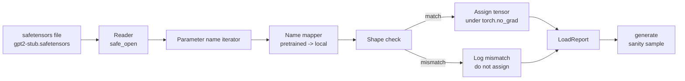

# On charge des poids que l'on a déjà entraînés

> La formation d'un modèle de paramètre de 124 millions à partir de zéro est une décision budgétaire; charger un point de contrôle publié est un mardi. Cette leçon charge des poids de style GPT-2 prétrainés à partir d'un fichier de séfétensors dans l'architecture exacte de la leçon 35, marche la cartographie du nom de paramètre pièce par pièce, et la santé mentale génère une continuation pour prouver que la charge a fonctionné. Aucun réseau, aucun chargement tiers, aucune magie opaque.

**Type:** Build
**Languages:** Python
**Prerequisites:** Phase 19 lessons 30 to 36
**Time:** ~90 minutes

## Objectifs d'apprentissage

- Lisez un fichier de séfétensors avec le `safetensors`La bibliothèque Python et inspecter les noms et les formes des tensors.
- Mape chaque nom de paramètre prétrainé sur un paramètre à l'intérieur du modèle GPT de la leçon 35.
- Traiter les deux conventions de nom qui diffèrent entre les poids publiés GPT-2 et le modèle dans cette piste: `wte/wpe/h.N.attn.c_attn/c_proj`et `mlp.c_fc/c_proj`par rapport aux noms locaux `tok_embed/pos_embed/blocks.N.attn.qkv/out_proj`et `mlp.fc1/fc2`- Je suis désolé .
- Détecter et refuser un déséquilibre de forme avec une erreur claire avant toute assignation de poids.
- Générez une courte suite avec les poids chargés et confirmez que les jetons proviennent de la distribution chargée, pas de celle initialement aléatoire.

## Le problème

Les poids publiés ne sont pas emballés pour votre architecture. Ils portent les noms de l'implémentation originale utilisée.`transformer.h.0.attn.c_attn.weight`de forme `(2304, 768)`Votre modèle s' attend à ce que`blocks.0.attn.qkv.weight`de forme `(2304, 768)`(qui est la même matrice dans une convention de mise en page différente) ou votre modèle utilise `nn.Linear`Le même paramètre apparaît avec trois identités subtilement différentes (nom, forme, layout en octets) et le chargement doit concilier les trois.

Un chargeur qui copie aveuglément met le bon tensor au mauvais endroit et vous obtenez un modèle qui génère des absurdités. Un chargeur qui refuse de copier lorsque la forme est différente mais ne logue rien vous laisse deviner quel tensor n'a pas atterri. Le chargeur dans cette leçon est explicite: chaque affectation est enregistrée, chaque forme est vérifiée, et un`LoadReport`résume les coups, les manquements et les désaccords de forme pour que vous puissiez lire ce qui s'est passé.

## Le concept



Le nom de cartographie est juste une fonction de chaîne à chaîne.`torch.no_grad()`Autograd ne suit pas la charge, le rapport contient le résultat de chaque nom.

### La convention de nommage du GPT-2

Les poids publiés de GPT-2 vivent sous des noms tels que:

| Pretrained name | Shape | Meaning |
|-----------------|-------|---------|
| `wte.weight` | (50257, 768) | Token embedding |
| `wpe.weight` | (1024, 768) | Position embedding |
| `h.N.ln_1.weight` | (768,) | LayerNorm 1 scale at block N |
| `h.N.ln_1.bias` | (768,) | LayerNorm 1 shift at block N |
| `h.N.attn.c_attn.weight` | (768, 2304) | Fused QKV linear weight |
| `h.N.attn.c_attn.bias` | (2304,) | Fused QKV linear bias |
| `h.N.attn.c_proj.weight` | (768, 768) | Attention output projection |
| `h.N.attn.c_proj.bias` | (768,) | Attention output projection bias |
| `h.N.ln_2.weight` | (768,) | LayerNorm 2 scale |
| `h.N.ln_2.bias` | (768,) | LayerNorm 2 shift |
| `h.N.mlp.c_fc.weight` | (768, 3072) | MLP fc1 weight |
| `h.N.mlp.c_fc.bias` | (3072,) | MLP fc1 bias |
| `h.N.mlp.c_proj.weight` | (3072, 768) | MLP fc2 weight |
| `h.N.mlp.c_proj.bias` | (768,) | MLP fc2 bias |
| `ln_f.weight` | (768,) | Final LayerNorm scale |
| `ln_f.bias` | (768,) | Final LayerNorm shift |

Deux surprises à prévoir.`c_attn`- Je suis là .`c_proj`- Je suis là .`c_fc`Les lignes sont stockées avec la matrice transposée par rapport à ce que `nn.Linear.weight`Le chargement est effectué au cours de l'affectation. la tête de LM n'est pas du tout dans le dossier; le modèle repose sur un lien de poids avec `wte`, la tête est donc réglée par aliasing une fois `wte`Les terres.

### La convention locale de dénomination

Le modèle de cette piste utilise des noms descriptifs:

| Local name | Meaning |
|------------|---------|
| `tok_embed.weight` | Token embedding |
| `pos_embed.weight` | Position embedding |
| `blocks.N.ln1.scale` | LayerNorm 1 scale at block N |
| `blocks.N.ln1.shift` | LayerNorm 1 shift |
| `blocks.N.attn.qkv.weight` | Fused QKV |
| `blocks.N.attn.qkv.bias` | Fused QKV bias |
| `blocks.N.attn.out_proj.weight` | Attention output projection |
| `blocks.N.attn.out_proj.bias` | Output projection bias |
| `blocks.N.ln2.scale` | LayerNorm 2 scale |
| `blocks.N.ln2.shift` | LayerNorm 2 shift |
| `blocks.N.mlp.fc1.weight` | MLP fc1 |
| `blocks.N.mlp.fc1.bias` | MLP fc1 bias |
| `blocks.N.mlp.fc2.weight` | MLP fc2 |
| `blocks.N.mlp.fc2.bias` | MLP fc2 bias |
| `final_ln.scale` | Final LayerNorm scale |
| `final_ln.shift` | Final LayerNorm shift |

La carte est une fonction fixe, la leçon la transmet comme un dicté que le chargement réitère.

### Le raccordement de la tige

Le démo ne les télécharge pas; il génère un petit fichier de séfétensors à la première mise en marche, avec la convention de nommage exacte du GPT-2 et des formes appropriées à un modèle de 12 blocs à d_model 192 au lieu de 768.

```figure
cc-weight-remap
```

## Faites-le

`code/main.py`les implémentations:

- Une petite réplique de la leçon 35 `GPTModel`Donc cette leçon est auto-contenue.
- `make_pretrained_to_local(num_layers)`qui élargit les entrées par couche.
- `load_safetensors(model, path)`qui itérera les noms, les cartographiera, vérifiera la forme, transposera les poids de style conv1d et les assignera sous `torch.no_grad()`Retourne une`LoadReport`- Je suis désolé .
- `make_stub_safetensors(path, cfg)`qui génère un fichier fixe avec la convention de nommage pré-entrainée exacte.
- Une démo qui crée`outputs/gpt2-stub.safetensors`à la première mise en marche, construit un nouveau modèle, capture une continuation générée à partir d'initial aléatoire, charge le bâton, capture une autre continuation, imprime les deux et vérifie que les deux sont différents (la charge a réellement changé le modèle).

- Je vais le faire.

```bash
python3 code/main.py
```

Résultats: le chemin de fixation, un journal de charge par nom, un `LoadReport`résumé, une continuation avant la charge, une continuation après la charge et un déséquilibre de forme sur un seul tensor intentionnellement mauvais injecté dans le dispositif afin d'exercer le chemin de défaillance.

## La pile

- `safetensors`pour le format en disque et un lecteur de streaming.
- `torch`pour le modèle et les mathématiques de l'affectation.
- - Je ne veux pas .`transformers`- Non , pas du tout .`huggingface_hub`Pas de réseaux.

## Modèles de production dans la nature

Trois modèles permettent au chargement de survivre au contact avec des poids que vous n'avez pas créés.

**Always validate the file before any assignment.**Ouvrez le fichier, répertoriez chaque nom de tensor avec son type d et sa forme, exécutez le cartographie complet avec des vérifications de forme, et seulement après le succès commencez à attribuer.

**Log every assignment with the source name and the destination name.**Quand quelque chose semble mal, le journal vous dit quel tensor est arrivé où; l'alternative est de lire les hexdumps.`LoadReport`les données de cette classe dans les traces de la leçon `loaded`- Je suis là .`missing`- Je suis là .`unexpected`, et `shape_mismatch`les listes et imprime un résumé à la fin.

**The LM head is a weight tying alias, not a separate copy.**Réglage`model.lm_head.weight = model.tok_embed.weight`après chargement `tok_embed`C'est le modèle canonique.`lm_head.weight`Le paramètre rompt le lien et doublera discrètement le nombre de paramètres.

## Utilisez-le

- Le chargement fonctionne pour tout fichier de séfétensors qui utilise la convention de nommage prétrainée.
- Le même schéma s'étend aux poids LLaMA, Mistral, Qwen une fois que vous mettez à jour la carte du nom.
- La génération de santé mentale après une charge est une porte rapide: si les échantillons post-charge ressemblent aux échantillons pré-charge, la charge n'a pas changé le modèle, ce qui signifie que la cartographie a silencieusement manqué chaque tensor.

## Exercices

1. Ajouter un `dtype`argument à la charge qui met chaque tensor à un type d cible (`bfloat16`- Je suis là .`float16`- Je suis là .`float32`) pendant la mission.`float32`Le modèle peut être abaissé à `bfloat16`et encore générer.
2. Ajouter un`expected_layers`argument qui refuse de charger un point de contrôle dont `h.N`Les indices ne correspondent pas aux indices du modèle `num_layers`- Je suis désolé .
3. Connectez le chargement à la fonction de génération de leçon 35 et produisez deux échantillons côte à côte: un de l'initial aléatoire, un du dispositif chargé.
4. Ajouter un chemin d'exportation: insérer l'état du modèle actuel dans un nouveau fichier de coffre-fort avec la convention de nommage prétrainée.
5. Extension `NAME_MAP`pour gérer la convention de nommage LLaMA (pas de biais, RMSNorm, mise en page qkv fusionnée) et rediriger le chargement sur un fichier LLaMA stub que vous générez.

## Les termes clés

| Term | What people say | What it actually means |
|------|-----------------|------------------------|
| Name map | "Key remapping" | The function from pretrained tensor names to local parameter names; usually a literal dict with one entry per layer index expanded over a loop |
| Shape mismatch | "Bad shape" | The pretrained tensor exists under the mapped name but its dimensions disagree with the local parameter; the loader refuses to assign and logs the pair |
| Transpose-on-load | "Conv1d layout" | Published GPT-2 stores attention and MLP projections in the transpose of what nn.Linear expects; the loader transposes during assignment |
| Weight tying alias | "Shared LM head" | Setting model.lm_head.weight = model.tok_embed.weight so the head and embedding share storage; the head is not in the file because of this |
| Load report | "Coverage summary" | A small dataclass that tracks loaded, missing, unexpected, and shape_mismatch lists; printing it is how you tell whether the load succeeded |

## Pour en savoir plus

- La phase 19 leçon 35 pour l'architecture qui reçoit les poids.
- La phase 19 leçon 36 pour la boucle d'entraînement qui produit un point de contrôle de la même forme.
- Leçon 11 de la phase 10 (quantification) pour savoir quoi faire avec les poids chargés lorsque la mémoire est serrée.
- Le cours de phase 10 (construction d'un pipeline complet de LLM) pour le cycle de vie complet autour de la charge et de l'inférence.
