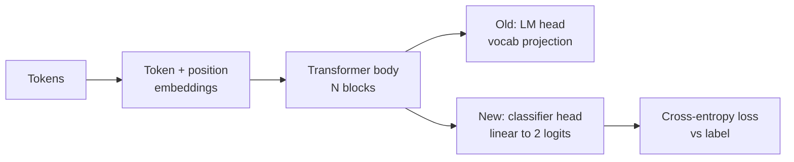
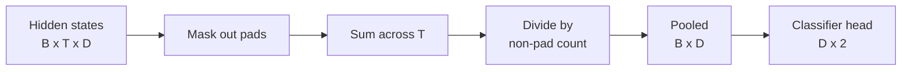
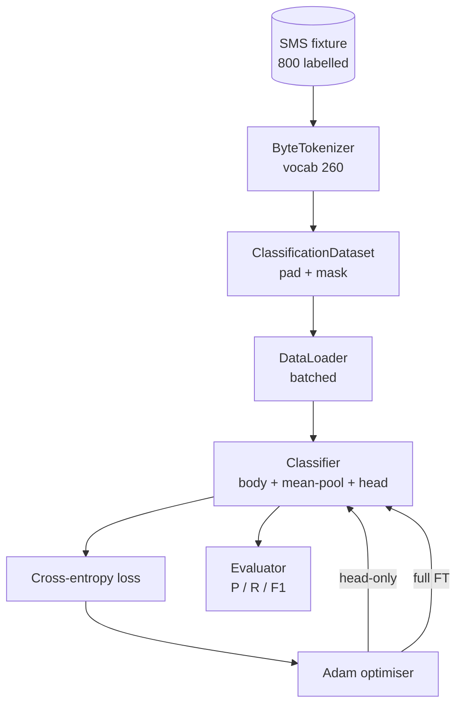

# Leçon 38: Classificateur - ajustement par tête

> La première pierre angulaire de la piste B. Un modèle de langage prétrainé est une pile de blocs d'auto-attention qui se terminent dans une tête de prédiction de jeton. Quand on veut du spam contre du jambon, la tête est fausse mais le corps est en grande partie juste. Cette leçon déchire la tête, colonne une couche linéaire de deux classes sur la représentation regroupée et entraîne le classifiateur de deux façons différentes: seule couche finale et réglage complet. L'évaluation est de la précision, du rappel, et F1 sur une fraction prolongée. Vous apprenez ce que chaque stratégie vous achète et ce qu'elle coûte.

**Type:** Build
**Languages:** Python (torch, numpy)
**Prerequisites:** Phase 19 lessons 30-37 (NLP LLM track: tokenizer, embedding table, attention block, transformer body, pre-training loop, checkpointing, generation, perplexity)
**Time:** ~90 minutes

## Objectifs d'apprentissage

- Remplacez une tête de modèle de langue par une tête de classification sans réinitialiser le corps.
- Implémenter deux régimes d'entraînement: corps congelé (à tête seulement) et réglage complet, partageant une seule boucle d'entraînement.
- Construisez un pipeline de données conscient du tokeniser qui couvre, masque le rembourrage et rassemble l'attention.
- Compute la précision, rappelle, F1, et une matrice de confusion à partir de logits bruts.
- Résumé de la différence entre le nombre de paramètres, le temps d'entraînement et la salle de tête.

## Le problème

Vous avez déjà formé un petit transformateur sur un corpus générique. La tête de sortie projette le dernier état caché dans un vocabulaire de 1000 jetons. Vous avez maintenant 800 messages SMS étiquetés comme spam ou jambon et vous voulez un classifiateur binaire.

La mauvaise option est de former un nouveau classifiateur à partir de zéro sur 800 exemples. Le corps du modèle prétrainé encode déjà une structure utile: identité des mots, position, co-occurrence simple. Le jeter à l'écart gaspille la calcul qui l'a construit.

Les deux bonnes options sont le head swap avec le corps gelé et le head swap avec le corps entraînable. L'entraînement à la tête seule est rapide, presque gratuit en mémoire et rarement surchargeable avec ces petites données.

Cette leçon construit les deux, donc vous pouvez les comparer sur le même appareil.

## Le concept



Le modèle est une fonction `f_theta(tokens) -> hidden_states`La tête est une fonction .`g_phi(hidden) -> logits`Échange de tête signifie garder .`theta`et le remplacement `g_phi`Les paramètres du corps sont la partie la plus chère.

Deux ensembles de paramètres entraînables sont importants:

- `theta`Des dizaines de milliers de poids par bloc d'attention.
- `phi`(la tête): `hidden_dim * num_classes`les poids plus un biais.

Dans l' entraînement à la tête seulement , vous comptez les gradients contre`phi`et les réduire à zéro contre `theta`PyTorch vous permet de le faire en réglant`requires_grad=False`L'optimisateur ne voit que la tête et le corps reste gelé.

Dans le cadre d'un ajustement complet, vous laissez les gradients revenir à travers l'ensemble de la pile. Le poids du corps dérive pour s'adapter à l'objectif de classification. Le risque est catastrophique d'oublier sur de petites données: le préentraînement du corps est éliminé par le bruit excessif.

## La question de l'établissement d'un groupe

Un classifiateur a besoin d'un vecteur par séquence, pas d'un vecteur par jeton.

- **Mean pool**: moyenne des états cachés à travers la séquence, pondérée par le masque d'attention.
- **CLS pool**: préparez un jeton spécial et utilisez uniquement sa sortie.
- **Last-token pool**C'est ce que font les classifiateurs de la classe GPT.

Cette leçon utilise le pooling moyen avec une pondération explicite du masque d'attention.



## Les données

800 SMS, équilibrés 400 spam et 400 jambons, sont générés de manière déterministe en`code/main.py`. Le générateur utilise une graine fixe, choisit des modèles et remplace les remplissages de fentes, et émet des messages de 5 à 25 jetons.

Les données sont divisées 80/20: 640 train, 160 test. Les fractions sont stratifiées de sorte que l'ensemble de test maintient l'équilibre 50/50.

## Les mesures

Classification binaire avec classe 1 comme classe positive (spam).

- `TP`: le spam prévu, était du spam.
- `FP`: prévue par le spam, était le jambon.
- `FN`: prévue jambon, était spam.
- `TN`: prévue pour le jambon, était le jambon.

Les trois principales métriques:

- `precision = TP / (TP + FP)`- Des messages marqués par spam, quelle est la fraction ?
- `recall = TP / (TP + FN)`- De l'espam réel, quelle fraction a été le modèle ?
- `F1 = 2 * P * R / (P + R)`- La moyenne harmonieuse des deux.

Une matrice de confusion imprime les quatre nombres comme une grille 2x2.

```figure
cap-classifier-head-swap
```

## Architecture



Le corps est un transformateur délibérément minuscule: vocab 260, caché 64, 4 têtes, 2 blocs, séquence max 32. Il est assez petit pour entraîner les deux régimes à la convergence dans les quatre-vingt-dix secondes sur la CPU. Il n'est pas prétrainé dans la leçon; au lieu de cela, le `pretrain_quick`L'aide fait cinq époques d'entraînement LM sur le même texte de fixation pour donner au corps un point de départ non trivial.

## Ce que vous allez construire

La mise en œuvre est une `main.py`plus un module d'essai (`code/tests/test_main.py`)

1. `ByteTokenizer`: cartes octets à ID, réserves un ID de carte.
2. `Block`: un bloc de transformateur avec une attention à plusieurs têtes et une couche de transmission.
3. `LMBody`: embedding de jeton + position plus une pile de blocs. Retourne des états cachés.
4. `MeanPool`: moyenne pondérée par masque sur l'axe de séquence.
5. `Classifier`Le corps est le même dans tous les régimes.
6. `freeze_body`et `unfreeze_body`: commutateur `requires_grad`sur les paramètres du corps.
7. `train_classifier`: une boucle partagée. Accepte le modèle et un optimisateur configuré pour le groupe de paramètres qui est entraînable.
8. `evaluate`: exécute l' ensemble d'essai et retourne `Metrics(precision, recall, f1, confusion)`- Je suis désolé .
9. `run_demo`: préentraîne le corps brièvement, ensuite entraîne et évalue la tête seulement, puis plein, imprime les deux rapports, et sort zéro.

## Pourquoi la comparaison est importante

Le régime de tête seule entraîne généralement plus rapidement et s'adapte plus gracieusement. Sur ce dispositif, vous voyez généralement une précision proche de 0,9 et vous rappelez près de 0,85 après vingt périodes d'entraînement à tête seule.

La leçon ne choisit pas un gagnant. Elle vous apprend à lire les chiffres et le coût. Sur 800 exemples et un petit corps, seule la tête est la bonne décision. Sur 80 000 exemples et un corps plus grand, la mise en forme complète commence à se révéler. Le contrat que vous prenez de cette leçon est l'API: la même `train_classifier`fonction gère les deux, et le commutateur est un appel.

## Des objectifs

- Ajouter un troisième régime qui défriche seulement le dernier bloc. Cela s'appelle parfois finition partielle. Cela coûte moins cher que la FT complète et apprend plus que la tête seulement.
- Un calendrier cosine sur la tête plus un taux constant plus petit sur le corps est une configuration de production commune.
- Remplacez le pooling moyen par un pool d'attention appris: une petite couche d'attention par une requête apprise.

Les tests vous donnent les clés, les chiffres sont à vous.
