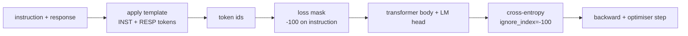
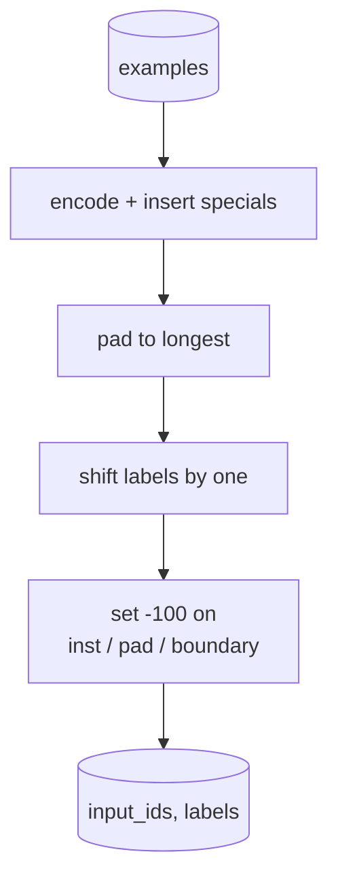
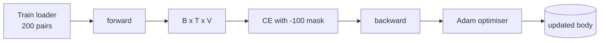

# Leçon 39: Tuning de l'instruction par un réglage fin supervisé

> Un modèle de base prétrainé peut prolonger une séquence mais ne peut pas suivre une instruction. Le réglage fin supervisé est le plus petit changement qui résout cela: alimenter le modèle par exemple d'une instruction et d'une réponse souhaitée, et former le corps à prédire les jetons de réponse. Le truc est que vous voulez que la perte compte seulement la réponse, pas l'instruction. Cette leçon construit une boucle SFT de style Alpaca avec une fonction de collage personnalisée qui masque les jetons d' instruction avec `ignore_index=-100`, traîne sur 200 paires d'instructions-réponse, et évalue sur une fraction prolongée en utilisant la correspondance exacte.

**Type:** Build
**Languages:** Python (torch, numpy)
**Prerequisites:** Phase 19 lessons 30-37 (NLP LLM track: tokenizer, embedding table, attention block, transformer body, pre-training loop, checkpointing, generation, perplexity)
**Time:** ~90 minutes

## Objectifs d'apprentissage

- Formater les données parallèles d'instruction-réponse en une seule séquence causale avec des jetons de limites explicites.
- Construisez une fonction de collation qui masque les jetons d'instruction de sorte que l'entropie croisée ne compte que les jetons de réponse.
- Formez un minuscule corps transformateur sous l'objectif SFT et regardez le mouvement de la métrique d'évaluation.
- Implémenter une génération avide et température échantillonnée qui respecte la limite de démarrage de la réponse.
- Compute une correspondance exacte sur les résultats générés.

## Le problème

Un modèle de base formé sur la prédiction de jetons suivants n'a aucune idée de ce qu'est une instruction.`"What is the capital of France?"`Le modèle a le langage mais pas le contrat de format.

Le contrat SFT est un modèle de chaîne.

```text
<INST> What is the capital of France? <RESP> The capital of France is Paris.
```

Les jetons de limite sont des jetons spéciaux réservés au moment de la formation.`<RESP>`Le modèle de base est toujours valable, il est simplement formé sur un corpus où chaque exemple a cette forme.

Mais il y a un problème. Si vous nourrissez toute la séquence à une perte de vanille en entropie croisée, vous entraînez le modèle à prédire également les jetons d'instruction.

## Le concept



`ignore_index`est une caractéristique de `torch.nn.functional.cross_entropy`- Toute position cible égale à `ignore_index`La convention de PyTorch est de`-100`. La fonction collate construit deux tensors par exemple: `input_ids`(la séquence complète) et `labels`(une copie de `input_ids`avec les positions d' instruction surécrites par `-100`)

Le modèle voit toute la séquence pendant le passage vers l'avant; l'attention peut prêter attention à l'instruction. La perte ne compte que les jetons de réponse. C'est exactement ce que vous voulez: conditionner l'instruction, prédire la réponse.

## Les données

Deux cents paires d' instructions-réponse sont générées déterministiquement en `main.py`Ils couvrent six types de tâches:

- Une seule prise de fait (capital de la note X)
- l'arithmétique
- extraction de la liste
- résumé d'une phrase
- code (impression, tri)
- définition

Chaque tâche a une instruction templaire et une réponse déterministe. C'est intentionnellement simple. Exact-match est fragile, et la leçon utilise un fichier où la bonne réponse est une chaîne spécifique.

Les divisions sont de 160 trains, 40 tests.

## Les symboles et les couches

Le tokeniser est de niveau octet avec trois spécialités réservées:

- `INST_ID = 256`: marque le début de la région d'instruction.
- `RESP_ID = 257`: marque la frontière entre l'instruction et la réponse.
- `PAD_ID = 258`: rembourrage pour lots de longueur variable.

La séquence est `[INST] inst_bytes [RESP] resp_bytes [PAD]*`- La fonction de collage:

1. Symbole de chaque exemple.
2. Il met chaque exemple dans le lot dans la plus longue séquence du lot.
3. Des bâtiments `labels`- Je suis là.`input_ids`décalé par un (objectif de LM de causalité), avec:
   - La région d' instruction est remplacée par `-100`- Je suis désolé .
   - La région de rembourrage a été remplacée par `-100`- Je suis désolé .
   - Le `RESP_ID`position limite elle-même remplacée par `-100`(vous n'entraînez pas le modèle à prédire le symbole de limite; il prédit ce qui suit).



Le changement est le truc de causalité standard: position `i`de `input_ids`prédit la position `i+1`Je suis un homme .`labels[i] = input_ids[i+1]`Le masque est appliqué après le déplacement pour atterrir dans les positions droites.

## Formation



La boucle est la boucle standard PyTorch SFT. Adam, taux d'apprentissage autour de 3e-4 à 1e-3, dix à vingt époques sur ce dispositif, aucun planificateur. Le modèle est assez petit (clandestin 96, 2 blocs, longueur maximale 64) pour entraîner à la convergence sur le processeur en deux minutes.

Chaque cinquième époque, la boucle effectue un petit test d'évaluation sur l'ensemble retenu et imprime le match exact.

## Génération

Au moment de l' évaluation , le modèle obtient le préfixe d' instruction `[INST] inst_bytes [RESP]`et génère des jetons jusqu'à ce que:

- la séquence atteint `max_len`ou
- Le modèle émet une heuristique de stop spéciale: deux octets consécutifs qui terminent une phrase (`.`- Je suis là .`!`- Je suis là .`?`)

La leçon envoie un décodeur avide plus un échantillonneur de température optionnel.

## Évaluation de la correspondance exacte

La mesure de texte prévue est normalisée (minuscule, espace blanc à bande, espace double de collapse) et comparée à la réponse de référence, normalisée de la même manière. La mesure est soit 1 ou 0, par exemple.

Les pipelines SFT réelles complètent le match exact avec le modèle F1 au niveau des jetons (leçon 41) et un modèle de juge.

```figure
cc-sft-loss-mask
```

## Ce que vous allez construire

La mise en œuvre est une `main.py`Plus des tests.

1. `InstructionTokenizer`: encodeur de niveau octet avec spécialités réservées.
2. `make_dataset`: génère 200 paires sur six types de tâches avec une semence fixe.
3. `SFTDataset`: rendements `(input_ids, labels)`par exemple, déjà préparé à la face.
4. `sft_collate`: remplissage dynamique, construit le tensor de lot, ensembles `-100`sur les positions d'instruction et de plaquette.
5. `TinyGPT`: corps de transformateur plus tête de LM liée ou détachée.
6. `train_sft`: la boucle SFT, avec des crochets d'évaluation à l'époque.
7. `generate`: décode de cause à cause d'un préfixe, avide ou échantillonné, avec l'arrêt heuristique.
8. `exact_match`: comparaison de chaînes normalisée, rendements flottant dans `[0, 1]`- Je suis désolé .
9. `run_demo`: construit les données, traîne pour vingt époques, évalue, imprime une ventilation par catégorie, sort zéro sur le succès.

## Pourquoi le masque est important

Sans le masque, la perte traite les jetons d'instruction comme des cibles. Le modèle apprend à prédire l'instruction. C'est un objectif différent et produit un modèle pire de deux façons. Premièrement, la capacité du modèle est gaspillée en reconstituant les entrées que l'utilisateur fournit toujours. Deuxièmement, la perte de réponse est plus faible dans la somme du gradient parce que les jetons d'instruction dépassent en nombre les jetons de réponse dans la plupart des lots; le taux d'apprentissage efficace de l'optimisateur sur la partie qui vous intéresse est inférieur à celui que vous avez prévu. Le masque n'est pas un polissage, c'est l'objectif.

## Des objectifs

- Ajouter un réchauffement du taux d'apprentissage suivi d'une décomposition cosinale.
- Ajouter des enregistrements de perte par jeton et tracer la courbe de perte sur la formation.`<RESP>`Les époques suivantes sont dominées par les jetons de réponse réels.
- Extension de l'évaluation à BLEU-1 ou chrF. Le match exact sous-estime les modèles qui produisent une paraphrase avec la même réponse.
- Ajoutez un modèle de chat avec un formatage multi-tours et entraînez sur un fichier qui comprend des suivis.

La mise en œuvre vous donne le contrat de format, le masque et la boucle.
