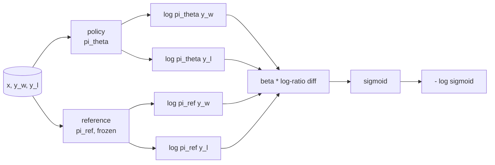
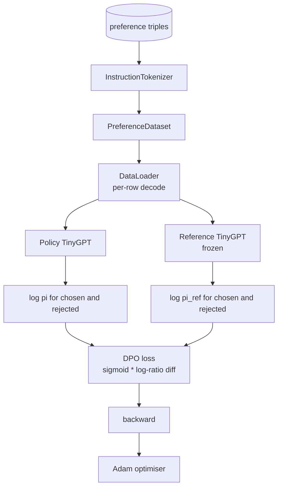

# Capstone Leçon 40: Optimisation directe des préférences à partir de zéro

> Les modèles de récompense et de PPO sont la pile classique de RLHF. Le DPO s'effondre en une seule perte supervisée qui correspond directement à une politique contre les paires de préférences. Cette leçon déduit la perte de DPO de l'identité de la différence de récompense, envoie un modèle de référence de travail plus un modèle de politique, calcule les probabilités de journaux par jeton et entraîne un minuscule transformateur sur un fichier de préférence des terminaisons choisies et rejetées. Les tests pin maths de perte et la direction du gradient afin que vous savez que l'implémentation correspond au papier.

**Type:** Build
**Languages:** Python (torch, numpy)
**Prerequisites:** Phase 19 lessons 30-37 (NLP LLM track: tokenizer, embedding table, attention block, transformer body, pre-training loop, checkpointing, generation, perplexity)
**Time:** ~90 minutes

## Objectifs d'apprentissage

- Dériver la perte de DPO comme un sigmoïde sur une différence de log-ratio écaillé et le relier à la récompense implicite.
- Construire un modèle de référence + une paire de modèles de politique avec une référence gelée et une politique entraîneable.
- Compute les probabilités de logs au niveau de la séquence dans les deux modèles, masquant les jetons de prompt.
- Formation de la politique sur `(prompt, chosen, rejected)`triple et regardez la montée du log-prob choisi par rapport à celui rejeté.
- Comportement des pin avec des tests sur les mathématiques de perte, le signe de gradient et l'invariance de référence.

## Le problème

Vous avez un modèle SFT. Il suit les instructions, mais ses sorties sont inégales; certaines finitions sont claires, certaines sont verbale ou erronées. Vous avez également un petit ensemble de données de paires de préférences: pour le même prompt, un humain a marqué une finition comme choisie et l'autre comme rejetée.

La réponse classique de la RLHF est un pipeline en deux étapes. Prenez un modèle de récompense sur les préférences. Optimisez la politique contre la récompense avec PPO. Cela fonctionne mais est coûteux: deux modèles en mémoire pendant la PPO, le contrôle KL pour garder la politique près de la référence, le piratage de la récompense lorsque le modèle de récompense est fragile.

La politique est formée directement sur les paires de préférences, avec une pénalité KL explicite vers la référence SFT. La même solution optimale selon le modèle de préférences Bradley-Terry, beaucoup moins de code.

## Le concept

Commencez par le modèle Bradley-Terry.`x`et deux compléments `y_w`(élu) et `y_l`(rejeté), la probabilité que l' humain préfère `y_w`est

```text
P(y_w > y_l | x) = sigmoid( r(x, y_w) - r(x, y_l) )
```

où `r`C'est une fonction de récompense latente.`r`Les politiques de la société sont les mêmes que celles des autres pays.`pi`pour maximiser `r`avec une ancre KL:

```text
max_pi   E_{x, y~pi} [ r(x, y) ] - beta * KL(pi || pi_ref)
```

La dérivation du DPO observe que la politique optimale `pi*`Dans le cadre de cet objectif, la forme de l'objectif est fermée en termes de`r`- Le numéro de la liste:

```text
pi*(y | x) = (1/Z(x)) * pi_ref(y | x) * exp( r(x, y) / beta )
```

Réorganiser pour `r`- Le numéro de la liste:

```text
r(x, y) = beta * ( log pi*(y | x) - log pi_ref(y | x) ) + beta * log Z(x)
```

Le `log Z(x)`Le terme est le même pour les deux `y_w`et `y_l`(c' est en fonction de `x`- Je ne sais pas .`y`), il annule donc lorsque vous calculez la différence de préférence:

```text
r(x, y_w) - r(x, y_l) = beta * ( log pi_theta(y_w|x) - log pi_ref(y_w|x)
                                - log pi_theta(y_l|x) + log pi_ref(y_l|x) )
```

Remplacez le sigmoïde Bradley-Terry et prenez la probabilité négative de log sur les paires de préférences:

```text
L_DPO(theta) = - E_{(x, y_w, y_l)} [
  log sigmoid( beta * ( log pi_theta(y_w|x) - log pi_ref(y_w|x)
                       - log pi_theta(y_l|x) + log pi_ref(y_l|x) ) )
]
```

Il s'agit d'une sigmoïde sur un seul scalaire par exemple, calculée à partir de quatre log-probabilités. Aucun modèle de récompense séparé. Aucun PPO. Aucun terme KL dans la perte; la contrainte KL est cuite dans la dérivation de forme fermée.



## Le signe du gradient

Une vérification utile de la santé mentale avant toute course d'entraînement.`log pi_theta(y_w | x)`- Le numéro de la liste:

```text
d L_DPO / d log pi_theta(y_w | x) = - beta * (1 - sigmoid(z))
```

où `z`C'est l'argument du sigmoïde.`z`, ce qui signifie: augmenter la probabilité de logement de la politique de l'achèvement choisi diminue la perte.`log pi_theta(y_l | x)`La formation pousse les élus vers le haut et les rejetés vers le bas. La référence est gelée; elle ne bouge pas.

## Les données

Douze préférences triples avec la leçon.`(prompt, chosen, rejected)`. La finition choisie est courte et précise. Ce qui est rejeté est verbale, hors sujet ou erroné. Les paires couvrent les mêmes familles de tâches que la leçon 39 (capital, arithmétique, liste) de sorte qu'une politique qui a commencé à partir d'une base SFT a un point de départ raisonnable.

Le dispositif est intentionnellement petit. DPO travaille sur des dizaines de milliers de paires en production; ici, le point est que la mathématique de perte et la boucle se déroulent de bout en bout sur un petit ensemble de données et que l'écart entre le log-prob choisi et le log-prob rejeté augmente visiblement.

## Invariance de référence

Une mise en œuvre DPO doit gérer le modèle de référence avec soin.

- Les paramètres de référence ne reçoivent jamais de gradients.
- Les probabilités de référence ne changent jamais entre les époques.
- La politique commence par les mêmes pondérations que la référence.`theta`est la référence plus une mise à jour apprise; l'initialisation de la politique en tant que copie de la référence est le début bien défini.)

La mise en œuvre les impose par:

- Envelopper la référence dans `torch.no_grad()`lors des passes avant.
- Réglage`requires_grad=False`sur chaque paramètre de référence.
- La construction de la politique par le biais de `policy.load_state_dict(reference.state_dict())`après la construction de la référence.

```figure
cap-dpo-preference
```

## Architecture



Le modèle est le même que TinyGPT utilisé dans la leçon 39 (décodage uniquement, causalisateur, tokeniseur de octets).

## Ce que vous allez construire

La mise en œuvre est une `main.py`Plus des tests.

1. `InstructionTokenizer`: par octets avec `INST`et `RESP`La même forme que la leçon 39.
2. `TinyGPT`La même forme que la leçon 39, donc la leçon est autonome même si vous avez sauté 39.
3. `make_preferences`: retourne douze `(prompt, chosen, rejected)`- Le triple.
4. `sequence_log_prob`: étant donné le modèle, un préfixe prompt et une finition, renvoie la somme des probabilités de journaux de jetons suivants sur la finition (pas de contribution de position prompt).
5. `dpo_loss`: prend les quatre probabilités de log et `beta`, renvoie le tensor de perte par exemple et le delta de récompense implicite pour l'enregistrement.
6. `train_dpo`: boucle per-epoch qui compute les log-probes choisis et rejetés en vertu de la politique et de la référence, applique la perte et les étapes Adam.
7. `evaluate_margins`: renvoie à tout moment la marge moyenne de probabilité de dépôt de journaux choisie et rejetée dans le cadre de la politique.
8. `run_demo`: construit des références et des politiques à partir d'un petit pré-entraînement de réchauffement, copie les poids, les trains pour trente étapes, imprime les pertes et marges par étape, et sort de zéro sur le succès.

## Pourquoi le DPO fonctionne

Le DPO est mathématiquement équivalent à la RLHF selon le modèle de préférence Bradley-Terry, jusqu'à la paramétrisation de la récompense.`r(x, y) = beta * (log pi(y|x) - log pi_ref(y|x))`est identifiable à partir de préférences jusqu'à une fonction de `x`La politique de forme fermée vous permet de sauter le modèle de récompense explicite.`pi`de `pi_ref`Le rapport log-grand est plus grand, et le sigmoïde saturé, qui atténue le gradient lorsque la politique se déplace trop loin.

## Des objectifs

- Ajouter une normalisation de longueur à la somme de la probabilité de log: diviser par la longueur de l'achèvement.
- Ajouter la variante IPO de la perte: remplacer le sigmoid + log par `(z - 1)^2`- Comparer la convergence sur le dispositif.
- Ajouter un paramètre d'allumage de l'étiquette qui interpelle l'étiquette sélectionnée avec dureté et un étiquette uniforme de 0,5.
- Remplacez la référence par un modèle plus petit et moins cher (savoir la saveur de distillation).

La mise en œuvre vous donne la perte, l'invariance de référence, et la boucle d'entraînement.
