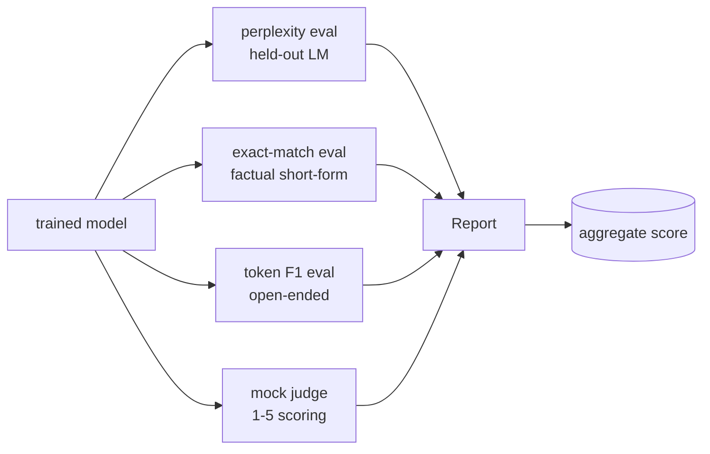
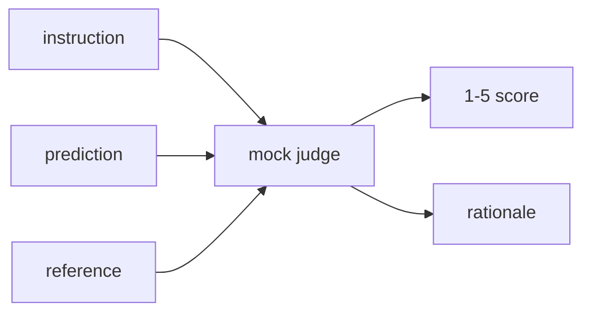
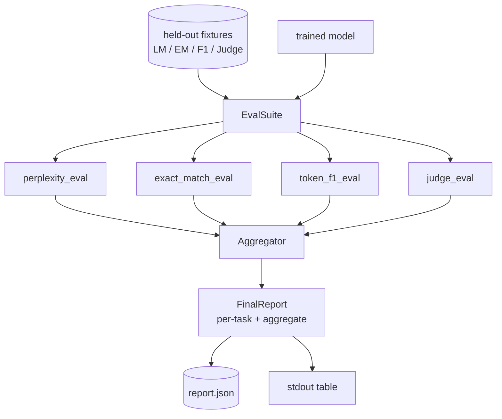

# Leçon 41 du Capstone: Pipeline d'évaluation complète

> L'entraînement est la partie que vous pouvez surveiller avec des courbes de perte. L'évaluation est la partie que vous devez concevoir. Cette leçon construit un pipeline d'évaluation unifié qui prend n'importe quel modèle de langage formé, exécute quatre évaluations hétérogènes sur elle, agrégant les résultats dans un rapport par tâche, et envoie un faux LLM local comme juge afin que la boucle fonctionne sans réseau. Les quatre évaluations couvrent les dimensions dont chaque modèle de transport a besoin: modélisation linguistique (perplexité), correction de forme courte (correspondance exacte), similitude de forme ouverte (token F1) et notation qualitative (juger).

**Type:** Build
**Languages:** Python (torch, numpy)
**Prerequisites:** Phase 19 lessons 30-37 (NLP LLM track: tokenizer, embedding table, attention block, transformer body, pre-training loop, checkpointing, generation, perplexity)
**Time:** ~90 minutes

## Objectifs d'apprentissage

- Compute la perplexité avec des jetons masqués sur un transformateur minuscule.
- Exécutez une évaluation de correspondance exacte sur des informations factuelles de forme courte.
- Compute le niveau F1 des jetons entre les chaînes de référence et prévue avec normalisation.
- Construisez un faux LLM local qui note les résultats des modèles sur une échelle de 1 à 5.
- Aggreger les quatre évaluations en un seul rapport pondéré avec répartition par tâche.

## Le problème

Une seule métrique ne décrit jamais un modèle de langage. La perplexité indique comment le modèle correspond bien à la distribution linguistique mais ne dit rien sur la question de savoir s'il répond aux questions. Le match exact indique si le modèle produit la corde d'or mais punit les paraphrases correctes. Le jeton F1 pardonne la paraphrase mais est trompé par la superposition lexicale avec le mauvais contenu. Le LLM-as-judge capture des dimensions qualitatives mais est coûteux et stochastique.

Le pipeline que vous voulez réellement a les quatre. Chaque évaluation couvre une dimension que les autres manquent. Chacun fonctionne sur un sous-ensemble différent de données conservées façonnées pour cette métrique. Le rapport final montre les nombres par tâche côte à côte et un agrégat, de sorte qu'un examinateur peut voir à un coup d'œil quelles compensations le modèle fait.

Cette leçon construit ce pipeline, de bout en bout, dans un seul fichier.

## Le concept



Chaque évaluation est une fonction de `(model, dataset) -> EvalResult`Le résultat contient la valeur métrique, les détails par exemple pour l'inspection et un nom de l'agrégat.

## La perplexité, correctement comptée

La perplexité est `exp(mean negative log-likelihood per token)`La mise en œuvre comporte deux pièges:

- La moyenne doit être au-dessus des positions de jetons réels, pas au-dessus de la séquence de lot.
- Le modèle prédit le prochain jeton, donc logits à position `i`Prédire le jeton en position `i+1`Les erreurs simples sont silencieuses: la perte continue, mais la métrique devient sans sens.

L'évaluation compute des sommes par lot de `-log p(token)`Il est plus sûr que de calculer la moyenne des perplexités par lot (qui sous-pilote les courtes séquences) et correspond à la définition du manuel.

## Parallèle exacte, avec normalisation

Le harnais normalise à la fois la prédiction et la référence avant de comparer:

- - Avec le minuscule.
- Des bandes autour de l'espace blanc.
- L'espace blanc interne s'effondre dans un seul espace.
- Pénom d'un point de référence (`.`- Je suis là .`!`- Je suis là .`?`) si les deux parties ne diffèrent que par la ponctuation.

La normalisation rend la correspondance exacte utile dans la pratique.`"Paris"`C' est vrai, celui qui dit`"Paris."`C'est aussi vrai, celui qui dit:`"  paris  "`La métrique exige toujours que la réponse soit la même chaîne après normalisation.

## Le jeton F1, dans le bon sens.

Le jeton F1 est la moyenne harmonieuse de précision et de rappel calculée sur le sac de jetons.

1. Normalité de la prédiction et de la référence (les mêmes règles que la correspondance exacte).
2. Divisez chacun en une liste de jetons (tokenisation de l'espace blanc).
3. Comptez l'intersection de plusieurs ensembles.
4. La précision = `intersection_count / len(pred_tokens)`- Rappelez-vous`intersection_count / len(ref_tokens)`F1 = moyenne harmonieuse.

Si la prédiction et la référence sont vides, F1 est 1 (match vide). Si seulement une est vide, F1 est 0. Ce modèle correspond à la référence d'évaluation SQuAD et produit des nombres stables sur les paraphrases.

## Loi sur la loi locale

Un vrai juge est un modèle de frontière derrière une API. Pour cette leçon, le juge doit exécuter hors ligne. Le juge de simulation est un marqueur déterministe qui prend une instruction, la prédiction du modèle et la référence, et retourne un score en `{1, 2, 3, 4, 5}`Les règles de notation sont explicites:

- 5 si la prédiction normalisée est égale à la référence normalisée.
- 4 si le jeton F1 entre prédiction et référence est au moins 0,8.
- 3 si le jeton F1 est en `[0.5, 0.8)`- Je suis désolé .
- 2 si le jeton F1 est en `[0.2, 0.5)`- Je suis désolé .
- 1 dans le cas contraire.

Ce n'est pas un vrai juge, mais il a la bonne interface.



## Aggrégation

L'agrégat est une moyenne pondérée des scores d'évaluation normalisés.`[0, 1]`- Le numéro de la liste:

- Perplexité: normalisation comme `1 / (1 + log(perplexity))`Une perplexité de 1 cartes à 1, des cartes infinies à 0.
- - Le match exact: déjà en cours .`[0, 1]`- Je suis désolé .
- F1: déjà en ligne `[0, 1]`- Je suis désolé .
- Juge: divisez par 5.

Les poids sont configurables. Le mélange par défaut est de 0,2 perplexité, 0,3 correspondance exacte, 0,3 jetons F1, 0,2 juge. Le choix des poids est une décision de produit; la leçon expose le bouton afin que vous puissiez expérimenter.

```figure
cg-eval-quadrant
```

## Architecture



Le `EvalSuite`Chaque évaluation individuelle est une fonction libre qui prend`(model, tokenizer, dataset, config)`et retourne un `EvalResult`- Le .`Aggregator`La démo imprime le tableau et écrit une copie JSON que l'indicateur en aval peut ingérer.

## Ce que vous allez construire

La mise en œuvre est une `main.py`Plus des tests.

1. `TinyGPT`: la même architecture de décodeur utilisée dans les leçons 38-40, inclus, de sorte que la leçon se démarque.
2. `InstructionTokenizer`: tokeniser en octets avec des spécialités INST / RESP / PAD.
3. Quatre appareils: un corpus LM, un ensemble EM, un ensemble F1 et un ensemble de juges.
4. `perplexity_eval`: rendements `EvalResult`avec la valeur de perplexité et l'histogramme de perte par jeton.
5. `exact_match_eval`: rapporte la moyenne EM et les dossiers par exemple.
6. `token_f1_eval`: renvoie la moyenne des fichiers F1 et par exemple.
7. `mock_judge`et `judge_eval`: par exemple, score et raison, score moyen sur l'ensemble.
8. `Aggregator.normalise`: règle de normalisation par échéance.
9. `Aggregator.aggregate`: moyenne pondérée et rapport compilé.
10. `run_demo`: entraîne brièvement un petit modèle, exécute les quatre évaluations, imprime la table des rapports et écrit le JSON, sort de zéro sur le succès.

## Lire le rapport

Le rapport a trois couches. Le haut est le score agrégé. Ci-dessous sont les quatre nombres par éval. Ci-dessous sont les ventilations par exemple pour le diagnostic. Une opération de calcul de l'indice de l'indice d'indice d'indice d'indice d'indice d'indice d'indice d'indice d'indice d'indice d'indice d'indice d'indice d'indice d'indice d'indice d'indice d'indice d'indice d'indice d'indice d'indice d'indice d'indice d'indice d'indice d'indice d'indice d'indice d'indice d'indice d'indice d'indice d'indice d'indice d'indice d'indice d'indice d'indice d'indice d'indice d'indice d'indice d'indice d'indice d'indice d'indice d'indice de l'indice d'indice d'indice de l'indice d'indice d'indice de l'indice d'indice d'indice de l'indice de l'indice d'indice d'indice d'indice d'indice d'indice d'indice de l'indice de l'indice d'indice d'indice d'indice de l'indice d'indice d'indice de l'indice d'indice d'indice de l'indice d'indice d'indice de l'indice d'indice d'indice qui est.

Le dépôt JSON utilise des clés stables afin qu'un tableau de bord CI puisse tracer des lignes de tendance sur les versions.

## Des objectifs

- Ajoutez une évaluation d'étalonnage: les probabilités de softmax du modèle correspondent-elles à sa précision?
- Ajouter une évaluation de robustesse: marquer chaque exemple avec une perturbation (typo, paraphrase, distracteur) et signaler une chute métrique par perturbation.
- Remplacez le juge de simulation par un modèle réel derrière un appel HTTP. La signature de la fonction ne change pas.
- Ajouter l'apprentissage des poids par tâche: au lieu de poids fixes, ajuster les poids à un ordre de préférence cible par rapport aux modèles.

La mise en œuvre vous donne les quatre évaluations, l'agrégateur et le rapport. Les pipelines d'évaluation réelles couvrent beaucoup plus de dimensions en haut; le schéma reste le même: une fonction par évaluation, un agrégateur, un rapport.
