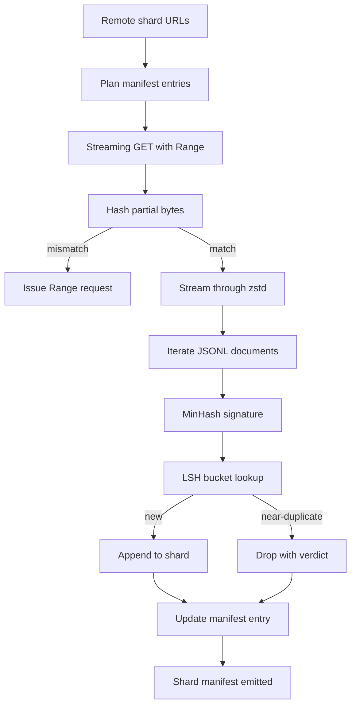

# Un téléchargement de corps

> L'entraînement d'un modèle de langue commence bien avant le premier passage. Le corpus doit être décompressé, déduplié et adressable, avec l'histoire de CV déjà préparée avant que le réseau ne tombe à 4%. Cette leçon construit un téléchargeur en continu qui tire des fragments comprimés, décomprime en vol avec Zstandard, duplique des empreintes digitales via MinHash plus le hachage sensible à la localisation, et écrit un manifeste de fragments que le reste du pipeline peut faire confiance.

**Type:** Build
**Languages:** Python
**Prerequisites:** Phase 19 lessons 30-37
**Time:** ~90 minutes

## Objectifs d'apprentissage

- Transférez des fragments à distance avec `urllib`et décompresser avec `zstandard`sans tamponner le dossier entier en mémoire.
- Retourner les téléchargements partiels en émettant HTTP `Range`les demandes contre un décalage de octets vérifié.
- Construisez une signature MinHash par document et mettez-la dans un seau avec LSH pour que des duplicates se heurtent.
- Émettez un manifeste de fragment avec le contenu hash, la taille des octets, le nombre de documents et le verdict dedup.

## Le problème

La première fois que vous vous entraînez sur un corpus de 200 Go , le réseau diminue de 41% et le script sort avec un`urllib`La deuxième fois, il est tombé à 78%. Avec 99%, vous avez réécrit la boucle trois fois. Les deux défaillances que vous devez résoudre à partir de la première minute sont le curriculum vitae partiel et la suppression de documents en double. Les deux ont des solutions bien connues; les deux sont systématiquement ignorés car le pipeline commence comme une ligne unique.`requests.get`On appelle ça les dents qui ont grandi.

Le résumé est un problème HTTP.`Range`Si le décalage et le fichier divergent même d'un octet, le téléchargement repris écrit des ordures et le corpus est corrompu d'une manière qui ne apparaît que lors de la jetonnisation.

La déduplication est un problème de signature. Exact-hash dédup manque de presque duplicates: le même article de Wikipédia apparaît avec trois pieds de page différents, le même fichier de code avec une tête de licence différente, le même article de blog avec un paramètre de suivi sur chaque lien. MinHash plus LSH les récupère à un coût sous-linéaire. Le coût est une signature par document et une recherche de seau par signature.

## Le concept



### En streaming avec `urllib`

La bibliothèque standard `urllib.request.urlopen`retourne un objet similaire à un fichier.`zstandard.ZstdDecompressor().stream_reader`Les octets circulent du réseau à travers le décompresseur vers l'itérateur de document sans jamais matérialiser la fragmentation comprimée ou la fragmentation décompressée dans la mémoire.

### Résumé avec `Range`

Le téléchargeur écrit deux fichiers par fragment: le fragment lui-même et un `.partial.json`Les dossiers des points de contrôle`verified_bytes`- Je suis là .`expected_size`- Je suis là .`sha256_prefix`(computé sur la première `verified_bytes`Le téléchargement est effectué en fonction de la fonction de démarrage.`sha256_prefix`Le débit est effectué en fonction des octets sur le disque et ne reprend que si le hash recomputé correspond. Si le hash est incorrect, le partiel est rejeté et le téléchargement redémarre à partir de octet zéro. La corruption silencieuse est impossible parce que les octets vérifiés sont vérifiés, pas supposés.

### MinHash plus LSH

MinHash estime la similitude Jaccard de deux ensembles dans un espace fixe. Pour un document, le ensemble est les bardeaux (n-grammes superposés) de son texte.`k`deux documents avec une similitude Jaccard `s`J' ai une probabilité .`s`de se mettre d'accord sur toute composante de la signature.

LSH regroupe ensuite les `k`Les composants en `b`bandes de `r`chaque rangée, où `k = b * r`Deux documents se heurtent dans au moins une bande avec probabilité .`1 - (1 - s^r)^b`, qui est un seuil nettement inférieur à la valeur de `s`Vous êtes en accord .`(b, r)`Le seuil pour le déduction du corps typique est `s = 0.8`, dont la littérature de recherche de l' LSH est parvenue `k = 128`- Je suis là .`b = 32`- Je suis là .`r = 4`- Je suis désolé .

### Manifeste de déchiffrement sous forme de contrat

La seule sortie durable du téléchargeur est le manifeste. Le manifeste contient, par fragment, l'URL, le nombre de octets décomprimés, le nombre de documents, le nombre unique de documents après déduction et le sha256 du fichier final de fragment. La tokenization en aval lit le manifeste, pas la liste des annuaires. Si une tranche manque ou si sa forme 256 est erronée, le manifeste indique à l'étape suivante de refuser de commencer. Le manifeste est le point décisif entre "les données sont téléchargées" et "les données sont téléchargées et vérifiables".

```figure
cap-corpus-downloader
```

## Faites-le

`code/main.py`les implémentations:

- `ShardPlanner`- lire une liste des URL de fragmentation et produire des entrées de manifeste prévues.
- `StreamingDownloader`- ouvre une `urllib`flux avec optionnel `Range`, écrit à un fichier temporaire, met à jour le `.partial.json`un point de contrôle sur chaque pièce, et vérifie le préfixe Sha256 sur le CV.
- `ZstdDocIterator`- enveloppe le flux en forme de fichier `zstandard.ZstdDecompressor`et produit un document par ligne.
- `MinHasher`- produit une`k`- signature de composant pour une chaîne utilisant une famille fixe de graines de hachage.
- `LSHIndex`- signes par bande et rapports de collisions.
- `Dedup`- combine le hasher et l'index pour étiqueter chaque document `keep`ou `near_duplicate`avec l'identifiant de fragment correspondant.
- `ManifestWriter`- recueille des statistiques par partage et écrit `manifest.json`- Je suis désolé .

Une démo au bas du fichier crée un petit corpus synthétique sur le disque, le comprime avec `zstandard`, le télécharge par un `file://`L'URL, déduplicates et imprime le manifeste.

- Je vais le faire.

```bash
python3 code/main.py
```

Le script sort de zéro et imprime un résumé manifeste.

## Modèles de production

Quatre modèles étalonnent cette leçon à de vrais corps.

**Checkpoint before write.**Le `.partial.json`Il doit être `fsync`-ed avant que les octets ne soient ajoutés à la fiche. Sinon, une perte de puissance inverse l'ordre: octets de fiche sur disque, point de contrôle sans eux, le prochain CV croit avoir moins de octets vérifiés que ce qu'il fait, les octets de suffixe dupliés corrompre le fichier.

**Sharded LSH index.**Un seul index LSH sur l'ensemble du corpus ne s'inscrit pas dans la RAM à l'échelle de 200 Go. Partagez l'indice LSH par le premier hash de bande, stockez les partitions sur le disque et consultez uniquement la partition dans laquelle une nouvelle signature atterrirait. Le coût est un disque supplémentaire lu par document; l'avantage est que l'indice LSH n'est plus un plafond de mémoire dure.

**Tombstone, not delete.**Les copies abandonnées sont enregistrées dans le manifeste avec le verdict .`near_duplicate`La suppression de ces documents perd le lien entre le double et son titulaire.

**Per-shard sha256 in the manifest, plus a manifest sha256.**Le manifeste lui-même obtient un hash de contenu. Les étapes en aval vérifient le hash du manifeste avant de faire confiance aux entrées par fragment. Sans cela, le manifeste est la surface d'attaque silencieuse: un attaquant qui peut modifier un seul fichier peut corrompre l'ensemble du pipeline.

## Utilisez-le

Modèles de production:

- **Resume on every CI run.**Les coureurs d'informations sont éphémères. Le téléchargeur doit prendre un disque frais à chaque coureur et récupérer du cache ou de la télécommande. `--cache-dir`est un drapeau de première classe.
- **Dedup before tokenization.**La tokenization est coûteuse. L'exécuter deux fois sur le même document coûte deux fois plus cher que pour la même courbe de perte. Dedup est en amont de la tokenization, pas en aval.
- **Manifest as merge gate.**La course de formation lit le manifeste sha256 à partir d'un comit fixé. Une nouvelle version d'un ensemble de données nécessite un nouveau comit manifeste. Le lien entre le code et les données est git, pas folklore.

## La faire partir

`outputs/skill-corpus-downloader.md`Il est possible de décrire, dans un projet réel, les URL qui alimentent le téléchargeur, la façon dont le répertoire des points de contrôle est défini, la largeur de la barre et `(k, b, r)`Le manuel est en mode de contrôle de version, ce cours va à l'avant du moteur.

## Exercices

1. Ajouter un `--shingle-width`flag et mesurer comment le verdict dédupe change à la largeur 3, 5, 9. Défendre le défaut choisi.
2. Ajouter la prise en charge de gzip à côté de zstd en sniffant les octets magiques. Le téléchargeur ne devrait pas exiger que l'appelant spécifie le codec.
3. Ajouter un `--resume-only`utilise dans l'IC pour empêcher une course de retirer accidentellement 200 GB.
4. Mettez l'indice LSH dans un fichier de rangée ou de rangement et mesurez le débit par rapport à la variante en mémoire.
5. Ajouter un manifeste sha256 à la mise en marche. Le téléchargeur doit échouer à fermer si le manifeste sur le disque ne convient pas au hash du manifeste dans `manifest.lock`- Je suis désolé .

## Les termes clés

| Term | What people say | What it actually means |
|------|-----------------|------------------------|
| Shard | "A file" | A self-contained slice of the corpus with its own sha256, used as the unit of resume and dedup |
| MinHash signature | "Fingerprint" | A `k`-component sketch of a set, where each component is the minimum of one independent hash over the set |
| LSH band | "Bucket" | A group of `r` signature components used as a single bucket key for collision detection |
| Verified bytes | "Resume offset" | Bytes on disk whose sha256 prefix matches the checkpoint; the only safe offset to resume from |
| Manifest | "The index" | The single durable record of what the downloader produced, including content hashes |

## Pour en savoir plus

- [RFC 7233](https://datatracker.ietf.org/doc/html/rfc7233)- Les demandes de portée HTTP, le protocole de CV
- [Zstandard format specification](https://datatracker.ietf.org/doc/html/rfc8478)- format de cadre qui rend la décompression en continu sûre
- [MinHash](https://en.wikipedia.org/wiki/MinHash)- la famille de signature que cette leçon utilise
- [Locality-sensitive hashing](https://en.wikipedia.org/wiki/Locality-sensitive_hashing)- le régime de banding derrière le seuil de déduction
- Phase 19 · 43 - le corpus de jetons HDF5 alimente le téléchargeur
- Phase 19 · 44 - le calendrier cossin qui s'entraîne sur le corpus
- Phase 19 · 45 - la boucle de l' AMP qui consomme le calendrier
