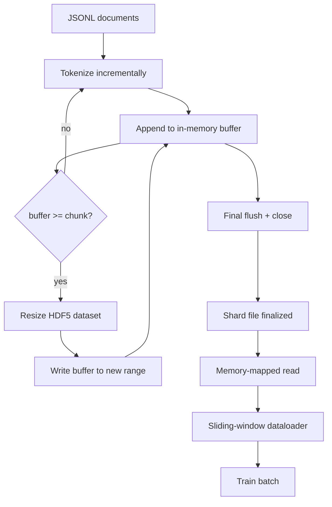

# Corpus sélectionné HDF5

> Le corpus téléchargé doit atterrir dans une disposition que l'entraîneur peut diffuser à la vitesse de la ligne. JSONL sur disque ne survit pas à 16 travailleurs de chargeur de données. HDF5 avec un ensemble de données entiers taillés en morceaux. Cette leçon construit la jetonisation de streaming dans un ensemble de données HDF5 dimensionnable, écriture fragmentée sur plusieurs fichiers, lecture en mémoire cartographiée au moment de la formation, et un chargement de données de fenêtre coulissante qui produit des séquences de longueur fixe avec le bon emballage.

**Type:** Build
**Languages:** Python
**Prerequisites:** Phase 19 lessons 30-37
**Time:** ~90 minutes

## Objectifs d'apprentissage

- Transférez des documents dans un ensemble de données HDF5 entiers dimensionnables avec un décomposé déterministe.
- Faites passer l'écriture à travers plusieurs fichiers HDF5 afin que l'échec soit limité et que le parallélisme soit possible.
- Lisez les jetons à travers la mise en page de la page HDF5 sauvegardée par cache en morceaux afin que le chargement de données copie dans les tampons de lot seulement au moment du lot.
- Implementer un chargeur de données de fenêtre coulissante qui émet des séquences d'entraînement de longueur fixe avec des règles d'emballage explicites.

## Le problème

Une formation moderne de langage-modèle lit des jetons à des centaines de milliers d'échantillons par seconde sur des dizaines de travailleurs. JSONL sur disque meurt lors de la première erreur de page de cache froide: le parseur JSON est lent, les limites du document ne sont pas adressables, et la recherche de "échantillon 4,217,884" nécessite la numérisation du fichier. Même le Parquet, qui se comprime bien, ne convient pas bien parce que l'entraîneur ne veut pas de colonnes; il veut un flux de jetons plat avec O(1) accès aléatoire.

HDF5 convient car il offre un ensemble de données en morceaux, dimensionnables, uniquement entiers dont les morceaux sont conviviaux en cas de lecture.`tokens[3,200,000 : 3,200,8192]`HDF5 copie l'hyperlab demandé du cache de la page dans un tableau NumPy nouvellement alloué. Le coût est un poignet de fichier ouvert et une empreinte de cache de page de taille de pièce par travailleur, ce qui est négligeable par rapport au coût de décoding JSONL.

Le problème de la construction est de rendre le côté écrit honnête. Les ensembles de données dimensionnables sont faciles à utiliser à mauvais escient: écrivez un document à la fois et le fichier HDF5 est fragmenté au point d'être inutilisable. Écrivez tous les documents en une seule taille et un processus de mort perd toute la fragmentation. La bonne discipline est le tampon-alors-extension, avec une taille tampon qui correspond à la taille de la pièce, et une écriture fragmentée qui divise la charge de travail entre les fichiers de sorte qu'un crash perd au plus une fragmentation.

## Le concept



### HDF5 mesurable fait correctement

L' ensemble de données de jetons est créé avec `maxshape=(None,)`et une fixation `chunks=(chunk_size,)`. Écrire des produits en tamponnant des jetons dans un tableau NumPy de longueur `chunk_size`. Lorsque le tampon est rempli, l'ensemble de données est redimensionné par exactement `chunk_size`et le tampon est écrit dans la nouvelle gamme. à la fin de la fraction, le tampon résiduel est écrit dans une gamme partielle finale. chaque écriture est contiguë et alignée en morceaux sauf la dernière, que le lecteur est dit de tronquer à l'enregistré`token_count`dans les attributs HDF5 de la fragmentation.

### Écriture en morceaux

Un seul fichier HDF5 est un seul point de défaillance. Le pipeline écrit des fragments en parallèle: chaque fragment d'entrée de la phase 19 leçon 42 produit un fragment de sortie HDF5.`shards.json`Les données sont indiquées par fragment, par chemin de fichier, par nombre de jetons, par nombre de documents et par sha256 sur les jetons.`shards.json`pour calculer les compensations globales et valider le corpus.

### Lire en mémoire

Au moment de la formation, chaque travailleur ouvre sa part de fichiers HDF5 dans `swmr=True`mode et demande `tokens[start:stop]`Le travail ne matérialise jamais l'ensemble du fichier: la tranche est copiée dans le tampon de lot du chargement de données, que le chargement de données copie ensuite dans un tensor d'entraînement en mémoire fixe au moment du lot. Le chemin de chaleur a un syscall par transion de lot; tout le reste est l'accès à la RAM.

### Le chargeur de données de la fenêtre coulissante

Le chargement de données est la seule étape qui connaît la longueur de la séquence d'entraînement.`window_size + 1`Les jetons et les retours `(input, target) = (tokens[:-1], tokens[1:])`. Les limites des documents ne sont pas appliquées: une fenêtre peut être étroitement liée à deux documents, avec une explicite `boundary_token_id`C'est la règle standard d'emballage, c'est aussi la règle qu'un débutant oublie, et se termine par un corpus qui est de 8% de jetons de limite d'entraînement et de 92% de texte naturel.

```figure
cc-hdf5-corpus
```

## Faites-le

`code/main.py`les implémentations:

- `Tokenizer`- un jeton déterministe de niveau octet suffisamment bon pour la démo.`encode(text) -> list[int]`et `vocab_size`- Je suis désolé .
- `HDF5ShardWriter`- ouvre un ensemble de données entiers dimensionnables, tamponne les jetons à la taille de la pièce, redimensionne et écrit en étapes de taille fixe, enregistre `token_count`et `sha256`comme les attributs HDF5 sur close.
- `ShardedTokenizationPipeline`- il y a des documents de saisie, il les envoie à un écrivain et il émet un`shards.json`l'indice.
- `MmapTokenStore`- ouvre des fichiers fragmentés pour les lectures cartographiées en mémoire, compute des compensations globales, expose une seule `get_slice(start, stop)`- Je suis en train de le faire.
- `SlidingWindowDataloader`- choisit des fenêtres aléatoires du flux global et donne des résultats `(input_ids, target_ids)`Des matrices numériques.

Une démo au bas du fichier crée un minuscule corpus de mémoire, le symbolise en deux fragments, les ouvre via une carte de mémoire, exécute le chargement de données pendant 10 lots, et imprime la forme par lots et une somme de contrôle.

- Je vais le faire.

```bash
python3 code/main.py
```

Le script sort de zéro et imprime des montants de lots.

## Modèles de production

Quatre modèles permettent de faire de cette leçon une véritable formation.

**Chunk size equals the typical read.**L' entraîneur lit .`window_size + 1`Les données de l'échantillon sont calculées en fonction de la valeur de l'échantillon.`window_size`Les pièces non correspondantes réduisent de moitié le débit parce que chaque échantillon touche deux pièces.

**Token count in attributes, not in the dataset.**La tranche arrière de l'ensemble de données peut être partiellement pleine car la taille de la pièce ne divise pas la limite du document.`token_count`En effet, le lecteur est un élément de la valeur de la valeur de la valeur de la valeur de la valeur de la valeur de la valeur de la valeur de la valeur de la valeur de la valeur de la valeur de la valeur de la valeur de la valeur de la valeur de la valeur de la valeur de la valeur de la valeur de la valeur de la valeur de la valeur de la valeur de la valeur de la valeur de la valeur de la valeur de la valeur de la valeur de la valeur de la valeur de la valeur de la valeur de la valeur de la valeur de la valeur de la valeur de la valeur de la valeur de la valeur de la valeur de la valeur de la valeur de la valeur de la valeur de la valeur de la valeur de la valeur de la valeur de la valeur de la valeur de la valeur de la valeur de la valeur de la valeur de la valeur de la valeur de la valeur de la valeur de la valeur de la valeur de la valeur de la valeur de la valeur de la valeur de la valeur de la valeur de la valeur de la valeur de la valeur de la valeur de la valeur de la valeur de la valeur de la valeur de la valeur de la valeur de la valeur de la valeur de la valeur de la valeur de la valeur de la valeur de la valeur de la valeur de la valeur de la valeur de la valeur de la valeur de la valeur de la valeur de la valeur de la valeur de la valeur de la valeur de la valeur de la valeur de la valeur de la valeur de la valeur de la valeur de la valeur de la valeur de la valeur de la valeur de la valeur de la valeur de la valeur de la valeur de la valeur de la valeur de la valeur de la valeur de la valeur de la valeur de la valeur de la valeur de la valeur de la valeur de la valeur de la valeur de la valeur de la valeur de la valeur de la valeur de la valeur de la valeur de la valeur de la valeur de la valeur de la valeur de la valeur de la valeur de la valeur de la valeur de la valeur de la valeur de la valeur de la valeur de la valeur de la valeur de la valeur de la valeur de la valeur de la valeur de la valeur de la valeur de la valeur de la valeur de la valeur de la valeur de la valeur de la valeur de la valeur de la valeur de la valeur de la valeur de la valeur de la valeur de la valeur de la valeur de la valeur de la valeur de la valeur de la valeur de la

**Sharded sha256 with parallel verification.**Chaque fragment a son propre sha256 sur les octets de jeton. L'entraîneur peut vérifier tous les fragments en parallèle avant le début de l'entraînement.

**`swmr=True` on both sides, with `libver="latest"` on the writer.**Le mode Écrivain unique-lecteur multiple nécessite que l'écrivain ouvre avec `libver="latest"`, créer chaque ensemble de données à l'avance, puis définir `file.swmr_mode = True`Après ça , l' écrivain doit appeler .`dataset.flush()`après chaque taille de la lecture les ouvriers (ouvert avec `swmr=True`) voir les données cohérentes.`libver="latest"`ou en activant SWMR après des modifications structurelles est une source commune de défaillances de "fichier est verrouillé".

## Utilisez-le

Modèles de production:

- **One HDF5 per source shard.**Le téléchargeur (leçon 42) émet un fragment par URL; la jetonisation (cette leçon) émet un HDF5 par fragment source.
- **Boundary token id.**Le jeton de limite fait partie du vocabulaire du tokenizer et est le seul jeton que le chargement de données injecte.
- **`shards.json` as the source of truth.**L'ajout d'une nouvelle tranche signifie écrire le HDF5, calculer son sha256 et ajouter une entrée.

## La faire partir

`outputs/skill-hdf5-tokenized-corpus.md`Il est possible de décrire, dans un projet réel, quel jeton alimente le pipeline, quelle taille correspond à la fenêtre du formateur, où `shards.json`Il y a aussi des leçons sur la façon dont les travailleurs de la téléchargement de données sont fragmentés sur des fichiers.

## Exercices

1. Ajouter un `--compression gzip`le signal de la rédaction HDF5 et mesurer le coût de débit sur le corpus de démonstration.
2. Ajouter une semence déterministe au chargement de données de la fenêtre coulissante et vérifier que deux courses avec la même semence produisent des lots identiques.
3. Ajouter un `--validate`mode qui lit chaque fragment, recompte le sha256 sur ses jetons, et compare contre`shards.json`L'informateur devrait le faire avant le début de l'entraînement.
4. Comparer le débit de chargement de données à des tailles de pièces égales, à la moitié et deux fois la taille de la fenêtre.
5. Ajouter un `--max-document-tokens`Le code de la réforme est un code de la réforme, qui coupe de très longs documents au moment de la rédaction.

## Les termes clés

| Term | What people say | What it actually means |
|------|-----------------|------------------------|
| Resizable dataset | "Append-only" | An HDF5 dataset with `maxshape=(None,)` that grows via `resize` calls in chunk-sized strides |
| Chunked layout | "How HDF5 stores it" | Fixed-size on-disk pages that the kernel can memory-map and the dataloader can read contiguously |
| `swmr` mode | "Read-while-write" | Single-Writer-Multiple-Reader mode that lets dataloader workers share the file safely |
| Shard index | "shards.json" | The durable index of all token shards with offsets and content hashes |
| Sliding window | "Training sample" | A fixed-length slice of the global token stream that the trainer pairs with its shift-by-one target |

## Pour en savoir plus

- [HDF5 chunking documentation](https://support.hdfgroup.org/documentation/hdf5/latest/hdf5_chunking.html)- la mise en page des données en morceaux, dimensionnables, que cette leçon utilise
- [h5py user guide](https://docs.h5py.org/en/stable/)- Liens Python pour HDF5
- [NumPy memory mapping](https://numpy.org/doc/stable/reference/generated/numpy.memmap.html)- l'exposition primitive HDF5 par le côté de lecture par le
- Phase 19 · 42 - le téléchargeur dont la sortie est symbolisée par cette leçon
- Phase 19 · 44 - le calendrier cosine qui consomme ce chargeur de données
- Phase 19 · 45 - la boucle AMP qui termine la phase d'entraînement
