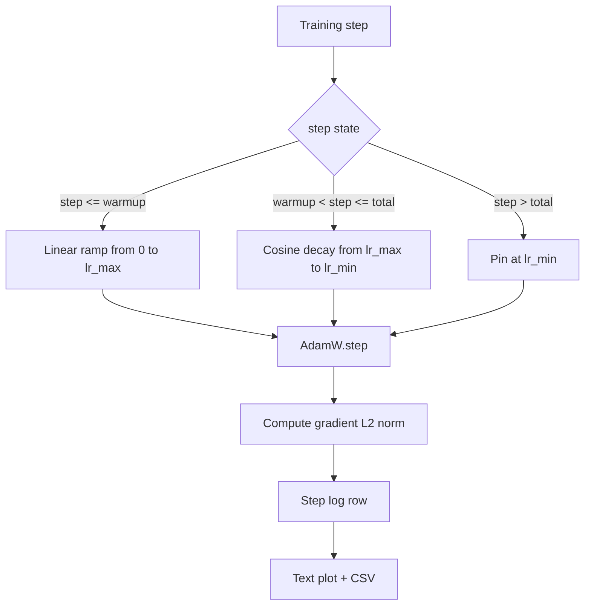

# L'écoulement de la couche de couche

> Le calendrier du taux d'apprentissage est la deuxième décision la plus importante après la fonction de perte. AdamW avec une décadence cosine et un réchauffement linéaire est la norme par défaut moderne pour la formation de modèle de langage car il permet au modèle de voir une petite taille effective des étapes pendant les premières mises à jour fragiles, monte à un pic configuré et se décompose doucement vers zéro. Cette leçon construit ce calendrier, trace la courbe sur les étapes d'entraînement, enregistre les normes de gradient à côté du calendrier, et prouve que le calendrier honore les limites de réchauffement, de pic et de décomposition.

**Type:** Build
**Languages:** Python
**Prerequisites:** Phase 19 lessons 30-37
**Time:** ~90 minutes

## Objectifs d'apprentissage

- Implémenter un optimisateur AdamW câblé à un calendrier cosine de taux d'apprentissage avec réchauffement linéaire.
- Calculer la valeur exacte du calendrier à chaque étape sans dériver de point flottant sur les courses.
- Le gradient de journaux L2 est la norme côte à côte avec le taux d'apprentissage, de sorte que la santé de l'entraînement est observable.
- Rendez le calendrier à un graphique de texte que l'œil peut lire et un CSV que tout outil peut consommer.

## Le problème

Les premiers mille mises à jour d'entraînement sont les plus bruyantes. Les poids du modèle sont encore proches de l'initialisation. L'estimation du second moment de fonctionnement de l'optimisateur n'a pas été stabilisée. La norme de gradient est grande et bruyante. Si le taux d'apprentissage est à son apogée pendant ces mises à jour, le modèle se détourne ou s'installe dans un plateau de perte, il ne s'échappe jamais. Les deux corrections bien connues sont le découpage des gradients, qui fait l'objet de la leçon 45 de la phase 19, et un calendrier de taux d'apprentissage qui commence petit et monte en amont.

Le calendrier cosine-avec-calmup comporte trois régions.`warmup_steps`le taux d' apprentissage s' élève linéairement de zéro à la hauteur configurée `lr_max`- De l' étape .`warmup_steps`Pour marcher`total_steps`Le taux d'apprentissage suit la moitié supérieure d'une courbe cosine, en déclinant à partir de `lr_max`à `lr_min`Après .`total_steps`Le taux d'apprentissage est fixé à `lr_min`Donc un entraîneur mal configuré qui dépasse ne sort pas silencieusement de l'horaire.

Le problème de la construction est que les horaires sont faciles à se tromper par un. Le temps de formation est de six heures dans une course d'entraînement comme un taux d'apprentissage qui est de 1% trop élevé ou trop bas au moment où le modèle commence à surpasser, ce qui est invisible à moins que le calendrier soit épuisé à des limites.

## Le concept



### Formule de réchauffement

Pour `step`dans `[0, warmup_steps]`avec `warmup_steps > 0`, le taux d' apprentissage est `lr_max * step / warmup_steps`Les dégénérés .`warmup_steps = 0`Le cas est traité comme "pas de réchauffement": le calendrier commence directement à `lr_max`Il est à l'étape zéro et entra immédiatement dans la décomposition cosine.`warmup_steps = 0`pour vérifier le calendrier produit toujours une courbe utilisable.

### Formule de cosine

Pour `step`dans `(warmup_steps, total_steps]`le taux d'apprentissage est `lr_min + 0.5 * (lr_max - lr_min) * (1 + cos(pi * progress))`où `progress = (step - warmup_steps) / max(1, total_steps - warmup_steps)`À la .`step = warmup_steps`le cosine évalue à `cos(0) = 1`, ce qui donne`lr_max`, correspondant exactement au point final de réchauffement.`step = total_steps`le cosine évalue à `cos(pi) = -1`, ce qui donne`lr_min`, correspondant exactement au point de décomposition.

La continuité des deux terminaisons n'est pas un accident, c'est pourquoi le calendrier est mis en œuvre en tant que fonction unique sur `step`Un calendrier collé perd une limite la première fois.`lr_max`est changé.

### Planche après étapes totales

Pour `step > total_steps`Le taux d'apprentissage reste à `lr_min`- le contrat est explicite: le calendrier ne s'écarte ni ne s'extrapole; il s'attache au sol et permet au formateur de consigner un avertissement.`total_steps`Pas la boucle.

### L'exploitation de la norme gradiente parallèlement au taux

Le programme est la moitié de la santé de l'entraînement. La norme de gradient est l'autre moitié. La boucle d'entraînement enregistre les deux par étape. Une course de formation divergente montre le pic de la norme de gradient avant la perte; un réchauffement bien réglé maintient la norme en hausse linéairement avec le rythme; un pic trop agressif apparaît comme une norme qui reste élevée après le réchauffement.`step, lr, grad_l2_norm, loss`Le CSV est le seul enregistrement durable.

```figure
cap-cosine-warmup
```

## Faites-le

`code/main.py`les implémentations:

- `CosineWithWarmup`- une fonction sans État `lr(step) -> float`sur le calendrier configuré.
- `TrainState`- enveloppe un modèle, un`AdamW`Optimiser, et le calendrier en une fonction de phase unique.
- `TrainState.step`- une passe vers l'avant, une passe vers l'arrière, une norme de gradient L2 et s'applique `lr(step)`à l'optimisateur.
- `plot_schedule_ascii`- rend l'horaire comme un graphique de texte que l'œil peut lire.
- `write_schedule_csv`- émet une ligne par étape avec le taux d'apprentissage.

Une démo en bas du fichier crée un minuscule`nn.Linear`Le modèle, trains pour 20 étapes sur un lot d'entrée fixe, et imprime le taux d'apprentissage par étape, la norme de gradient et la perte.

- Je vais le faire.

```bash
python3 code/main.py
```

Le script sort de zéro et imprime un journal d'entraînement par étape plus le graphique du calendrier.

## Modèles de production

Quatre modèles élèvent le calendrier à un artefact de production.

**Schedule lives in a config, not in code.**L' entraîneur lit .`warmup_steps`- Je suis là .`total_steps`- Je suis là .`lr_max`- Je suis là .`lr_min`Le calendrier est reproduisable parce que le calendrier est adressé au contenu; le calendrier est vérifiable parce que le calendrier fait partie du diff PR.

**Step counter is monotonic and decoupled from epochs.**Certains cadres confondent étape et époque lorsque l'ensemble de données est fragmenté ou que le chargement de données est redémarré.`global_step`La course se poursuit dans la position correcte du calendrier car le compteur d'étape est l'axe durable.

**Schedule plot in the run directory.**Chaque séance d' entraînement écrit:`outputs/lr_schedule.png`Un réviseur qui analyse le répertoire peut vérifier le calendrier sans réécrire quoi que ce soit. Cela capture la classe de bugs de calendrier mal configuré au moment des relations publiques.

**Log row schema is fixed.** `step, lr, grad_l2_norm, loss`Un tableau de bord ou un ordinateur en aval lit le schéma; renommer une colonne sans renverser une version invalidera tout tableau de bord existant.

## Utilisez-le

Modèles de production:

- **Sweep peak before sweeping anything else.** `lr_max`Le bouton le plus sensible.`lr_max`Les échelles sont faibles avec la taille du modèle, donc le balayage du petit modèle est un priorité fort.
- **Warmup is a fraction of total steps, not an absolute count.**Une course de 200 millions d'étapes avec 2 000 étapes de réchauffement commence presque immédiatement au sommet; une course de 20 000 étapes avec le même nombre de étapes se réchauffe de 10%.
- **`lr_min` is non-zero on purpose.**Un étage qui est de 10% de`lr_max`Il permet à l'optimisateur d'apprendre pendant la longue traîne.`lr_min = 0`Le programme produit une courbe d'entraînement qui est superbe sur une piste et un modèle qui n'a pas terminé l'entraînement.

## La faire partir

`outputs/skill-cosine-warmup.md`Il est possible de décrire, sur un projet réel, quelle configuration porte le calendrier, à partir de quelle étape de formation le compteur global est lu et à quel point `lr_max`Cette leçon va à l'avant du moteur.

## Exercices

1. Ajoutez une variante inverse de la racine carrée du calendrier et comparez-la sur une course d'entraînement de 200 étapes.
2. Ajouter un `--restart`le drapeau qui ajoute un second réchauffement à `total_steps / 2`Défendre si les redémarrages chauds améliorent ou nuisent pendant la course de jouets.
3. Ajouter un test unitaire qui montre que le calendrier est continu: pour chaque étape `[0, total_steps]`la différence `|lr(step+1) - lr(step)|`est limitée par `lr_max / warmup_steps`- Je suis désolé .
4. Faites le programme en un `torch.optim.lr_scheduler.LambdaLR`La leçon utilise une fonction simple étape; que change l'emballage?
5. Ajouter un `--plot-png`drapeau qui écrit une vraie intrigue via `matplotlib`. Défendre si le graphique de texte de la leçon ou la PNG est le meilleur paramètre pour les exécutions CI.

## Les termes clés

| Term | What people say | What it actually means |
|------|-----------------|------------------------|
| Warmup | "Slow start" | Linear ramp from zero to `lr_max` over the first `warmup_steps` updates |
| Cosine decay | "Smooth drop" | Upper-half cosine curve from `lr_max` to `lr_min` over the remaining steps |
| Floor | "After training" | The fixed `lr_min` value the schedule pins at past `total_steps` |
| Gradient norm | "L2 of grads" | The Euclidean norm of the concatenated gradient vector, logged each step |
| Global step | "Schedule axis" | A monotonic step counter that survives restarts and drives the schedule |

## Pour en savoir plus

- [Loshchilov and Hutter, SGDR: Stochastic Gradient Descent with Warm Restarts (arXiv 1608.03983)](https://arxiv.org/abs/1608.03983)- le papier de référence du calendrier cossin
- [Loshchilov and Hutter, Decoupled Weight Decay Regularization (arXiv 1711.05101)](https://arxiv.org/abs/1711.05101)- Le document de référence d'AdamW
- [PyTorch torch.optim.lr_scheduler](https://docs.pytorch.org/docs/stable/optim.html#how-to-adjust-learning-rate)- comment les fonctions étape sont composées avec les calendriers-cadres
- Phase 19 · 42 - le téléchargeur dont le corps est consommé par le présent calendrier
- Phase 19 · 43 - le chargement de données avec lequel le calendrier évolue
- Phase 19 · 45 - coupure de gradient et AMP, la couche suivante dans la boucle
