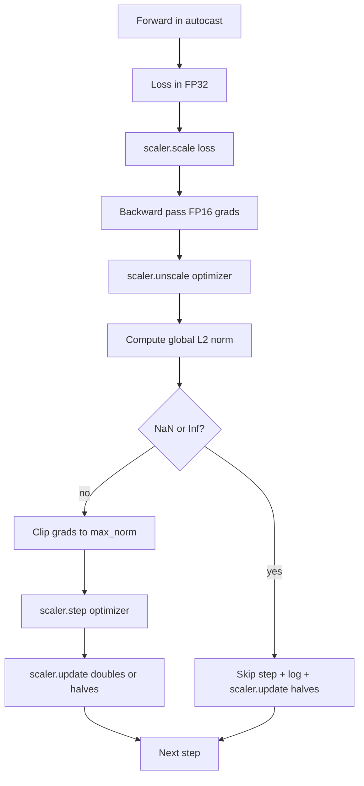

# Coupe graduelle et précision mixte

> L'optimisateur et le calendrier de la leçon précédente supposent que les gradients sont sains. Ils ne le sont généralement pas. Un seul mauvais lot peut augmenter la norme de gradient de trois ordres de magnitude. L'entraînement à précision mixte amplifie cette situation en introduisant un débordement de FP16 sur le côté perte. Cette leçon construit les deux ceintures de sécurité sans lesquelles la formation de production ne peut pas être expédiée: le coupage de gradient à une norme globale L2 configurée, et une boucle de précision mixte avec autocast et GradScaler qui détecte NaN et Inf, saute la étape de manière claire et enregistre le facteur d'échelle pour la médecine forense.

**Type:** Build
**Languages:** Python
**Prerequisites:** Phase 19 lessons 30-37
**Time:** ~90 minutes

## Objectifs d'apprentissage

- Calculer la norme globale L2 sur tous les gradients et clips de paramètres en place lorsqu'elle dépasse un seuil configuré.
- Enveloppez une étape d'entraînement en auto-caste plus un GradScaler pour que les passes avant et arrière de FP16 survivent au débordement.
- Détecter NaN et Inf dans la perte ou le gradient, sauter l'étape d'optimisation, et enregistrer le saut.
- Rapportez le facteur d'échelle du GradScaler à chaque étape pour qu'une longue séquence de sauts soit immédiatement visible.

## Le problème

Une course d'entraînement qui a été nette hier produit une courbe de perte qui va verticalement à l'étape 8.217. Le coupable est un seul lot dont la norme de gradient est de 4 200 fois plus élevée que la précédente. Sans cliquer, l'optimisateur applique une étape qui réinitialise tout apprentissage que le modèle avait fait dans l'heure précédente. Avec un clip global L2 à la norme 1.0, le même lot contribue à une mise à jour de la norme unitaire; la perte reste sur sa ligne de tendance; la course survit.

L'entraînement à précision mixte renforce le débit de 2 à 3 fois en calculant le passage avant et la plupart du passage arrière en FP16. Le coût est que le FP16 a une gamme d'exponents étroite. Un gradient typique qui déborde dans FP16 est évalué à Inf, qui se propage à travers les couches suivantes comme NaN, qui fixe chaque poids à NaN à l'étape d'optimisation suivante. Le GradScaler de PyTorch résout cette question en multipliant la perte par un grand facteur d'échelle avant le passage en arrière et en divisant les gradients par le même facteur avant l'étape d'optimisation. Si un gradient est inf ou naN à un moment non étalé, le scaler saute l'étape et réduit de moitié le facteur d'échelle; si les étapes N précédentes ont été propres, le scaler double le facteur. Au cours de la formation, le facteur trouve la valeur la plus élevée que la gamme FP16 permet.

Le problème de construction est de câbler les deux correctement. Clip avant de décaler et le seuil est sur des gradients d'échelle; clip après décaler et l'ordre des opérations sur le GradScaler.`scaler.scale(loss).backward()`Alors ...`scaler.unscale_(optimizer)`Alors ...`clip_grad_norm_`Alors ...`scaler.step(optimizer)`Alors ...`scaler.update()`Tout autre ordre produit une boucle silencieuse.

## Le concept



### Norme mondiale de l2

La norme globale L2 est la norme euclidienne du vecteur de gradient concaténé, et non la norme par paramètre. PyTorch la met en œuvre comme`torch.nn.utils.clip_grad_norm_(parameters, max_norm)`. La fonction renvoie la norme pré-clips afin que la leçon puisse enregistrer à la fois la valeur naturelle et la valeur coupée, ce qui est nécessaire pour le diagnostic "nous coupons à chaque étape".

### autocast et GradScaler

`torch.amp.autocast(device_type)`est le gestionnaire de contexte qui exécute de manière sélective les opérations admissibles (la plupart des opérations de la classe matmul) au titre du QP16. `torch.amp.GradScaler(device_type)`L'aide est l'aide qui élève la perte avant le retour vers l'arrière et inverse-échelles les gradients avant l'optimisateur étape. Les deux sont conçus ensemble; l'utilisation de l'un sans l'autre est une erreur de configuration que le test devrait attraper.

La leçon utilise le CPU autocast parce que c'est ce qui fonctionne dans CI; le même schéma transférera littéralement à CUDA en changeant `device_type="cpu"`à `device_type="cuda"`. Le GradScaler sur le CPU est un stub (le CPU autocast fonctionne déjà en BF16 par défaut et n'a pas besoin d'échelle de perte), mais la leçon comprend les sites d'appel afin que le câblage soit identique à la boucle GPU.

### Détection de NaN et d'inf

La détection se fait à deux endroits.`torch.isfinite`Une perte de l'inf ou de l'anine n'est pas utile et est ignorée sans entrer dans l'optimisateur.`scaler.unscale_(optimizer)`La leçon analyse les gradients non scalés avec `has_non_finite_grad(...)`Les deux contrôles couvrent ensemble les modes de défaillance avant et arrière.

### Diagnostics des facteurs de mise à l'échelle

Le facteur d'échelle est l'état interne du GradScaler.`scaler.get_scale()`Une course saine montre que le facteur d'échelle monte en puissance de deux jusqu'à ce qu'il soit saturé près de`2^17`ou `2^18`Une course de mauvaise conduite montre le facteur oscillant entre les valeurs élevées et basses, ce qui indique que les gradients du modèle sont parfois dans la plage et parfois non.

```figure
grad-clip-monitor
```

## Faites-le

`code/main.py`les implémentations:

- `clip_global_l2_norm`- un enveloppeur autour `torch.nn.utils.clip_grad_norm_`qui renvoie à la fois la norme avant et après la vidéo.
- `has_non_finite_grad`- un assistant qui scanne les gradients pour NaN et Inf.
- `AmpTrainState`- enveloppe un modèle, un`AdamW`Un système d'optimisation, un GradScaler et un dispositif de lancement automatique.`step(inputs, targets)`qui coupe, évolue et saute sur le pipeline NaN.
- `StepLog`et `SkipLog`- des enregistrements structurés par étape.
- Une démonstration qui entraîne un petit`nn.Linear`Le modèle de 20 étapes, injecte un inf dans le gradient de l'étape 5 pour exercer le trajet de saut, et imprime le journal résultant.

- Je vais le faire.

```bash
python3 code/main.py
```

Le script sort de zéro et imprime un journal par étape avec chaque ligne marquée `STEP`ou `SKIP`; au moins une ligne est une `SKIP`- Je suis désolé .

## Modèles de production

Quatre modèles élèvent la boucle à une étape de formation de production.

**Skip counter as an alert, not a log line.**Une poignée de sauts par course d'entraînement est saine. Des centaines de sauts par époque sont une alerte difficile: le modèle est dans un régime FP16 ne peut pas tenir et la boucle échoue silencieusement.

**Clip threshold lives in the config.** `max_norm = 1.0`Le seuil de récupération est le plus élevé, mais le plus élevé est le plus élevé, et le plus élevé est le plus élevé.

**Norm log goes to a CSV with the schedule.**Les colonnes CSV sont `step, lr, grad_l2_pre_clip, grad_l2_post_clip, loss, skipped, skip_reason, scaler_scale`. Un examinateur qui ouvre le fichier voit le calendrier, l'histoire du gradient, le facteur d'échelle et le résultat de saut (avec sa raison) dans une seule ligne.

**`scaler.update()` runs every step, even on skip.**Lors d'une étape nette, le balanceur lit son compteur sans inf, le fait augmenter et peut-être le double. Lors d'une étape sautée, le balanceur réduit le facteur de moitié et réinitialise le compteur.`update()`sur le chemin de saut est le bug qui produit "le facteur d'échelle n'a jamais changé".

## Utilisez-le

Modèles de production:

- **Autocast device matches optimizer device.** `torch.amp.autocast(device_type="cuda")`pour la formation des GPU; `torch.amp.autocast(device_type="cpu")`Les appareils de mélange produisent une erreur de type silencieuse qui apparaît comme une courbe de perte qui semble bien mais un modèle qui n'apprend pas.
- **Loss check before backward.** `torch.isfinite(loss).all()`Le coût est négligeable et les économies sur une perte de NaN sont une étape d'entraînement.
- **`set_to_none=True` in `zero_grad`.**Définit les gradients à `None`Le paramètre est un débit libre amélioré et une légère réduction de la surface de bug.

## La faire partir

`outputs/skill-clip-amp.md`Il est possible de décrire, sur un projet réel, quel seuil de clip et quel dispositif de lancement automatique utilise la phase d'entraînement, où le CSV à chaque étape vit dans le contrôle de version et quel est le seuil d'alerte de production de saut-rate.

## Exercices

1. Remplacez l'injection synthétique Inf par un pic de perte réel (multipliez la cible d'un lot par 1e8) et vérifiez les déclencheurs du trajet de saut.
2. Ajouter un `--bf16`mode qui passe automatiquement au BF16 au lieu du FP16. le BF16 a une gamme d'exponents plus large que le FP16 et nécessite rarement une mise à l'échelle des pertes; vérifiez que le taux de saut tombe à zéro sur la même démo.
3. Ajoutez un test unitaire pour que l'emballage de la prise de gradient renvoie correctement la norme pré-clip et post-clip lorsqu'aucune prise de temps n'est effectuée.
4. Ajouter un calcul du taux de saut de la fenêtre roulante et un signal CLI qui échoue si le taux dépasse un seuil configuré pendant 100 étapes consécutives.
5. Faites le fil de la boucle pour écrire le CSV canonique (`step, lr, grad_l2_pre_clip, grad_l2_post_clip, loss, skipped, skip_reason, scaler_scale`) et confirmer que le fichier survit à un Ctrl-C en faisant flouer après chaque rangée.

## Les termes clés

| Term | What people say | What it actually means |
|------|-----------------|------------------------|
| Global L2 norm | "Clip target" | Euclidean norm of the concatenated gradient vector across all trainable parameters |
| autocast | "Mixed precision" | Selective FP16 (or BF16) execution of eligible operations inside a `with` block |
| GradScaler | "Loss scaler" | Helper that multiplies the loss before backward and inverse-scales gradients before the optimizer step |
| Skip | "Bad step" | An optimizer step refused because the gradient or loss was non-finite; the scaler halves the factor |
| Scaling factor | "Scaler state" | The GradScaler's current multiplier; doubles after clean stretches and halves on every skip |

## Pour en savoir plus

- [Micikevicius et al., Mixed Precision Training (arXiv 1710.03740)](https://arxiv.org/abs/1710.03740)- la proposition initiale de réduction des pertes
- [Pascanu, Mikolov, Bengio, On the difficulty of training recurrent neural networks (arXiv 1211.5063)](https://arxiv.org/abs/1211.5063)- le papier de référence de découpe de gradients
- [PyTorch torch.amp.GradScaler](https://docs.pytorch.org/docs/stable/amp.html)- l' API de l' écailleur que cette leçon comporte
- [PyTorch torch.nn.utils.clip_grad_norm_](https://docs.pytorch.org/docs/stable/generated/torch.nn.utils.clip_grad_norm_.html)- le coupage primitif que cette leçon utilise
- Phase 19 · 42 - le téléchargeur dont le corpus alimente la boucle
- Phase 19 · 43 - le chargeur de données que consomme la boucle
- Phase 19 · 44 - le calendrier de cette boucle
