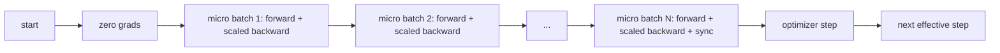
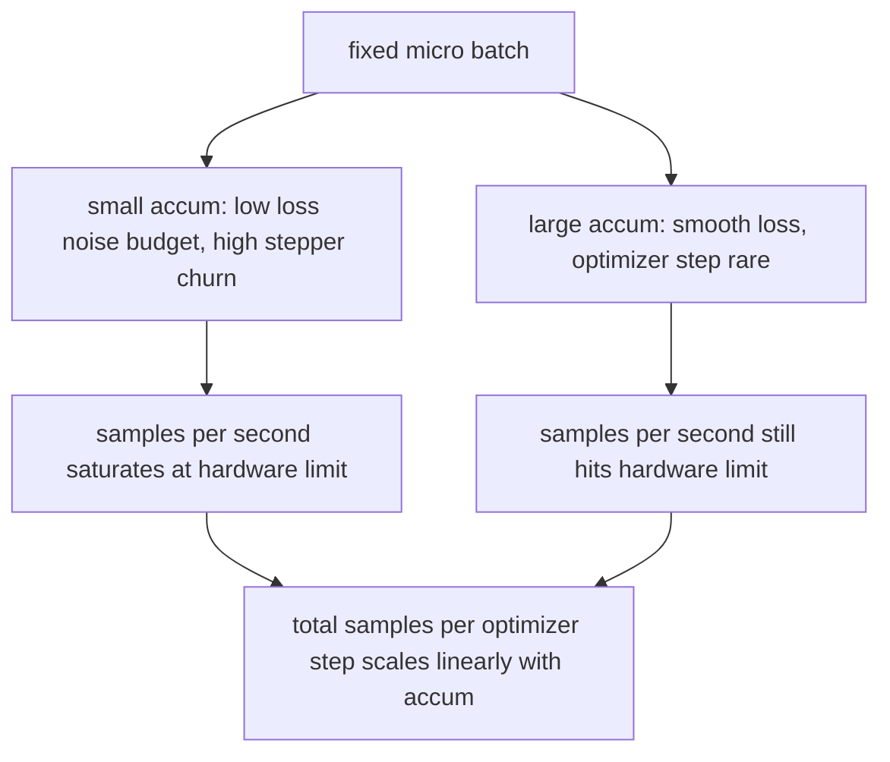

# Accumulation progressive

> Traînez à un lot efficace que vous ne pouvez pas vous permettre, un micro lot à la fois.

**Type:** Build
**Languages:** Python
**Prerequisites:** Phase 19 lessons 42 to 45
**Time:** ~90 minutes

## Objectifs d'apprentissage

- Dériver l'identité effective du lot: `effective_batch = micro_batch * accum_steps`- Je suis désolé .
- Implémenter une mise à l'échelle de perte par micro lot afin que le gradient accumulé correspond à un seul lot complet en arrière.
- Sautez la synchronisation de l'optimisateur jusqu'au dernier micro-batch (synchronisation sur dernière étape).
- Lisez un débit par rapport à la courbe de lot effective et expliquez le rendement en diminution.

## Le problème

Vous voulez vous entraîner à un lot efficace de 512 parce que la courbe de perte est plus lisse et l'optimisateur de l'étape est plus logique à cette échelle. L'accélérateur de bureau contient 32 exemples avant de s'épuiser. Le double du lot n'est pas une option. La réduction du modèle à moitié n'est pas une option. Le truc que le champ a atteint en 2017 et n'a jamais cessé d'utiliser est d'exécuter 16 passes à l'envers, de laisser les gradients s'accumuler à l'intérieur des tampons de paramètres, et de ne pas passer l'optimisateur que lorsque le compte atteint la cible.

Le risque est que la perte ne soit plus le même nombre qu'elle l'était au plus grand lot. L'entropie croisée de 16 mini-batches sumées naïvement est 16 fois la perte d'un lot complet. Sans mise à l'échelle, la direction du gradient est correcte mais la magnitude est erronée, et l'étape d'optimisation est 16 fois trop grande. La correction est une division. La correction est également facile à oublier.

## Le concept



Le contrat est court:

- Les pertes pour chaque micro-batch sont divisées par `accum_steps`avant `backward()`PyTorch additionne les gradients en `param.grad`par défaut; la division repousse la somme courante dans la bonne échelle.
- L'optimisateur de démarrage prend une fois par lot effectif, après le dernier micro-batch en arrière.
- L'état de l'optimisateur (buffers de momentum, moments Adam) avance une fois par étape efficace, pas une fois par micro-batch.
- Sur un seul appareil, il s'agit de comptabilité. sur un groupe de rangs multiples, le même schéma enveloppe les micro-parties non finales dans une`no_sync`le dernier micro-batch réduit le gradient accumulé complet en un seul passage au lieu de payer le coût du réseau N fois.

### La preuve d'équivalence dans le code

```python
loss = criterion(model(x_full), y_full)
loss.backward()
opt.step()
```

est équivalent à

```python
for x, y in chunks(x_full, y_full, n):
    scaled = criterion(model(x), y) / n
    scaled.backward()
opt.step()
```

Le buffer de gradient accumulé à la fin de la boucle est le même tensor qu'un seul lot complet en arrière produirait.`equivalence_check`- Je suis désolé .

### Où vont les coûts

Chaque micro-batch coûte un avant et un arrière.`outputs/accum-curve.json`montre ce qui se passe lorsque le lot effectif se développe à micro-partie fixe:



Il n'y a pas de déjeuner gratuit.`accum_steps`Le temps de l'optimisation du mur est doublé par étape de l'optimisateur. Ce qui change, c'est la variance de l'estimation du gradient: au même budget du mur, vous avez fait moins d'étapes d'optimisation mais chacune a été moyenne sur plus d'échantillons.

```figure
cc-grad-accumulation
```

## Faites-le

`code/main.py`C'est un artefact qui fonctionne.

### Étape 1: vérification de l'équivalence

`equivalence_check()`La fonction de la commande de la même graine est de type "gradient buffer" qui est comparé à la même graine.`max_abs_diff < 1e-4`- Je suis désolé .

### Étape 2: modèle de synchronisation sur la dernière étape

`train_one_optimizer_step`Pour chaque micro lot, sauf le dernier.`no_sync_context(model)`. sur un seul processus le contexte est un no-op; sur DDP c'est là que le gradient all-reduce est omis.`sync_counter`enregistrent combien de fois nous avons quitté le champ no_sync; pour N micro-parties le nombre est un par étape effective, pas N.

### Étape 3: courbe de débit

`sweep_effective_batches`fonctionne sur le même modèle avec un micro-batch fixe et une liste des étapes d'accumulation.

- `samples_per_sec`: échantillons totaux vus divisés par temps par par le mur
- `median_step_ms`: 50e percentile par étape effective
- `sync_calls`: points collectifs exercés
- `avg_loss`: moyenne sur les étapes d'optimisation du balayage

La production se déplace en `outputs/accum-curve.json`et est réutilisable à partir d'un carnet.

- Je vais le faire.

```bash
python3 code/main.py
```

Le script imprime l'équivalence diff, puis la table de balayage, puis le chemin JSON.

## Utilisez-le

Dans la formation de production, l'accumulation de gradients vit derrière un bouton.`accumulation_steps = effective_batch // (micro_batch * world_size)`Les cadres que vous n'êtes pas autorisé à utiliser ici sont enveloppés dans la même boucle, mais les étapes sont les mêmes: élargir la perte, sauter la synchronisation sur les micros non définitifs, accumuler, étape une fois.

Trois modèles dans la nature:

- La taille du micro-batch est choisie pour saturer la mémoire de l'appareil.
- Le lot efficace est choisi à partir d'un calendrier de taux d'apprentissage.
- Le nombre d'accumulation est le pont entre les deux et le seul bouton que vous pouvez régler en temps d'exécution sans réécrire le chargement de données.

## La faire partir

`outputs/skill-gradient-accumulation.md`capture la recette pour qu' un paire puisse la déposer dans un nouveau repo: perte d'échelle par `accum_steps`, sauter la synchronisation de l'optimisateur sur les micros non finaux, passer l'optimisateur une fois par lot effectif, enregistrer le débit contre le lot effectif en JSON afin que le commerce soit visible.

## Exercices

1. Retournez la balayage avec `--num-steps 100`et des échantillons de graphes par seconde contre le lot effectif.
2. Ajouter une variante de mise à l'échelle incorrecte (pas de division) et afficher le paramètre diff à l'étape 1 contre la référence.
3. Swap SGD pour AdamW et confirmer l'état de l'optimisateur avance une fois par étape effective, pas une fois par micro-batch.
4. Introduisez une vraie`DistributedDataParallel`l'emballage et l'itinéraire de la`no_sync_context`Confirmer que les synchronisations ont chuté de N-1 par lot effectif.
5. Modifiez le contrôle d'équivalence pour comparer deux micro-écartements différents (2 par 8 contre 4 par 4) et expliquez toute tolérance dont vous avez besoin pour vous détendre.

## Les termes clés

| Term | What people say | What it actually means |
|------|-----------------|------------------------|
| Micro batch | The batch you forward | The slice that fits in memory in a single forward pass |
| Accum steps | Backward passes per step | Number of backwards summed before one optimizer step |
| Effective batch | The batch | Micro batch times accum steps times data parallel world size |
| Loss scaling | Divide by N | Per-micro-batch division so summed gradients match full batch |
| Sync on last | Skip the rest | Only run the gradient collective on the last backward in the window |

## Pour en savoir plus

- Les docteurs de PyTorch sur `DistributedDataParallel.no_sync`pour la version de production du jeu de synchronisation à la dernière étape.
- Goyal et coll., 2017, sur l'échelle linéaire pour l'entraînement de grands lots, la raison canonique de se soucier de la série efficace.
- PyTorch traqueur de sortie sur les interactions d'accumulation de gradients avec décaler de précision mixte.
- Les leçons de phase 19 42 à 45 couvrent le modèle, le chargement de données, l'optimisateur et l'échafaudage de formation que cette leçon suppose.
- La phase 19 de la leçon 47 couvre le point de contrôle et le relancement afin qu'une longue course d'accumulation survienne à un clocher de la cloche.
