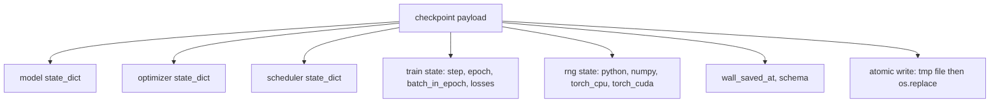
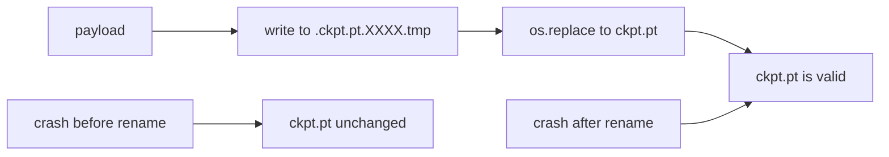
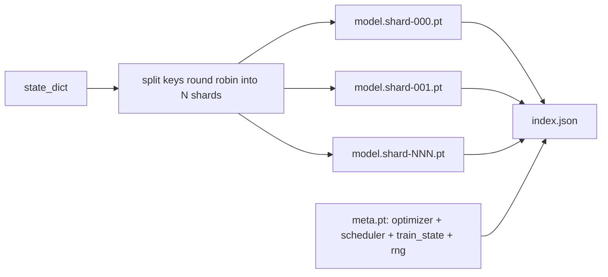

# Point de contrôle Enregistrer et Relancer

> Le train interrompt les sorties de la course, les points de contrôle laissent continuer.

**Type:** Build
**Languages:** Python
**Prerequisites:** Phase 19 lessons 42 to 45
**Time:** ~90 minutes

## Objectifs d'apprentissage

- Capturez l'état d'entraînement complet en une seule charge utile qui peut être rechargée dans un nouveau processus.
- Implémenter un sauvegarde atomique avec write-to-temp puis renommer afin qu'un crash ne laisse jamais un fichier à moitié écrit.
- Retournez l'état RNG pour Python, NumPy et PyTorch afin que la perte post-resume correspond à la ligne de base ininterrompue.
- Construisez une mise en page de point de contrôle fragmenté pour les modèles qui ne correspondent plus à un seul fichier, avec des fragmentations vérifiées par hash et un index JSON.

## Le problème

Vous avez fixé un emploi d'entraînement de 18 heures. Le couvercle de l'horloge est de 4 heures. Le cluster redémarre à 11 heures parce que quelqu'un au-dessus de votre grade de rémunération a approuvé une mise à niveau du noyau. Sans checkpoints, vous recommencez. Sans CV, vous perdez également l'état d'optimisation qui a pris les 11 premières heures pour apprendre, donc même si les poids du modèle ont survécu, les moments AdamW sont partis et la prochaine étape se cache dans une direction que la trajectoire d'entraînement avait déjà dépassée.

Le bon artefact est un seul fichier qui contient tout ce qui est nécessaire pour continuer: les paramètres du modèle, l'état de l'optimisateur, l'état du planificateur, l'historique de perte des parcelles, les compteurs de phase et d'époque actuels et de lot en époque, et l'état du RNG pour chaque source de hasard. Sans l'état RNG, la courbe de perte repris est une courbe différente. Le même modèle, les mêmes données, différents mélanges, différents masques de dérapagement, différents numéros sur le tableau de bord.

La rédaction d'un fichier temporaire dans le même répertoire et le renommé signifie qu'un enregistrement de l'autre moitié du contrat laisse le fichier bon précédent intact. Le renom est atomique sur les systèmes de fichiers POSIX.

## Le concept



### Les cinq seins de l'État

| Bucket | Why it matters |
|--------|----------------|
| Model | Weights and buffers; what the model is. |
| Optimizer | Momentum and adaptive moments; without these the next step is a different optimization problem. |
| Scheduler | Where the learning rate is on its curve; cosine schedules in particular care. |
| Train counters | Step, epoch, batch-in-epoch, plus the loss history that draws the dashboard. |
| RNG state | Determinism for dropout, data shuffling, and any sampling inside the model. |

### Réservation atomique



Deux règles. Premièrement, le fichier temporaire vit dans le même répertoire que la cible afin que le renom reste dans le même système de fichiers; renommées croisées d'appareils ne sont pas atomiques. Deuxièmement, le nom temporaire est unique par tentative afin que deux écrivains ne piétinent pas.

### Points de contrôle déchiquetés

Lorsque le modèle devient grand, la charge utile d'un seul fichier devient trop grande pour être chargée rapidement, trop grande pour être inspectée et trop douloureuse lorsqu'un réseau partage des hiccups au milieu de la lecture.



L'index enregistre le nombre de fragments, le sha256 de chaque fragment et le sha256 du fichier méta. Le chargement échoue fortement lorsque tout hash ne correspond pas. Les fragments peuvent atterrir sur différents disques physiques; le meta est petit et lit en premier.

### Le CV se poursuit au milieu de l'époque

Un CV qui correspond au début de la prochaine ère des déchets, de quelques minutes à un jour.`(epoch, batch_in_epoch)`Après la charge, la boucle d'entraînement fait avancer rapidement le générateur de nombres aléatoires au-delà des lots déjà consommés dans l'époque actuelle et se poursuit à partir de`batch_in_epoch`Le code de leçon fait exactement cela; l'affirmation est que la trajectoire de perte après le recommencement correspond à la ligne de base ininterrompue dans 1e-4.

```figure
cc-atomic-checkpoint
```

## Faites-le

`code/main.py`fourni quatre primitifs et un pilote de démonstration.

### Étape 1: capture et restauration de l'état de RNG

`capture_rng_state`Retourne un dicté avec Python `random.getstate`, NumPy's `np.random.get_state`, et les cycles de processeur PyTorch et CUDA RNG. `restore_rng_state`Le tensor de la CPU est un tampon de 8 octets que le RNG de PyTorch sait utiliser.

### Étape 2: sauvegarde atomique

`atomic_save`écrit la charge utile à un fichier temporaire dans le répertoire cible, puis `os.replace`Il change le nom de la famille en nom de famille.`atomic_write_json`Il en va de même pour l'indice fragmenté.

### Étape 3: Voyage aller-retour complet au point de contrôle

`save_checkpoint`Le système de gestion de la circulation de gaz et de gaz est un système de gestion de la circulation de gaz et de gaz.`load_checkpoint`l' inversera et lui rendra une `TrainState`. Le champ schéma est le crochet de mise à niveau: les changements de format futurs bousculent la chaîne de version et le chargement des envois.

### Étape 4: variante en morceaux

`save_sharded_checkpoint`Ronde-robin les touches de paramètre sur N shards, écrit chaque shard avec son propre sauvegarde atomique, écrit un fichier méta avec optimisateur et planificateur et train état, et écrit l'indice JSON avec shard sha256s. `load_sharded_checkpoint`Vérifie chaque fragment avant de fusionner.

### Étape 5: démo de résumé

`run_resume_demo`trains un petit modèle pour `total_steps`, garde un point de contrôle à `interrupt_at`La fonction renvoie la différence absolue maximale entre les deux trajectoires de perte après le point d'interruption. Avec le RNG restauré, la différence est nulle ou bruit de point flottant.

- Je vais le faire.

```bash
python3 code/main.py
```

Les démos en un seul fichier et en fragments affirment tous deux une différence maximale sous 1e-4.`outputs/resume-demo.json`- Je suis désolé .

## Utilisez-le

La formation de production accumule le point de contrôle du navire dans le cadre du trainer. La forme est la même: modèle + optimisateur + planificateur + compteur + RNG, écrit à l'atome, nommé par étape afin que le dernier soit facile à trouver.

Trois modèles à appliquer:

- **Schema is a string in the payload.**Sans elle, vous ne pouvez pas évoluter le format sans rompre les vieilles règles.
- **Sha256 every shard.**Un téléchargement silencieux est le pire type de bug; le chargement échoue rapidement ou il échoue tard.
- **Keep checkpoint cadence honest.**Gardez chaque N pas et chaque minute de l'horloge, selon le plus court.

## La faire partir

`outputs/skill-checkpoint-save-resume.md`est la recette pour tout nouveau script d'entraînement: forme de charge utile, écriture atomique, capture de RNG, index fragmenté.`save_checkpoint`au site de sauvegarde périodique, fil `load_checkpoint`au démarrage, et la course survit aux meurtres.

## Exercices

1. Remplacez le déchiquetage en rouleaux ronds par le déchiquetage par groupe de paramètres (couches terminant en `.weight`contre`.bias`Quand est-il préférable de faire chaque mise en page?
2. Élargir la boucle de sauvegarde pour garder les derniers points de contrôle K et tailler les plus anciens.
3. Ajouter un `--ckpt-every-seconds`flag qui déclenche un sauvegarde sur un intervalle de temps, pas seulement le compte de pas.
4. Ajoutez un chemin de vérification de la somme de contrôle qui fonctionne au démarrage, scanne tous les points de contrôle dans le répertoire et rapporte lesquels sont corrompus.
5. La mise en œuvre d'une `migrate_v1_to_v2`fonction qui ajoute un nouveau champ à la charge utile et bounce la chaîne de schéma. Faire la charge tolérer les deux versions.

## Les termes clés

| Term | What people say | What it actually means |
|------|-----------------|------------------------|
| Atomic save | "Write and pray" | Write to a temp file in the same directory, then os.replace into the target name |
| State dict | "The weights" | Model parameters and buffers, keyed by parameter name |
| Sharded checkpoint | "Big model file" | Multiple files, one per shard, plus a meta file and a JSON index with sha256s |
| RNG state | "Random seed" | Captured state for python random, numpy, torch CPU, torch CUDA; not just the seed |
| Mid-epoch resume | "Restart" | Fast-forward the RNG and continue from the next batch in the same epoch |

## Pour en savoir plus

- POSIX `rename`La sémantique de l' atomique affirme que `os.replace`Il dépend.
- Documents de PyTorch sur `torch.save`et `torch.load`, y compris `map_location`pour les restaurations entre appareils.
- La leçon 46 de la phase 19 couvre l'accumulation de gradients sur laquelle la charge utile du point de contrôle de cette leçon survit.
- La phase 19 leçon 48 couvre les emballages distribués dont le format de dictée de l'État est adapté à ce régime.
- Le noyau Linux `fsync`documentation de la garantie de durabilité derrière le renommé atomique.
