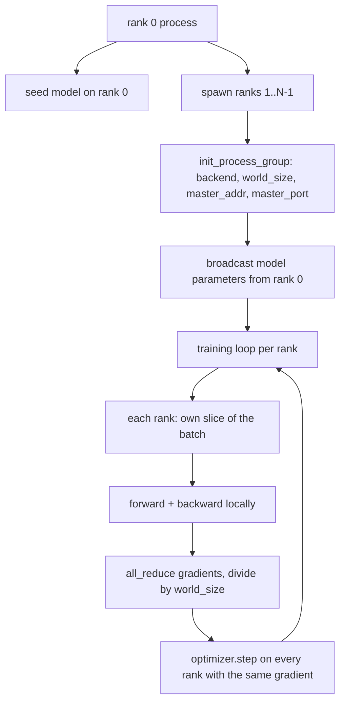
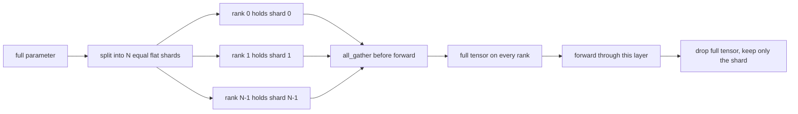

# Parallèle de données distribuées et FSDP depuis le début

> La formation multi-ranges est deux collectifs et une règle.

**Type:** Build
**Languages:** Python
**Prerequisites:** Phase 19 lessons 42 to 45
**Time:** ~90 minutes

## Objectifs d'apprentissage

- Rassembler un groupe de processus à travers N rangs avec le `gloo`Le backend, pas de matériel spécial.
- Implémenter un emballage DDP minimal qui transmet les paramètres à la construction et réduit complètement les dégradations après la rechute.
- Prouver que la réduction totale des gradients par rang correspond à un gradient de processus unique sur l'entrée concaténée.
- Déchiffrement des paramètres FSDP: chaque rang contient une tranche, le tensor complet est rassemblé pour le passage vers l'avant et laissé tomber après.

## Le problème

Le modèle s'adapte à un appareil. Le jeu de données ne le fait pas. Le budget d'optimisation dit que vous voulez voir N fois les exemples par seconde. Le premier levier est le parallèle des données: chaque rangage exécute le même modèle sur une tranche différente du lot, puis mesure les gradients moyens avant l'étape d'optimisation. Le second levier est le FSDP: le modèle ne s'adapte pas non plus à un dispositif, de sorte que chaque rang contient une fraction de chaque paramètre et reconstruit la totalité des tensors couche par couche pendant le passage vers l'avant.

La douleur est la comptabilité. Si les paramètres dérivent à travers les rangs, la course est silencieusement corrompue. Si vous faites la moyenne des gradients mais pas la perte, le tableau de bord est faux. Si le backend collectif ne peut pas se mettre d'accord sur une topologie, la course est suspendue pour toujours. La solution est d'écrire les collectifs à la main une fois et de ne jamais faire confiance à un enveloppe que vous ne pouvez pas reproduire.

Cette leçon fonctionne sur CPU.`gloo`Les navires de l' arrière-plan avec chaque PyTorch construit et accepte`torch.multiprocessing`les travailleurs; le même code passe à `nccl`sur un nœud multi-GPU sans modifier la structure.

## Le concept



### Les deux collectifs qui comptent

| Collective | What it does | When |
|------------|--------------|------|
| `broadcast` | Copy a tensor from one rank to all others | Parameter init, scheduler state, any one-to-all sync |
| `all_reduce` | Sum (or mean, or max) a tensor across all ranks, every rank gets the result | Gradient averaging after backward |
| `all_gather` | Each rank contributes a tensor, every rank gets the concatenation | Logits collection, FSDP parameter unshard |

Le contrat de DDP est `broadcast`dans la construction et `all_reduce`Le schéma du FSDP ajoute:`all_gather`avant le passage vers l'avant de chaque couche.

### Les moyennes de gradients correspondent à la gradiente de processus unique

Un modèle formé sur un lot d'exemples B sur N rangs doit produire le même gradient qu'un seul processus d'entraînement sur un lot de N*B. Le truc est que la somme des gradients par rang et la division par N donne le gradient de perte moyen, ce qui est ce que l'entropie croisée avec une réduction moyenne produirait sur le lot complet.`max-abs-diff < 1e-3`entre le gradient manuel de réduction totale et le gradient de référence de processus unique.

### Scénario du FSDP



La mémoire gagne est exacte: la mémoire par rang pour les paramètres tombe à 1/N. Le coût est le collect, qui est payé chaque passage vers l'avant. La production FSDP chevauchera le collect avec le calcul de la couche précédente de sorte que le coût de l'horloge de mur est beaucoup plus petit que la prédiction de la comptabilité naïve. La leçon fait le tour par chaque paramètre et affirme que la reconstruction est un bit égal à l'original.

### CPU et le fond de l'écran

CUDA est la cible de production, mais les mêmes chemins de code existent sur le processeur. `gloo`C'est le backend collectif du CPU.`nccl`Les classes sont initialisées en utilisant la formule de l'interface de l'API.`backend="gloo"`et des rangs sont engendrés avec `torch.multiprocessing`plutôt que `torchrun`Les deux finissent par la même chose .`torch.distributed`Sur un nœud multi-GPU, les seules modifications sont `backend="nccl"`, tensors de dispositif, et `torchrun`pour le lancer.

```figure
cg-allreduce-ring
```

## Faites-le

`code/main.py`est l'artefact couru.

### Étape 1: mettre en avant le groupe de processus

```python
os.environ["MASTER_ADDR"] = "127.0.0.1"
os.environ["MASTER_PORT"] = str(port)
dist.init_process_group(backend="gloo", rank=rank, world_size=world_size)
```

`MASTER_ADDR`et `MASTER_PORT`Les classes choisissent un port libre par un truc de liaison et de fermeture pour éviter les collisions lorsque plusieurs courses partagent une machine.

### Étape 2: diffusion en cours de construction

`MinimalDDP.__init__`passe tous les paramètres et tampons et appels `dist.broadcast(tensor, src=0)`Les valeurs de rang 0 deviennent l'initial canonique.

### Étape 3: réduire complètement les gradients après la reprise

```python
def all_reduce_grads_(module, world_size):
    for p in module.parameters():
        if p.grad is None:
            p.grad = torch.zeros_like(p.data)
        dist.all_reduce(p.grad.data, op=dist.ReduceOp.SUM)
        p.grad.data.div_(world_size)
```

Chaque rang se termine avec le même gradient moyen. L'optimisateur est maintenant une fonction de la même entrée sur chaque rang, c'est pourquoi les paramètres restent en synchronisation tout au long de la course.

### Étape 4: prouver l'équivalence

`manual_all_reduce_matches_single_process`construit le même modèle sur le rang 0 et compare le gradient post-all-reduce contre le gradient qu'un seul processus calculerait sur l'entrée concaténée.

### Étape 5: Voyage aller-retour du FSDP

`fsdp_round_trip_sketch`l'appareil d'appliquage de chaque paramètre, les épingles à un multiple de `world_size`La reconstruction de chaque rang est égale à l'original. Ceci est l'étape non fractionnée; l'inverse (re-fractionnée après l'avant) est une tranche du tensor recueilli.

- Je vais le faire.

```bash
python3 code/main.py
```

La taille par défaut du monde est 2. Deux processus CPU se reproduisent, parlent à travers `gloo`, et la sortie de zéro.`outputs/ddp-demo.json`capture des sumes de paramètres par rang, la norme de gradient après tout-réduire, le résultat du retour-retour du FSDP et la différence de gradient manuel versus référence.

## Utilisez-le

Les stacks de formation de production appellent les mêmes primitifs.`DistributedDataParallel`ajoute: crochets de gradient post-rétrograde qui se chevauchent tout-réduire avec tout-réduire arrière, bouqueté qui combine plusieurs petits gradients en un collectif, et le `no_sync`le contexte de la leçon 46 utilisé.

Le FSDP de PyTorch ajoute: une vue de paramètre plat par couche afin que chaque rang contient un tampon contigu, un chevauchement de l'unshard de la couche suivante avec le calcul de la couche actuelle, et une décharge optionnelle de la CPU pour les shards.

La forme reste la même: diffusion au démarrage, réduction après retrait, déchiquetage des paramètres lorsqu'ils ne s'adaptent plus.

## La faire partir

`outputs/skill-distributed-fsdp-ddp.md`Il contient la recette d'un nouveau script de formation:`gloo`pour la CPU et `nccl`pour GPU, enveloppez le modèle dans une coque DDP qui diffuse à la construction et réduit après la rétroviseur, optionnellement déchiffrer les paramètres avec le modèle all_gather de l'esquisse FSDP.

## Exercices

1. Courez avec `--world-size 4`et confirmer que le paramètre de diffusion reste inférieur à 1e-3 tout au long de la course.
2. Remplacez la moyenne manuelle par `dist.all_reduce(op=dist.ReduceOp.AVG)`et le temps la différence.
3. Ajouter un crochet post-retardé à l'emballage DDP afin que le tout-réduire se chevauche avec le reste du rétard; mesurer l'amélioration de l'horloge murale.
4. Mettez en œuvre l'étape de ré-shard FSDP: après le passage vers l'avant, remplacez à nouveau le tensor complet par le shard local. Confirmez les baisses de mémoire par rang.
5. Passez à l' arrière-plan`nccl`Notez quelles variables de l'environnement changent et lesquelles restent les mêmes.

## Les termes clés

| Term | What people say | What it actually means |
|------|-----------------|------------------------|
| Backend | "gloo or nccl" | The library that implements the collective ops; gloo is CPU, nccl is GPU |
| World size | "Total ranks" | Number of processes in the group; the group is the unit collectives operate on |
| Rank | "Worker id" | Process identifier within the group, zero indexed |
| All-reduce | "Sum the grads" | Sum a tensor across all ranks, every rank ends with the same result |
| Unshard | "Gather the params" | Reconstruct the full tensor from per-rank slices via all_gather |

## Pour en savoir plus

- PyTorch `torch.distributed`La documentation de la sémantique collective sur laquelle repose cette leçon.
- Le `gloo`la liste collective de la bibliothèque, identique en forme à celle du CUDA `nccl`Les primitifs.
- La phase 19 leçon 46 pour le modèle d' accumulation de gradients qui enveloppe le DDP tout-réduire en `no_sync`- Je suis désolé .
- L'étape 19 leçon 47 pour la mise en page du point de contrôle qui survit aux opérations DDP et FSDP.
- La documentation FSDP PyTorch pour la mise en œuvre de la production du déchiquetage des paramètres décrite ici.
