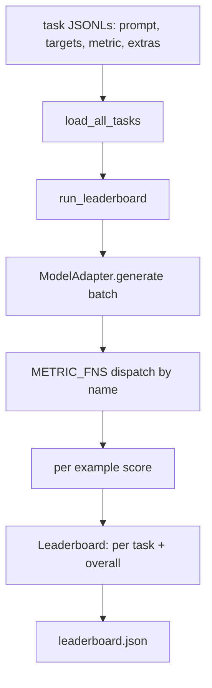
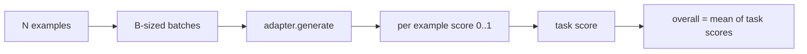

# Le modèle d'évaluation de la langue

> Un modèle qui réussit bien dans une tâche que vous ne pouvez pas définir est un modèle qui réussit bien par hasard.

**Type:** Build
**Languages:** Python
**Prerequisites:** Phase 19 lessons 42 to 45
**Time:** ~90 minutes

## Objectifs d'apprentissage

- Définir une tâche comme un fichier JSONL avec `prompt`- Je suis là .`targets`- Je suis là .`metric`, et facultatif `extras`Par exemple.
- Implémenter cinq mesures: correspondance exacte, rouge-l F1, vérification exécutable, choix multiple et contenu de sous-chaîne.
- Construisez un runner qui collecte des exemples par tâche et envoie à un adaptateur de modèle échangeable.
- Émettez un JSON de classement avec des scores par tâche, une latence et une moyenne globale reproduisable.

## Le problème

Un nouveau modèle de langage arrive chaque semaine. La revendication du marketing est qu'il fonctionne bien. La question honnête est: bien à quoi? La réponse honnête est le tableau de classement que vous avez écrit vous-même, parce que le tableau de classement du fournisseur est celui auquel ils ont accordé.

Sans harnais dans votre repo, vous comparez deux modèles par vibration. Avec un harnais, vous les comparez par score sur un ensemble de tâches fixes avec une métrique fixe, sur une sortie JSON, vous pouvez différer. Le harnais est le contrat entre la course d'hier et la course d'aujourd'hui. Sans lui, les régressions vont.

Le piège est de trop adapter le harnais à un seul modèle. La solution est la même piège à l'envers: le harnais est assez petit pour être lu en quinze minutes, les tâches sont assez petites pour être expédiées dans le repo, les mesures sont écrites à partir de zéro pour qu'un collègue puisse les vérifier, et l'adaptateur est le seul endroit où le code spécifique au modèle vit. S'échangez l'adaptateur, le tableau de bord bouge; échangez les tâches, le tableau de bord bouge. Rien d'autre ne devrait bouger.

## Le concept



### Spécifications des tâches

Chaque exemple est une ligne JSONL:

```json
{"id": "arith-00", "prompt": "compute: 2 + 2", "targets": ["4"], "metric": "exact_match"}
```

Pour les mesures qui ont besoin de points d'aide,`extras`porte la charge utile latérale:

```json
{
  "id": "code-00",
  "prompt": "python: write a function f that doubles its input",
  "targets": ["ok"],
  "metric": "code_exec",
  "extras": {"io_pairs": [[1, 2], [3, 6]]}
}
```

Une tâche est une tâche.`.jsonl`fichier sous `outputs/tasks/`Le nom du fichier est le nom de la tâche. Tous les exemples dans un fichier partagent une métrique.

### Les cinq tâches de fixation

| Task | Metric | What it tests |
|------|--------|---------------|
| arithmetic | exact_match | Token-level correctness on a deterministic answer |
| summary | rouge_l | Longest common subsequence F1 against a one-line reference summary |
| code-exec | code_exec | Executable test: the predicted function must satisfy a list of input-output pairs |
| multiple-choice | multiple_choice | First letter of the prediction must match an allowed letter |
| generation | substring_contains | Free-form text must contain at least one target substring |

### Le contrat métrique

Chaque métrique est une fonction de `(prediction, targets, extras) -> float in [0.0, 1.0]`Le harnais donne une moyenne des scores par exemple pour obtenir un score de tâche, puis une moyenne des scores de tâche pour obtenir le total.

- `exact_match`: minuscules, éclat de l'espace blanc, égalité.
- `substring_contains`: même normalisation, test de sous-string.
- `multiple_choice`: premier caractère en haut.
- `rouge_l`: Longueur du LCS divisée par longueur de prédiction et de référence, F1 de précision et de rappel.
- `code_exec`: exécuter la prédiction dans un espace de noms restreint, appeler `f(x)`sur chaque paire d'entrée-sortie, compter les correspondances.

La métrique code_exec exécute la prédiction dans un espace de noms de composants dérivé.`import os`Il explose parce que `os`n'est pas dans l'espace de noms; vous ne pouvez pas atteindre le système de fichiers à partir d'une prédiction de code.

### L'adaptateur du modèle

```python
class ModelAdapter(Protocol):
    def generate(self, prompts: Sequence[str]) -> List[str]: ...
    @property
    def name(self) -> str: ...
```

L'adaptateur est la couture.`ToyAdapter`Un véritable adaptateur appelle le modèle et le rend.

### Le coureur

`run_task`lots `batch_size`Les instructions sont envoyées à la fois et envoyées à la fonction métrique. `run_leaderboard`Il accomplit toutes les tâches et les moyennes. `write_leaderboard`émet JSON avec une chaîne de schéma afin que les changements de format futurs ne brisent pas silencieusement les tableaux de bord.



```figure
eval-harness-matrix
```

## Faites-le

`code/main.py`est l'artefact couru.

### Étape 1: tâches de fixation des semences

`seed_fixture_tasks(target_dir)`écrit le cinq `.jsonl`Les dossiers.`main.py`les semer lorsque le répertoire est vide.

### Étape 2: tâches de chargement

`load_all_tasks(task_dir)`Il lit tout .`.jsonl`et renvoie un dicté du nom de la tâche à une liste de `Example`Les commentaires commencent par `#`et les lignes vides sont saisies afin que les contributeurs puissent annoter les fichiers.

### Étape 3: mettre en œuvre des mesures

Chaque métrique est une petite fonction avec un test unitaire. La suite de tests de la leçon comprend 13 cas couvrant la normalisation, la superposition partielle, l'exécution du code et le rejet du code dangereux.

### Étape 4: écrire le coureur

`run_task`Il y a des variations de la quantité de produits.`TaskResult`avec un score, un nombre correct, un nombre total et une latence. `run_leaderboard`Il accomplit toutes les tâches et produit un`Leaderboard`avec la moyenne globale.

### Étape 5: émettez JSON

`write_leaderboard`La série de la carte.`--include-per-example`flag dépose les enregistrements par exemple afin que vous puissiez différencier les prédictions par rapport à la course précédente lorsque les scores bougent.

- Je vais le faire.

```bash
python3 code/main.py
```

Le script seme les fixtures lors de la première course, les note avec l'adaptateur de jouets (qui obtient chaque fixation correctement), et écrit `outputs/leaderboard.json`. Le score global est de 1,0 avec l' adaptateur de jouets; le test de l' adaptateur de bâton en `test_main.py`montre le même harnais produit 0,0 lorsque l'adaptateur ne peut pas répondre.

## Utilisez-le

Pour brancher un vrai modèle, écrivez un adaptateur.

```python
class HttpAdapter:
    name = "vendor.v1"

    def __init__(self, endpoint, api_key):
        self.endpoint = endpoint
        self.api_key = api_key

    def generate(self, prompts):
        out = []
        for prompt in prompts:
            response = http_post(self.endpoint, prompt, self.api_key)
            out.append(response["text"])
        return out
```

Échange `ToyAdapter`pour `HttpAdapter`au sommet de `main()`Le harnais, les tâches, les mesures et le classement restent les mêmes.

Trois modèles à appliquer lors de l'expédition du harnais dans un projet réel:

- **Pin the task files.**Le leaderboard.json contient le contenu de tâche en hachage ou il contient les JSONL à côté; sinon le score se déplace lorsque le fichier de tâche le fait, et vous ne pouvez pas dire lequel.
- **Diff predictions, not just scores.**Le `--include-per-example`flag vous permet de voir ce que le modèle a dit le jour où le score est tombé.
- **Cap the batch size.**Les adaptateurs réels ont des limites de vitesse.

## La faire partir

`outputs/skill-lm-eval-harness.md`contient la recette: JSONL spécification de tâche, cinq métriques, adaptateur échangeable, coureur en lots, tableau de classement JSON avec chaîne de schéma.`outputs/tasks/`Les installations sont les fixations; copier dans un projet réel comme un débutant.

## Exercices

1. Ajoutez une sixième tâche avec une métrique personnalisée que vous écrivez à partir de zéro (coupe-chef de BLEU, score de référence de BLEURT, tout ce qui a un contrat clair).
2. Extension `code_exec`pour capturer les échecs et accepter une liste des échecs attendus comme cibles.
3. Ajouter une commande de classement différent: donné deux `leaderboard.json`les fichiers, imprimer quelles tâches ont été déplacées et par combien.
4. La latence de la limite par exemple. Enveloppez l'appel de l'adaptateur dans un délai; surface séparée `timeouts`colonne dans le tableau de classement.
5. Pin le contenu de la tâche avec un sha256 dans le tableau de classement afin qu'un lecteur futur puisse vérifier qu'il a obtenu les mêmes tâches.

## Les termes clés

| Term | What people say | What it actually means |
|------|-----------------|------------------------|
| Task spec | "The eval format" | JSONL file with prompt, targets, metric, optional extras per example |
| Metric | "How you score" | Function from (prediction, targets, extras) to a float in [0, 1] |
| Adapter | "The model client" | Object with a generate(prompts) -> list[str] method; the only model-specific code |
| Leaderboard | "The scoreboard" | JSON with per-task scores, total counts, latency, and an overall average |
| Code exec metric | "Run it and check" | Execute the prediction in a restricted namespace, compare against input-output pairs |

## Pour en savoir plus

- Le harnais d'évaluation de l'im-original pour la référence de production, beaucoup plus grand mais de même forme.
- L'accord de HuggingFace pour une mise en œuvre alternative du même contrat.
- La phase 19 leçon 46 couvre les modèles d'accumulation de gradients utilisés dans l'empilement d'entraînement les scores de harnais.
- La phase 19 leçon 47 couvre le format du point de contrôle contre lequel vous marquez; pinchez le hash du point de contrôle dans le tableau de classement.
- La phase 19 leçon 48 couvre la pile de formation distribuée qui a produit le modèle en cours d'essai.
