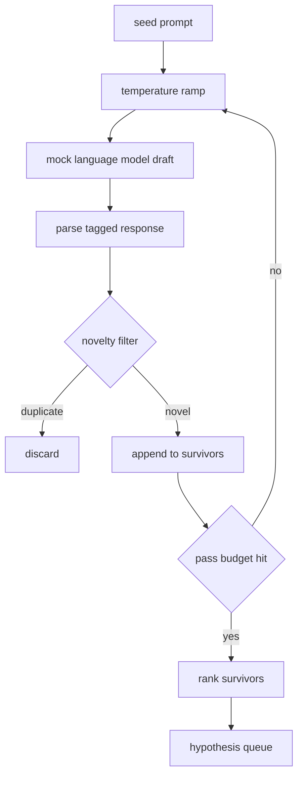

# Générateur d'hypothèses

> Un agent de recherche qui pose la même question deux fois gaspille des jetons.

**Type:** Build
**Languages:** Python
**Prerequisites:** Phase 19 Track A lessons 20-29
**Time:** ~90 minutes

## Objectifs d'apprentissage
- Faites passer un échantillon à partir d'une demande de semence et transformez ses résultats en enregistrements d'hypothèses typés.
- Ramp la température de l'échantillon sur chaque passage de sorte que le prochain projet dérive plus loin de la dernière.
- Filtre près de duplicates avec un petit modèle d'intégration et un seuil de distance cosine.
- Réglez les survivants avec une fonction de notation qui mélange nouveauté, spécificité et testabilité.
- Gardez chaque étape déterministe de sorte que la même graine produit toujours la même file d'attente.

## Pourquoi générer, puis filtrer

Un planificateur qui pose une seule question à un modèle une fois obtient une hypothèse. C'est bien pour un exemple travaillé. Pour une boucle de recherche, c'est la mauvaise forme. La boucle veut une file d'attente classée avec profondeur, de sorte que lorsque la première hypothèse échoue, le coureur a la suivante prête sans payer pour un autre passe d'échantillonnage complet.

Deux idées se combinent pour produire cette file d'attente. Le premier est la température de rampe: chaque passage à travers le échantillon augmente la température d'une tranche, de sorte que les projets ultérieurs sont encouragés à errer. Le second est le filtrage de nouveauté: après chaque projet, le générateur mesure la distance d'embedding de chaque survivant précédent et rejette tout ce qui se trouve à l'intérieur du grappillage.

La leçon envoie un modèle de langage simulateur qui renvoie des séquences de jetons scriptées pour les invites fixes. La simulation est suffisante pour exercer le chemin complet: invitation de semence, rampe de température appliquée, candidats analysés, filtre de nouveauté exécuté, rangé file d'attente.

## La forme de l'hypothèse

```text
Hypothesis
  id             : int           (monotonic within a run)
  text           : str           (the claim)
  variables      : list[str]     (what changes between conditions)
  metric         : str           (what the runner will measure)
  baseline_ref   : str | None    (which paper or run the comparison cites)
  draft_pass     : int           (which sampler pass produced this)
  temperature    : float         (the sampler setting at draft time)
  novelty_score  : float         (distance from prior survivors, 0..1)
  rank_score     : float         (weighted sum used for ordering)
```

`variables`et `metric`Le coureur de la leçon 52 lit ces champs directement lorsqu'il construit la configuration de l'expérience.

`baseline_ref`L'évaluation de la leçon 53 a besoin d'une ligne de base pour comparer. Si l'hypothèse en omet une, l'évaluation revient à la mise en œuvre précédente sur la même métrique.

```figure
cg-novelty-ramp
```

## Architecture



La boucle est droite, mais chaque boîte a un contrat difficile.

## Rampe de température

Commencez par `t_min`, fin à `t_max`, étape `(t_max - t_min) / (n_passes - 1)`. Chaque passage appelle l'échantillonneur à la température actuelle, produisant `n_passes`des valeurs uniformément espacées de `GeneratorConfig.schedule()`. Le modèle de simulation honore la température en passant entre un petit ensemble de réponses scriptées accélérées `(prompt, temp_bucket)`Les seins sont des intervalles ouverts, de sorte qu'un petit changement de température choisit un seau différent et produit un projet différent.`temperature=t`Il est passé.

Le calendrier par défaut est de 6 passes à partir de `0.2`à `1.2`Six suffit à remplir la file d'attente sans payer pour des échantillons que le filtre de nouveauté rejettera de toute façon.`0.2`Le modèle retourne la graine.`1.2`Les réponses ont tendance à dériver du sujet et à échouer dans le parseur.

## Filtre de nouveauté

Après chaque projet est analysé, le générateur intègre le texte et compare contre chaque hypothèse acceptée. L'intègre est un petit sac haché de jetons de mots, normalisé à la longueur unitaire.`1 - dot(a, b)`Un projet est approuvé si sa distance minimale avec un survivant est supérieure .`novelty_threshold`- Par défaut`0.25`- Je suis désolé .

L'intégration hashée n'est pas fancy. Elle est déterministe, a zéro dépendances, et suffit pour saisir le cas évident: deux projets qui partagent la plupart de leurs noms. Un déploiement de production échangeait dans un modèle de petite phrase. L'interface reste la même.

## Score de rang

```text
rank_score = w_novelty * novelty_score
           + w_specificity * specificity_score
           + w_testability * testability_score
```

Trois points sous.`novelty_score`est la distance minimale d'intégration des survivants précédents. `specificity_score`est le nombre de variables concrètes de l'hypothèse divisé par un nombre cible. `testability_score`est un si l'hypothèse spécifie à la fois une métrique et une ligne de base, la moitié si elle n'a qu'une métrique, zéro autrement.

Les poids par défaut sont `0.4`- Je suis là .`0.3`- Je suis là .`0.3`Les poids sont dans le générateur, donc une leçon en aval peut les déplacer sans forcer le code.

## Modèle de langue de simulation

```python
class MockLLM:
    def sample(self, prompt: str, temperature: float, seed: int) -> str:
        ...
```

Le prélèvement est déterminant étant donné un`(prompt, temperature, seed)`La simulation maintient une table de réponse scriptée accroché`(prompt_signature, temperature_bucket)`Si la table ne contient pas d'entrée pour une clé, le prélèvement de l'échantillon renvoie un retrait qui échoue au parseur.

La graine est mélangée dans la réponse de sorte que la même`(prompt, temperature)`Les résultats obtenus par les tests sont reproductibles, mais dans un déploiement réel, le grain provient d'une horloge système ou d'un compteur.

## Cote de sortie

La sortie est une liste de `Hypothesis`enregistrements triés par `rank_score`Le coureur de la leçon 52 fait le test, et l'évaluateur de la leçon 53 rédige un verdict. Si le verdict dit que l'hypothèse était erronée, le coureur fait le suivant.

Quand il est vide, l'orchestre peut ou bien élargir le bouton de semence et redémarrer le générateur ou s'arrêter et déclarer l'épuisement du budget.

## Comment lire le code

`code/main.py`définit `Hypothesis`- Je suis là .`MockLLM`- Je suis là .`HypothesisGenerator`Le générateur expose une seule`run(seed_prompt)`méthode qui renvoie une file d'attente triée; le nombre de passes est lu à partir de `GeneratorConfig.n_passes`Le filtre de nouveauté est une seule fonction. Le score de rang est une seule fonction. Rien ne dépend de`numpy`Le calcul intégré est pur stdlib donc la leçon reste portable.

`code/tests/test_generator.py`couvre le chemin linéaire, le chemin de rejet en double, le chemin de défaillance du parseur, les limites de la rampe de température et l'ordre de rang.

## Où cette fente dans

La leçon cinquante-un prend la tête de la file d'attente et effectue une recherche littéraire pour la confirmer ou la réfuter. La leçon cinquante-deux prend la même tête et fait une expérience réelle. La leçon cinquante-troisième lit les deux sorties et écrit un verdict. Les quatre leçons se composent en une boucle de recherche sans humain; un humain peut entrer à n'importe quelle frontière.
