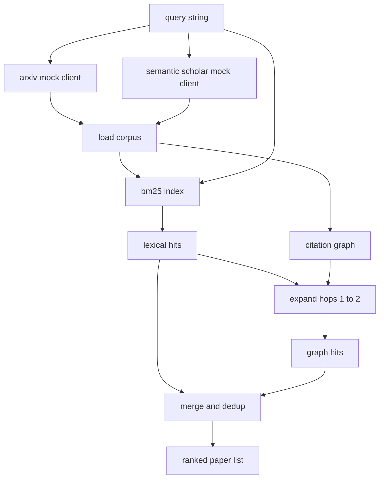

# La récupération de la littérature

> Une hypothèse est bon marché. Savoir si quelqu'un l'a déjà prouvée est la partie la plus chère. Construire la couche de récupération qui répond à cette question avant que le coureur tourne une boîte à sable.

**Type:** Build
**Languages:** Python
**Prerequisites:** Phase 19 Track A lessons 20-29
**Time:** ~90 minutes

## Objectifs d'apprentissage
- Modélisez un petit dossier papier avec les champs que la boucle lisera en aval.
- Construire un indice BM25 sur les résumés avec des structures de données stdlib seulement.
- Faites un graphique de citations pour les documents de surface que la recherche léxicale a manqué.
- Déduplicer les coups sur le lexique et le graphique passe par un id papier stable.
- Enveloppez deux faux API externes derrière un seul client afin que le site d'appel en amont reste le même lorsque les points d'extrémité réels atterrissent.

## Pourquoi deux passes de récupération

Une recherche de mots clés sur les résumés renvoie des documents qui partagent le vocabulaire avec la requête. Ça couvre la plus grande partie de la surface. Il manque deux affaires. Le premier est lorsque le document fondamental utilise un vocabulaire différent; par exemple, une requête pour "attention sparse" manque un document intitulé "sélection de bloc dans le routage des transformateurs". Le second est lorsque le document pertinent est un suivi qui cite une ancre connue; il est plus efficace de trouver l'ancre et de marcher en avant que de forcer brutalement le bassin abstrait.

La leçon construit les deux passes. BM25 sur les résumés capture les hits lexicaux. Un traversage de graphes de citation élargit une graine posée en avant et en arrière par un ou deux sauts. L'union est déduplicée par id papier et classée par un petit score combiné.

## La forme du papier

```text
Paper
  id          : str           (stable identifier, "p001" for the mock corpus)
  title       : str
  abstract    : str
  year        : int
  authors     : list[str]
  references  : list[str]     (paper ids this paper cites)
  citations   : list[str]     (paper ids that cite this paper)
  source      : str           (which mock api supplied it, "arxiv" or "s2")
```

Les deux FAI simulées retournent des champs qui se chevauchent mais ne sont pas identiques, de sorte que le chargement du corpus les unit sur `id`- Je suis désolé .

```figure
cg-citation-hops
```

## Architecture



Le client de récupération possède les deux passes et la fusion. L'appelant lui remet une requête et reçoit une liste classée où chaque entrée contient des champs de score par papier (`bm25_score`- Je suis là .`graph_distance`- Je suis là .`recency_score`- Je suis là .`final_score`) qui expliquent le classement.

## BM25 à partir de zéro

L' implémentation est la norme Okapi BM25 avec des paramètres par défaut `k1=1.5`- Je suis là .`b=0.75`L' index est constitué de deux dictionnaires:`term -> doc_frequency`et `term -> list of (doc_id, term_count)`La longueur du document est le nombre de symboles de l'abstract. La longueur moyenne du document est calculée une fois au moment de la création de l'index.`idf * tf_norm`où `tf_norm`est la fréquence normalisée de la durée standard BM25.

Le tokeniser est `lower`Il est donc possible de faire une conversion en un système de production qui se change en un petit voteur.

```text
idf(t)      = log((N - df + 0.5) / (df + 0.5) + 1.0)
tf_norm(t)  = (f * (k1 + 1)) / (f + k1 * (1 - b + b * dl / avgdl))
score(d, q) = sum over t in q of idf(t) * tf_norm(t)
```

## Traversage du graphique de citation

Le graphique est construit une fois à partir du corpus. Les bords avant vont d'un papier à ses références. Les bords arrière vont d'un papier à ses citations. Le travers est une largeur de première recherche semée par les meilleurs hits BM25, plafonnée à deux sauts.

Deux sauts sont un plafond délibéré. Un saut est trop peu profond; l'agent veut souvent l'ancêtre ou le descendant immédiat. Trois sauts fait exploser la taille du résultat sur un graphique connecté et tend à dériver du sujet. La leçon expose la limite de saut comme un bouton de configuration afin qu'une boucle en aval puisse la serrer.

## Déduction et classement

Les deux passes retournent des ensembles qui se chevauchent. Les clés de fusion sur le papier id. Pour chaque papier, le score final est un mélange pondéré.

```text
final_score = w_bm25 * bm25_score_norm
            + w_graph * graph_score
            + w_recency * recency_score
```

`bm25_score_norm`est le score BM25 divisé par le score maximum BM25 dans l'ensemble fusionné (donc le champ vit en zéro à un). `graph_score`est une pour les hits directes lexicaux, alors `0.6`pour un seul saut, `0.3`Pour deux sauts, nul sinon. `recency_score`est une rampe linéaire allant de zéro à l'année minimale du corpus à une à la plus grande.

Les poids par défaut sont `0.5`- Je suis là .`0.3`- Je suis là .`0.2`Les poids sont config; un sujet obsolète peut réduire la récente tandis qu'un sujet en mouvement rapide le soulève.

## Corpus de faux

Le corpus est de cent documents, générés par `build_corpus()`. Chaque article a un titre écrit à la main et un résumé sur un des cinq sujets: attention sparsity, augmentation de la récupération, adaptateurs de basse qualité, distillation de l'ensemble de données et harnais d'évaluation.

Les deux faux clients API (`ArxivMockClient`- Je suis là .`SemanticScholarMockClient`L'archivage renvoie le titre, l'abstract, l'année, les auteurs. Semantic Scholar ajoute des références et des citations.

## Quelles leçons 52 et 53 lisent

Le coureur de la leçon 52 dit:`paper.id`- Je suis là .`paper.title`L'évaluateur de la leçon 53 lit:`paper.year`et `paper.references`d'attribuer une ligne de base à un document spécifique.

Le client de récupération renvoie une `RetrievalResult`Le coureur les enregistre afin qu'un passage d'observabilité en aval puisse tracer la qualité au fil du temps.

## Comment lire le code

`code/main.py`définit `Paper`- Je suis là .`ArxivMockClient`- Je suis là .`SemanticScholarMockClient`- Je suis là .`BM25Index`- Je suis là .`CitationGraph`- Je suis là .`RetrievalClient`La mise en œuvre de BM25 est une classe, soixante lignes. Le traversage du graphique est une méthode.

`code/tests/test_retrieval.py`couvre le chemin lexique, le chemin du graphique, la fusion, le dédupe et la requête vide.

## Où cette fente dans

La leçon cinquante produit une hypothèse. La leçon cinquante-un recherche la littérature pour voir si cette hypothèse est déjà réglée. La leçon cinquante-deux exécute l'expérience si ce n'est pas le cas. La leçon cinquante-troisième lit à la fois le résultat de la récupération et les mesures de l'expérience pour écrire le verdict. Le client de récupération est le moins cher des quatre étapes et se déroule en premier dans l'orchestreur.
