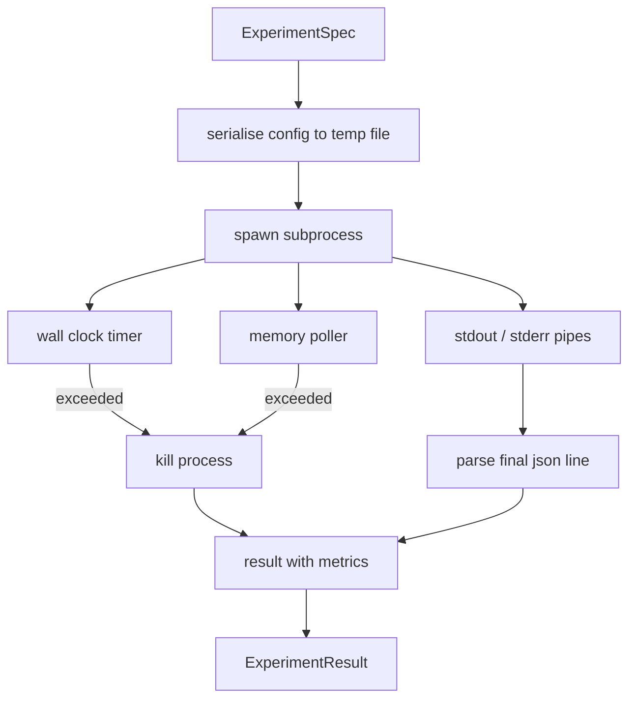

# Coureur expérimental

> La boucle est aussi honnête que ses mesures. Construisez le coureur qui prend une spécification, l'exécute dans un sous-processus sandboxé, et émet une tache de métriques json que l'évaluateur peut faire confiance.

**Type:** Build
**Languages:** Python
**Prerequisites:** Phase 19 Track A lessons 20-29
**Time:** ~90 minutes

## Objectifs d'apprentissage
- Encodez une expérience comme une spécification typée que le coureur peut sérialiser en un sous-processus.
- Lancez un sous-processus avec un temps de délais dur et un capuchon de mémoire doux, et la surface les deux comme conditions terminales.
- Capturez stdout, stderr et les taches de métriques structurées dans un seul enregistrement de résultats.
- Construisez une table d'ablation qui balaie un bouton de configuration à la fois sur une spécification de base fixe.
- Gardez chaque résultat déterministe donné une graine de sorte que l'évaluateur voit les mêmes nombres à travers les courses.

## Pourquoi un sous-processus

Une boucle de recherche exécute un code non fiable. L'hypothèse est venue d'un échantillonneur, le script de l'expérience est venu du même chemin; traiter l'un ou l'autre comme sûr dans le processus est demander un crash qui fait tomber l'orchestrateur.

Le coureur ici ne met pas en œuvre une sandboxing complète. Il n'y a pas de cgroup, pas de filtre de secoomp, pas de repérage de l'espace de noms. Ce qu'il a est un temps de décalage de l'horloge murale, une boucle de sondage pour la croissance de la mémoire, et un chemin de tuerie qui met fin au processus sur l'une ou l'autre limite. C'est le contrat de runtime chaque fois que la sandbox plus élaborée s'étend. La leçon garde le contrat assez petit pour être lu en une seule séance.

## La forme de l'ExperimentSpec

```text
ExperimentSpec
  spec_id        : str            (stable id, "exp_001")
  hypothesis_id  : int            (link back to the queue from lesson 50)
  script_path    : str            (path to the python script to run)
  config         : dict           (passed to the script as one json arg)
  seed           : int            (deterministic seed for the experiment)
  wall_timeout_s : float          (hard timeout, killed on exceed)
  memory_cap_mb  : int            (soft cap, polled; killed on exceed)
  metric_keys    : list[str]      (which fields the evaluator will read)
```

Le script vit sur le disque; le coureur écrit la configuration à un chemin de fichier temporaire que le script lit. Le script est censé imprimer une seule ligne json sur stdout dont les clés sont un superensemble de `metric_keys`Tout ce qui reste sur Stdout est capturé mais ignoré par le parseur de métriques.

```figure
cg-runner-limits
```

## Architecture



Le coureur est une classe avec une méthode principale. Le pollier est un petit fil qui se réveille une fois à chaque intervalle de sondage et lit le sous-processus `psutil`L'équivalent du système de fichiers proc, lorsqu'il est disponible, se réduit à l'absence d'opération lorsque la plateforme ne l'expose pas.

## Pourquoi une casquette de mémoire douce

Les capsules de mémoire dures sont nécessaires `resource.setrlimit`La leçon propose une approche portable: enquête sur la taille du jeu résident de la plateforme et supprime le sous-processus s'il dépasse le plafond. Le plafond est doux parce que le questionnaire a un intervalle non zéro; un processus peut monter au-dessus du plafond entre les sondages et ensuite reculer. Le coureur enregistre le RSS maximum observé afin que l'évaluateur puisse voir à quel point la course est arrivée à la limite.

Sur les systèmes sans support d'inspection de processus, le questionnaire enregistre un avertissement unique et se désactive.

## Capture de la défense et de la défense

Le coureur lit les deux tuyaux drainés à la fin. Stdout est scanné ligne par ligne; la dernière ligne qui analyse comme json avec tout ce qui est nécessaire `metric_keys`Les lignes json précédentes sont conservées dans le résultat comme`intermediate_metrics`; l'évaluateur peut les utiliser pour les courbes d'apprentissage.

Le coureur ne lève jamais sur un code de sortie non zéro; au lieu de cela, il enregistre le code dans le résultat. Toute sortie non zéro est étiquetée `"crash"`même lorsque le script imprimait des mesures, donc l'évaluateur traite des courriers partiels comme des défaillances par défaut.

## Tableau d'ablation

```python
def ablate(base: ExperimentSpec, knob: str, values: list[Any]) -> list[ExperimentSpec]:
    ...
```

Compte tenu d'une spécification de base et d'un nom de boutons, l'assistant renvoie une spécification par valeur avec `config[knob]`Chaque spécification obtient un dérivé.`spec_id`(le secteur de l'énergie)`f"{base.spec_id}_{knob}_{value}"`Le coureur fait un bateau .`AblationRunner`qui les dirige dans l'ordre et retourne un `AblationTable`en fonction de la valeur du bouton.

Pourquoi un bouton à la fois. Les balais factuels complets explosent de façon exponentielle et produisent des résultats que l'évaluateur ne peut pas interpréter. Un bouton à la fois produit un axe propre que l'évaluateur peut tracer.

## Déterminisme

Chaque spec porte une graine. Le coureur transmet la graine au script via le dicton de configuration (`config["__seed"] = spec.seed`Les scripts de l'expérience simulée en`code/experiments/`L'évaluateur de la leçon 53 en dépend; sans déterminisme, une "régrésion" pourrait être une initialisation aléatoire différente.

## Le scénario de l'expérience

La leçon propose un script d' expérience:`code/experiments/sparsity_experiment.py`C'est un vrai script qui lit son fichier de configuration, simule une petite course d'entraînement avec un passe aléatoire numpy, et imprime une tache de métriques json.`sleep_s`bouton pour les délais de test et un`allocate_mb`- Le bouton pour tester le questionnaire de mémoire.

La simulation n'est pas une formation réelle. C'est un calcul numérique qui imite la forme d'une boucle d'entraînement: une courbe de perte, une perplexité finale, un temps de mur. Le but de la leçon est le coureur, pas la simulation. Un vrai script d'expérience importerait un modèle.

## Forme de résultat

```text
ExperimentResult
  spec_id              : str
  hypothesis_id        : int
  exit_code            : int
  terminal             : "ok" | "timeout" | "oom" | "crash"
  wall_time_s          : float
  peak_rss_mb          : float | None
  metrics              : dict
  intermediate_metrics : list[dict]
  stdout_tail          : str
  stderr_tail          : str
```

L' évaluateur lit `metrics`et `terminal`Si le terminal est autre que`"ok"`L'expérience est considérée comme une tentative échouée et le verdict de l'évaluateur est automatique.

## Comment lire le code

`code/main.py`définit `ExperimentSpec`- Je suis là .`ExperimentResult`- Je suis là .`ExperimentRunner`- Je suis là .`AblationRunner`La gestion de sous-processus est une classe. le polisseur de mémoire est un petit fil. l'aide à l'ablation est une seule fonction.

`code/experiments/sparsity_experiment.py`est l'expérience simulée utilisée dans les tests. Il lit son chemin du fichier de configuration à partir d'Argv et écrit une seule ligne de métriques json à la fin.

`code/tests/test_runner.py`couvre le chemin du succès, le chemin de l'heure de sortie, le chemin de l'accident, le tableau d'ablation et le contrôle du déterminisme sur deux courses.

## Où cette fente dans

La leçon cinquante génère l'hypothèse. La leçon cinquante-un filtre tout ce que la littérature a déjà réglé. La leçon cinquante-deux fait l'expérience pour ce qui reste. La leçon cinquante-troisième lit le résultat, fait le test de signification et écrit le verdict que l'orchestre stocke contre l'id de l'hypothèse.
