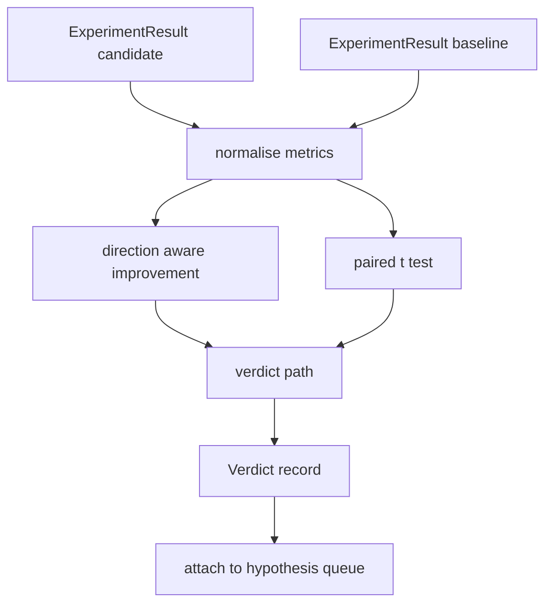

# Évaluateur de résultats

> Le coureur a produit des chiffres. L'évaluateur décide si ces chiffres sont une amélioration, une régression ou un bruit. Construisez le chemin du verdict qui transforme les mesures en une conclusion d'une ligne.

**Type:** Build
**Languages:** Python
**Prerequisites:** Phase 19 Track A lessons 20-29
**Time:** ~90 minutes

## Objectifs d'apprentissage
- Comparer une course de candidat à une ligne de base en utilisant une amélioration consciente de la direction et un seuil fixe.
- Exécuter un test t par paires à partir de zéro par semence et lire la valeur p résultante.
- Normalement utiliser les mesures à l'échelle des journaux afin qu'un rapport en aval puisse les mélanger à des mesures linéaires.
- Émettre un verdict par hypothèse que l'orchestre peut joindre à la file d'attente de la leçon cinquante.
- Gardez chaque pas pur pour que les mêmes entrées produisent toujours le même verdict.

## Pourquoi un test par paires

Un seul nombre de la part du coureur ne dit pas si le changement est réel. La même configuration avec une graine différente donne une perplexité différente. Le changement pourrait être le bruit. La bonne comparaison est parallèle: les mêmes graines avec les mêmes données, une fois avec le candidat et une fois avec la ligne de base. Chaque graine contribue à une différence. La moyenne de ces différences est l'effet. L'erreur standard de ces différences est le sol bruyant.

La leçon met en œuvre le test à partir de zéro.`scipy.stats`Les maths sont assez petits pour être lus sur un écran.

```text
diffs    = [a_i - b_i for i in seeds]
mean     = sum(diffs) / n
variance = sum((d - mean) ** 2 for d in diffs) / (n - 1)
t_stat   = mean / sqrt(variance / n)
df       = n - 1
p_value  = two_sided_p(t_stat, df)
```

La valeur de p à deux côtés utilise une fonction bêta incomplète régulière. La leçon envoie une petite mise en œuvre qui utilise la fraction continue Lentz.

## Amélioration de la direction

Certaines mesures s'améliorent à mesure qu'elles augmentent (exactitude, débit), d'autres s'améliorent à mesure qu'elles diminuent (perte, perplexité, temps de paroi).`direction`champ sur chaque métrique.

```text
if direction == "higher_is_better":
    improvement = (candidate - baseline) / abs(baseline)
elif direction == "lower_is_better":
    improvement = (baseline - candidate) / abs(baseline)
```

Une amélioration négative sur une métrique supérieure est meilleure signifie que le candidat est pire.

Un seuil plat (`improvement_threshold=0.02`Le verdict est "bruit" indépendamment de la valeur p; la boucle n'est pas intéressée par les changements que l'utilisateur ne pouvait pas mesurer.

```figure
cg-paired-verdict
```

## Architecture



L'évaluateur effectue trois calculs indépendants et les rejoint dans le chemin du verdict. Chaque calcul est une fonction pure sans état partagé.

## Normalisation du journal

La perplexité est exponentielle en perte. Une baisse de 0,1 en perte est une baisse beaucoup plus importante en perplexité. La comparaison de la perplexité directement entre deux configurations est bonne, mais le mélanger avec des métriques linéaires dans un seul rapport nécessite une normalisation.

La leçon normalise toute mesure dont `scale`champ est `"log"`Le seuil est ensuite appliqué dans l'espace de log.`log(28) - log(32) = -0.133`une meilleure métrique, qui est bien au-dessus du seuil de 2%.

```text
if scale == "log":
    a = log(candidate)
    b = log(baseline)
else:
    a = candidate
    b = baseline
```

Les métriques avec `scale="linear"`Le même chemin de code traite les deux.

## Test par semence par paires

Le coureur de la leçon 52 émet une dernière tache de métriques par course. Pour le test parallèle, l'évaluateur a besoin d'une tache par semence pour le candidat et une par semence pour la ligne de base. L'orchestre exécute la même expérience sous les deux configurations sur une liste de semences et remet à l'évaluateur deux listes de semences.`ExperimentResult`- Des dossiers.

L' évaluateur les associe par semence (la semence vit dans `result.metrics["seed"]`Si les graines ne correspondent pas dans les deux listes, l'évaluateur élève un `PairingError`L'orchestre devrait revenir.

## La forme du verdict

```text
Verdict
  hypothesis_id          : int
  metric                 : str
  direction              : "higher_is_better" | "lower_is_better"
  scale                  : "linear" | "log"
  candidate_mean         : float
  baseline_mean          : float
  improvement            : float       (signed, fraction; see direction rules)
  p_value                : float | None  (None if n < 2)
  significance_threshold : float
  improvement_threshold  : float
  verdict                : "improved" | "regressed" | "noise" | "failed"
  rationale              : str
```

Le chemin du verdict est une petite table de décision:

```text
1. If any candidate result has terminal != "ok": verdict = "failed"
2. else if |improvement| < improvement_threshold:  verdict = "noise"
3. else if p_value is None or p_value > significance: verdict = "noise"
4. else if improvement > 0:                          verdict = "improved"
5. else:                                             verdict = "regressed"
```

La logique est une phrase lisible par l'homme d'une ligne que l'orchestre peut enregistrer contre l'id hypothétique.

## Comment lire le code

`code/main.py`définit `MetricSpec`- Je suis là .`Verdict`- Je suis là .`Evaluator`Le test t est mis en œuvre en mathématiques stdlib pures; numpy est utilisé uniquement pour lire la liste des métriques et les moyens de calcul et les variantes.

`code/tests/test_evaluator.py`couvre le chemin amélioré, le chemin régressé, le chemin du bruit (petite amélioration), le chemin du bruit (bas n), le chemin de la ligne de terminaison raté, le chemin de normalisation du journal, le test t contre une valeur de référence connue et l'erreur d'accouplement.

## Où cette fente dans

La leçon cinquante a produit la file d'attente hypothétique. La leçon cinquante-uni a filtré tout ce que la littérature a réglé. La leçon cinquante-deux a mené l'expérience sous les configurations candidate et de base sur les graines. La leçon cinquante-troisième lit ces courses et écrit le verdict. L'orchestre couture les quatre ensemble:

```text
for hypothesis in queue:
    literature = retrieval.search(hypothesis.text)
    if literature_settles(hypothesis, literature):
        attach(hypothesis, verdict="settled")
        continue
    candidates = runner.run_all(specs_for(hypothesis))
    baselines  = runner.run_all(baseline_specs_for(hypothesis))
    metric_spec = MetricSpec("perplexity", direction=LOWER, scale=LOG)
    verdict = evaluator.evaluate(hypothesis.id, metric_spec, candidates, baselines)
    attach(hypothesis, verdict)
```

Ce groupe n'est pas dans cette leçon; les quatre leçons se composent sans aucune colle au-delà des données de classe définies par chacune.
