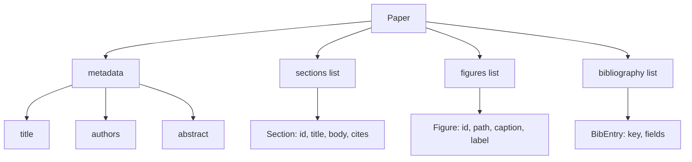
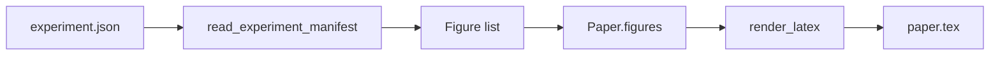
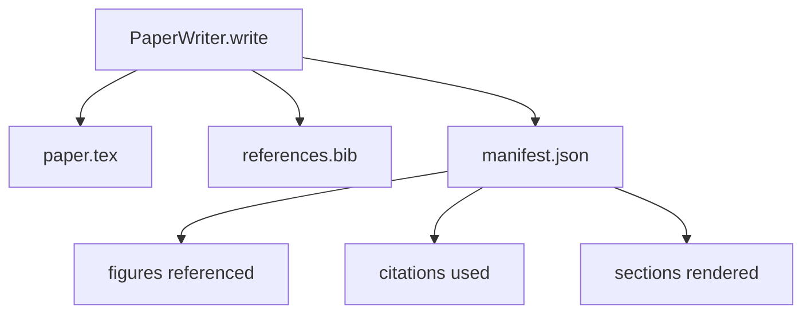

# Écrivain de papier

> Un squelette LaTeX est un contrat entre le chercheur et le typographe. Si le contrat est rompu, le document ne se compile pas et l'échec est fort. Construisez d'abord le squelette, puis remplissez-le.

**Type:** Build
**Languages:** Python
**Prerequisites:** Phase 19 lessons 50-53
**Time:** ~90 minutes

## Objectifs d'apprentissage

- Traiter un document de recherche comme un artefact structuré avec un graphique de section connu, pas un document sous forme libre.
- Générez un squelette LaTeX qui déclare son abstraction, ses sections, ses espaces de figure et ses clés bibliographiques avant d'écrire une prose.
- Injecter des chiffres provenant des sorties d'expériences (pistes et sous-titres) dans le squelette par un mécanisme de fente déterministe.
- Tapez un générateur de prose ridicule qui remplit chaque section d'un contour structuré afin que le harnais soit testable sans modèle.
- Envoyez un seul .`paper.tex`plus un `references.bib`Plus un manifeste qui énumère chaque chiffre référencé et chaque citation utilisée.

```figure
ch-paper-skeleton
```

## Pourquoi un squelette d'abord ?

Un projet qui commence par la prose accumule une dette structurelle. L'introduction augmente trois paragraphes qui devraient être dans un travail connexe. Un chiffre est référencé avant qu'il ne soit défini. La bibliographie se termine par trois clés pour le même article.

Un squelette inverse ça. La structure est déclarée à l'avance comme données. Les sections sont des machines à sous avec des noms et un ordre. Les chiffres sont des machines à sous avec des identifiants et des légendes. Les clés bibliographiques sont déclarées en haut avec les entrées qu'elles pointent vers. La prose est générée dans ces machines un à un. Le harnais peut valider, avant toute prose écrite, que chaque figure a une fente, chaque citation a une entrée, et chaque section apparaît dans la table des matières.

C'est la même discipline que les leçons antérieures appliquées aux plans, aux appels à outils et aux traces.

## La forme du papier



Chaque champ est des données Python simples.`Paper`Le harnais peut examiner le papier avant de le rendre: compter les sections, répertorier les fichiers figuratifs manquants, vérifier que chaque`\cite{key}`a une correspondance `BibEntry`- Je suis désolé .

## Le contrat de rendement

Le rendu garantit trois propriétés.`\begin{figure}`bloc avec une étiquette stable du formulaire `fig:<id>`Deuxièmement, chaque section émet un`\section{}`avec une étiquette stable du formulaire `sec:<id>`Les références croisées fonctionnent.`\bibliography`bloc dont `references.bib`contient exactement les entrées déclarées sur le papier, ni plus ni moins.

En cas de violation de l'une ou l'autre de ces règles, il s'agit d'une erreur de rendu, pas d'un avertissement.

## Injection de figure à partir d'expériences

Les leçons précédentes de cette piste ont produit des sorties d'expérience à mesure que JSON se manifeste. Chaque manifeste contient une liste d'artefacts avec des chemins et des légendes courtes.`Figure`- Des dossiers.



L'injection est déterministe. Les identifiants figurés sont dérivés du nom de l'expérience plus un compteur monotone. Les légendes proviennent du manifeste. Les chemins sont normalisés par rapport au répertoire de sortie du papier de sorte que le LaTeX compile même lorsque les sorties de l'expérience sont situées ailleurs sur le disque.

## Le générateur de prose ridicule

La leçon ne demande pas de modèle.`MockProseGenerator`Le générateur élargit cette chaîne en deux paragraphes courts avec le titre de la section tissé. Les noms de la prose générés font des chiffres et des citations exactement lorsque le contour les déclare.

Il suffit de cela pour tester chaque comportement de l'écrivain. Une mise en œuvre réelle échangeait le générateur pour un appel modèle. Le harnais autour de lui ne change pas. C'est la valeur de déclarer le générateur de prose comme un appelable: le test remplace un déterministe, la production remplace un modèle, le reste du pipeline est identique.

## La sortie manifeste

L'écrivain émet trois fichiers dans le répertoire de sortie.



Le manifeste est ce qu'un évaluateur ou un boucle critique en aval lit. Il ne partage pas LaTeX; il lit le manifeste. La leçon suivante, le boucle critique, prend ce manifeste comme entrée et produit une liste de rétroaction. C'est pourquoi le manifeste fait partie du contrat et le LaTeX non.

## Portes de validation

L'écrivain passe quatre portes avant d'écrire un dossier.

1. Chaque numéro est unique dans le papier.
2. Chaque section est`cites`le champ fait référence à une clé bibliographique qui est déclarée sur le papier.
3. L'abstrait n'est pas vide.
4. Le titre n'est pas vide.

Une porte échouée se lève .`PaperValidationError`Le harnais fait apparaître la raison comme le mode défaillance. Il n'y a pas d'écriture partielle: soit les trois fichiers sont émis, soit aucun.

## Comment lire le code

`code/main.py`définit `Paper`- Je suis là .`Section`- Je suis là .`Figure`- Je suis là .`BibEntry`- Je suis là .`PaperValidationError`- Je suis là .`MockProseGenerator`- Je suis là .`PaperWriter`, et une `render_latex`La fonction de l'équipe`write`La méthode prend un répertoire de sortie et émet `paper.tex`- Je suis là .`references.bib`, et `manifest.json`- Le .`read_experiment_manifest`l' assistant convertit une liste d' expérimentations en manifestes `Figure`- Des dossiers.

`code/tests/test_paper_writer.py`couvertures: rendu de squelette sans sections, rendu complet avec deux sections et deux chiffres, porte de citation manquante, porte d'identification de figure dupliquée, contenu manifeste et contrat de chaîne LaTeX (chaque section émet un `\section{}`, chaque chiffre émet un`\begin{figure}`)

## On va plus loin

Deux extensions seront nécessaires pour une mise en œuvre réelle.`Paper`Le format est compilé en Markdown pour les articles de blog et HTML pour les prévisualisations.`Paper`. Deuxièmement, enrichissement des citations: l'écrivain récupère les entrées BibTeX d'une clé de citation, étant donné un cache local d'I.D.I. Les deux peuvent ajouter de la valeur, les deux peuvent être ajoutés sans toucher le contrat de squelette.

Les sections, les chiffres et les citations déclarés comme des données, générés en prose en fentes, manifestés émis à côté de la LaTeX.
