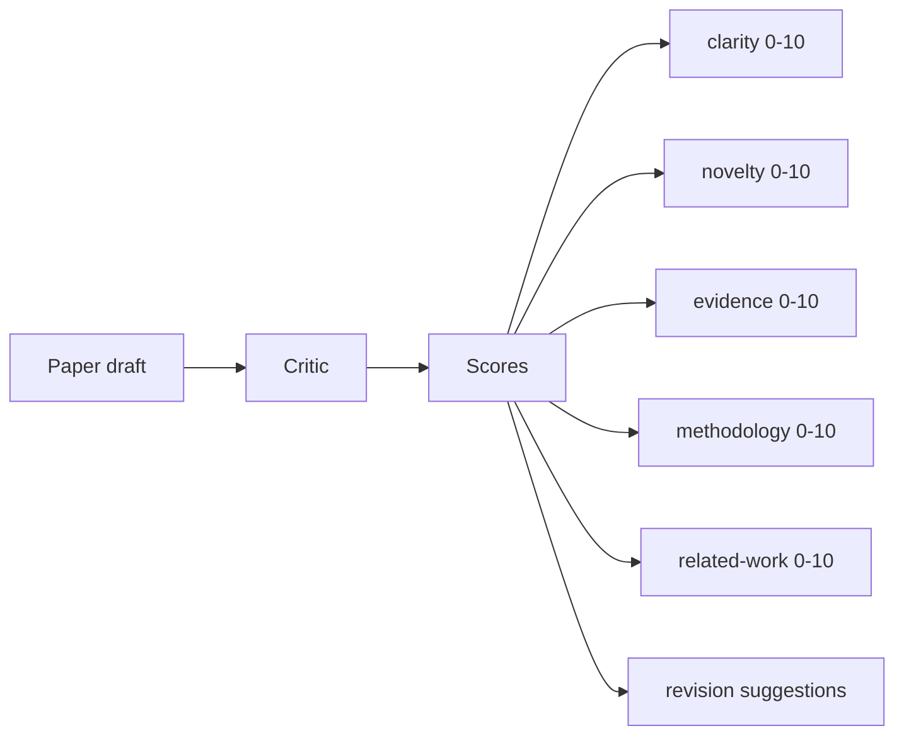
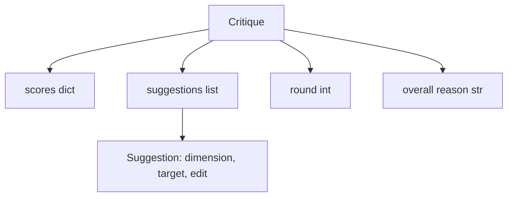
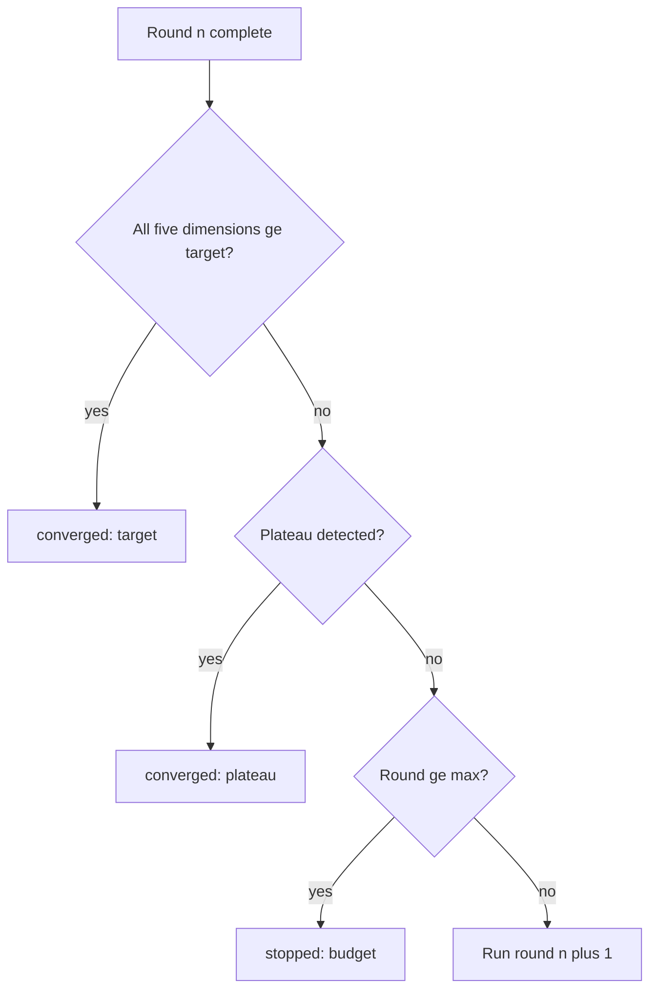
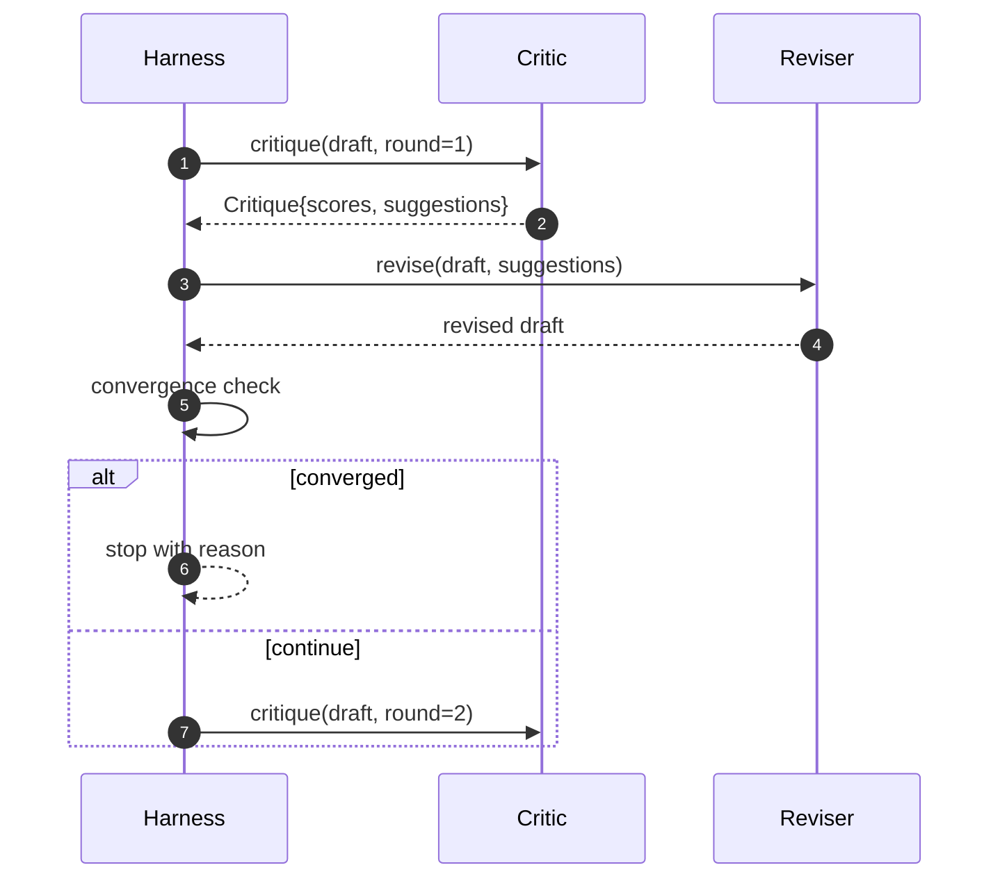

# Le cycle critique

> Un critique qui revient "a l'air bien" la première fois est cassé. Un critique qui revient toujours "a besoin de travail" est cassé. Le critique intéressant est celui qui converge, et vous devez concevoir la convergence.

**Type:** Build
**Languages:** Python
**Prerequisites:** Phase 19 lessons 50-53
**Time:** ~90 minutes

## Objectifs d'apprentissage

- Réserver un projet de document sur cinq dimensions fixes: clarté, nouveauté, preuve, méthodologie, travail connexe.
- Appliquez la critique de chaque round comme une révision structurée différente plutôt qu'une réécriture libre.
- Détecter la convergence en comparant les scores entre les tours; arrêt sur plateau, objectif atteint ou budget épuisé.
- Le budget de la capture est maximal, donc un critique non convergent ne fonctionne pas pour toujours.
- Émettez une trace par tour afin que le tableau de bord ou l'étape suivante puisse rendre la trajectoire du score.

```figure
ch-critic-converge
```

## Pourquoi cinq dimensions fixes

Un critique de forme libre est un modèle qui renvoie un paragraphe de suggestions. La révision du prochain tour traite le paragraphe comme un contexte ambiant.

Cinq dimensions donnent un contrat au harnais.



Le score est un vecteur. Le harnais surveille chaque dimension à travers les tours. Une révision qui augmente la clarté mais qui réduit les preuves est une régression sur les preuves, et la vérification de convergence le voit. Un critique de modèle seulement ne peut pas offrir cette garantie.

## La forme de la critique



Chaque suggestion porte la dimension qu'elle améliore, la section qu'elle cible et une dimension qu'elle améliore.`edit`L'instruction de modification est une instruction de modification qui peut être appliquée par le réviseur. Le réviseur est également un récapitulatif. La leçon envoie un réviseur déterministe qui interprète l'instruction de modification comme une opération d'appendice à section. Un réviseur basé sur un modèle interprète le même champ que un prompt. Le contrat ne change pas.

## Règles de convergence, dans l'ordre

La boucle critique se termine lorsque l'une des trois conditions prend feu.



L'objectif est le cas le plus strict: chacun des cinq dimensions (clarité, nouveauté, preuve, méthodologie, travail relatif) doit être atteint `>= target_score`(par défaut `8.0`Un moyen élevé avec une dimension faible ne suffit pas. La détection de plateau compare la moyenne du tour actuel à la moyenne du tour précédent. Si l'amélioration est inférieure `plateau_epsilon`(par défaut `0.1`) pour deux tours consécutifs, la boucle sort avec `plateau`. Le budget est un plafond strict sur les tours (par défaut `5`) et sort avec `budget`- Je suis désolé .

L'ordre est important. Si la troisième ronde touche la cible sur la même itération qui déclencherait également un plateau, le résultat est `target`- Je ne sais pas .`plateau`- Je suis désolé .

## Pourquoi la détection du plateau se fait sur deux tours

Un plateau à tour est un bruit. Un vrai critique retourne un score légèrement différent à chaque itération même sur un projet fixe, parce que le score déterministe dépend toujours des suggestions qui ont été appliquées et dans quel ordre.

## Le critique déterministe dans cette leçon

La leçon ne demande pas de modèle. Le critique envoyé est un appel qui note un projet basé sur trois signaux: longueur moyenne du corps de la section (clarité), nombre de chiffres et nombre de citations (prouves), et un`originality_tag`Le réviseur sait comment faire grimper chaque score.

```text
clarity      grows when the average section body length increases
novelty      grows when originality_tag is set to "high"
evidence     grows when a section's figure_refs is non-empty
methodology  grows when a section titled "Method" exists with body
related-work grows when a section titled "Related Work" exists with body
```

Le réviseur interprète chaque suggestion comme une annexe ciblée. Après le premier tour, le harnais peut observer le score augmenter.

## Le contrat de boucle complète



Le harnais possède le compteur rond, le traceur et le contrôle de convergence. Le critique possède la partition. Le réviseur possède le diff. Aucun des trois ne touche l'état des autres.

## La sortie de Trace

Chaque tour émet un événement de trace avec le numéro de la ronde, le vecteur de la note, le nombre de suggestions et le verdict de convergence. La trace complète est retournée le long du projet final. Un tableau de bord en aval peut rendre le tableau de score par ronde. La leçon suivante, le planificateur d'itération, lit la trace pour décider si la branche vaut la peine d'être conservée.

## Des budgets qui protègent contre les mauvais critiques

Un critique qui donne des suggestions qui n'améliorent jamais le score verrouille la boucle dans le plafond de l'iteration maximale.`budget`L'utilisateur lit que comme un bug critique, pas un bug de projet. L'alternative, qui ne fait surface que le projet final, cache le diagnostic.

## Comment lire le code

`code/main.py`définit `Critique`- Je suis là .`Suggestion`- Je suis là .`Critic`le protocole,`Reviser`le protocole,`CriticLoop`, et une `make_deterministic_critic_pair`Une usine qui renvoie le critique déterministe et un réviseur correspondant.`Paper`La forme est incluse, donc la leçon se démarque.

`code/tests/test_critic_loop.py`couvertures: amélioration monotone après le premier tour, convergence cible sur un projet réglé, détection de plateau après deux tours plates, épuisement budgétaire lorsqu'aucune suggestion ne s'améliore, application de suggestion par le réviseur et forme de trace.

## On va plus loin

Deux extensions seront nécessaires à une vraie mise en œuvre. Premièrement, les poids dimensionnels: un article d'atelier pèse plus de nouveauté que de méthodologie; un journal pèse l'inverse. La vérification de la convergence devient une moyenne pondérée. Deuxièmement, les critiques couplés: un critique marque, un deuxième critique juge les suggestions avant que le réviseur ne les voie.`Critique`la forme.

Une fois la critique structurée, chaque autre amélioration, règle de convergence, tableau de bord, critique parallèle, tombe sans changer de boucle.
