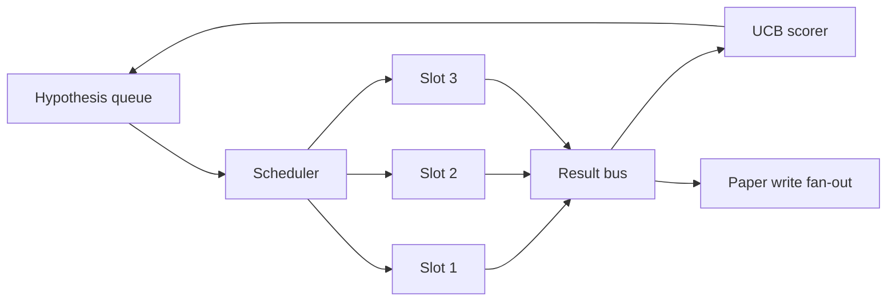
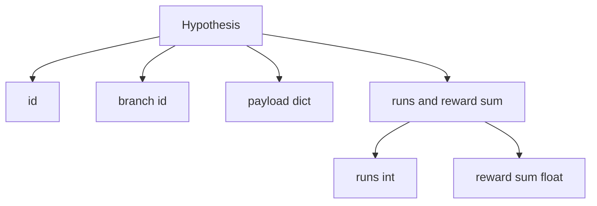
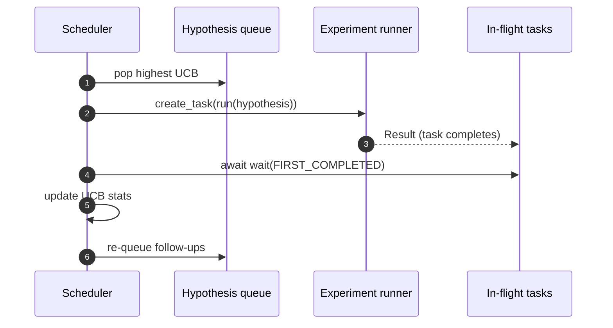

# Calendrier d'itération

> Une boucle de recherche sans planificateur est une file d'attente avec des illusions.

**Type:** Build
**Languages:** Python
**Prerequisites:** Phase 19 lessons 50-53
**Time:** ~90 minutes

## Objectifs d'apprentissage

- Modélisez un flux de travail de recherche comme une file d'attente hypothétique alimentant des espaces d'expérience parallèles dont les résultats se retournent.
- Exécutez plusieurs expériences simultanément avec Asyncio afin que le planificateur puisse occuper toutes les machines à sous.
- Scorez chaque branche hypothétique avec UCB afin que le planificateur puisse tailler les branches à faible rendement sans abandonner l'exploration.
- Répandre les résultats finis à un stade de rédaction sur papier et à un stade de ré-couture afin qu'une branche à haut rendement génère des hypothèses de suivi.
- Surface une trace de per-iteration avec les scores des branches, l'occupation des espaces, et les décisions de taille.

```figure
ch-ucb-scheduler
```

## Pourquoi un planificateur et non une liste de travail

Une liste de travail plate comporte des tâches dans l'ordre de soumission. C'est bien quand chaque tâche est indépendante. La recherche n'est pas indépendante: une découverte de l'expérience trois modifie la priorité des expériences quatre et cinq. Un planificateur qui lit le résultat et réordonne la file d'attente obtient un travail plus utile par unité de calcul.

Le choix de conception intéressant est la règle de notation. Un marqueur avide choisit toujours le leader actuel et n'explore jamais. Un marqueur uniforme n'exploite jamais. UCB (liens de confiance supérieurs) est le chemin du milieu: exploiter le leader tout en réservant la capacité pour les branches qui ont été moins essayées.

## La forme du système



La file d'attente contient des hypothèses. Le planificateur choisit l'hypothèse UCB la plus élevée lorsqu'une fente est libérée. Chaque fente exécute une expérience asynchrone. Les expériences terminées diffusent leur résultat sur le bus. Le bus met à jour les statistiques UCB sur la branche d'origine et les ventilateurs vers la phase d'écriture sur papier lorsque le rendement d'une branche franchit un seuil.

## La forme de l'hypothèse



`branch`La branche est la direction de la recherche; l'hypothèse est un essai au sein de celle-ci. `runs`est le nombre d'expériences achevées pour cette branche,`reward_sum`L'UCB lit les deux.

## Score de l'UCB

La formule UCB utilisée dans cette leçon est la classique UCB1.

```text
ucb(branch) = mean_reward(branch) + c * sqrt( ln(total_runs) / runs(branch) )
```

`total_runs`est le nombre de toutes les expériences réalisées dans toutes les branches. `c`est le poids de l' exploration; la leçon est défaillante à `sqrt(2)`Une branche avec zéro course obtient`+inf`Une branche avec une récompense moyenne élevée conserve un score élevé jusqu'à ce que les autres branches se rattrapent; une branche qui fonctionne plusieurs fois sans beaucoup de récompense est écrasée par des alternatives moins courantes.

La porte de taille est séparée du cueilleur. La taille supprime une branche de la planification future lorsque sa récompense moyenne tombe en dessous d'un niveau absolu (par défaut `0.2`) au moins après `prune_after_runs`essais (par défaut `3`Cela garde la file d'attente limitée.

## Slots parallèles avec asyncio

Le planificateur expérimente avec `asyncio.create_task`Chaque tâche est effectuée par un coureur d' expérimentation (un`async def`(appelable) qui renvoie un `Result`. La boucle principale attend l' ensemble des tâches en vol avec `asyncio.wait(..., return_when=asyncio.FIRST_COMPLETED)`et met en ligne la mise à jour des scores à chaque finition.



La boucle principale ne bloque jamais une seule expérience. Le planificateur continue de démarrer de nouvelles tâches dès qu'une fente est libérée, jusqu'à ce que la file d'attente soit vide et qu'aucune tâche ne soit en vol.

## Détecteur de la circulation: déclencheurs de papier

Quand la récompense moyenne d'une branche croise`paper_threshold`(par défaut `0.7`) et cette branche n'a pas encore produit de document, le planificateur fait une`paper.trigger`Dans cette leçon, le déclencheur est capturé comme une liste afin que les tests puissent l'affirmer.

## Propagation: hypothèses de suivi

Lorsqu'un résultat de rendement élevé arrive, le planificateur peut appeler l'utilisateur fourni `expander`L'expansion est une fonction pure de l'expansion de l'expansion de l'expansion de l'expansion de l'expansion de l'expansion de l'expansion de l'expansion de l'expansion de l'expansion de l'expansion de l'expansion de l'expansion de l'expansion de l'expansion de l'expansion de l'expansion de l'expansion de l'expansion de l'expansion de l'expansion de l'expansion de l'expansion de l'expansion de l'expansion de l'expansion de l'expansion de l'expansion de l'expansion de l'expansion de l'expansion de l'expansion de l'expansion de l'expansion de l'expansion de l'expansion de l'expansion de l'expansion de l'expansion de l'expansion de l'expansion de l'expansion de l'expansion de l'expansion de l'expansion de l'expansion de l'expansion de l'expansion de l'expansion de l'expansion de l'expansion de l'expansion de l'expansion.`Result`à `list[Hypothesis]`La leçon envoie un amplificateur déterministe qui produit deux suivis pour tout résultat dont la récompense dépasse le seuil papier.

## Les budgets

Deux budgets protègent le planificateur des boucles de fuite.

```text
max_experiments    : total count of experiments run across all branches
max_seconds        : wall-clock cap (asyncio time)
```

Lorsque l'un ou l'autre est en panne, le programmeur arrête de planifier de nouvelles tâches, attend celles en vol et renvoie la trace finale.`stop_reason`- Je suis désolé .

## Le rapport de suivi et le rapport final

Chaque décision de planification (selection, expédition, résultat, taille, ventilateur) émet un événement. Le rapport final résume les statistiques par branche, les courses totales, le total de l'horloge de la paroi et les déclencheurs du papier.

## Comment lire le code

`code/main.py`définit `Hypothesis`- Je suis là .`Result`- Je suis là .`BranchStats`- Je suis là .`IterationScheduler`, et une `make_deterministic_runner`Une usine qui renvoie un coureur d'expérience asyncée avec des récompenses prévisibles.`delay_ms`(par défaut `5ms`) de sorte que la simultanée est observable.

`code/tests/test_scheduler.py`couvertures: UCB choisit d'abord les branches non testées, l'occupation parallèle des fentes, les déclencheurs de papier lorsqu'on franchit le seuil, la taille des branches après des essais à faible rendement, les hypothèses de suivi et la sortie budgétaire (le nombre d'expériences et l'horloge murale).

## On va plus loin

Trois extensions seront nécessaires pour une mise en œuvre réelle. Premièrement, les statistiques persistantes de l'UCB au cours des séances: les statistiques actuelles sont conservées dans la mémoire; un réel planificateur les contrôlerait afin qu'un redémarrage préserve le budget d'exploration déjà dépensé. Deuxièmement, le score multi-objectif: au lieu d'une récompense scalaire, chaque résultat émet un vecteur et UCB devient un sélecteur de style Pareto. Troisièmement, les bandits contextuels: les conditions de choix sur les caractéristiques de l'hypothèse (longueur, complexité) de sorte que des hypothèses similaires partagent l'exploration.

Le planificateur est l'endroit où la recherche devient plus qu'une liste de travail. Une fois que l'UCB est câblé et que les fentes fonctionnent en parallèle, chaque autre amélioration se compose en haut.
